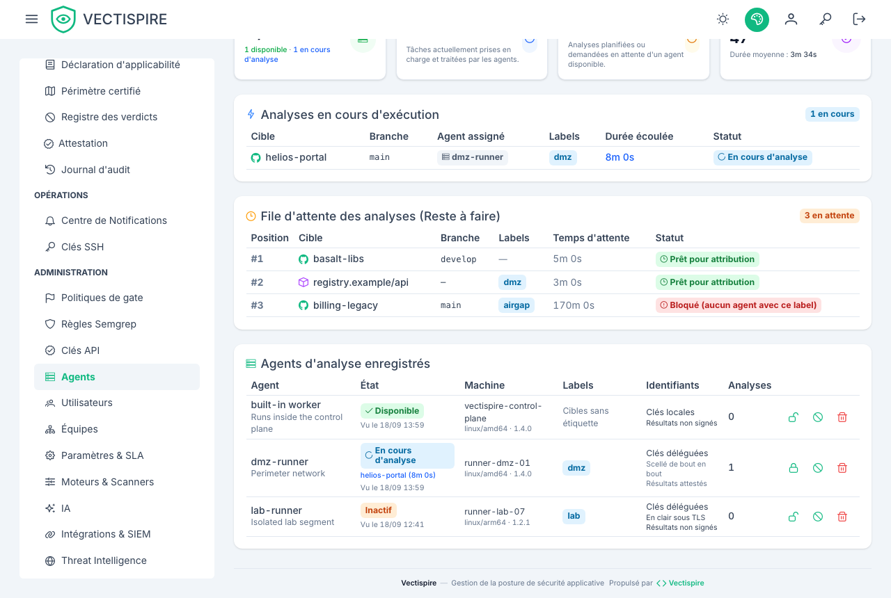

# Agents

Un scan est exécuté par un **agent**. Il en existe deux sortes, toutes deux étant des lignes de
la même table, listées ensemble sur la page **Agents**.

**L'agent intégré** est le processus web lui-même. Créé automatiquement au démarrage, sans
configuration — ce qui est pourquoi une installation mono-machine fonctionne d'emblée.

**Les agents distants** sont des processus de travail séparés sur d'autres machines, parlant un
protocole à quatre routes : `hello`, `jobs`, `heartbeat`, `result`.

Les deux exécutent le même code et renvoient tous deux la sortie brute des scanners pour que le
plan de contrôle la normalise. Un résultat produit sur une autre machine est donc
**indiscernable** d'un résultat local : mêmes lignes, même enrichissement, même politique de
licences, même réconciliation.

## Quand en ajouter un

- Garder le socket Docker hors de l'hôte qui sert l'interface.
- Atteindre un dépôt ou un registre routable seulement depuis un autre segment réseau.
- Ajouter de la capacité.

## En exécuter un

```bash
# Sur la machine de l'agent — la clé vient de /agents, affichée une seule fois
VECTISPIRE_URL=https://vectispire.internal \
VECTISPIRE_AGENT_TOKEN=zsk_... \
node dist/agent/main.js
```

Ou en conteneur, ce qui est la façon prévue de le déployer :

```bash
docker compose --profile with-agent up -d
```

Un agent **interroge en HTTP**, il n'a donc besoin d'aucun port entrant. Sa clé porte la portée
`agent` et **aucun accès à la base de données** — c'est une propriété de sécurité et non un
détail. Un agent disposant d'une connexion à la base aurait aussi besoin d'`ENCRYPTION_KEY`,
c'est-à-dire de la capacité à déchiffrer toutes les clés de déploiement que Vectispire détient.

## Modes d'identifiants {#credentials-modes}

| Mode | Ce que le contrôleur envoie | Quand |
|---|---|---|
| `local` (défaut) | rien | la machine de l'agent a son propre accès git. Un agent compromis ne livre que ce qui avait été accordé à cette machine. |
| `delegated` | la clé de déploiement, par travail | une machine de confiance seulement. |

`delegated` **exige HTTPS et est refusé sans lui**. La clé n'est jamais écrite sur disque
au-delà d'un fichier temporaire en `0600`, et chaque remise est auditée.

Préférez `local`. Cela borne les dégâts qu'un agent compromis peut faire à l'accès propre de
cette machine, ce qui est toute la raison d'exécuter des scans sur un hôte séparé.

## Attester les résultats d'un agent

**C'est le contrôle qui mérite d'être activé avant les autres.** Rendre le résultat d'un scan est
l'opération la plus lourde du produit : des artefacts présents et vides signifient « analysé, rien
trouvé », ce qui résout tout le backlog de la cible pour ce type — en silence, et correctement. Qui
peut poster un résultat peut donc faire disparaître les vulnérabilités d'une cible de tous les
écrans, de tous les exports et de tous les verdicts de gate, en ne laissant qu'un scan qui a l'air
d'avoir tourné.

Tant qu'aucune clé n'est épinglée, la seule chose entre cela et un `VECTISPIRE_AGENT_TOKEN` volé
est le jeton lui-même — et un jeton vit dans un fichier compose, une variable d'environnement et un
coffre de secrets de CI, et voyage à chaque poll.

Sur `/agents`, l'icône de cadenas d'une ligne épingle une clé. Le plan de contrôle génère une paire
Ed25519, garde la moitié publique sur la ligne de l'agent et vous montre la moitié privée **une
fois** :

```bash
VECTISPIRE_AGENT_SIGNING_KEY=<la valeur affichée une seule fois>
```

Posez-la dans la configuration de l'agent et redémarrez-le. Tant qu'il ne l'a pas, ses résultats
sont refusés en 403 et le refus est écrit au journal d'audit sous `AGENT_RESULT_REFUSED`.

Préférez générer la paire vous-même si vous tenez à ce que la moitié privée n'ait jamais existé
ici : `PUT /api/v1/admin/agents/{id}/signing-key` accepte une clé publique en base64 à la place du
mot `generate`.

**La clé n'est jamais annoncée par l'agent**, et cette asymétrie avec la clé de scellement est tout
l'intérêt. Une signature vérifiée contre une clé que son signataire a publiée sur le même canal ne
prouve que ce que le jeton porteur prouvait déjà. Celle-ci doit venir de quelqu'un qui n'est pas
l'agent.

La ligne dit dans quel état est chaque agent — *Results attested* ou *Results unsigned* — parce
qu'un opérateur qui croit son parc attesté n'a aucun autre moyen d'apprendre qu'il ne l'est pas.

## Désactiver l'agent intégré

C'est ainsi qu'on dit « n'exécute rien ici ». Les scans en file attendent alors un agent
distant au lieu d'utiliser discrètement l'instance web.

Cela vaut la peine sur tout déploiement où l'hôte de l'interface ne devrait pas avoir de socket
Docker du tout.

## Épingler une cible à un agent

Posez **Agent requis** sur le dépôt ou l'image. Servez-vous-en pour les cibles routables depuis
un seul segment — pas comme outil de répartition de charge, puisqu'une cible épinglée cesse
d'être analysée quand cet unique agent est indisponible.

## Lire la page

Chaque agent affiche sa capacité de scans concurrents et la date de sa dernière annonce. Un
agent qui **ne s'est jamais annoncé** n'a pas atteint le plan de contrôle du tout : vérifiez
l'URL, le jeton, et que le HTTPS sortant est autorisé.


