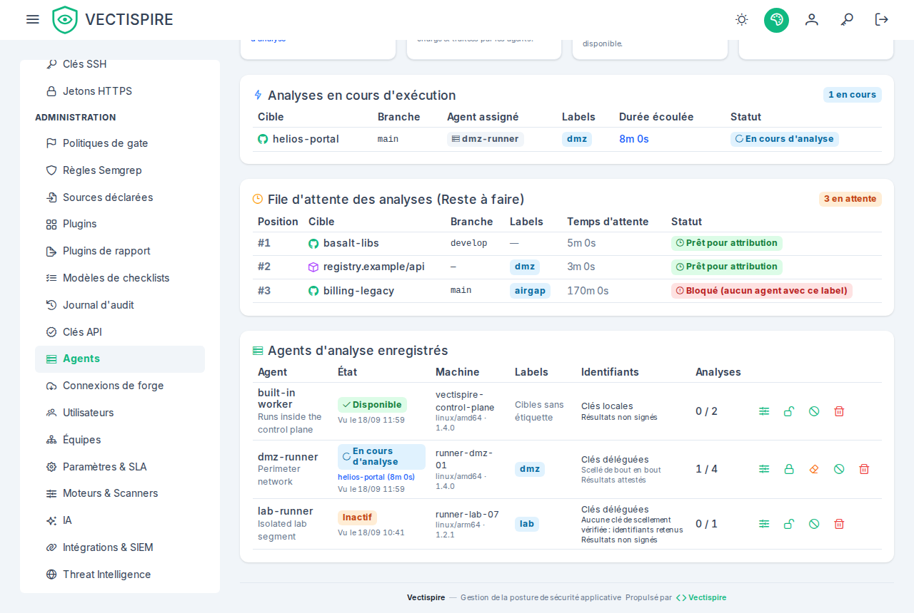

# Agents

Un scan est exécuté par un **agent**. Il en existe deux sortes, toutes deux étant des lignes de
la même table, listées ensemble sur la page **Agents**.

**L'agent intégré** est le processus web lui-même. Créé automatiquement au démarrage, sans
configuration — ce qui est pourquoi une installation mono-machine fonctionne d'emblée.

**Les agents distants** sont des processus de travail séparés sur d'autres machines, parlant un
protocole court : `hello`, `sealing-key` (pour un agent `delegated`), `jobs`, `rules`, `heartbeat`, `result`,
et `failure` pour une analyse prise qu'il n'a pas pu exécuter.

Deux durées le traversent, sous deux formes différentes, pour qui écrit un client d'après le
contrat publié. `GET /api/v1/agent/jobs?wait=30` prend l'attente du long-poll en **secondes
entières** — 0 par défaut, qui répond aussitôt, et tenue 30 au plus. Le `duration` du résultat
est un **texte ISO-8601** (`"PT12.345S"`), le `format: duration` que déclare le contrat ; un nombre
de secondes venant d'un agent plus ancien est encore accepté. Dans le résultat, `[]` signifie
qu'une étape a tourné sans rien trouver, et `null` ou un champ absent qu'elle n'a pas tourné — d'où
l'importance de la différence : seul le premier résout le stock de cette étape.

Les deux exécutent le même code et renvoient tous deux la sortie brute des scanners pour que le
plan de contrôle la normalise. Un résultat produit sur une autre machine est donc
**indiscernable** d'un résultat local : mêmes lignes, même enrichissement, même politique de
licences, même réconciliation.

## Quand en ajouter un

- Garder le socket Docker hors de l'hôte qui sert l'interface.
- Atteindre un dépôt ou un registre routable seulement depuis un autre segment réseau.
- Ajouter de la capacité.

## En exécuter un

```bash
# Sur la machine de l'agent — la clé vient de /agents, affichée une seule fois
VECTISPIRE_URL=https://vectispire.internal \
VECTISPIRE_AGENT_TOKEN=zsk_... \
java -jar vectispire-agent.jar      # produit par ./gradlew :vectispire-agent:bootJar, JDK 25
```

Ou en conteneur, ce qui est la façon prévue de le déployer :

```bash
docker compose --profile with-agent up -d
```

Un agent **interroge en HTTP**, il n'a donc besoin d'aucun port entrant. Sa clé porte la portée
`agent` et **aucun accès à la base de données** — c'est une propriété de sécurité et non un
détail. Un agent disposant d'une connexion à la base aurait aussi besoin d'`ENCRYPTION_KEY`,
c'est-à-dire de la capacité à déchiffrer toutes les clés de déploiement que Vectispire détient.

Dans la composition fournie, l'agent n'atteint que l'API et un proxy du démon qui lui est propre ;
la base et le proxy du plan de contrôle sont sur des réseaux auxquels il n'est pas rattaché. Cela
l'empêche de *demander* la clé — cela ne fait pas deux hôtes d'un seul : les deux proxys atteignent
le même démon, et l'accès au démon y est root. Le profil sert à évaluer le protocole. Pour
l'isolation, faites tourner l'agent sur une autre machine et réglez `VECTISPIRE_EMBEDDED_WORKER=false`
sur le plan de contrôle.

## Mener plusieurs analyses en parallèle {#running-several-scans-at-once}

**Analyses simultanées** (`max_concurrent`) est le nombre d'analyses qu'un agent mène en parallèle :
**de 1 à 16**, 1 quand rien n'est précisé. Réglez-le en déclarant l'agent, ou plus tard avec l'icône
de curseurs sur sa ligne — ou `PATCH /api/v1/admin/agents/{id}` avec `{"max_concurrent": 4}`. Une
valeur hors de 1–16 est refusée par un 400 plutôt qu'arrondie en silence. La ligne l'affiche sous la
forme *en cours / autorisées*, et un changement est inscrit au journal d'audit.

La limite est appliquée des deux côtés. Le plan de contrôle ne confie une nouvelle analyse à un
agent que tant que celles qu'il détient — prises en charge, pas encore rendues, bail encore vivant —
sont moins nombreuses que la limite, et il les compte dans la base : deux interrogations du même
agent ne peuvent pas la dépasser ensemble. L'agent, lui, cesse d'interroger dès qu'il est plein.

**La limite appartient à la ligne de l'agent, pas à un processus.** Deux processus démarrés avec la
même clé se partagent une seule limite — et, en mode `delegated`, seul celui qui s'est annoncé en
dernier peut ouvrir une clé scellée. Pour davantage de machines, déclarez davantage d'agents.

### Le dimensionner

Chaque analyse lance jusqu'à cinq conteneurs de scanners l'un après l'autre, chacun plafonné à 2 Go
de mémoire et à tous les cœurs de l'hôte Docker sauf un. La base du rapprochement des vulnérabilités
— environ 3 Go — est téléchargée **une fois pour l'hôte**, et non par analyse, et partagée en lecture
seule par toutes les analyses (`VECTISPIRE_VULNERABILITY_DB_DIR`, voir
[Configuration](../reference/configuration.md)) : comptez-la une fois, et autant pendant qu'une mise
à jour se télécharge à côté de la base en cours. Par analyse simultanée, comptez environ :

| | par analyse |
|---|---|
| CPU | un cœur |
| Mémoire | 2 Go, en plus de la JVM de l'agent |
| Disque (répertoire temporaire) | le clone et le SBOM — la base de vulnérabilités est celle de l'hôte, comptée une fois |

Les analyses au-delà de ce que la machine peut tenir n'attendent pas leur tour : elles se disputent
les mêmes cœurs et expirent ensemble, à 15 minutes par scanner. Restez en deçà de la machine ; plus
de capacité, c'est un autre agent.

### La modifier, et arrêter un agent

**Une limite abaissée s'applique à la prochaine prise en charge.** Aucune nouvelle analyse ne
démarre tant que celles en cours ne sont pas repassées sous la limite, et rien de ce qui tourne n'est
interrompu. L'agent apprend la nouvelle valeur dans la réponse à sa prochaine interrogation —
relevée ou abaissée, sans redémarrage.

**Arrêter un agent attend ses analyses.** Sur `SIGTERM` — `docker stop`, une mise à jour progressive
— il cesse de prendre du travail et attend que les analyses en cours soient rendues. Les abandonner
coûterait plus cher qu'attendre : le protocole n'a pas d'appel pour rendre une analyse sans l'avoir
exécutée — `failure` dit qu'elle n'a pas pu l'être et consomme une tentative, et un arrêt n'est ni l'un
ni l'autre —, donc une analyse abandonnée garde son bail jusqu'à ce qu'il expire (20 minutes après son dernier signe de
vie), puis revient dans la file en ayant consommé l'une de ses trois tentatives, et son travail est
perdu. Donnez au conteneur un délai d'arrêt aussi long que votre analyse la plus longue —
`stop_grace_period: 30m` dans compose ; le défaut de Docker est de 10 secondes.

Si le processus est tué avant — ou si la machine tombe —, c'est exactement cette expiration qui se
produit. Jusque-là ses analyses comptent encore dans sa limite, si bien qu'un agent redémarré aussitôt
ne prend que ce qui reste ; une fois expirées, elles ne comptent plus, avant même que la file les
ait remises en attente.

### Quand une analyse ne peut pas s'exécuter sur un agent

Un clonage refusé — une clé d'hôte qui a changé, une clé de déploiement que la forge ne connaît pas —,
un espace de travail impossible à créer, un identifiant délégué qui ne s'ouvre pas : tout ce qui arrête
l'agent avant qu'un résultat existe. **L'agent le dit aussitôt** (`POST /api/v1/agent/jobs/{id}/failure`),
avec la raison et si une autre tentative pourrait réussir — le `kind` du rapport :

| Nature | Ce que l'agent a rencontré | Ce que devient l'analyse |
|---|---|---|
| `permanent` | une clé d'hôte qui a changé ou n'est pas épinglée, une authentification refusée (SSH ou HTTPS), un dépôt ou une branche qui n'existe pas, un sous-chemin absent du clone, un identifiant qui ne s'ouvre pas ou ne peut pas servir ici, une URL que la garde du clonage refuse (un hôte link-local, une redirection) | **en échec aussitôt**, à cette tentative, quelle qu'elle soit |
| `transient` | le réseau, un délai dépassé, la forge qui répond 5xx ou 429, un démon Docker qui ne répond pas — et tout ce que l'agent n'a pas su classer | de retour dans la file avec la tentative comptée, **réclamable de nouveau après 1 minute, puis 5, puis 15**, en échec définitif à la troisième tentative |

L'agent décide de la nature d'après le type de l'échec — la raison de déconnexion SSH de MINA,
l'exception propre à JGit, le statut HTTP de la forge —, jamais d'après les mots du message. **Dans le
doute, transitoire** : un échec inconnu est retenté plutôt que de faire échouer une analyse pour de bon
sur un incident passager. Un bail expiré est transitoire aussi, et attend de la même façon. Les délais
sont le `VECTISPIRE_SCAN_RETRY_DELAYS` du plan de contrôle
([Configuration](../reference/configuration.md#scan-queue)).

**La raison est sur l'analyse**, dans l'historique et sur sa page — *Attempt 1 of 3 could not run on
agent "edge"; the scan is back in the queue, not before …: …* —, et la page indique à partir de quand la
tentative suivante peut démarrer tant que l'analyse attend. Chaque rapport est audité sous
`AGENT_SCAN_FAILED`, avec sa nature.

- **Nettoyée avant de quitter l'agent, et de nouveau à l'arrivée.** L'agent retire du texte, par leur
  valeur, la clé de déploiement, le jeton, sa clé API et sa clé de signature ; le plan de contrôle
  retire tout ce qui a la forme d'un secret (la partie utilisateur d'une URL, un bloc de clé privée, un
  jeton porteur). Une ligne, 1 000 caractères au plus.
- **Signée comme un résultat.** Un agent dont la clé de signature est épinglée signe le rapport avec
  elle (dans un contexte propre : la signature d'un résultat ne vaut pas pour un rapport), faute de quoi
  il est refusé en 403 et audité sous `AGENT_RESULT_REFUSED` — sans quoi une clé API volée pourrait
  consommer toutes les tentatives de toutes les analyses qu'elle prend.
- **Une fois, pour cette tentative.** Le rapport nomme la tentative que la prise a remise à l'agent ;
  un rapport envoyé deux fois, ou portant sur une tentative que l'analyse a dépassée depuis, reçoit un
  409 et ne change rien — tout comme celui d'un agent qui ne détient pas l'analyse.
- **Un plan de contrôle plus ancien répond 404**, et l'agent revient à ce qu'il a toujours fait — le
  bail expire, et la raison n'est que dans le journal de l'agent, qui le dit. Un agent plus ancien face
  à ce plan de contrôle n'envoie pas de rapport, et ses échecs se terminent comme avant ; celui qui
  rapporte sans `kind` est lu comme transitoire.

Une nouvelle tentative, c'est souvent le même agent. Avec un seul agent, une analyse dont le clonage
rencontrait une erreur réseau passagère consommait ses trois tentatives en autant d'interrogations —
quelques secondes — avant que l'incident soit passé ; elle attend désormais entre elles. Un clonage
refusé pour de bon échoue dès sa première tentative, avec la raison.

**Le worker intégré suit la même règle.** Une analyse que le plan de contrôle n'a pas pu exécuter
lui-même — son runner a échoué avant qu'un résultat existe — est classée de la même façon, attend les
mêmes délais et porte une raison nettoyée de la même façon : l'exécutant qui a pris une analyse ne
change pas son sort.

## Modes d'identifiants {#credentials-modes}

| Mode | Ce que le contrôleur envoie | Quand |
|---|---|---|
| `local` (défaut) | rien | la machine de l'agent a son propre accès git — en SSH : un dépôt privé en HTTPS ne peut pas être cloné dans ce mode. Un agent compromis ne livre que ce qui avait été accordé à cette machine. Cet accès est le `.ssh` du home du processus de l'agent — dans le profil `with-agent`, `$VECTISPIRE_AGENT_WORK_DIR/home/.ssh`, vide sauf si vous y placez une clé dédiée ; la composition ne monte aucun `~/.ssh` à vous. |
| `delegated` | la clé de déploiement ou le jeton HTTPS, par travail | une machine de confiance seulement. |

**Le premier clone SSH d'un agent `local` demande un `known_hosts` que vous avez rempli.** Il clone
avec l'accès SSH de sa propre machine, et ssh refuse un hôte que son `known_hosts` ne liste pas —
l'analyse échoue avec *« The host key of … was refused by this machine's own known_hosts »*. Ce
refus est le comportement par défaut de ssh et il est conservé : inscrivez les clés de la forge
dans `$VECTISPIRE_AGENT_WORK_DIR/home/.ssh/known_hosts` (le profil `with-agent`) avec
`ssh-keyscan`, **après avoir comparé leurs empreintes à celles que publie la forge** — les
commandes sont dans
[Un agent `local` : remplir `known_hosts`](../guide/repositories.md#ssh-known-hosts-local-agent).
Un agent `delegated` inscrit lui-même un premier contact et refuse une clé changée.

En mode `delegated`, la clé ou le jeton **ne part jamais que scellé** pour le processus de l'agent
lui-même, et jamais en clair — en HTTPS ou non. Il n'est jamais écrit sur le disque de l'agent — il
est lu en mémoire et remis au transport — et chaque remise est auditée.

### Avant de déléguer des identifiants : épingler la clé de signature {#before-delegating-credentials-pin-the-signing-key}

**Un agent `delegated` ne reçoit rien tant qu'aucune clé de signature des résultats n'est épinglée
pour lui** — voir [Attester les résultats d'un agent](#attesting-an-agents-results) — et que sa
moitié privée n'est pas dans la configuration de l'agent. La raison tient à l'origine de la clé de
scellement. L'agent fabrique une paire X25519 neuve à chaque démarrage et en annonce la moitié
publique ; le plan de contrôle scelle les identifiants pour elle. Cette annonce emprunte le même
chemin réseau que les identifiants, si bien qu'un proxy qui termine TLS sur ce chemin pourrait
autrement la modifier. L'agent **signe donc sa clé de scellement avec sa clé de signature
épinglée**, et le plan de contrôle n'accepte qu'une clé de scellement dont la signature se vérifie
contre la clé qu'un administrateur a épinglée ([décision 0031](https://github.com/asmolabs/vectispire/blob/main/docs/architecture/fr/decisions/0031-a-sealing-key-is-believed-only-on-the-pinned-key.md)).
**Le scellement sort un proxy qui termine TLS de la frontière de confiance, pourvu qu'une clé de
signature soit épinglée.**

Donc, pour chaque agent `delegated` :

1. Épinglez une clé de signature sur sa ligne (l'icône de cadenas sur `/agents`), et posez la
   moitié privée affichée une seule fois dans `VECTISPIRE_AGENT_SIGNING_KEY`, dans la configuration
   de l'agent.
2. Faites tourner un agent de cette version et redémarrez-le. Après son `hello`, il annonce sa clé
   de scellement, signée ; son journal dit `Sealing key verified by the control plane`.
3. La ligne indique alors *Scellé de bout en bout*. Jusque-là elle indique *Aucune clé de scellement
   vérifiée : identifiants retenus* : l'agent ne reçoit pas les analyses qui demandent une clé ou un
   jeton, qui restent dans la file pour un exécuteur capable de les mener — un agent vérifié ou le
   worker intégré — **sans consommer aucune de leurs tentatives**. Les analyses d'images et les
   dépôts sans identifiant lui reviennent toujours. Quand seules de telles analyses l'attendent,
   sa demande reçoit un **412** qui nomme l'étape manquante, et son journal le dit à chaque nouvel
   essai ; rien n'est envoyé. Si aucun autre exécuteur ne peut les prendre, elles attendent que cet
   agent soit corrigé. Le plan de contrôle le dit aussi : la jauge
   `vectispire.scans.credential.unserved` (sous `/actuator/metrics`) compte les analyses en attente
   de dépôts portant un identifiant qu'aucun exécuteur capable de le recevoir ne sert — un agent
   `local` activé, un agent `delegated` à la clé vérifiée, ou le worker intégré quand il tourne — et
   son journal avertit, au plus toutes les quinze minutes et de nouveau quand le nombre augmente, en
   nommant les étiquettes et les agents qui les prendraient mais n'ont pas de clé vérifiée. L'écran
   **Agents** affiche le même chiffre en avertissement au-dessus de la file, avec ces étiquettes,
   ces agents et ce qu'il faut faire (`GET /api/v1/admin/agents/credentialed-backlog`).

**La rotation est automatique.** Chaque démarrage fabrique une paire neuve, datée de sa création ;
le plan de contrôle garde la plus récente signée par la clé épinglée et refuse une plus ancienne
(**409**, audité). Un `hello` sans clé, ou avec une clé que personne n'a signée, ne remplace ni
n'efface jamais la clé acceptée.

**La réinitialiser est un acte d'administrateur.** Sur `/agents`, l'icône de gomme sur la ligne
d'un agent qui indique *Scellé de bout en bout* oublie sa clé, après confirmation — ou
`DELETE /api/v1/admin/agents/{id}/sealing-key`. À utiliser pour un hôte d'agent dont l'horloge a
reculé, si bien que toutes ses nouvelles clés paraissent plus anciennes, ou pour une clé soupçonnée
d'avoir fui ; pour le reste, les clés plus récentes suffisent. Épingler, remplacer ou retirer la clé
de signature l'oublie aussi. Les deux sont audités. **Tant que l'agent n'a pas prouvé une nouvelle
clé, il ne reçoit aucun identifiant délégué** : la ligne indique de nouveau *identifiants retenus*
et ses analyses déléguées attendent dans la file qu'il annonce une nouvelle clé signée, à son
prochain démarrage ou à sa prochaine prise en charge.

Une signature qui ne se vérifie pas est refusée en **403**, écrite au journal d'audit sous
`AGENT_SEALING_KEY_REFUSED` et envoyée au SIEM sous `VECTI-SEC-020` : la clé configurée sur l'agent
n'est pas celle qui est épinglée, ou la clé de scellement n'a pas été fabriquée par l'agent.

**Mise à niveau.** Un agent plus ancien que cette version ne sait pas signer sa clé : un plan de
contrôle à jour ne lui remet aucun identifiant délégué (412, dans le journal de l'agent), tandis que
son `hello`, le mode `local` et les analyses d'images continuent de fonctionner. Un agent de cette
version face à un plan de contrôle plus ancien fonctionne comme avant — son `hello` porte la clé
non signée pour laquelle ce plan de contrôle scelle.

Préférez `local`. Cela borne les dégâts qu'un agent compromis peut faire à l'accès propre de
cette machine, ce qui est toute la raison d'exécuter des scans sur un hôte séparé.

## Attester les résultats d'un agent {#attesting-an-agents-results}

**C'est le contrôle qui mérite d'être activé avant les autres.** Rendre le résultat d'un scan est
l'opération la plus lourde du produit : des artefacts présents et vides signifient « analysé, rien
trouvé », ce qui résout tout le backlog de la cible pour ce type — en silence, et correctement. Qui
peut poster un résultat peut donc faire disparaître les vulnérabilités d'une cible de tous les
écrans, de tous les exports et de tous les verdicts de gate, en ne laissant qu'un scan qui a l'air
d'avoir tourné.

Tant qu'aucune clé n'est épinglée, la seule chose entre cela et un `VECTISPIRE_AGENT_TOKEN` volé
est le jeton lui-même — et un jeton vit dans un fichier compose, une variable d'environnement et un
coffre de secrets de CI, et voyage à chaque poll.

Sur `/agents`, l'icône de cadenas d'une ligne épingle une clé. Le plan de contrôle génère une paire
Ed25519, garde la moitié publique sur la ligne de l'agent et vous montre la moitié privée **une
fois** :

```bash
VECTISPIRE_AGENT_SIGNING_KEY=<la valeur affichée une seule fois>
```

Posez-la dans la configuration de l'agent et redémarrez-le. Tant qu'il ne l'a pas, ses résultats
sont refusés en 403 et le refus est écrit au journal d'audit sous `AGENT_RESULT_REFUSED` ; ses rapports
d'échec aussi.

Préférez générer la paire vous-même si vous tenez à ce que la moitié privée n'ait jamais existé
ici : `PUT /api/v1/admin/agents/{id}/signing-key` accepte une clé publique en base64 à la place du
mot `generate`.

**La clé n'est jamais annoncée par l'agent**, et cette asymétrie avec la clé de scellement est tout
l'intérêt. Une signature vérifiée contre une clé que son signataire a publiée sur le même canal ne
prouve que ce que le jeton porteur prouvait déjà. Celle-ci doit venir de quelqu'un qui n'est pas
l'agent.

La même clé se porte garante de la clé de scellement de l'agent : c'est pourquoi un agent
`delegated` ne reçoit aucun identifiant sans elle — voir [Avant de déléguer des identifiants](#before-delegating-credentials-pin-the-signing-key).

La ligne dit dans quel état est chaque agent — *Results attested* ou *Results unsigned* — parce
qu'un opérateur qui croit son parc attesté n'a aucun autre moyen d'apprendre qu'il ne l'est pas.

## Désactiver l'agent intégré

C'est ainsi qu'on dit « n'exécute rien ici ». Les scans en file attendent alors un agent
distant au lieu d'utiliser discrètement l'instance web.

Cela vaut la peine sur tout déploiement où l'hôte de l'interface ne devrait pas avoir de socket
Docker du tout.

## Épingler une cible à un agent

Posez **Agent requis** sur le dépôt ou l'image. Servez-vous-en pour les cibles routables depuis
un seul segment — pas comme outil de répartition de charge, puisqu'une cible épinglée cesse
d'être analysée quand cet unique agent est indisponible.

## Lire la page

Chaque agent affiche ses analyses en cours face à sa limite — voir
[Mener plusieurs analyses en parallèle](#running-several-scans-at-once) — et la dernière fois qu'il s'est
manifesté : son `hello`, chaque demande de travail — servie ou non — et chaque renouvellement de bail
pendant une analyse, écrit au plus toutes les quinze secondes. Deux minutes sans rien de cela, et il
apparaît hors ligne. Un agent qui **ne s'est jamais annoncé** n'a pas atteint le plan de contrôle du
tout : vérifiez l'URL, le jeton, et que le HTTPS sortant est autorisé.


