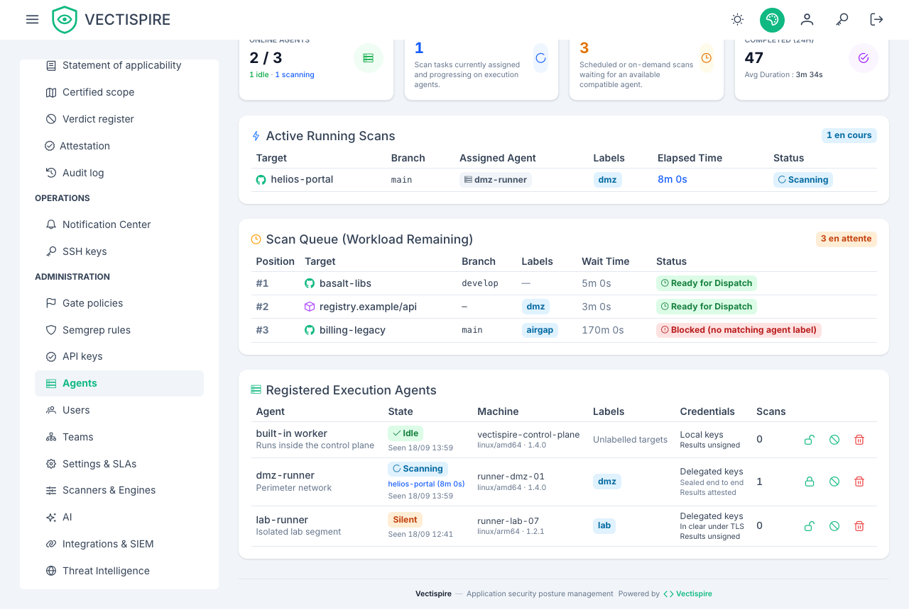

# Agents

A scan is executed by an **agent**. There are two kinds, and both are rows in the same
table, listed together on the **Agents** page.

**The built-in agent** is the web process itself. Created automatically at startup, with no
configuration — which is why a single-machine install works out of the box.

**Remote agents** are separate worker processes on other machines, speaking a four-route
protocol: `hello`, `jobs`, `heartbeat`, `result`.

Both run the same code and both send back the scanners' raw output for the control plane to
normalise. A result produced on another machine is therefore **indistinguishable** from a
local one: same rows, same enrichment, same license policy, same reconciliation.

## When to add one

- Keep the Docker socket off the host that serves the interface.
- Reach a repository or registry only routable from another network segment.
- Add capacity.

## Running one

```bash
# On the agent's machine — the key comes from /agents, shown once
VECTISPIRE_URL=https://vectispire.internal \
VECTISPIRE_AGENT_TOKEN=zsk_... \
node dist/agent/main.js
```

Or as a container, which is how it is meant to be deployed:

```bash
docker compose --profile with-agent up -d
```

An agent **polls over HTTP**, so it needs no inbound port. Its key carries the `agent`
scope and **no database access** — that is a security property rather than a detail. An
agent with a database connection would also need `ENCRYPTION_KEY`, which is the ability to
decrypt every deploy key Vectispire holds.

In the shipped composition the agent reaches only the API and a daemon proxy of its own; the
database and the control plane's proxy are on networks it is not attached to. That keeps it from
*asking* for the key — it does not make one host two: both proxies reach the same daemon, and
daemon access is root there. The profile is for evaluating the protocol. For the isolation, run
the agent on another machine and set `VECTISPIRE_EMBEDDED_WORKER=false` on the control plane.

## Credentials modes

| Mode | What the controller sends | When |
|---|---|---|
| `local` (default) | nothing | the agent's machine has its own git access — over SSH: a private repository over HTTPS cannot be cloned in this mode. A compromised agent yields only what that machine was granted. |
| `delegated` | the deploy key or HTTPS token, per job | a trusted machine only. |

`delegated` **requires HTTPS and is refused without it**. The key or token is never written to
disk — it is parsed in memory and handed to the transport — and every delivery is audited. An agent that announced a sealing key
**refuses a key that arrives unsealed**: that is what a TLS-terminating proxy stripping the
announcement would produce, and the sealing exists precisely to keep the key from that proxy.

Prefer `local`. It bounds the damage a compromised agent can do to that machine's own
access, which is the entire reason for running scans on a separate host in the first place.

## Attesting an agent's results

**This is the one control worth turning on before the others.** Handing back a scan result is the
heaviest operation in the product: artifacts that are present and empty mean "analysed, found
nothing", which resolves the target's whole backlog of that type — silently, and correctly. So
whoever can post a result can make a target's vulnerabilities disappear from every screen, every
export and every gate verdict, leaving a scan that looks like it ran.

Until a key is pinned, the only thing standing between that and a stolen `VECTISPIRE_AGENT_TOKEN`
is the token itself — and a token lives in a compose file, an environment variable and a CI secret
store, and travels on every poll.

On `/agents`, the lock icon on an agent's row pins a key. The control plane generates an Ed25519
pair, keeps the public half on the agent's row and shows you the private half **once**:

```bash
VECTISPIRE_AGENT_SIGNING_KEY=<the value shown once>
```

Put it in the agent's configuration and restart it. Until it has the key, its results are refused
with 403 and the refusal is written to the audit log as `AGENT_RESULT_REFUSED`.

Prefer generating the pair yourself if you would rather the private half never existed here at all:
`PUT /api/v1/admin/agents/{id}/signing-key` accepts a base64 public key instead of the word
`generate`.

**The key is never one the agent announces**, and that asymmetry with the sealing key is the whole
point. A signature verified against a key its signer published on the same channel proves only what
the bearer token already proved. This one has to arrive from somebody who is not the agent.

The row says which state each agent is in — *Results attested* or *Results unsigned* — because an
operator who believes their fleet is attested has no other way to find out it is not.

## Disabling the built-in agent

That is how you say "run nothing here". Queued scans then wait for a remote agent instead
of quietly using the web instance.

Worth doing on any deployment where the interface host should not have a Docker socket at
all.

## Pinning a target to an agent

Set **Required agent** on the repository or image. Use it for targets only routable from
one segment — not as a load-balancing tool, since a pinned target stops being scanned when
that one agent is down.

## Reading the page

Each agent shows its concurrent scan capacity and when it last announced itself. An agent
that has **never announced** has not reached the control plane at all: check the URL, the
token, and that outbound HTTPS is allowed.


