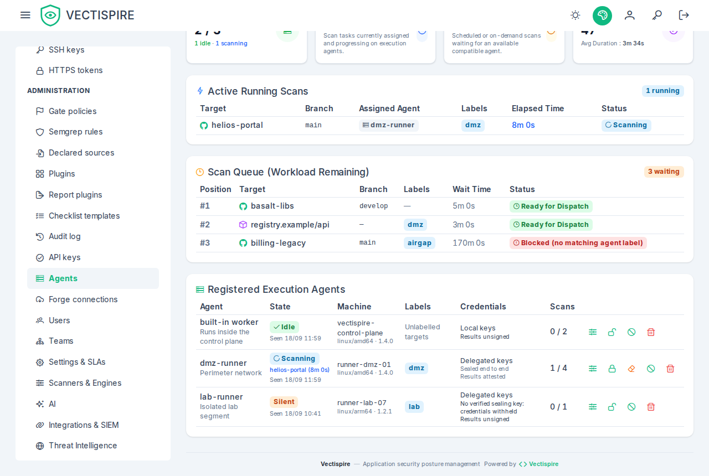

# Agents

A scan is executed by an **agent**. There are two kinds, and both are rows in the same
table, listed together on the **Agents** page.

**The built-in agent** is the web process itself. Created automatically at startup, with no
configuration — which is why a single-machine install works out of the box.

**Remote agents** are separate worker processes on other machines, speaking a short
protocol: `hello`, `sealing-key` (for a `delegated` agent), `jobs`, `rules`, `heartbeat`, `result`,
and `failure` for a scan it claimed and could not run.

Two durations cross it, in two different forms, for anyone writing a client against the
published contract. `GET /api/v1/agent/jobs?wait=30` takes the long-poll wait as **whole
seconds** — 0 by default, which answers at once, and held for at most 30. The result's `duration`
is **ISO-8601 text** (`"PT12.345S"`), the `format: duration` the contract declares; a number of
seconds from an older agent is still accepted. In the result, `[]` means a step ran and found
nothing, and `null` or a missing field means it did not run — which is why the difference matters:
only the first resolves that step's backlog.

Both run the same code and both send back the scanners' raw output for the control plane to
normalise. A result produced on another machine is therefore **indistinguishable** from a
local one: same rows, same enrichment, same license policy, same reconciliation.

## When to add one

- Keep the Docker socket off the host that serves the interface.
- Reach a repository or registry only routable from another network segment.
- Add capacity.

## Running one

```bash
# On the agent's machine — the key comes from /agents, shown once
VECTISPIRE_URL=https://vectispire.internal \
VECTISPIRE_AGENT_TOKEN=zsk_... \
java -jar vectispire-agent.jar      # built by ./gradlew :vectispire-agent:bootJar, JDK 25
```

Or as a container, which is how it is meant to be deployed:

```bash
docker compose --profile with-agent up -d
```

An agent **polls over HTTP**, so it needs no inbound port. Its key carries the `agent`
scope and **no database access** — that is a security property rather than a detail. An
agent with a database connection would also need `ENCRYPTION_KEY`, which is the ability to
decrypt every deploy key Vectispire holds.

In the shipped composition the agent reaches only the API and a daemon proxy of its own; the
database and the control plane's proxy are on networks it is not attached to. That keeps it from
*asking* for the key — it does not make one host two: both proxies reach the same daemon, and
daemon access is root there. The profile is for evaluating the protocol. For the isolation, run
the agent on another machine and set `VECTISPIRE_EMBEDDED_WORKER=false` on the control plane.

## Running several scans at once

**Concurrent scans** (`max_concurrent`) is how many scans one agent runs in parallel: **from 1 to
16**, 1 when nothing is said. Set it when you declare the agent, or later with the sliders icon on
its row — or `PATCH /api/v1/admin/agents/{id}` with `{"max_concurrent": 4}`. A value outside 1–16
is refused with a 400 rather than quietly rounded. The row shows it as *running / allowed*, and a
change is written to the audit log.

It is enforced on both sides. The control plane hands an agent a new scan only while the scans it
holds — claimed, not yet reported, lease still live — are fewer than the limit, and it counts them
in the database, so two polls of the same agent cannot take it past the limit together. The agent
stops polling as soon as it is full.

**The limit belongs to the agent's row, not to a process.** Two processes started with the same key
share one limit between them — and, in `delegated` mode, only the one that announced itself last can
open a sealed key. For more machines, declare more agents.

### Sizing it

Each scan runs up to five scanner containers one after the other, each capped at 2 GB of memory and
at all but one of the Docker host's cores. The vulnerability matcher's database — about 3 GB — is
downloaded **once for the host**, not per scan, and shared read-only by every scan
(`VECTISPIRE_VULNERABILITY_DB_DIR`, see [Configuration](../reference/configuration.md)): count it
once, plus as much again while an update is downloaded beside the current one. Per concurrent scan,
count roughly:

| | per scan |
|---|---|
| CPU | one core |
| Memory | 2 GB, on top of the agent's own JVM |
| Disk (temporary directory) | the clone and the SBOM — the vulnerability database is the host's, counted once |

Scans past what the machine can hold do not wait their turn: they compete for the same cores and
time out together, 15 minutes per scanner. Stay below the machine; more capacity is another agent.

### Changing it, and stopping an agent

**A lowered limit applies to the next claim.** No new scan starts until the running ones fall below
it, and nothing running is interrupted. The agent learns the new value from the answer to its next
poll — raised or lowered, without a restart.

**Stopping an agent waits for its scans.** On `SIGTERM` — `docker stop`, a rolling update — it stops
claiming and waits for the scans in progress to be handed back. Abandoning them would cost more
than waiting: the protocol has no call to give a scan back unrun — `failure` says the scan could
not run and spends an attempt, and a stop is neither — so an abandoned scan keeps its lease
until it lapses (20 minutes after its last heartbeat), then returns to the queue having used one of
its three attempts, and its work is lost. Give the container a grace period as long as your longest
scan — `stop_grace_period: 30m` in compose; Docker's default is 10 seconds.

If the process is killed first — or the machine dies — that lapse is exactly what happens. Until
then its scans still count against its limit, so an agent restarted at once claims only what is
left; once they lapse they no longer count, even before the queue puts them back.

### When a scan cannot run on an agent

A clone refused — a host key that changed, a deployment key the forge does not know — a workspace
that could not be made, a delegated credential that would not open: anything that stops the agent
before a result exists. **The agent says so at once** (`POST /api/v1/agent/jobs/{id}/failure`), with
the reason and whether another attempt could pass — the report's `kind`:

| Kind | What the agent met | What becomes of the scan |
|---|---|---|
| `permanent` | a host key that changed or is not pinned, authentication refused (SSH or HTTPS), a repository or a branch that does not exist, a sub-path the clone does not hold, a credential that will not open or cannot be used here, a URL the clone's own guard refuses (a link-local host, a redirect) | **failed at once**, on this attempt, whichever it is |
| `transient` | the network, a timeout, the forge answering 5xx or 429, a Docker daemon that did not answer — and anything the agent could not classify | back in the queue with the attempt counted, **claimable again after 1 minute, then 5, then 15**, failed for good at the third attempt |

The agent decides the kind from the failure's type — MINA's SSH disconnect reason, JGit's own
exception, the HTTP status the forge answered — never from the message's words. **When in doubt,
transient**: an unknown failure retries rather than failing a scan for good over a passing incident.
A lapsed lease is transient too, and waits the same way. The delays are the control plane's
`VECTISPIRE_SCAN_RETRY_DELAYS` ([Configuration](../reference/configuration.md#scan-queue)).

**The reason is on the scan**, in the history and the scan's page — *Attempt 1 of 3 could not run on
agent "edge"; the scan is back in the queue, not before …: …* — and the page says when the next attempt
may start while the scan waits. Each report is audited as `AGENT_SCAN_FAILED`, with its kind.

- **Scrubbed before it leaves the agent, and again on arrival.** The agent removes the deployment key,
  the token, its API key and its signing key from the text by value; the control plane removes
  whatever has a secret's shape (a URL's user part, a private key block, a bearer token). One line, at
  most 1,000 characters.
- **Signed like a result.** An agent whose signing key is pinned signs the report with it (its own
  context: a result's signature does not pass for a report's), or it is refused with 403 and audited
  as `AGENT_RESULT_REFUSED` — otherwise a stolen API key could spend every attempt of every scan it
  claims.
- **Once, for that attempt.** The report names the attempt the claim handed the agent; a report sent
  twice, or one about an attempt the scan has since moved past, answers 409 and changes nothing — as
  does one from an agent that does not hold the scan.
- **An older control plane answers 404**, and the agent falls back to what it always did — the lease
  lapses, and the reason is in the agent's log only; it says so there. An older agent against this
  control plane sends no report, and its failures end as they did; one that reports without a `kind`
  is read as transient.

A retry is often the same agent. With one agent, a scan whose clone met a passing network error used
to spend its three attempts in as many polls — seconds — before the incident had passed; it now waits
between them. A clone refused for good fails at its first attempt, with the reason.

**The built-in worker follows the same rule.** A scan the control plane could not run itself — its
runner failed before a result existed — is classified the same way, waits the same delays and carries
a reason scrubbed the same way: which executor took a scan does not change its fate.

## Credentials modes

| Mode | What the controller sends | When |
|---|---|---|
| `local` (default) | nothing | the agent's machine has its own git access — over SSH: a private repository over HTTPS cannot be cloned in this mode. A compromised agent yields only what that machine was granted. That access is the `.ssh` of the agent process's home — in the `with-agent` profile, `$VECTISPIRE_AGENT_WORK_DIR/home/.ssh`, empty unless you put a dedicated key there; the composition mounts no `~/.ssh` of yours. |
| `delegated` | the deploy key or HTTPS token, per job | a trusted machine only. |

**A `local` agent's first SSH clone needs a `known_hosts` you filled in.** It clones with its
machine's own SSH access, and ssh refuses a host its `known_hosts` does not list — the scan fails
with *"The host key of … was refused by this machine's own known_hosts"*. That refusal is ssh's
default and is kept: write the forge's keys to `$VECTISPIRE_AGENT_WORK_DIR/home/.ssh/known_hosts`
(the `with-agent` profile) with `ssh-keyscan`, **after comparing their fingerprints with the ones the
forge publishes** — the commands are in
[A `local` agent: fill in `known_hosts`](../guide/repositories.md#ssh-known-hosts-local-agent). A
`delegated` agent records a first contact itself and refuses a changed key.

In `delegated` mode the key or token **only ever leaves sealed** for the agent's own process, and
never in the clear — over HTTPS or not. It is never written to disk on the agent — it is parsed in
memory and handed to the transport — and every delivery is audited.

### Before delegating credentials: pin the signing key {#before-delegating-credentials-pin-the-signing-key}

**A delegated agent receives nothing until a result-signing key is pinned for it** — see
[Attesting an agent's results](#attesting-an-agents-results) — and its private half is in the
agent's configuration. The reason is where the sealing key comes from. The agent makes a fresh
X25519 pair at every start and announces the public half; the control plane seals credentials for
it. That announcement crosses the same network path as the credentials, so a TLS-terminating proxy
on that path could otherwise change it. The agent therefore **signs its sealing key with its pinned
signing key**, and the control plane accepts only a sealing key whose signature verifies against the
key an administrator pinned ([decision 0031](https://github.com/asmolabs/vectispire/blob/main/docs/architecture/en/decisions/0031-a-sealing-key-is-believed-only-on-the-pinned-key.md)).
**Sealing takes a TLS-terminating proxy out of the trust boundary, given a pinned signing key.**

**A credential opens only for what it was sealed for.** A deployment key is sealed as a deployment
key; an HTTPS token is sealed for the host and the user name it travels with, and the agent opens it
under those, then sends it to that host alone. A host changed on the way leaves an envelope that no
longer opens, and the scan fails rather than handing the token to another server. An agent older
than 0.11.0 opens envelopes bound to nothing: its signed announcement is refused, the audit entry
says *older than this control plane … Update the agent*, and it is handed no credential, so
**update every `delegated` agent with the control plane**.

So, for each `delegated` agent:

1. Pin a signing key on its row (the lock icon on `/agents`), and set the private half shown once as
   `VECTISPIRE_AGENT_SIGNING_KEY` in the agent's configuration.
2. Run an agent of this version and restart it. After its `hello` it announces its sealing key,
   signed; the log says `Sealing key verified by the control plane`.
3. The row now reads *Sealed end to end*. Until then it reads *No verified sealing key: credentials
   withheld*: the agent is not handed the scans that need a key or token, which stay in the queue
   for an executor that can run them — a verified agent or the built-in worker — **without spending
   any of their attempts**. Image scans and repositories without a credential still go to it. When
   those scans are all that is waiting for it, its poll is answered **412** with the step that is
   missing, and its log says so on every retry; nothing is sent. If no other executor can take
   them, they wait until this agent is fixed. The control plane says so too: the gauge
   `vectispire.scans.credential.unserved` (under `/actuator/metrics`) counts the waiting scans of
   repositories carrying a credential that no executor able to be handed it serves — an enabled
   `local` agent, a `delegated` one with a verified key, or the built-in worker when it runs — and
   its log warns, at most every fifteen minutes and again when the count grows, naming the labels
   and the agents that would take them but hold no verified key. The **Agents** screen shows the
   same figure as a warning above the queue, with those labels, those agents and what to do
   (`GET /api/v1/admin/agents/credentialed-backlog`).

**Rotation is automatic.** Each start makes a new pair, stamped with its creation time; the control
plane keeps the newest key signed with the pinned key and refuses an older one (**409**, audited).
A `hello` without a key, or with one nobody signed, never replaces or clears the accepted key.

**Resetting it is an administrator's act.** On `/agents`, the eraser icon on the row of an agent
that reads *Sealed end to end* forgets its key, after a confirmation — or
`DELETE /api/v1/admin/agents/{id}/sealing-key`. Use it for an agent host whose clock went back, so
that its new keys all read as older, or for a key suspected of having leaked; newer keys fix
everything else on their own. Pinning, replacing or removing the signing key forgets it too. Both
are audited. **Until the agent proves a new key, it is handed no delegated credential**: the row
reads *credentials withheld* again and its delegated scans wait in the queue until it announces a
new signed key, at its next start or its next claim.

A signature that does not verify is refused with **403**, written to the audit log as
`AGENT_SEALING_KEY_REFUSED` and sent to the SIEM as `VECTI-SEC-020`: the agent's configured key is not
the pinned one, or the key was not made by the agent.

**Upgrading.** An agent older than this version cannot sign its key: a current control plane hands
it no delegated credential (412, in the agent's log) while its `hello`, `local` mode and image scans
keep working. An agent of this version talking to an older control plane still works as before —
its `hello` carries the unsigned key that control plane seals for.

Prefer `local`. It bounds the damage a compromised agent can do to that machine's own
access, which is the entire reason for running scans on a separate host in the first place.

## Attesting an agent's results

**This is the one control worth turning on before the others.** Handing back a scan result is the
heaviest operation in the product: artifacts that are present and empty mean "analysed, found
nothing", which resolves the target's whole backlog of that type — silently, and correctly. So
whoever can post a result can make a target's vulnerabilities disappear from every screen, every
export and every gate verdict, leaving a scan that looks like it ran.

Until a key is pinned, the only thing standing between that and a stolen `VECTISPIRE_AGENT_TOKEN`
is the token itself — and a token lives in a compose file, an environment variable and a CI secret
store, and travels on every poll.

On `/agents`, the lock icon on an agent's row pins a key. The control plane generates an Ed25519
pair, keeps the public half on the agent's row and shows you the private half **once**:

```bash
VECTISPIRE_AGENT_SIGNING_KEY=<the value shown once>
```

Put it in the agent's configuration and restart it. Until it has the key, its results are refused
with 403 and the refusal is written to the audit log as `AGENT_RESULT_REFUSED`; so are its failure
reports.

Prefer generating the pair yourself if you would rather the private half never existed here at all:
`PUT /api/v1/admin/agents/{id}/signing-key` accepts a base64 public key instead of the word
`generate`.

**The key is never one the agent announces**, and that asymmetry with the sealing key is the whole
point. A signature verified against a key its signer published on the same channel proves only what
the bearer token already proved. This one has to arrive from somebody who is not the agent.

The same key vouches for the agent's sealing key, which is why a `delegated` agent receives no
credential without it — see [Before delegating credentials](#before-delegating-credentials-pin-the-signing-key).

The row says which state each agent is in — *Results attested* or *Results unsigned* — because an
operator who believes their fleet is attested has no other way to find out it is not.

## Disabling the built-in agent

That is how you say "run nothing here". Queued scans then wait for a remote agent instead
of quietly using the web instance.

Worth doing on any deployment where the interface host should not have a Docker socket at
all.

## Pinning a target to an agent

Set **Required agent** on the repository or image. Use it for targets only routable from
one segment — not as a load-balancing tool, since a pinned target stops being scanned when
that one agent is down.

## Reading the page

Each agent shows its running scans against its limit — see
[Running several scans at once](#running-several-scans-at-once) — and when it was last heard from: its
`hello`, each poll for work — found or not — and each lease renewal during a scan, written at most
every fifteen seconds. Two minutes without any of them and it reads as offline. An agent that has
**never announced** has not reached the control plane at all: check the URL, the token, and that
outbound HTTPS is allowed.


