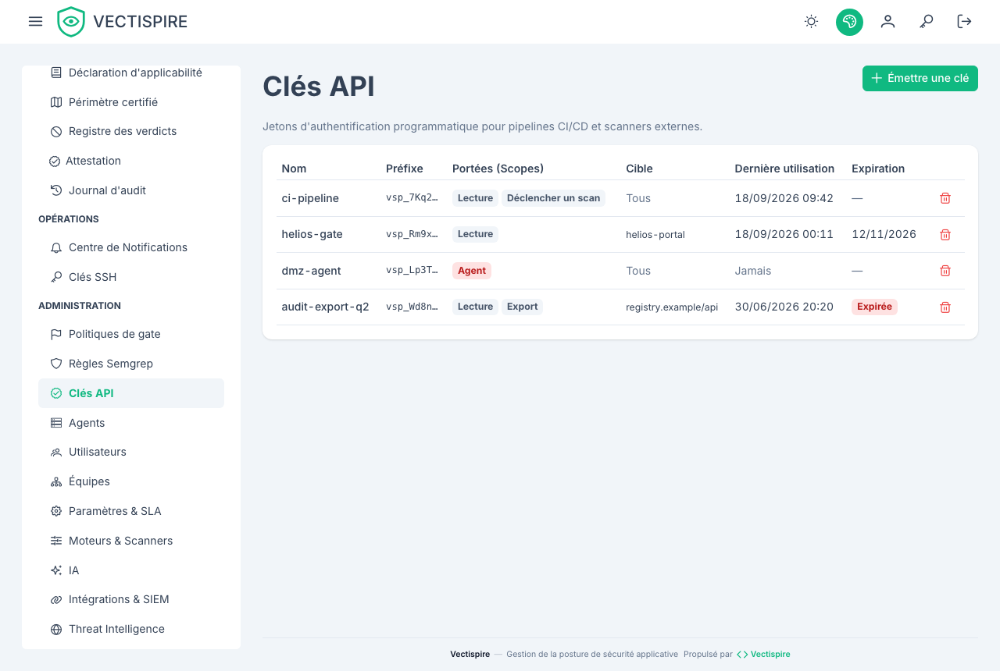

# Clés d'API

Émises depuis l'interface, pour des machines plutôt que pour des personnes : une barrière CI, un job
SonarQube ou Jenkins, un script qui exporte un SBOM. Un agent distant a aussi une clé, mais elle est
créée avec l'agent, pas ici.

## Une clé agit pour un compte

Une clé appartient au compte qui l'a émise et **agit pour ce compte** : elle voit ce que le compte
voit, et chaque écriture qu'elle fait est consignée dans le [journal d'audit](audit-log.md) sous la
forme `alice (API key ci)` — le compte, et la clé à côté. Désactivez le compte et ses clés cessent
de fonctionner avec lui. Une clé émise avant que les clés aient un propriétaire est listée
*aucun compte — inactive* et ne s'authentifie nulle part : révoquez-la et émettez-en une autre.

## Portées

Une clé ne passe ensuite que sur les routes qui acceptent une clé, et seulement avec une portée
qu'elle détient :

| Portée | Permet |
|---|---|
| `read` | lister et lire dépôts, conteneurs, scans, issues, verdicts de barrière et synthèse de conformité |
| `scan` | déclencher le scan d'un dépôt ou d'un conteneur, et demander un verdict à la [barrière CI](../integrations/ci-gate.md) |
| `export` | documents SBOM, VEX, CSAF et CycloneDX, PDF et dossier de preuves de conformité, exports |

Tout le reste — administration, triage, réglages, utilisateurs — refuse une clé avec `403`, quel que
soit le rôle du compte. C'est le but : la clé d'un administrateur utilisée par un pipeline n'est pas
un administrateur.

Donnez à une barrière CI une clé `scan`, et rien de plus.



## Limiter une clé à une cible

Une clé peut être limitée à un dépôt ou à un conteneur. Elle ne voit alors que cette cible, dans ce
que son compte voit : une restriction rétrécit, elle n'élargit jamais. Une cible qui n'existe pas, ou
que le compte ne voit pas, est refusée à l'émission.

## Affichée une seule fois

Une clé est affichée une fois, à sa création. Vectispire stocke ce dont il a besoin pour
vérifier une clé présentée, et ne peut pas vous en remontrer la valeur.

Mettez-la directement dans votre coffre à secrets. Si elle est perdue, révoquez-la et
émettez-en une autre — c'est une opération de deux minutes, alors qu'une clé collée dans une
fenêtre de discussion pour s'en épargner est une opération permanente.

## Présenter une clé

| En-tête | Pour |
|---|---|
| `Authorization: Bearer zsk_…` | une clé — la forme à préférer |
| `X-API-Key: zsk_…` | la même clé, pour un client qui ne peut pas poser `Authorization` ; lu seulement en l'absence d'`Authorization` |

Un jeton de session n'est jamais accepté dans `X-API-Key`. Chaque clé dispose d'un budget de
requêtes par minute (`VECTISPIRE_API_KEY_REQUESTS_PER_MINUTE`, 600 par défaut) ; au-delà, la réponse
est `429` avec `Retry-After`, pour qu'un job qui boucle ralentisse au lieu de charger le plan de
contrôle.

```bash
curl -fsS -H "Authorization: Bearer $VECTISPIRE_TOKEN" \
  "$VECTISPIRE_URL/api/v1/issues?repository_id=12"
```

## Révoquer

Révoquez une clé quand le pipeline qui l'utilisait est retiré, quand quelqu'un qui pouvait la
lire s'en va, ou quand vous n'êtes pas sûr. La révocation est immédiate, et chaque usage figure
dans le [journal d'audit](audit-log.md).

Deux gestes révoquent des clés d'eux-mêmes :

- **Un administrateur qui réinitialise le mot de passe d'un compte révoque toutes les clés que ce
  compte a émises**, comme il ferme ses sessions. Une réinitialisation sert à exclure quelqu'un qui
  détenait le compte ; une clé émise entre-temps continuerait sinon d'agir pour lui. L'entrée d'audit
  de la réinitialisation dit combien de clés sont parties. Émettez-en de nouvelles ensuite.
- **Supprimer un dépôt ou un conteneur révoque les clés restreintes à cette cible**, avec les droits
  qui la nomment — une clé ne survit jamais à sa cible, même à une restauration qui renumérote.

Émettre une clé ne redemande pas le mot de passe. Seul un administrateur en émet, chaque émission
figure au journal d'audit et part vers le SIEM, et un compte qui se connecte par authentification
unique peut n'avoir aucun mot de passe local à fournir — une étape de ré-authentification
fermerait l'écran à ces administrateurs plutôt que de le protéger.

## En CI

```yaml
env:
  VECTISPIRE_TOKEN: ${{ secrets.VECTISPIRE_TOKEN }}
```

Jamais dans le dépôt, jamais dans la définition du job. Voir
[Barrière CI](../integrations/ci-gate.md).
