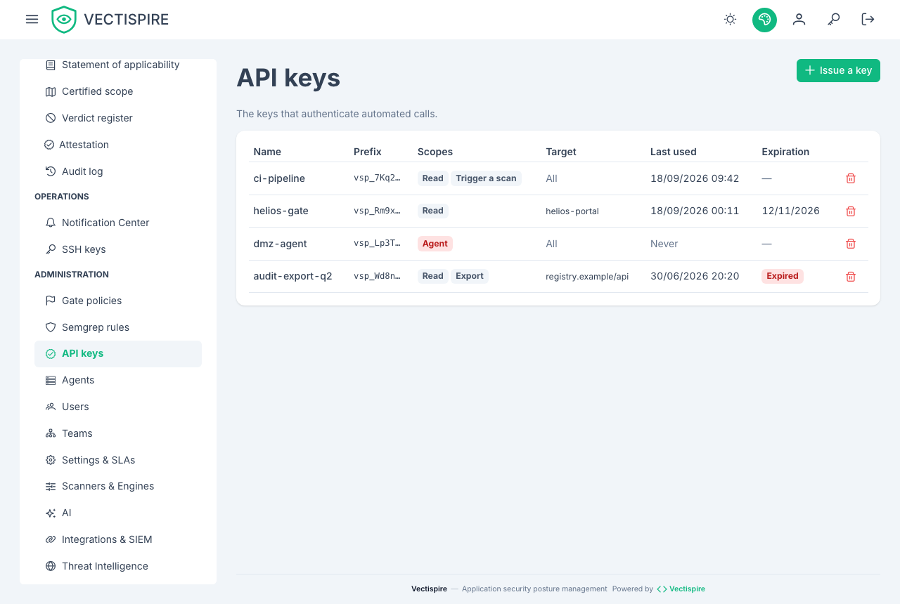

# API keys

Issued from the interface, for machines rather than people: a CI gate, a SonarQube or Jenkins job,
a script that exports an SBOM. A remote agent has a key too, but it is created with the agent, not
here.

## A key acts for an account

A key belongs to the account that issued it and **acts for that account**: it sees what the
account sees, and every write it makes is recorded in the [audit log](audit-log.md) as
`alice (API key ci)` — the account, and the key beside it. Deactivate the account and its keys stop
working with it. A key issued before keys had an owner is listed as *no account — inactive* and
authenticates nowhere: revoke it and issue another.

## Scopes

A key then passes only on the routes that accept a key, and only with a scope it holds:

| Scope | Allows |
|---|---|
| `read` | listing and reading repositories, containers, scans, issues, gate verdicts and the compliance summary |
| `scan` | triggering a scan of a repository or container, and asking the [CI gate](../integrations/ci-gate.md) for a verdict |
| `export` | SBOM, VEX, CSAF and CycloneDX documents, compliance PDF and evidence bundle, exports |

Anything else — administration, triage, settings, users — refuses a key with `403`, whatever the
account's role. That is the point: an administrator's key used by a pipeline is not an
administrator.

Give a CI gate a key with `scan` and nothing more.



## Restricting a key to one target

A key can be restricted to one repository or one container. It then sees only that target, within
what its account sees: a restriction narrows, it never widens. A target that does not exist, or that
the account cannot see, is refused at issuance.

## Shown once

A key is displayed once, at creation. Vectispire stores what it needs to verify a
presented key and cannot show you the value again.

Put it straight into your secret store. If it is lost, revoke it and issue another — that
is a two-minute operation, and a key pasted into a chat window to avoid it is a permanent
one.

## Sending a key

| Header | For |
|---|---|
| `Authorization: Bearer zsk_…` | a key — the form to prefer |
| `X-API-Key: zsk_…` | the same key, for a client that cannot set `Authorization`; read only when `Authorization` is absent |

A session token is never accepted in `X-API-Key`. Each key has a budget of requests per minute
(`VECTISPIRE_API_KEY_REQUESTS_PER_MINUTE`, 600 by default); beyond it the answer is `429` with
`Retry-After`, so a looping job slows down instead of loading the control plane.

```bash
curl -fsS -H "Authorization: Bearer $VECTISPIRE_TOKEN" \
  "$VECTISPIRE_URL/api/v1/issues?repository_id=12"
```

## Revoking

Revoke a key when the pipeline that used it is retired, when someone who could read it
leaves, or when you are not sure. Revocation is immediate, and every use is in the
[audit log](audit-log.md).

## In CI

```yaml
env:
  VECTISPIRE_TOKEN: ${{ secrets.VECTISPIRE_TOKEN }}
```

Never in the repository, never in the job definition. See
[CI policy gate](../integrations/ci-gate.md).
