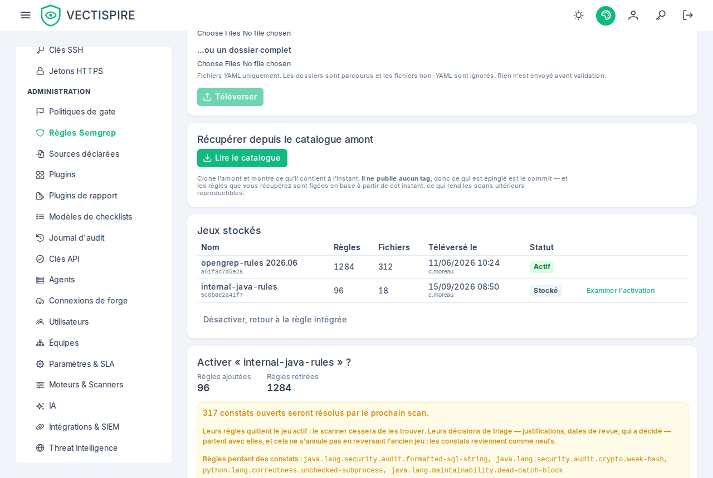

# Jeux de règles Semgrep

Semgrep lit le code source lui-même — une requête SQL concaténée, une commande passée à un
shell, un certificat TLS non vérifié. Aucun autre scanner ici ne voit quoi que ce soit de tout
cela.

Il est **désactivé par défaut**, et s'exécute réseau désactivé comme tous les autres scanners.

!!! info "Qui lit, qui modifie"
    Lire les jeux de règles et leur impact est ouvert aux administrateurs, au CISO et au rôle
    **Auditeur**. Téléverser un jeu, en activer ou en désactiver un demande un administrateur ou
    le CISO.

## Pourquoi vous devez installer les règles vous-même

**Vectispire n'embarque qu'une seule règle.**

C'est une contrainte de licence, pas un oubli : les jeux de règles Semgrep publics ne sont pas
redistribuables. Les livrer placerait un problème de redistribution dans chaque déploiement de
ce produit.

La couverture réelle vient donc d'un jeu de règles que vous installez. Activer Semgrep sans
jeu de règles vous donne les constats d'une seule règle et un faux sentiment de couverture — ce
qui est pire que de le laisser désactivé.

## En installer un

Procurez-vous un jeu de règles sous une licence qui autorise votre usage, et enregistrez-le
dans **Jeux de règles**. Le registre de Semgrep, les règles internes de votre organisation, ou
celles d'un éditeur — la contrainte porte sur la redistribution par Vectispire, pas sur votre
exécution.

## Sécurité et qualité

Les constats Semgrep arrivent en deux sortes :

- **sécurité** — soumis à la barrière comme n'importe quelle vulnérabilité ;
- **qualité** — visibles dans le backlog, et ils **ne peuvent jamais faire échouer une barrière
  CI**.

Cette frontière est structurelle plutôt que configurable. Voir
[Qualité du code](../guide/quality.md).

## Le déployer

Attendez-vous à un premier résultat volumineux sur une base de code existante. Activez-le sur
un dépôt, traitez ce qu'il dit, affinez le jeu de règles, et seulement ensuite élargissez —
l'activer sur tout le parc d'un coup produit un backlog que personne ne trie et une
fonctionnalité que tout le monde ignore.

**L'activation dit ce qu'elle coûte avant de le faire.** Les règles qu'un nouveau jeu abandonne
sont des règles dont les constats ouverts se résolvent au prochain scan, et leurs justifications,
dates de revue et décideur partent avec elles. Reverser l'ancien jeu ne les ramène pas : les
constats reviennent comme neufs.

**Et elle ne se fait que sur ce nombre.** Quand le changement résoudrait au moins un constat
ouvert, le bouton **Activer** — et **Désactiver, retour à la règle intégrée**, qui abandonne de la même façon
les règles du jeu actif — est refusé tant que vous n'avez pas confirmé le nombre que l'aperçu
affiche. Ce nombre est relu à la confirmation : si des constats sont arrivés depuis l'aperçu, le
nouveau nombre vous est montré et la question reposée, si bien qu'un aperçu pris plus tôt n'autorise
jamais plus de perte qu'il n'en affichait. Un changement qui ne résout rien s'active aussitôt. Le
journal d'audit enregistre la perte acceptée, en nombre et par règle. Les règles fournies tournent à
côté de tout jeu : leurs constats ne sont jamais comptés comme perdus.

Pour un script : envoyez `acceptLosing` avec l'`affectedIssues` de l'aperçu ; un `409` de type
`urn:vectispire:problem:rule-set-activation-loses-issues` porte l'`affectedIssues` et les
`losingIssues` courants. Voir la [référence de l'API](https://github.com/asmolabs/vectispire/blob/main/docs/fr/api/rest_api_reference.md).
