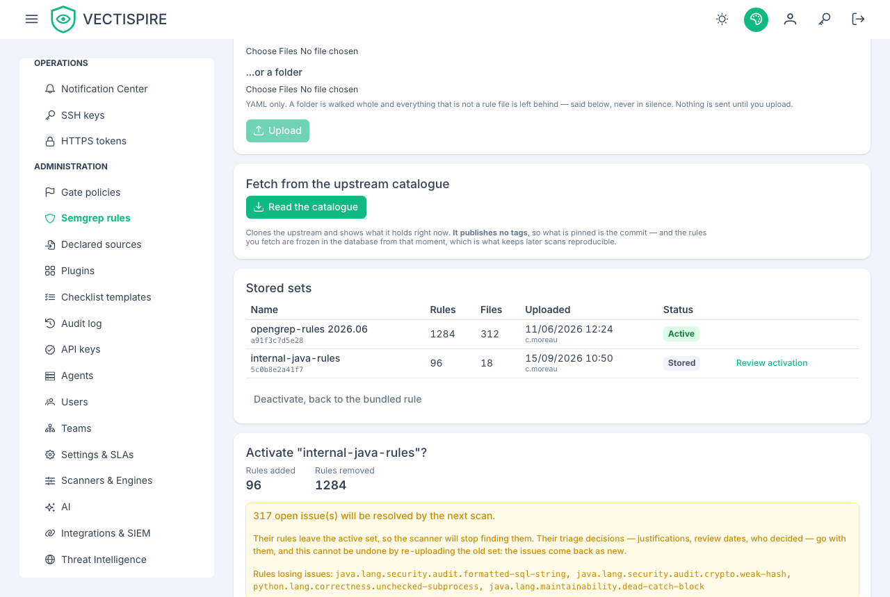

# Semgrep rule sets

Semgrep reads the source code itself — a concatenated SQL query, a command handed to a
shell, an unverified TLS certificate. No other scanner here sees any of that.

It is **off by default**, and it runs with the network disabled like every other scanner.

!!! info "Who can read, who can change"
    Reading the rule sets and their impact is open to administrators, the CISO and the **Auditor**
    role. Uploading a set, activating or deactivating one requires an administrator or the CISO.

## Why you have to install rules yourself

**Vectispire bundles a single rule.**

That is a licensing constraint, not an oversight: the public Semgrep rule sets are not
redistributable. Shipping them would put a redistribution problem into every deployment of
this product.

So real coverage comes from a rule set you install. Enabling Semgrep without one gets you
one rule's worth of findings and a false sense of coverage — which is worse than leaving it
off.

## Installing one

Obtain a rule set under a license that permits your use, and register it on **Rule sets**.
Semgrep's own registry, your organisation's internal rules, or a vendor's — the constraint
is on Vectispire redistributing them, not on you running them.

## Security and quality

Semgrep findings arrive in two kinds:

- **security** — gated like any vulnerability;
- **quality** — visible in the backlog, and they **can never fail a CI gate**.

That boundary is structural rather than configurable. See
[Code quality](../guide/quality.md).

## Rolling it out

Expect a large first result on an existing codebase. Enable it on one repository, work
through what it says, tune the rule set, and only then widen — turning it on estate-wide in
one go produces a backlog nobody triages and a feature everybody ignores.

**Activation says what it costs before it does it.** The rules a new set drops are rules whose
open issues resolve on the next scan, and their justifications, review dates and decider go with
them. Re-uploading the old set does not bring them back: the issues return as new ones.

**And it goes ahead only on that number.** When the change would resolve at least one open issue,
the **Activate** button — and **Deactivate, back to the bundled rule**, which drops the active set's rules
the same way — is refused until you confirm the count the preview shows. The count is read again
when you confirm: if findings arrived since the preview, you are shown the new number and asked
again, so a preview taken earlier never authorises more loss than it displayed. A change that
resolves nothing activates at once. The audit log records the loss you accepted, by number and by
rule. The bundled rules run beside every set, so their issues are never counted as lost.

For a script: send `acceptLosing` with the preview's `affectedIssues`; a `409` of type
`urn:vectispire:problem:rule-set-activation-loses-issues` carries the current `affectedIssues` and
`losingIssues`. See the [API reference](https://github.com/asmolabs/vectispire/blob/main/docs/en/api/rest_api_reference.md).
