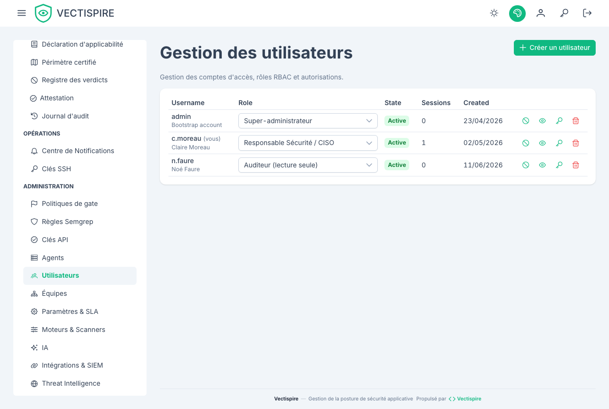
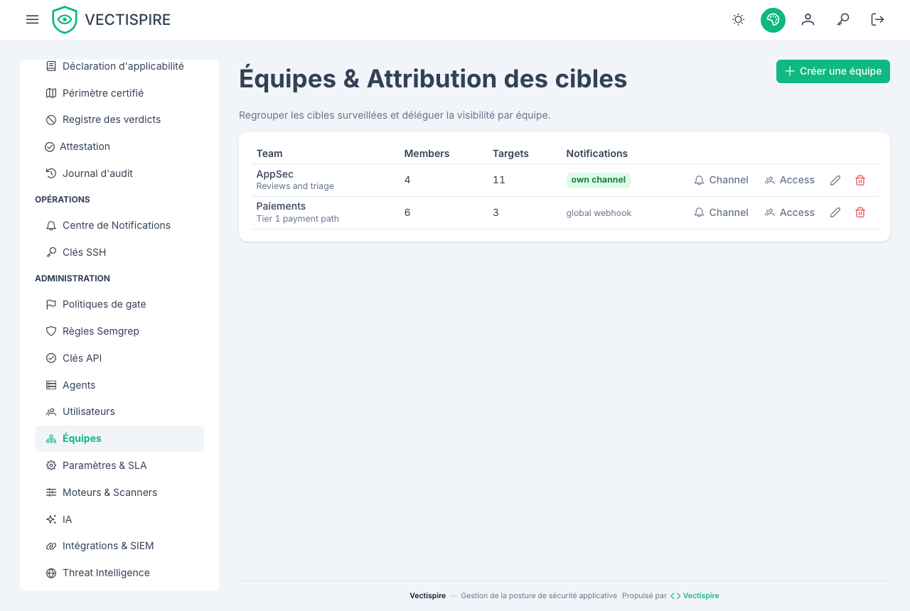

# Utilisateurs et équipes

## Comptes

Il n'y a **aucune page d'inscription**. Un administrateur crée chaque compte.

Le premier vient des variables d'amorçage au premier démarrage, et seulement quand la table des
utilisateurs est vide — voir
[Installation](../getting-started/installation.md#the-first-account). Ensuite, les deux
variables sont ignorées.

Un compte porte un indicateur `is_active`. Un compte désactivé ne peut pas se connecter, et son
historique reste intact — ce qui est tout l'intérêt de désactiver plutôt que de supprimer.

## Rôles

Les rôles décident de ce qu'une personne peut **faire** ; les équipes décident de ce qu'elle peut
**voir**. Les deux sont indépendants, et c'est voulu : donner un rôle n'élargit pas le périmètre,
sauf pour les trois rôles qui portent explicitement une portée globale.

| Rôle | Ce qu'il peut faire |
|---|---|
| **Utilisateur** | Voit et qualifie les constats de ses cibles. Ne peut pas approuver seul une décision qui clôt une anomalie lorsque la double validation est active. |
| **Référent sécurité** | Comme ci-dessus, et peut approuver un triage — dans le seul périmètre que ses équipes lui donnent. |
| **Auditeur** | Voit tout le parc et **ne change rien**, nulle part. Lit le journal d'audit, les preuves de conformité, la politique de barrière, les jeux de règles et la configuration SIEM. N'approuve aucun triage. |
| **Responsable Sécurité / CISO** | Voit tout le parc, approuve les triages, et **écrit** la gouvernance : barrières, jeux de règles, destination SIEM, politique de licences, réglages. N'administre pas les comptes. |
| **Administrateur** | Tout ce qui précède, plus les comptes, les équipes, les clés API, les clés SSH et les agents. |
| **Super-administrateur** | Le gouverneur de la plateforme : décide des règles sous lesquelles les autres agissent — double validation, visibilité des cibles — et administre les comptes, mais **ne prend aucune décision de triage** et n'importe aucun VEX. Créé par l'amorçage de l'installation. |

**L'auditeur mérite un mot.** Il existe parce que « regarder » et « pouvoir changer » étaient la
même permission : la seule façon d'ouvrir le journal d'audit à quelqu'un était de lui donner aussi
le droit de réécrire la politique qu'il venait vérifier. Si vous devez montrer votre posture à un
commissaire, à un client ou à un service interne, c'est ce rôle-là et pas le CISO.

Distribuez les rôles administratifs avec parcimonie : le journal d'audit n'a de sens qu'à
proportion du nombre de gens capables de changer ce qu'il enregistre.

**Seul un super-administrateur administre un super-administrateur.** Accorder ou retirer ce rôle,
réinitialiser son mot de passe, désactiver ou supprimer son compte est refusé à un administrateur.
La séparation des rôles en dépend : le compte qui peut lever la double validation est celui qui ne
peut pas trier, et un administrateur capable de se promouvoir tiendrait les deux moitiés. Pour la
même raison, **personne ne change son propre rôle**, ni vers le haut ni vers le bas — un autre
administrateur doit le faire.

## Équipes et visibilité

Les équipes décident de ce qu'une personne peut **voir**. Les cibles appartiennent à des
équipes, et chaque liste, chaque export et chaque série de tendance est restreint par la
visibilité du lecteur — la série « backlog dans le temps » du tableau de bord comprise.

Cette restriction est uniforme à dessein. Une vue qui l'ignorerait discrètement laisserait
quelqu'un déduire la forme d'un parc qu'il ne peut pas ouvrir.

## Ce qu'une attribution nomme

Une attribution — à un compte directement, ou à une équipe — nomme l'une de trois choses :

| Type | Couvre |
|---|---|
| `repository` | ce dépôt |
| `container` | cette image de conteneur |
| `project` | tous les dépôts du projet **au moment de chaque requête** — voir [Solutions et projets](solutions-and-projects.md) |

Ce qu'une personne voit est l'**union** de tout ce qui lui est attribué directement et de tout ce
qui est attribué à ses équipes. Rejoindre une équipe ne restreint jamais ce qu'on avait déjà.

**Une attribution de projet suit le projet.** Un dépôt rangé dans le projet après l'attribution est
visible de ses titulaires dès qu'il y est rangé ; un dépôt qui en sort cesse d'être visible par
cette attribution au même instant. Rien n'est réattribué, c'est tout l'intérêt — et c'est pourquoi
déplacer un dépôt d'un projet à l'autre est audité comme le changement d'accès qu'il est.

Il n'y a pas d'attribution sur une solution : attribuez chacun de ses projets. Une attribution
nommant un projet inexistant est refusée. Supprimer un projet révoque toute attribution qui le
nomme.

Les listes d'attributions d'un compte et d'une équipe montrent chaque cible par son nom — un projet
sous la forme `Solution / Projet` — et une cible supprimée depuis comme « deleted target ». Les
fenêtres d'accès des écrans **Utilisateurs** et **Équipes** proposent chaque projet, sous la forme
*Projet — Solution / Projet*, à côté des dépôts et des images.

## Cibles sans étiquette

Une cible n'appartenant à aucune équipe n'est visible que de ceux qui voient tout. Il vaut la
peine de les chercher après un import en masse : une cible sans propriétaire est une cible dont
personne n'est responsable, et ses scans continuent de compter dans le tableau de bord de
personne.

## Voir aussi

- [Authentification unique](sso.md) — déléguer l'authentification sans déléguer l'autorisation.
- [Clés d'API](api-keys.md) — pour des machines plutôt que pour des personnes.
- [Journal d'audit](audit-log.md) — ce qui est enregistré de tout cela.
