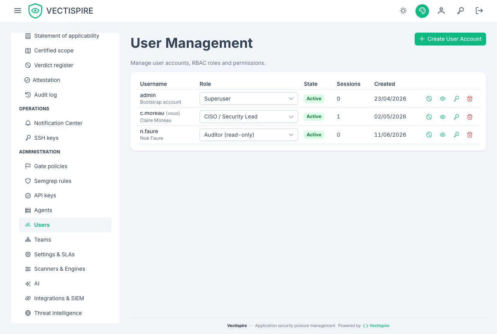
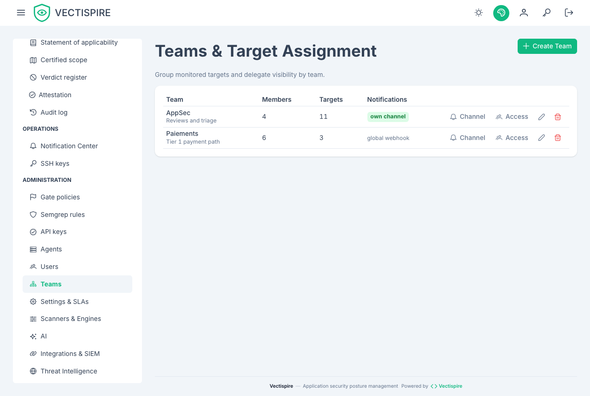

# Users and teams

## Accounts

There is **no self-registration page**. An administrator creates every account.

The first one comes from the bootstrap variables at first start, and only when the user
table is empty — see [Installation](../getting-started/installation.md#the-first-account).
After that, both variables are ignored.

An account has an `is_active` flag. A deactivated account cannot sign in, and its history
stays intact — which is the point of deactivating rather than deleting one.

## Roles

Roles decide what a person may **do**; teams decide what they may **see**. The two are independent
by design: granting a role does not widen someone's scope, except for the three roles that
explicitly carry a global one.

| Role | What it can do |
|---|---|
| **User** | Sees and triages the findings of its own targets. Cannot single-handedly approve a decision that settles an issue while four-eyes approval is on. |
| **Security Champion** | As above, and may approve a triage — but only within the scope its teams grant. |
| **Auditor** | Sees the whole estate and **changes nothing**, anywhere. Reads the audit log, the compliance evidence, the gate policy, the rule sets and the SIEM configuration. Approves no triage. |
| **CISO / Security Lead** | Sees the whole estate, approves triages, and **writes** governance: gate policies, rule sets, SIEM destination, licence policy, settings. Does not administer accounts. |
| **Administrator** | All of the above, plus accounts, teams, API keys, SSH keys and agents. |
| **Superuser** | The platform governor: decides the rules the others act under — four-eyes approval, target visibility — and administers accounts, but **takes no triage decision** and imports no VEX. Created by the installation's bootstrap. |

**The auditor is worth a note.** It exists because "looking" and "being able to change" used to be
the same permission: the only way to open the audit log to someone was to also grant them the right
to rewrite the policy they had come to check. If you have to show your posture to an assessor, a
customer or an internal function, that is the role — not CISO.

Hand out administrative roles sparingly: the audit log is only as meaningful as the number of
people who can change what it records.

**Only a superuser administers a superuser.** Granting or removing the role, resetting a
superuser's password, deactivating or deleting the account are refused to an administrator. The
separation rests on it: the account that can lift four-eyes is the one that cannot triage, and an
administrator able to make itself superuser would hold both halves. For the same reason **nobody
changes their own role**, up or down — another administrator has to.

## Teams and visibility

Teams decide what a person can **see**. Targets are owned by teams, and every list, every
export and every trend series is narrowed by the reader's visibility — the dashboard's
backlog-over-time series included.

That narrowing is uniform on purpose. A view that quietly ignored it would let somebody
infer the shape of an estate they cannot open.

## What a grant names

A grant — to an account directly, or to a team — names one of three things:

| Kind | Covers |
|---|---|
| `repository` | that repository |
| `container` | that container image |
| `project` | every repository in the project **at the moment of each request** — see [Solutions and projects](solutions-and-projects.md) |

What a person sees is the **union** of everything granted to them directly and everything granted
to their teams. Joining a team never narrows what someone already had.

**A project grant follows the project.** A repository filed into the project after the grant was
made is visible to its holders as soon as it is filed; a repository moved out stops being visible
through that grant at the same moment. Nothing is re-granted, which is the point — and why moving a
repository between projects is audited as the access change it is.

There is no grant on a solution: grant each of its projects. A grant naming a project that does not
exist is refused. Deleting a project revokes every grant naming it.

The grant lists of an account and of a team show each target by name — a project as
`Solution / Project` — and a target that has since been deleted as "deleted target".

## Unlabelled targets

A target belonging to no team is visible only to those who can see everything. It is worth
checking for these after a bulk import: an unowned target is one nobody is responsible for,
and its scans still count in nobody's dashboard.

## Related

- [Single sign-on](sso.md) — delegating authentication without delegating authorisation.
- [API keys](api-keys.md) — for machines rather than people.
- [Audit log](audit-log.md) — what gets recorded about all of this.
