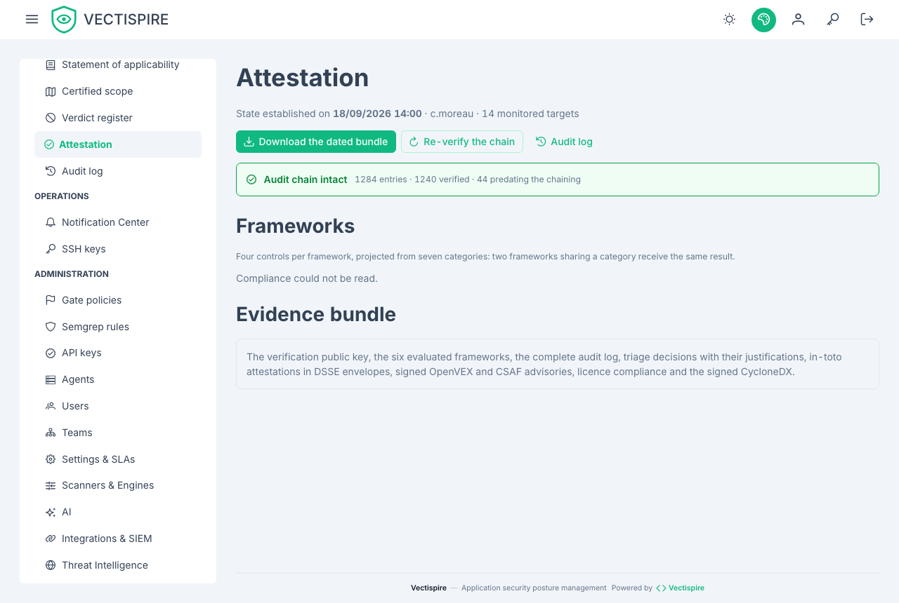

# Attestation

What the estate looked like, at an hour, with the proof attached.

## Why a page rather than a fifth link

The four screens an auditor needs already exist — the audit log and its chain check, the
compliance summary, the gate policy, the evidence bundle — and **not one of them carries a time**.

An auditor is not asking "where are you". They are asking "where were you on the day I looked",
and a screen with no hour cannot answer that.

## The chain check leads, because it is the only proof here

Everything else on this page is a measurement. The audit chain is the one claim that demonstrates
itself on the spot: each entry carries the hash of the one before it, so an entry modified or
removed after the fact breaks the chain at a nameable place.

Two numbers sit beside it and must not be confused:

- **broken** names the entry where the chain fails. That is an alarm.
- **unverifiable** counts entries written before chaining existed. That is history, not tampering,
  and reading it as an alarm would make an old installation look compromised.

## What the bundle contains

One click exports the signed evidence bundle. The nine sections are described rather than listed:
the file names are the server's, and copying them here would create a second list that drifts at
the first rename with nothing reporting it. Naming what they contain stays true longer than naming
what they are called.

The signature is what makes the package worth more than a screenshot: it attests that this bundle
is the one Vectispire produced, unmodified.

## Scope and compliance are read together

An attestation without a scope is a measurement of an unnamed thing. The page shows the compliance
posture beside the chain state, and a failure to read one does not erase the other — a compliance
figure that did not load must not take a verified chain down with it.

## Related

- [Compliance](compliance.md) — the frameworks behind the posture.
- [Certified scope](certified-scope.md) — what the attestation is about.
- [Audit log](../administration/audit-log.md) — the chain itself, and its off-database mirror.
