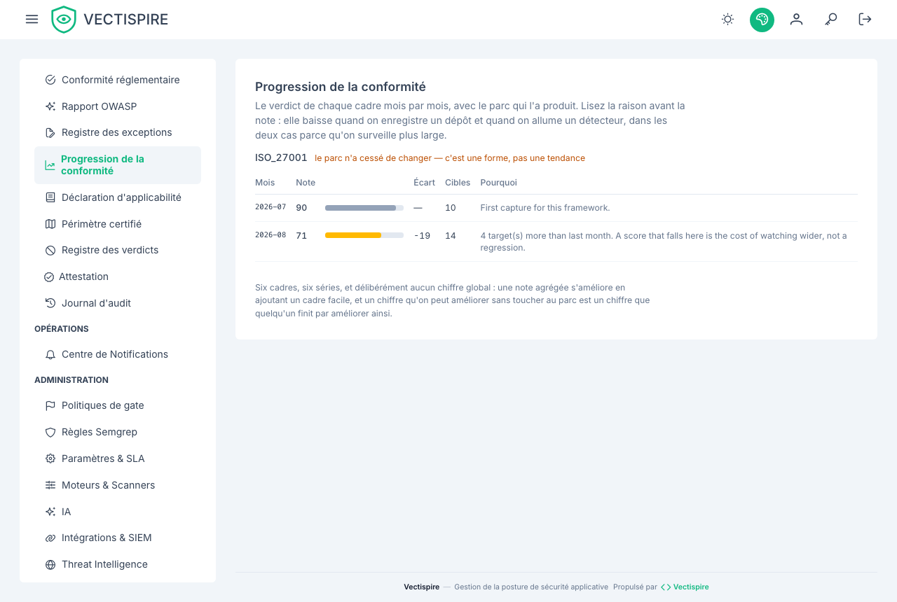

# Conformité

Vectispire évalue le parc contre six référentiels, de façon déterministe, et emballe le
résultat en preuve signée.

| Référentiel | |
|---|---|
| **NIS 2** | Directive européenne sur la sécurité des réseaux et de l'information |
| **DORA** | Résilience opérationnelle numérique européenne, secteur financier |
| **ISO/IEC 27001:2022** | Management de la sécurité de l'information |
| **PCI-DSS v4.0** | Industrie des cartes de paiement |
| **Cyber Resilience Act (EU CRA)** | Obligations de sécurité des produits |
| **SOC 2 Type II** | Trust services criteria |



## Évaluation déterministe

Le même parc au même instant produit le même verdict, à chaque fois. C'est une exigence et non
une élégance : une évaluation qui varie d'une exécution à l'autre est une évaluation qu'un
auditeur a raison d'écarter, et dont vous ne pouvez pas vous servir pour montrer qu'un contrôle
a tenu sur une période.

## Le coffre de preuves

Un clic exporte un **paquet de preuves signé cryptographiquement** :

```
GET /api/v1/compliance/evidence-bundle.zip
```

Une clé d'intégration restreinte à certaines cibles reçoit le paquet de ces cibles : la piste d'audit
et la progression mois par mois décrivent tout le parc, elles sont donc omises, et la liste
`withheld` du manifeste le dit.

La signature est ce qui rend le paquet plus utile qu'une capture d'écran. Elle atteste que ce
paquet est bien celui que Vectispire a produit, non modifié — ce qui est la question que se
pose réellement quiconque examine des preuves après coup.

**Vérifiez-le avec une clé obtenue à part**, jamais avec le `00_vectispire_public_key.pub` que le
paquet transporte : qui modifie un paquet remplace aussi ce fichier. Récupérez la clé sur
`/api/v1/crypto/public-key.pub` ou gardez-en une copie épinglée d'avant. L'attestation qu'il contient
est une enveloppe DSSE signée sur l'encodage de pré-authentification de la spécification :
`cosign verify-attestation` et les vérificateurs in-toto la contrôlent comme n'importe quelle autre.

## Ce que c'est, et ce que ce n'est pas

C'est une évaluation mécanique des contrôles que Vectispire peut observer : ce qui est analysé,
à quelle fréquence, ce qui a été trouvé, ce qui en a été décidé, par qui, et si le registre est
intact.

Ce n'est **pas** un verdict de conformité pour votre organisation. La plupart de ces
référentiels couvrent la gouvernance, le personnel, la sécurité physique et la gestion des
fournisseurs, dont un scanner ne voit rien. Traitez l'export comme une preuve pour les
contrôles techniques, classée à côté de tout le reste.

## Registres à l'appui

Trois autres exports pèsent dans la même conversation, tous couverts sous
[Exports](exports.md) :

- le document **OpenVEX**, construit depuis vos décisions de triage ;
- le rapport de **posture** par cible, écrit pour une personne ;
- l'**historique de détection et de triage**, qui est le document répondant à « qui savait
  quoi, et quand ».

## Garder le registre intact

Une preuve de conformité ne vaut que ce que vaut le journal qui la porte. Voir
[Journal d'audit](../administration/audit-log.md) pour la chaîne d'empreintes, et pour le
miroir qui place une seconde copie hors de la base de données qu'il surveille.
