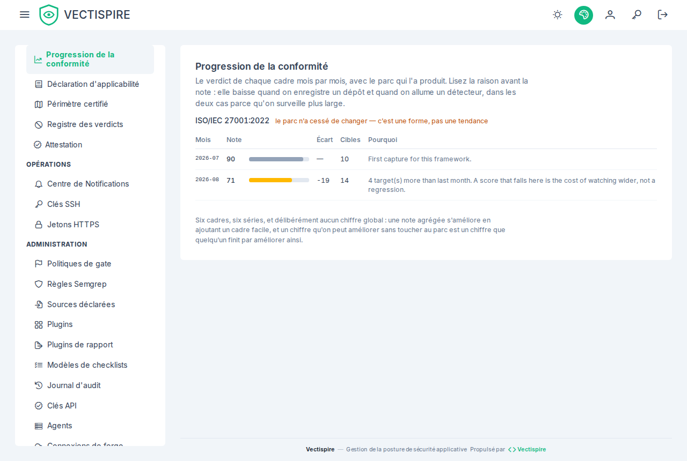

# Conformité

Vectispire rapporte ce que les analyses observent, et ce que la plateforme elle-même a activé, à
une poignée de contrôles techniques nommés d'après six référentiels, et emballe le résultat en
preuve signée.

## Ce que c'est, et ce que ce n'est pas

C'est une évaluation mécanique des contrôles que Vectispire peut observer : ce qui est analysé,
à quelle fréquence, ce qui a été trouvé, ce qui en a été décidé, par qui, et si le registre est
intact.

Chaque référentiel est représenté par **quatre** contrôles techniques — 24 en tout. Les référentiels
sont bien plus vastes : l'Annexe A de l'ISO/IEC 27001:2022 compte à elle seule quatre-vingt-treize contrôles, et
Vectispire en mesure quelques-uns parmi les contrôles technologiques. L'essentiel de ce que ces
référentiels exigent — gouvernance, personnel, sécurité physique, gestion des fournisseurs — échappe
à tout scanner.

Ce n'est **pas** un verdict de conformité pour votre organisation. Cela prépare une évaluation ; ce
n'en est pas une. Traitez l'export comme une preuve pour les contrôles techniques, classée à côté
de tout le reste.

| Référentiel | |
|---|---|
| **NIS 2** | Directive européenne sur la sécurité des réseaux et de l'information |
| **DORA** | Résilience opérationnelle numérique européenne, secteur financier |
| **ISO/IEC 27001:2022** | Management de la sécurité de l'information |
| **PCI-DSS v4.0** | Industrie des cartes de paiement |
| **Cyber Resilience Act (EU CRA)** | Obligations de sécurité des produits |
| **SOC 2** | Trust services criteria — un rapport SOC 2 est celui d'un auditeur ; Vectispire lui fournit des preuves |



Chaque contrôle est noté par sa catégorie — vulnérabilités, chaîne d'approvisionnement (la part des
cibles dotées d'un SBOM), secrets, développement sécurisé, infrastructure as code, gouvernance de la
barrière, piste d'audit — si bien que son titre nomme l'exigence à laquelle il se rapporte, non tout
ce qu'elle demande. `CRA-ART11-NOTIF`, par exemple, note les vulnérabilités critiques ouvertes,
inscrites au catalogue CISA KEV ou en retard dont partirait une notification au titre de l'article
14 ; il ne fait ni ne suit la notification. Les codes CRA gardent la numérotation de la proposition de 2022 ; les titres citent le règlement
(UE) 2024/2847 tel qu'adopté, dont l'obligation de signalement de l'article 14 s'applique depuis le
11 septembre 2026. Les formules sont dans la
[référence de conformité](https://github.com/asmolabs/vectispire/blob/main/docs/fr/COMPLIANCE_AND_REGULATORY.fr.md).
La même posture donne le même verdict : un résultat peut être reproduit.

## Des réglages de la plateforme plafonnent certains contrôles

Un contrôle qui repose sur une capacité de cette instance est plafonné — score abaissé, statut
*partiel* au mieux — tant que la capacité est désactivée, et le détail du contrôle nomme le réglage :

| Quand | Plafond | Contrôles |
|---|---|---|
| Aucune clé de chiffrement (`ENCRYPTION_KEY`) | 60 | les contrôles de secrets de chaque référentiel |
| Aucun miroir d'audit (`vectispire.audit.mirror-path`) | 70 | les contrôles d'audit : `DORA-ART16-INCIDENT`, `PCI-REQ-10.2`, `SOC2-CC7.2` |
| Aucun fournisseur d'identité (`VECTISPIRE_OIDC_ISSUER`) | 65 | les mêmes contrôles d'audit |
| Un fournisseur d'identité, avec la connexion par mot de passe local encore ouverte (`VECTISPIRE_PASSWORD_LOGIN`) | 85 | les mêmes contrôles d'audit |
| Approbation à quatre yeux désactivée (`triage_four_eyes_required`) | 75 | `NIS2-ART21-GOV` |

## Sans donnée n'est pas conforme

Un contrôle noté sur l'absence de constats ne dit rien d'une cible que personne n'a regardée. Tant
qu'aucune cible n'a été analysée avec succès, chaque contrôle qui lit le parc est **`NO_DATA`**, et
chaque référentiel aussi — le contrôle de la piste d'audit, qui lit la chaîne de cette instance, reste
mesuré et affiché. Le score d'un `NO_DATA` vaut zéro et n'est pas une mesure : les écrans affichent un
tiret, la matrice laisse vide la colonne du référentiel, le PDF indique *NO DATA*, et la progression
mensuelle n'enregistre aucun mois pour un référentiel sans rien de mesuré.

Dès qu'une partie du parc est observée, la couverture plafonne chaque contrôle noté sur l'absence de
constats — vulnérabilités, secrets, développement sécurisé et IaC (ISO 27001 A.8.8, A.5.15, A.8.28,
A.8.9, et leurs équivalents dans les autres référentiels) : une cible jamais analysée rend le contrôle
*non conforme*, une cible analysée hors de la fenêtre de fraîcheur le limite à *partiel*, et le détail
dit combien de cibles l'évaluation couvre. Dix cibles dont une analysée sans constat ne font pas un parc
propre ; elles font une cible propre et neuf que personne n'a regardées. Une cible compte comme observée
dès qu'elle a une analyse réussie — quelles que soient les étapes qui y ont produit ; les checklists de
sécurité sont le lieu où une étape se mesure pour elle-même.

## Par projet et par solution

La même évaluation répond pour un projet ou une [solution](../administration/solutions-and-projects.fr.md) :

```
GET /api/v1/projects/{id}/compliance
GET /api/v1/solutions/{id}/compliance
```

C'est l'évaluation du parc exécutée sur les cibles rangées dans le projet (ou dans les projets de la
solution), et sur rien d'autre : mêmes contrôles, mêmes plafonds de couverture et de fraîcheur,
**`NO_DATA` quand aucune de ces cibles n'a été analysée** — quel que soit l'état du reste du parc — et
une matrice par cible qui ne contient qu'elles. Un projet propre dans un parc plein de critiques se lit
conforme ; le parc, non. La réponse porte la forme du résumé du parc sous `compliance` et, sous
`scorecard`, la fiche de score de la portée sur les mêmes cibles : notée par son maillon le plus
faible — le plus bas score de ces cibles, chacun tel que la fiche de la cible le calcule, nommée dans
`weakestTarget` — avec les points de risque de tout le backlog ouvert de la portée. La fiche suit la
même absence : note `NO_DATA` et score `null` quand aucune
des cibles n'a de scan terminé, score plafonné à la part analysée quand certaines seulement en ont un,
avec `totalTargets` et `observedTargets` à côté
([calcul de la fiche](repositories.fr.md#comment-la-note-du-scorecard-est-calculee)). Les contrôles
propres à la plateforme (chiffrement, miroir d'audit, quatre-yeux, politique de connexion) sont ceux du
déploiement et se lisent de même dans chaque périmètre.

**Un projet que vous ne voyez qu'en partie est évalué sur la partie que vous voyez**, et la réponse le
dit : `partial` vaut vrai et `targetCount` indique combien de cibles ont été comptées. Le verdict parle
pour ces cibles, jamais pour le projet entier. Un projet ou une solution dont vous ne voyez rien reçoit la
réponse d'un projet inexistant (`404`). Rien de tout cela n'est enregistré : c'est calculé pour la
lecture, comme le résumé du parc, et la progression mensuelle reste celle du parc.

**À l'écran**, la page d'un projet montre sa conformité et son score, et **Conformité et score** sur
chaque solution de l'arbre [Solutions et projets](../administration/solutions-and-projects.fr.md#la-page-du-projet)
ouvre ceux de la solution : la fiche de score, puis les chiffres, la matrice, les référentiels et les
contrôles de la page du parc, dessinés par le même composant, avec *Calculé sur N cible(s)* au-dessus et,
sur un périmètre partiel, un avertissement qu'ils ne couvrent que ce que vous voyez. Un périmètre dont
aucune cible n'a été analysée se lit *Aucune donnée* de bout en bout — les référentiels comme le score
affichent un tiret. Le tiret du score est le `NO_DATA` de la fiche elle-même : elle part de cent et
retranche ce qu'elle trouve, et répondait 100, A+, pour un périmètre que personne n'avait regardé, jusqu'à
ce qu'elle sache dire qu'elle n'avait rien à noter.

## Le paquet de preuves

Un clic exporte un **paquet de preuves signé** :

```
GET /api/v1/compliance/evidence-bundle.zip
```

Une clé d'intégration restreinte à certaines cibles reçoit le paquet de ces cibles : la piste d'audit
et la progression mois par mois décrivent tout le parc, elles sont donc omises, et la liste
`withheld` du manifeste le dit.

La signature est ce qui rend le paquet plus utile qu'une capture d'écran. Elle atteste que ce
paquet est bien celui que Vectispire a produit, non modifié — ce qui est la question que se
pose réellement quiconque examine des preuves après coup.

**Vérifiez-le avec une clé obtenue à part**, jamais avec le `00_vectispire_public_key.pub` que le
paquet transporte : qui modifie un paquet remplace aussi ce fichier. Récupérez la clé sur
`/api/v1/crypto/public-key.pub` ou gardez-en une copie épinglée d'avant. L'attestation qu'il contient
est une enveloppe DSSE signée sur l'encodage de pré-authentification de la spécification :
`cosign verify-attestation` et les vérificateurs in-toto la contrôlent comme n'importe quelle autre.

## Registres à l'appui

Trois autres exports pèsent dans la même conversation, tous couverts sous
[Exports](exports.md) :

- le document **OpenVEX**, construit depuis vos décisions de triage ;
- le rapport de **posture** par cible, écrit pour une personne ;
- l'**historique de détection et de triage**, qui est le document répondant à « qui savait
  quoi, et quand ».

## Garder le registre intact

Une preuve de conformité ne vaut que ce que vaut le journal qui la porte. Voir
[Journal d'audit](../administration/audit-log.md) pour la chaîne d'empreintes, et pour le
miroir qui place une seconde copie hors de la base de données qu'il surveille.
