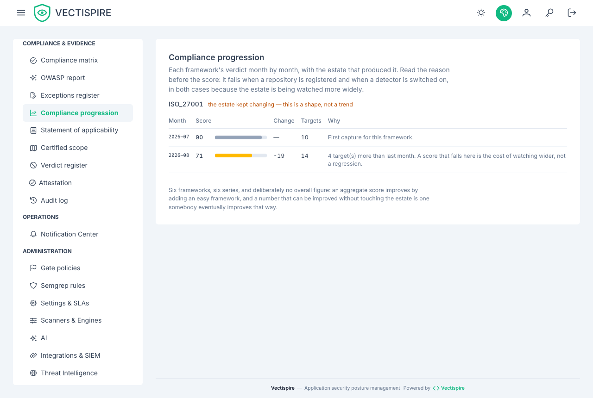

# Compliance

Vectispire evaluates the estate against six frameworks, deterministically, and packages the
result as signed evidence.

| Framework | |
|---|---|
| **NIS 2** | EU network and information security directive |
| **DORA** | EU digital operational resilience, financial sector |
| **ISO/IEC 27001:2022** | Information security management |
| **PCI-DSS v4.0** | Payment card industry |
| **Cyber Resilience Act (EU CRA)** | Product security obligations |
| **SOC 2 Type II** | Trust services criteria |



## Deterministic evaluation

The same estate at the same moment produces the same verdict, every time. That is a
requirement rather than a nicety: an evaluation that varies between runs is one an auditor
is right to discard, and one you cannot use to show that a control held over a period.

## The Evidence Vault

One click exports a **cryptographically signed evidence bundle**:

```
GET /api/v1/compliance/evidence-bundle.zip
```

The signature is what makes the package worth more than a screenshot. It attests that this
bundle is the one Vectispire produced, unmodified — which is the question anyone reviewing
evidence after the fact actually has.

**Verify it against a key you obtained separately**, never the `00_vectispire_public_key.pub` the
bundle carries: whoever alters a bundle replaces that file too. Fetch the key from
`/api/v1/crypto/public-key.pub` or keep a copy pinned from before. The attestation inside is a DSSE
envelope signed over the specification's pre-authentication encoding, so `cosign verify-attestation`
and in-toto verifiers check it as they would any other.

## What this is and is not

It is a mechanical evaluation of the controls Vectispire can observe: what is scanned, how
often, what was found, what was decided about it, who decided, and whether the record is
intact.

It is **not** a compliance verdict for your organisation. Most of these frameworks cover
governance, personnel, physical security and supplier management, none of which a scanner
can see. Treat the export as evidence for the technical controls, filed alongside
everything else.

## Supporting records

Three other exports carry weight in the same conversation, all covered under
[Exports](exports.md):

- the **OpenVEX** document, built from your triage decisions;
- the **posture** report per target, written for a person;
- the **detection and triage history**, which is the document that answers "who knew what,
  when".

## Keeping the record intact

Compliance evidence is only as good as the log behind it. See
[Audit log](../administration/audit-log.md) for the hash chain, and for the mirror that
puts a second copy outside the database it watches.
