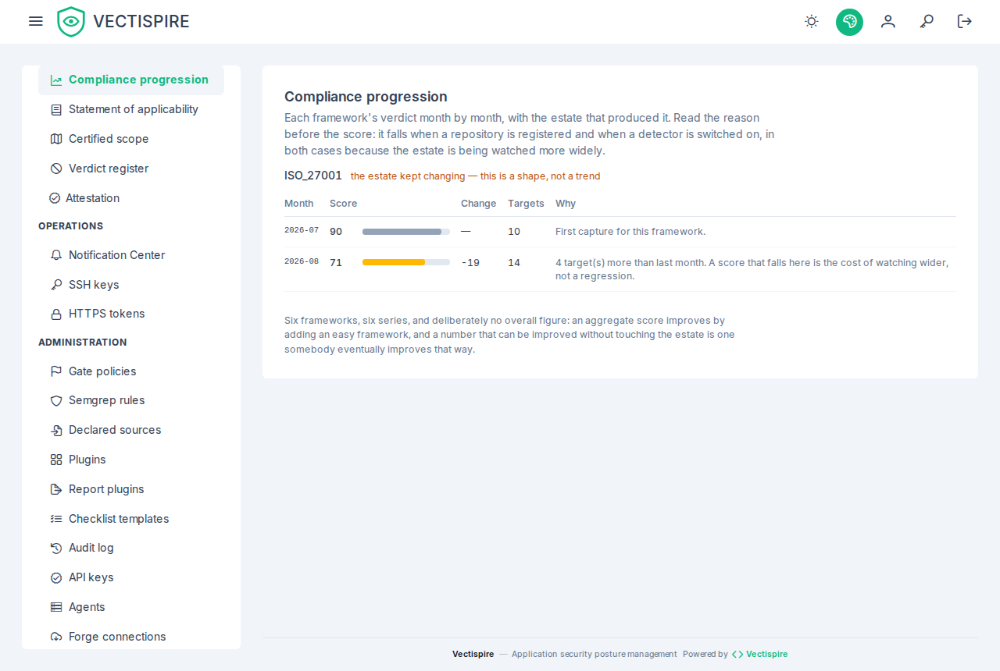

# Compliance

Vectispire evaluates the estate against six frameworks, deterministically, and packages the
result as signed evidence.

| Framework | |
|---|---|
| **NIS 2** | EU network and information security directive |
| **DORA** | EU digital operational resilience, financial sector |
| **ISO/IEC 27001:2022** | Information security management |
| **PCI-DSS v4.0** | Payment card industry |
| **Cyber Resilience Act (EU CRA)** | Product security obligations |
| **SOC 2 Type II** | Trust services criteria |



## Deterministic evaluation

The same estate at the same moment produces the same verdict, every time. That is a
requirement rather than a nicety: an evaluation that varies between runs is one an auditor
is right to discard, and one you cannot use to show that a control held over a period.

## No data is not compliant

A control scored on the absence of findings says nothing of a target nobody looked at. Until a target
has been scanned successfully, every control that reads the estate is **`NO_DATA`**, and so is every
framework — the audit trail's control, which reads this instance's own chain, is still measured and
shown. A `NO_DATA` score is zero and is no measurement: the screens show a dash, the matrix leaves the
framework's column empty, the PDF reads *NO DATA*, and the monthly progression records no month for a
framework with nothing measured.

Once part of the estate is observed, coverage caps every control scored on the absence of findings —
vulnerabilities, secrets, secure coding and IaC (ISO 27001 A.8.8, A.5.15, A.8.28, A.8.9, and their
counterparts in the other frameworks): a target never scanned makes the control *non-compliant*, one
scanned outside the freshness window makes it *partial* at best, and the detail says how many targets
the assessment covers. Ten targets with one scanned clean is not a clean estate; it is one clean target
and nine nobody looked at. A target counts as observed once it has a successful scan — whichever steps
produced in it; the security checklists are where a step is measured on its own.

## Per project and per solution

The same evaluation answers for one project or one [solution](../administration/solutions-and-projects.md):

```
GET /api/v1/projects/{id}/compliance
GET /api/v1/solutions/{id}/compliance
```

It is the estate's evaluation run over the targets filed in the project (or in the solution's
projects), and over nothing else: the same controls, the same coverage and freshness caps, **`NO_DATA`
when none of those targets was scanned** — however scanned the rest of the estate is — and a
per-target matrix holding only them. A clean project in an estate full of criticals reads compliant;
the estate does not. The response carries the estate summary's shape under `compliance` and, under
`scorecard`, the portfolio scorecard computed over the same targets — no second formula for either.
The platform's own controls (encryption, the audit mirror, four-eyes, the sign-in policy) are the
deployment's and read the same in every scope.

**A project you see only in part is evaluated over the part you see**, and the response says so:
`partial` is true and `targetCount` says how many targets were counted. The verdict speaks for those
targets, never for the project as a whole. A project or solution you see nothing of is answered as one
that does not exist (`404`). Nothing of this is stored: it is computed for the read, like the estate's
summary, and the monthly progression stays the estate's.

## The Evidence Vault

One click exports a **cryptographically signed evidence bundle**:

```
GET /api/v1/compliance/evidence-bundle.zip
```

An integration key restricted to some targets receives the bundle for those targets: the audit trail
and the month-by-month progression describe the whole estate, so they are left out, and the
manifest's `withheld` list says so.

The signature is what makes the package worth more than a screenshot. It attests that this
bundle is the one Vectispire produced, unmodified — which is the question anyone reviewing
evidence after the fact actually has.

**Verify it against a key you obtained separately**, never the `00_vectispire_public_key.pub` the
bundle carries: whoever alters a bundle replaces that file too. Fetch the key from
`/api/v1/crypto/public-key.pub` or keep a copy pinned from before. The attestation inside is a DSSE
envelope signed over the specification's pre-authentication encoding, so `cosign verify-attestation`
and in-toto verifiers check it as they would any other.

## What this is and is not

It is a mechanical evaluation of the controls Vectispire can observe: what is scanned, how
often, what was found, what was decided about it, who decided, and whether the record is
intact.

It is **not** a compliance verdict for your organisation. Most of these frameworks cover
governance, personnel, physical security and supplier management, none of which a scanner
can see. Treat the export as evidence for the technical controls, filed alongside
everything else.

## Supporting records

Three other exports carry weight in the same conversation, all covered under
[Exports](exports.md):

- the **OpenVEX** document, built from your triage decisions;
- the **posture** report per target, written for a person;
- the **detection and triage history**, which is the document that answers "who knew what,
  when".

## Keeping the record intact

Compliance evidence is only as good as the log behind it. See
[Audit log](../administration/audit-log.md) for the hash chain, and for the mirror that
puts a second copy outside the database it watches.
