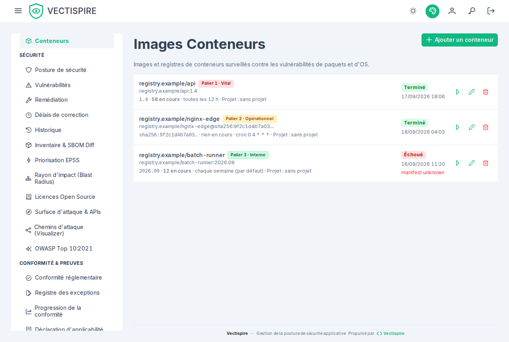

# Images de conteneur

Une image de conteneur est une cible de scan au même titre qu'un dépôt, enregistrée dans
**Conteneurs** avec sa référence — registre, nom, et tag ou empreinte.

Préférez une empreinte quand vous le pouvez. Un tag est mutable : un verdict enregistré contre
`monapp:latest` est un verdict sur ce que `latest` désignait au moment du scan, ce qui n'est
pas un fait sur lequel quiconque peut agir une semaine plus tard.

## Ce qui est contrôlé

L'image est cataloguée par Syft et rapprochée par Grype exactement comme un dépôt : mêmes
lignes `Finding`, même enrichissement EPSS et KEV, même évaluation de licences, même
réconciliation d'issues.

Un contrôle est propre aux images : le statut de **fin de support** de la distribution sur
laquelle l'image est construite, lu depuis le catalogue endoflife.date. Il vaut la peine de
dire pourquoi il compte, parce qu'il ne porte aucune CVE. Une image de base sortie de son
support de sécurité n'a aucun problème *actuel* que vous puissiez montrer du doigt ; elle a la
garantie que rien ne sera corrigé pour le *prochain*.

La couverture y est délibérément limitée aux produits — langages, exécutions, cadriciels,
distributions — plutôt qu'à chaque bibliothèque du catalogue.

## Projet {#project}

Chaque image indique le projet où elle est rangée, avec un lien vers ce projet dans
[Solutions et projets](../administration/solutions-and-projects.md), ou **sans projet**, avec un lien
vers ce groupe. Le rangement se fait depuis cet écran, par un administrateur, comme pour un dépôt —
et il change des accès : une attribution sur un projet couvre les images qui y sont rangées.

## Identifiants de registre

Les registres privés demandent des identifiants, et **Vectispire ne les stocke pas** : une image est
tirée par le démon Docker pour le compte de l'exécuteur qui l'analyse — le worker intégré ou un agent —
avec les identifiants de la configuration Docker de cet exécuteur (`DOCKER_CONFIG`, par défaut
`~/.docker/config.json` de l'utilisateur sous lequel il tourne, une entrée `auths` par registre, telle
que l'écrit `docker login`). Rien d'eux n'atteint le plan de contrôle, la base ni le protocole des
agents. Donnez à chaque exécuteur susceptible d'analyser une image privée les identifiants de son
registre. Une configuration qui les garde dans un assistant (`credsStore`, comme Docker Desktop) ne
laisse rien que l'exécuteur puisse lire : écrivez l'entrée dans le fichier lui-même, pour un compte en
lecture seule.

Les mêmes identifiants servent à lire la signature d'un [plugin](../administration/plugins.md#signer-limage)
dans son registre.

## Scan et récurrence

Identiques aux dépôts : le défaut de l'installation (chaque semaine sauf changement), un intervalle,
une expression cron — qui l'emporte quand les deux sont posés — ou manuel uniquement. Voir
[Dépôts](repositories.md#recurrence).

## Dérive du SBOM entre deux versions

Comparer deux images de la même application répond à la question qu'un scan isolé ne peut pas
poser : qu'est-ce que cette version a changé ? La visionneuse de **différentiel de SBOM** montre
les paquets ajoutés et retirés, les migrations de licence — une dépendance permissive devenue
copyleft GPL ou AGPL entre deux tags est exactement le genre de changement que personne ne
remarque dans un différentiel de fichier de verrouillage — et l'impact net en CVE.

Voir [Inventaire et licences](inventory-and-licenses.md).
