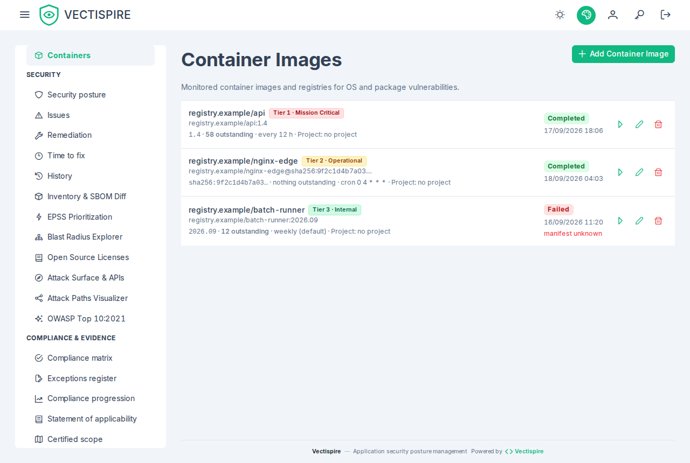

# Container images

A container image is a scan target like a repository, registered on **Containers** with its
reference — registry, name and tag or digest.

Prefer a digest where you can. A tag is mutable, so a verdict recorded against
`myapp:latest` is a verdict about whatever `latest` meant at the moment of the scan, which
is not a fact anybody can act on a week later.

## What is checked

The image is catalogued by Syft and matched by Grype exactly as a repository is: same
`Finding` rows, same EPSS and KEV enrichment, same license evaluation, same issue
reconciliation.

One check is specific to images: the **end-of-life** status of the distribution the image
is built on, read from the endoflife.date catalogue. It is worth stating why it matters,
because it carries no CVE. A base image past its security support has no *current* problem
you can point to; it has the guarantee that nothing will be fixed for the *next* one.

Coverage there is deliberately scoped to products — languages, runtimes, frameworks,
distributions — rather than every library on the catalogue.

## Project

Each image shows the project it is filed in, linking to that project in
[Solutions and projects](../administration/solutions-and-projects.md), or **no project**, linking
to that group. Filing is done from that screen, by an administrator, as for a repository — and it is
an access change: a grant on a project covers the images filed in it.

## Registry credentials

Private registries need credentials, and **Vectispire does not store them**: an image is pulled by
the Docker daemon on behalf of whichever executor scans it — the built-in worker or an agent — with
the credentials of that executor's own Docker configuration (`DOCKER_CONFIG`, by default
`~/.docker/config.json` of the user it runs as, an `auths` entry per registry as `docker login`
writes it). Nothing of them reaches the control plane, the database or the agent protocol. Give each
executor that may scan a private image the credentials for its registry. A configuration that keeps
them in a credential helper (`credsStore`, as Docker Desktop does) leaves nothing the executor can
read: write the entry into the file itself, for a read-only account.

The same credentials are used to read a [plugin](../administration/plugins.md#signing-the-image)'s
signature from its registry.

## Scanning and recurrence

Identical to repositories: run on demand, or set an interval or a cron expression, with
the expression winning when both are set. See [Repositories](repositories.md#recurrence).

## SBOM drift between releases

Comparing two images of the same application answers the question a single scan cannot:
what did this release change? The **SBOM diff** viewer shows packages added and pruned,
license migrations — a permissive dependency that became GPL or AGPL copyleft between two
tags is exactly the kind of change nobody notices in a lockfile diff — and net CVE impact.

See [Inventory and licenses](inventory-and-licenses.md).
