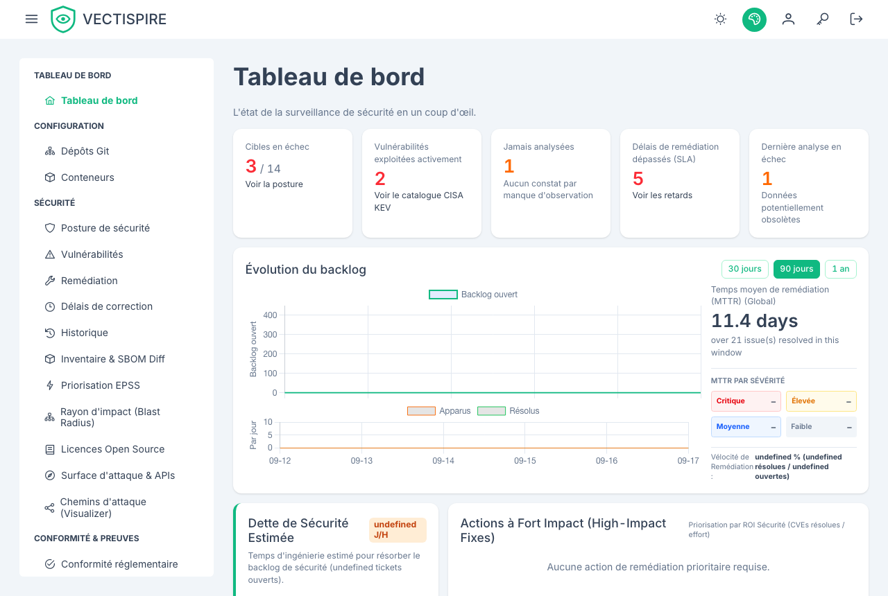
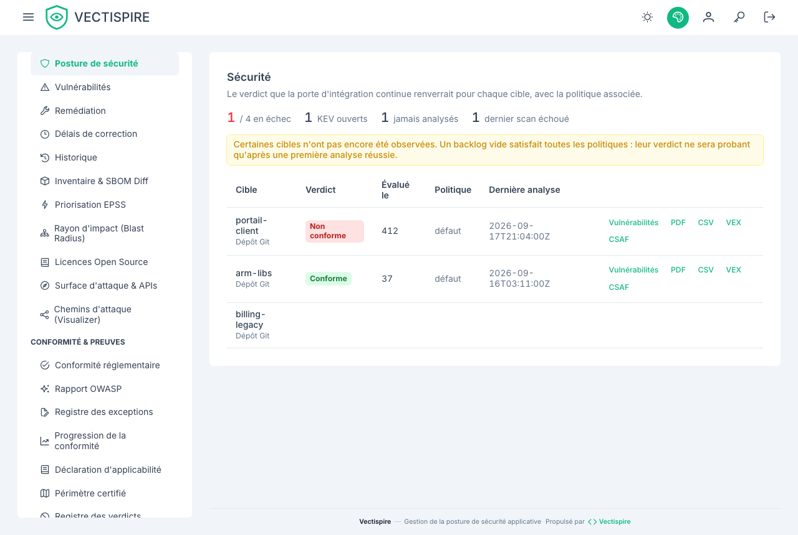

# Tableau de bord

La navigation est groupée en deux, et cette séparation est une affirmation sur ce que chaque
moitié peut faire à une construction.

**Sécurité** porte le verdict de barrière par cible, le backlog des issues, les dépôts et les
conteneurs. Tout ce qui est ici peut faire échouer une construction.

**Qualité** classe le backlog de qualité du code par règle, par fichier et par dépôt, et dit
clairement que rien de tout cela ne peut faire échouer une construction. Voir
[Qualité du code](quality.md).

## La vue d'ensemble Sécurité

Par cible : le verdict de barrière, le backlog courant par gravité, et la date du dernier scan.
Les chiffres par gravité écartent les constats triés non affecté ou corrigé, comme tout chiffre de
risque ; chacun ouvre la liste des constats avec le même filtre, pour que le compte et la liste
concordent.
Le verdict est calculé depuis que les politiques de barrière existent ; cet écran est l'endroit
où il est enfin montré.

Deux états sont nommés ici et nulle part ailleurs : une cible **jamais analysée**, et une cible
dont le **dernier scan a échoué**. Toutes deux portent un backlog vide, et un backlog vide
passe toutes les politiques. Un tableau de bord qui n'afficherait que les chiffres montrerait
ces deux-là en vert.

## Backlog dans le temps

Les chiffres ci-dessus sont des instantanés. Ils répondent à « combien » et jamais à « mieux ou
moins bien que le mois dernier ». La série, elle, y répond : backlog courant jour par jour, ce
qui est apparu face à ce qui a été résolu, et le délai moyen de résolution.

Le MTTR est affiché **absent** plutôt que zéro pour une période où rien n'a été résolu. Zéro se
lirait comme « corrigé le jour de son apparition », soit l'inverse de ce qui s'est passé.

La série est restreinte par votre visibilité, comme toutes les autres vues — voir
[Utilisateurs et équipes](../administration/users-and-teams.md).

## Note de posture de sécurité

Le classement de maturité donne à chaque dépôt et conteneur une note de A à F, à côté de son
niveau de criticité métier. Le niveau est ce que vous posez à l'enregistrement du dépôt ; la
note est calculée depuis le backlog. Un service de niveau 1 avec une mauvaise note est la
première ligne à lire sur cette page.

La règle de ce classement lui est propre : à partir de 100, chaque problème **non résolu** coûte
des points selon sa sévérité — critique 25, haute 10, moyenne 3, tout le reste 1, et un
problème sans sévérité compte comme moyen. La note est A à partir de 90, B à partir de 75, C à
partir de 50, D à partir de 30, F en dessous. Les problèmes triés **non affecté** ou
**corrigé** sont écartés, comme sur le scorecard et à la barrière ; un problème dont
l'exclusion est en attente d'approbation compte toujours.

**Ce n'est pas la note du scorecard.** La fiche scorecard d'un dépôt, et la pastille README qui
en est tirée, suivent une autre règle — vulnérabilités exploitées, atteignabilité, licences —
et une échelle de A+ à F, décrite dans
[Comment la note du scorecard est calculée](repositories.md#comment-la-note-du-scorecard-est-calculee).
Le même dépôt peut donc afficher B ici et C sur sa pastille ; aucune des deux n'a tort, elles
répondent à des questions différentes.
