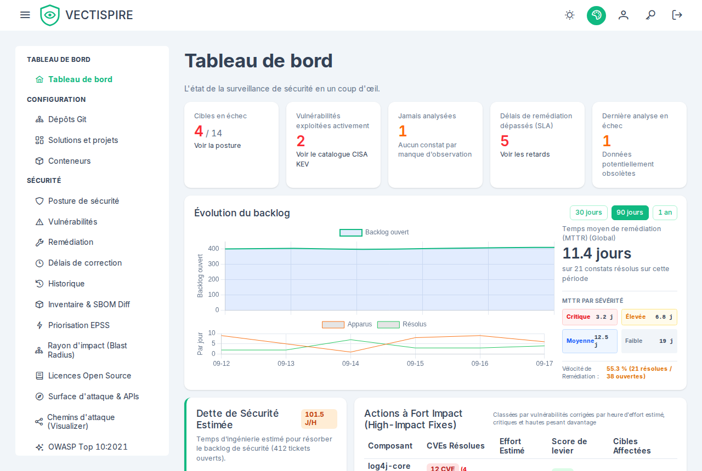
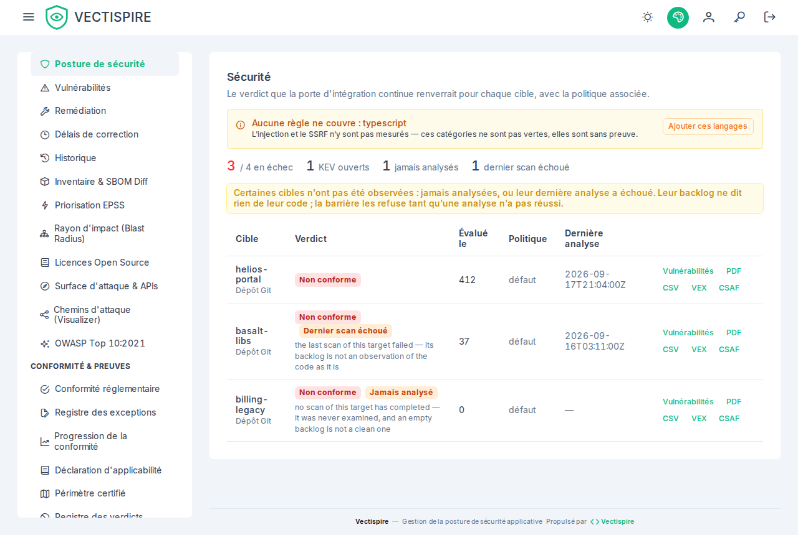

# Tableau de bord

Le tableau de bord est la première entrée de la navigation, qui est groupée selon ce qu'on vient y
faire :

- **Tableau de bord** — cette page.
- **Configuration** — les dépôts, les solutions et projets, et les images de conteneur.
- **Sécurité** — la vue d'ensemble de la posture de sécurité, les vulnérabilités, le plan de
  remédiation et ses délais, l'historique, l'inventaire et les vues qui classent ou cartographient
  le backlog (EPSS, rayon d'impact, licences, surface et chemins d'attaque, OWASP Top 10:2021).
- **Conformité & preuves** — la matrice de conformité, le registre des exceptions et, pour les rôles
  qui lisent la gouvernance, ce que demande un évaluateur : la déclaration d'applicabilité, le
  périmètre certifié, le registre des verdicts, l'attestation.
- **Opérations** — les notifications, et pour les administrateurs les clés SSH et les jetons HTTPS.
- **Administration** — ce que le rôle permet : politiques, règles, plugins, journal d'audit, clés,
  agents, comptes, paramètres.

Ce qu'un menu montre dépend du rôle ; une page qu'il n'offre pas à un compte est une page que le
serveur lui refuserait.

Le backlog de qualité du code n'a pas d'entrée de menu : il s'ouvre depuis cette page, par le compte
**Qualité** à côté du backlog par gravité, marqué *ne bloque jamais*. Il classe les constats de
qualité par règle, par fichier et par dépôt, et rien de tout cela ne peut faire échouer une
construction — voir [Qualité du code](quality.md).

## La vue d'ensemble Sécurité

Par cible : le verdict de barrière, le backlog courant par gravité, et la date du dernier scan.
Les chiffres par gravité écartent les constats triés non affecté ou corrigé, comme tout chiffre de
risque ; chacun ouvre la liste des constats avec le même filtre, pour que le compte et la liste
concordent.
Le verdict est calculé depuis que les politiques de barrière existent ; cet écran est l'endroit
où il est enfin montré.

Deux états sont nommés ici et nulle part ailleurs : une cible **jamais analysée**, et une cible
dont le **dernier scan a échoué**. Toutes deux portent un backlog vide ou périmé, qui satisferait
toutes les politiques ; elles échouent donc à leur verdict avec une violation `observation` — celle que
répond `POST /api/v1/gate` — et le badge à côté dit laquelle.

## Backlog dans le temps

Les chiffres ci-dessus sont des instantanés. Ils répondent à « combien » et jamais à « mieux ou
moins bien que le mois dernier ». La série, elle, y répond : backlog courant jour par jour, ce
qui est apparu face à ce qui a été résolu, et le délai moyen de résolution.

Le MTTR est affiché **absent** plutôt que zéro pour une période où rien n'a été résolu. Zéro se
lirait comme « corrigé le jour de son apparition », soit l'inverse de ce qui s'est passé.

**Une ligne datée marque le jour où la formule du scorecard a changé** sur cette installation — le jour
de sa mise à jour en 0.11.0, quand elle avait déjà un scan terminé — et une note sous les graphiques le
dit. Les courbes sont celles du backlog, que la formule ne déplace pas ; la ligne sert à qui met une
note en regard, puisque la plupart des notes se lisent plus bas à partir de ce jour sans que rien n'ait
changé dans les dépôts. Une installation neuve n'a pas de note sous l'ancienne formule, et pas de ligne.

La série est restreinte par votre visibilité, comme toutes les autres vues — voir
[Utilisateurs et équipes](../administration/users-and-teams.md).

## Note de posture de sécurité

**Le portefeuille n'a pas de note unique.** Le panneau au-dessus du classement montre, sur les cibles
que vous voyez, **combien lisent chaque note** — de A+ à F, et *Aucune donnée* pour celles jamais
scannées —, **la cible la plus faible** par son nom avec son score et sa note, et **les points de
risque de tout ce qui est ouvert**, chaque problème et chaque licence interdite une fois. Une note pour
tout un parc serait soit écrasée par sa taille, en additionnant le backlog de chaque cible, soit la
note de la pire cible sous un autre nom ; combien de cibles sont en F, si ce nombre baisse, et laquelle
ouvrir d'abord, c'est sur cela que vous agissez
([décision 0036](https://github.com/asmolabs/vectispire/blob/main/docs/architecture/fr/decisions/0036-the-posture-score-formula.md)).

Le classement de maturité donne à chaque dépôt et conteneur **la note de son scorecard**, de A+ à F,
à côté de son niveau de criticité métier. Le niveau est ce que vous posez à l'enregistrement du
dépôt ; la note est calculée depuis le backlog. Un service de niveau 1 avec une mauvaise note est la
première ligne à lire sur cette page.

**Une cible, une note.** Le score et la note d'une ligne sont ceux de la fiche scorecard de la cible et
de sa pastille README, calculés par la même règle — vulnérabilités exploitées, critiques, hautes,
moyennes et basses, et licences non autorisées, chacune pesée en points de risque — décrite dans
[Comment la note du scorecard est calculée](repositories.md#comment-la-note-du-scorecard-est-calculee).
Les problèmes triés **non affecté** ou **corrigé** sont écartés, comme sur le scorecard et à la
barrière ; un problème dont l'exclusion est en attente d'approbation compte toujours.

**Les ex æquo sont départagés par les points de risque.** Chaque ligne les montre à côté du score ; de
deux cibles au même score — toutes deux maintenues à 1 loin dans F, ou à 54 par un problème exploité —
celle qui a le moins de points de risque est classée devant.

**Quelles cibles sont listées.** Toute cible que vous voyez qui porte un problème ouvert ou un scan
terminé, et celles dont tous les problèmes sont clos. Une cible scannée sans constat est listée à 100,
A+. Une cible sans scan terminé — ses constats viennent d'un seul import SARIF — est classée en dernier
comme *Aucune donnée*, sans score ; ses comptes restent. Une cible enregistrée et jamais scannée, sans
aucun problème, n'est pas listée.
