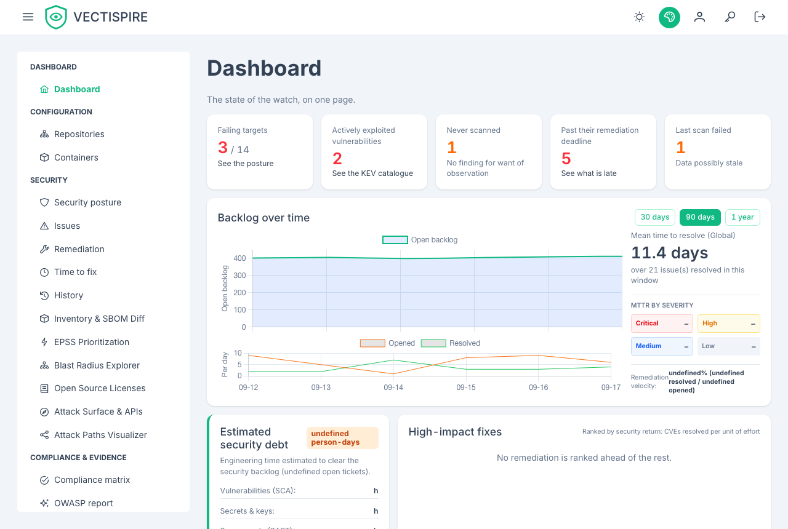
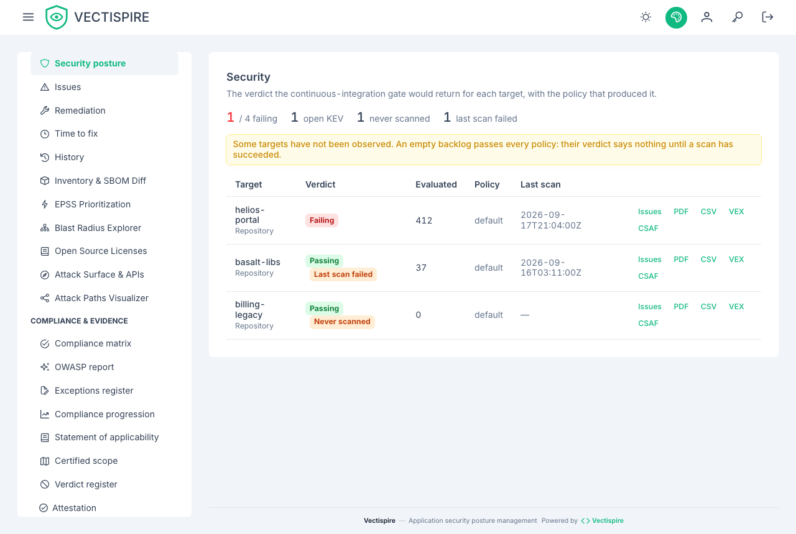

# Dashboard

The navigation is grouped in two, and the split is a statement about what each half can do
to a build.

**Security** holds the gate verdict per target, the issue backlog, repositories and
containers. Anything here can fail a build.

**Quality** ranks the code-quality backlog by rule, file and repository, and says plainly
that none of it can fail a build. See [Code quality](quality.md).

## The security overview

Per target: the gate verdict, the standing backlog by severity, and when it was last
scanned. The per-severity figures leave out findings triaged not affected or fixed, as every
figure of risk does; each opens the findings list with the same filter, so the count and the list
agree. The verdict has been computed since gate policies existed; this screen is where it
is finally shown.

Two states are named here that appear nowhere else: a target **never scanned**, and one
whose **last scan failed**. Both carry an empty backlog, and an empty backlog passes every
policy. A dashboard that only showed the numbers would show these two as green.

## Backlog over time

The figures above are snapshots. They answer "how much" and never "better or worse than
last month". The series answers that: standing backlog day by day, what appeared against
what was resolved, and the mean time to resolve.

MTTR is shown **absent** rather than zero for a period in which nothing was resolved. Zero
would read as "fixed the day it appeared", which is the opposite of what happened.

The series is narrowed by your visibility like every other view — see
[Users and teams](../administration/users-and-teams.md).

## Security posture grade

The maturity ranking gives each repository and container a grade from A to F, alongside its
business criticality tier. The tier is what you set when registering the repository; the grade
is computed from the backlog. A Tier 1 service at a poor grade is the first line to read on
this page.

The ranking's rule is its own: starting from 100, every **unresolved** issue costs points by
severity — critical 25, high 10, medium 3, anything else 1, and an issue with no severity is
counted as medium. The grade is A from 90, B from 75, C from 50, D from 30, F below. Issues
triaged **not affected** or **fixed** are left out, as on the scorecard and at the gate; one
whose dismissal is awaiting approval still counts.

**This is not the scorecard grade.** A repository's scorecard, and the README badge built from
it, uses a different rule — exploited vulnerabilities, reachability, licences — and a scale from
A+ to F, described in
[How the scorecard grade is computed](repositories.md#how-the-scorecard-grade-is-computed). The
same repository can therefore read B here and C on its badge; neither is wrong, they answer
different questions.
