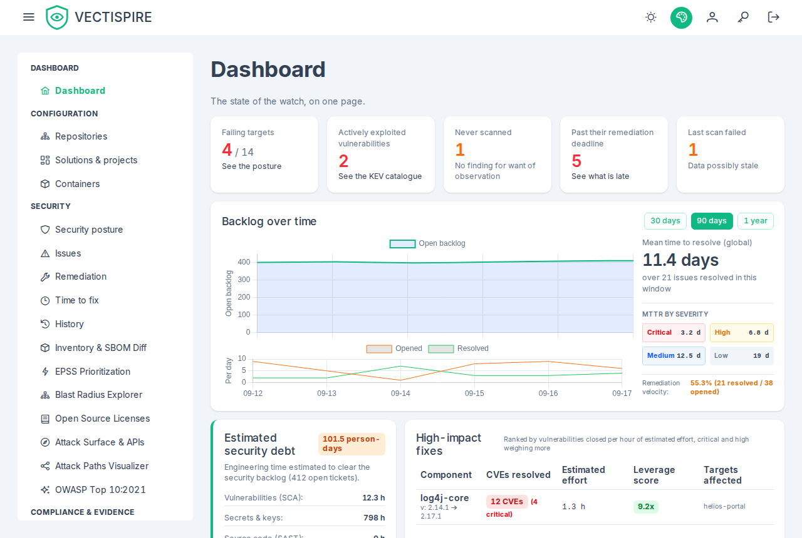
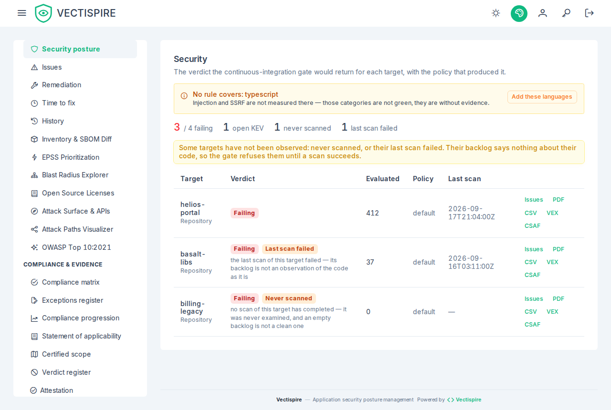

# Dashboard

The navigation is grouped in two, and the split is a statement about what each half can do
to a build.

**Security** holds the gate verdict per target, the issue backlog, repositories and
containers. Anything here can fail a build.

**Quality** ranks the code-quality backlog by rule, file and repository, and says plainly
that none of it can fail a build. See [Code quality](quality.md).

## The security overview

Per target: the gate verdict, the standing backlog by severity, and when it was last
scanned. The per-severity figures leave out findings triaged not affected or fixed, as every
figure of risk does; each opens the findings list with the same filter, so the count and the list
agree. The verdict has been computed since gate policies existed; this screen is where it
is finally shown.

Two states are named here that appear nowhere else: a target **never scanned**, and one
whose **last scan failed**. Both carry an empty backlog, and an empty backlog passes every
policy. A dashboard that only showed the numbers would show these two as green.

## Backlog over time

The figures above are snapshots. They answer "how much" and never "better or worse than
last month". The series answers that: standing backlog day by day, what appeared against
what was resolved, and the mean time to resolve.

MTTR is shown **absent** rather than zero for a period in which nothing was resolved. Zero
would read as "fixed the day it appeared", which is the opposite of what happened.

The series is narrowed by your visibility like every other view — see
[Users and teams](../administration/users-and-teams.md).

## Security posture grade

The maturity ranking gives each repository and container **its scorecard's grade**, from A+ to F,
alongside its business criticality tier. The tier is what you set when registering the repository;
the grade is computed from the backlog. A Tier 1 service at a poor grade is the first line to read on
this page.

**One target, one grade.** The score and the grade of a row are those of the target's scorecard and of
its README badge, computed by the same rule — exploited vulnerabilities, criticals and highs,
disallowed licences, and five points for a completed scan — described in
[How the scorecard grade is computed](repositories.md#how-the-scorecard-grade-is-computed). Issues
triaged **not affected** or **fixed** are left out, as on the scorecard and at the gate; one whose
dismissal is awaiting approval still counts. Mediums and lows are shown in their columns and weigh
nothing on the score, as on the scorecard.

**Which targets are listed.** Every target you see that holds an open issue or a completed scan, and
those whose issues are all closed. A target scanned clean is listed at 100, A+. A target holding no
completed scan — its findings came from a SARIF import alone — ranks last as *No data*, with no score;
its counts stay. A target registered and never scanned, carrying no issue, is not listed.

The scale saturates at the bottom, as the scorecard's does: from twenty-seven open highs, or four
exploited criticals, a target reads 0, F, whatever else it carries. Read the counts beside
the letter.
