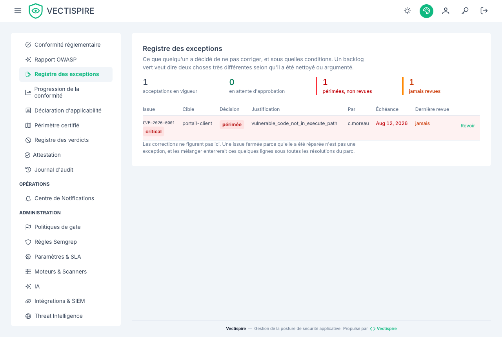

# Exceptions

Ce que quelqu'un a décidé de **ne pas** corriger, et sous quelles conditions.

C'est la question qu'un évaluateur pose en premier et qu'aucun tableau de bord ne répond. Tous les
autres écrans décrivent ce que le parc contient ; celui-ci décrit ce qu'on a écarté — et un backlog
vert veut dire deux choses opposées selon celle des deux qui l'a produit.

## Les deux chiffres qui portent l'écran

Ce ne sont pas les acceptations en vigueur.

- **Périmées** — accordées pour une période, la période est passée, personne n'a rouvert.
- **Jamais revues** — une acceptation que personne n'a ouverte depuis qu'elle a été accordée.

La seconde n'existait pas avant. Sans elle, une acceptation confirmée chaque trimestre et une
acceptation que personne n'a regardée depuis janvier se lisaient à l'identique.

## Confirmer est l'action qui ne change rien

Confirmer une exception ne change ni sa décision, ni son échéance, ni son auteur. La seule chose qui
bouge est la **preuve que quelqu'un a regardé** — c'est elle qui transforme « personne n'a revu
ceci » en fait daté.

Une instance qui n'enregistre jamais de revue est indiscernable, dans un audit, d'une instance où le
risque a été accepté une fois puis oublié.

Accorder et revoir sont réservés au référent sécurité.

## Prolonger exige une date

Le serveur refuse une prolongation sans nouvelle échéance, et l'écran la refuse avant que la requête
ne parte : une acceptation sans terme n'est pas une acceptation, c'est un abandon avec une
justification.

## La couleur suit le sens, pas la métrique

« 0 périmée » en rouge était une bonne nouvelle peinte en alarme. Un tableau où les bonnes nouvelles
sont rouges apprend à ignorer le rouge, et c'est alors celui qui compte qui devient invisible.

## À lire aussi

- [Constats et triage](issues.fr.md) — là où une exception s'accorde.
- [Déclaration d'applicabilité](statement-of-applicability.fr.md) — la déclaration sous laquelle ces exceptions se rangent.
