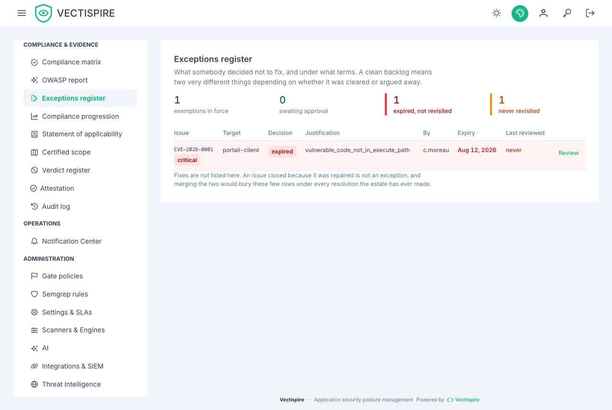

# Exceptions

What somebody decided **not** to fix, and under what conditions.

This is the question an assessor asks first and no dashboard answers. Every other screen describes
what the estate contains; this one describes what was waived — and a green backlog means two
opposite things depending on which of the two produced it.

## The two numbers that carry the screen

They are not the acceptances in force.

- **Lapsed** — granted for a period, the period has passed, nobody reopened them.
- **Never reviewed** — an acceptance nobody has opened since it was granted.

The second is the one that did not exist before. An acceptance confirmed every quarter and an
acceptance nobody has looked at since January read identically without it.

## Reviewing is the action that changes nothing

Confirming an exception changes neither its decision, nor its deadline, nor its author. The only
thing that moves is the **evidence that somebody looked** — which is what turns "nobody reviewed
this" into a dated fact.

An instance that never records a review is indistinguishable, in an audit, from one where the
risk was accepted once and forgotten.

Granting and reviewing are both reserved to the security lead.

## Extending needs a date

The server refuses an extension with no new deadline, and the screen refuses it before the
request leaves: an open-ended acceptance is not an acceptance, it is an abandonment with a
justification attached.

## Colour follows meaning, not metric

"0 lapsed" in red was good news painted as an alarm. A table where good news is red teaches people
to ignore red, and then the red that matters becomes invisible too.

## Related

- [Issues and triage](issues.md) — where an exception is granted.
- [Statement of applicability](statement-of-applicability.md) — the declaration these exceptions sit under.
