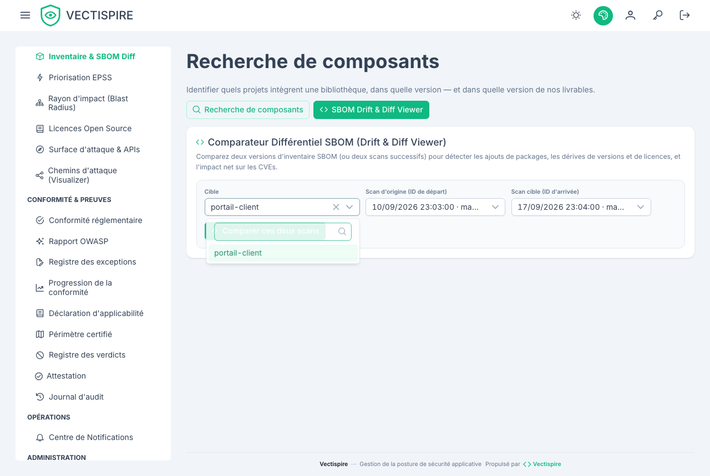

# Inventaire et licences

## Inventaire

L'inventaire, c'est le parc vu du côté des paquets plutôt que du côté des cibles : quels
composants vous exécutez, dans quelles versions, à combien d'endroits.

Il répond à la question qui arrive le matin où une nouvelle CVE est publiée — *est-ce qu'on
l'utilise, et où ?* — sans rien réanalyser, parce que les SBOM sont déjà stockés.

## Licences

La conformité des licences est évaluée contre une **liste de blocage configurable**, à partir
de données déjà présentes dans le SBOM. Pas de scan séparé, pas d'outil séparé.

Configurez la liste sous [Réglages](../administration/settings.md). Ce qui doit y figurer est
une décision propre à votre organisation, pas un défaut que quelqu'un d'autre pourrait fournir :
l'AGPL est fatale pour un produit propriétaire distribué et sans objet pour un service interne
qui n'est jamais livré.

Une violation de licence est un constat de plein droit. Elle compte pour la barrière, et la
politique de barrière peut être réglée pour faire échouer une construction dessus.

### La matrice de copyleft

Les licences sont résolues à travers une matrice de copyleft plutôt que comparées comme des
chaînes de caractères : une dépendance permissive qui a acquis une transitive copyleft est
visible comme telle, et non comme un nom que personne n'a reconnu.

## Dérive et différentiel de SBOM

**Dans l'interface, la cible vient d'abord.** Choisir un dépôt ou une image remplit deux listes
avec les scans de cette cible — la date, la branche et le nombre de constats de chacun — et
présélectionne les deux plus récents, qui sont la comparaison que presque tout le monde cherche :
ce qui a changé depuis la dernière fois. L'autre question, entre la version livrée et la
précédente, est à deux clics dans les mêmes listes.

Le numéro du scan reste affiché, en fin de ligne. C'est ce que l'API prend et ce qu'on cite en
support ; il n'est simplement plus la seule chose proposée. Cet écran en demandait deux, tapés à
la main, qu'aucun écran n'affichait en évidence.

Une cible analysée une seule fois n'a pas de paire, et l'écran le dit plutôt que de laisser deux
listes vides.

`GET /api/v1/sbom/diff` — et la visionneuse équivalente — compare deux SBOM et rapporte :

- les paquets **ajoutés** et **retirés** ;
- les **migrations de licence**, par exemple de permissive vers copyleft GPL ou AGPL ;
- l'**impact net en CVE** entre les deux.

C'est le contrôle qu'un différentiel de fichier de verrouillage ne peut pas vous donner. Une
dépendance dont la licence change entre deux versions mineures ne change rien de visible dans
le différentiel de votre manifeste, et change tout à ce que vous avez le droit de livrer.

## Dette de sécurité

`GET /api/v1/remediation/debt` convertit le backlog ouvert en heures d'ingénierie estimées et
en jours-personnes, et met en avant les **correctifs à plus fort impact** — ceux où une seule
action lève le plus de risque.

Traitez les heures comme un ordre de grandeur plutôt que comme un devis. Leur valeur est dans
la comparaison de deux dépôts ou de deux trimestres, pas dans le remplissage d'un plan de
projet.
