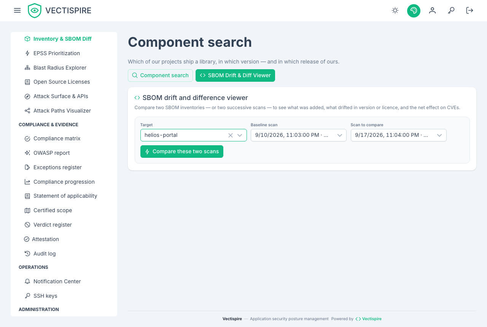

# Inventory and licenses

## Inventory

The inventory is the estate seen from the package side rather than the target side: which
components you run, in which versions, in how many places.

It answers the question that arrives on the morning a new CVE is published — *do we use
this, and where?* — without re-scanning anything, because the SBOMs are already stored.

## Licenses

License compliance is evaluated against a **configurable blocklist**, using data already
present in the SBOM. No separate scan, no separate tool.

Configure the blocklist under [Settings](../administration/settings.md). What belongs on it
is a decision for your organisation, not a default anybody else can supply: AGPL is fatal
for a proprietary distributed product and irrelevant for an internal service that is never
shipped.

A license violation is a first-class finding. It counts towards the gate, and the gate
policy can be set to fail a build on it.

### The copyleft matrix

Licenses are resolved through a copyleft matrix rather than matched as strings, so a
permissive dependency that acquired a copyleft transitive is visible as such rather than
as a name nobody recognised.

## SBOM drift and diff

**In the interface, the target comes first.** Choosing a repository or an image fills two
pickers with that target's own scans — the date, the branch and how many findings each one
carried — and preselects the two most recent, which is the comparison almost everybody wants:
what changed since last time. The other question, between the version you shipped and the one
before it, is two clicks away in the same pickers.

The scan's number is still shown, at the end of each line. It is what the API takes and what a
support conversation quotes; it is simply no longer the only thing on offer. This screen used to
ask for two of them, typed, and nothing displayed them prominently.

A target scanned once has no pair, and the screen says so rather than leaving two empty pickers.

`GET /api/v1/sbom/diff` — and the equivalent viewer — compares two SBOMs and reports:

- packages **added** and **pruned**;
- **license migrations**, for instance permissive to GPL or AGPL copyleft;
- **net CVE impact** between the two.

This is the check a lockfile diff cannot give you. A dependency relicensed between two
minor versions changes nothing visible in the diff of your manifest and changes everything
about what you are allowed to ship.

## Security debt

`GET /api/v1/remediation/debt` converts the open backlog into estimated engineering hours
and person-days, and highlights the **top high-impact fixes** — those where one action
clears the most risk.

Treat the hours as a shape rather than a quotation. Their value is in comparing two
repositories or two quarters, not in filling in a project plan.
