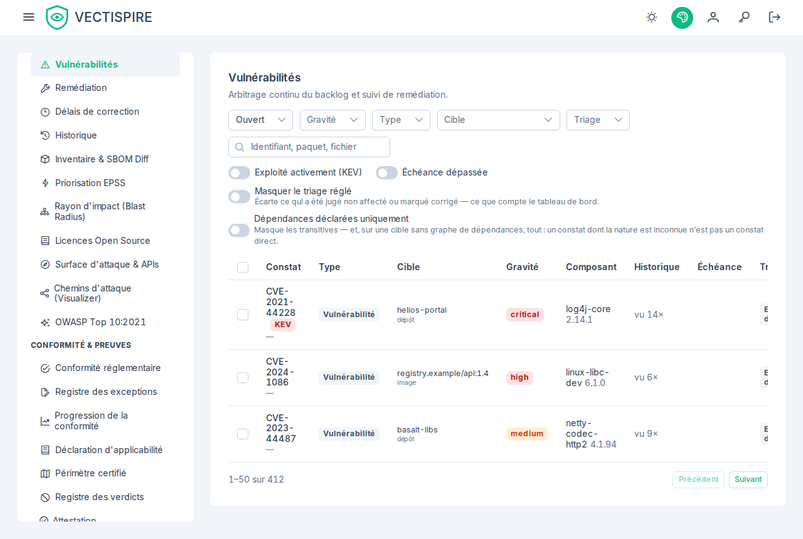

# Constats et triage

Une issue est un problème, suivi d'un scan à l'autre. C'est là que le travail se fait
réellement.

## Ce qui identifie une issue

L'empreinte **ignore délibérément la version du paquet**. Une dépendance qui reste vulnérable
sur trois correctifs successifs est une issue avec un historique et une décision, pas trois
issues qu'il faut chacune décider à nouveau.

Chaque issue porte : sa première apparition, le nombre de fois qu'elle a été vue, l'existence
d'une version correctrice, le caractère direct ou transitif du paquet, son score EPSS, son
statut KEV, et son historique de triage.

## Les deux axes

| | Écrit par | Valeurs |
|---|---|---|
| **État** | le pipeline, depuis ce que les scanners ont observé | `open`, `resolved` |
| **Statut de triage** | une personne | `under review`, `affected`, `not affected`, `will not fix`, `fixed` — et `pending approval` tant qu'une décision attend une seconde personne |

Ils ne s'écrivent jamais l'un l'autre. Supprimer une issue ne la résout pas, et un scan qui
résout une issue n'efface pas ce que quelqu'un a décidé à son sujet.

## Trier

Ouvrez une issue et consignez une décision dans le vocabulaire VEX, avec une
**justification** et éventuellement un **commentaire**. La justification est la partie qui doit
vous survivre : « non atteignable dans notre configuration », « non livré en production »,
« code vendu que nous n'exécutons pas ».

`not affected`, `will not fix` et `fixed` **règlent** l'issue : elle cesse de faire échouer la
barrière et sort des chiffres du backlog. Sous la [double validation](../administration/four-eyes.md),
quelqu'un qui ne peut pas approuver ne fait que les demander — l'issue attend en `pending approval`,
toujours comptée, jusqu'à ce qu'un approbateur l'accorde.

### Accepter un risque {#accepting-a-risk}

**Ne sera pas corrigé — risque accepté** sert pour une vulnérabilité qui s'applique bel et bien et
que l'équipe a décidé de ne pas corriger. Ce n'est pas *non affecté* : chaque justification VEX dit
pourquoi un produit n'est **pas** exposé, et aucune n'est vraie ici. La décision ne porte donc
**aucune justification** — le serveur en refuse une — et **exige une date de réexamen** : une
acceptation sans date est celle que personne ne regarde plus. Les documents VEX exportés continuent de
dire que le produit est affecté, sans correction prévue ([décision 0041](https://github.com/asmolabs/vectispire/blob/main/docs/architecture/fr/decisions/0041-will-not-fix-is-not-not-affected.md)), et l'acceptation figure
au [registre des exceptions](exceptions.md).

Avant la 0.11.0, une acceptation n'avait pas de statut à elle et s'enregistrait comme *non affecté*,
avec une justification choisie dans une liste où aucune ne s'appliquait ; le *Won't Fix* d'un
traqueur en devenait une aussi.

### Dates de réexamen {#review-dates}

Une suppression est une affirmation sur un contexte, et les contextes changent. Posez une
**date de réexamen** sur la décision : l'issue revient à *en cours d'examen* à cette date, avec
sa justification et son commentaire intacts.

C'est le mécanisme qui empêche un backlog de triage de se dégrader en silence permanent. « Non
atteignable dans notre configuration » était vrai quand la configuration était ce qu'elle était.

Les issues dont l'échéance est passée sont signalées comme telles dans la liste.

### Triage en masse

Une CVE présente dans quarante dépôts est **un jugement sur un contexte**, pas quarante — et la
décider quarante fois est la façon dont le triage cesse d'avoir lieu.

Restreignez la liste avec les filtres, sélectionnez, décidez une fois. La transaction est
tout-ou-rien, et chaque issue enregistre malgré tout sa propre transition dans son propre
historique : une décision en masse qui réécrirait silencieusement quarante lignes serait
indiscernable de quarante lignes éditées à la main, et le registre doit pouvoir faire la
différence.

## Filtres à connaître

- **Type** — comprend **Plugin (analysé par Vectispire)** et **Importé (déclaré par la CI)**, les deux
  sortes de constats produits par un autre outil (voir [Plugins et imports SARIF](../administration/plugins.md)).
  La ligne dit quel plugin ou quelle source, et la page de l'issue a une carte **Provenance**.
- **Corrigeables seulement** — masque tout ce dont aucune version correctrice n'est publiée.
- **Dépendances directes** — masque ce qu'une publication en amont, et non vous, doit corriger.
- **Activement exploitées (KEV)** — la liste la plus courte, et celle à lire en premier.
- **Triées / non triées** — ce qui a été décidé face à ce qui ne l'a pas été.
- **Échéance dépassée** — les constats ouverts qui ont dépassé le délai de correction de leur
  gravité, triage réglé exclu (voir [Délais de correction](remediation-delays.md)).
- **Projet ou solution** — `project_id` / `solution_id` sur `GET /api/v1/issues` : les problèmes des
  dépôts rangés dans ce projet (ou dans un projet quelconque de cette solution) au moment où vous
  demandez, si bien qu'un dépôt rangé ou déplacé depuis compte là où il est désormais. Les images ne
  sont dans aucun projet et ne correspondent jamais. Comme tout filtre, il est **restreint à ce que
  vous pouvez voir** : un projet que vous ne voyez qu'en partie montre les problèmes de cette partie —
  celle que l'arborescence des solutions vous montre — et un projet dont vous ne voyez rien montre une
  liste vide, exactement comme un projet qui n'existe pas. Les pastilles de l'arborescence comptent
  sans le triage réglé ; ajoutez `unsettled=true` pour que la liste s'accorde avec elles.

  L'écran n'a pas de sélecteur pour ce filtre : une étiquette de sévérité sur une solution ou un projet
  dans **Solutions et projets** ouvre cette liste avec le périmètre, cette sévérité et **Masquer le
  triage réglé** déjà positionnés (voir [Solutions et projets](../administration/solutions-and-projects.md)).
  Le périmètre s'affiche au-dessus de la liste en pastille — **Projet : Payments / Ledger**,
  **Solution : Payments** — et sa croix le retire en laissant les autres filtres tels quels. Un projet
  que l'arborescence ne vous montre pas est nommé par le numéro du lien, au-dessus de la liste vide
  ordinaire. Chaque filtre de cette page est gardé dans l'adresse : une liste filtrée se met en favori
  ou s'envoie, et **Précédent** revient à la page d'où elle a été ouverte.
- **Masquer le triage réglé** — écarte ce qui a été jugé non affecté, accepté comme ne sera pas
  corrigé ou marqué corrigé. C'est la
  règle selon laquelle comptent les chiffres par gravité du tableau de bord, et les liens depuis ces
  chiffres l'activent.

## Un ordre qui fonctionne

1. Les entrées KEV, quel que soit leur CVSS.
2. EPSS élevé.
3. Directes et corrigeables.
4. Tout le reste, par gravité.

Un classement par gravité d'abord place une critique inexploitable dans une dépendance
transitive devant une élevée activement exploitée dans un paquet que vous avez déclaré. Ce
n'est pas le bon après-midi de travail.

## Historique

Chaque transition est conservée : de quel statut vers quel statut, par qui, avec quelle
justification, contre quelle version du projet. Une issue que personne n'a triée est imprimée
dans l'historique exporté en le disant — sinon, le silence passerait pour une décision qui n'a
simplement jamais été écrite.
Une issue résolue qu'une analyse retrouve est rouverte, et c'est aussi une ligne de son
historique, avec le jour où sa résolution avait commencé ; personne n'est nommé, puisque
personne n'a décidé.

Voir [Historique et preuves](history.md).
