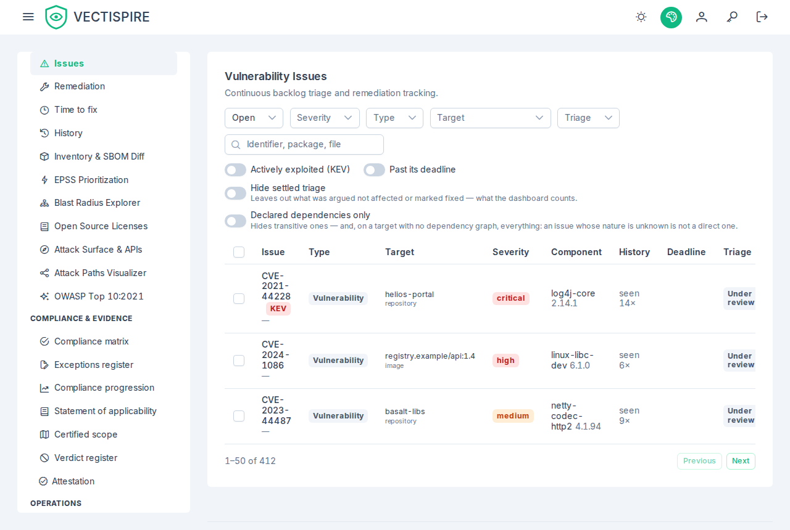

# Issues and triage

An issue is one problem, tracked across scans. It is where the work actually happens.

## What identifies an issue

The fingerprint deliberately **ignores the package version**. A dependency that stays
vulnerable through three patch releases is one issue with one history and one decision,
not three issues that each need deciding again.

Each issue carries: when it was first seen, how many times it has been seen, whether a fix
version exists, whether the package is direct or transitive, its EPSS score, its KEV
status, and its triage history.

## The two axes

| | Written by | Values |
|---|---|---|
| **State** | the pipeline, from what scanners observed | `open`, `resolved` |
| **Triage status** | a person | `affected`, `not affected`, `fixed`, `under review` |

They never write to each other. Suppressing an issue does not resolve it, and a scan
resolving an issue does not erase what somebody decided about it.

## Triaging

Open an issue and record a decision in the VEX vocabulary, with a **justification** and
optionally a **comment**. The justification is the part that has to survive you: "not
reachable in our configuration", "not shipped in production", "vendored code we do not
execute".

### Review dates

A suppression is a statement about a context, and contexts change. Set a **review date**
on the decision and the issue returns to *under review* at that date, with its
justification and comment intact.

This is the mechanism that stops a triage backlog from decaying into permanent silence.
"Not reachable in our configuration" was true when the configuration was what it was.

Issues past their deadline are flagged as such in the list.

### Bulk triage

One CVE across forty repositories is **one judgement about one context**, not forty — and
deciding it forty times is how triage stops happening.

Narrow the list with the filters, select, decide once. The transaction is all-or-nothing,
and each issue still records its own transition in its own history: a bulk decision that
silently rewrote forty rows would be indistinguishable from forty rows edited by hand, and
the record has to be able to tell the difference.

## Filters worth knowing

- **Type** — includes **Plugin (analysed by Vectispire)** and **Imported (declared by CI)**, the two
  kinds of finding another tool produced (see [Plugins and SARIF imports](../administration/plugins.md)).
  The row says which plugin or which source, and the issue's page has a **Provenance** card.
- **Fixable only** — hides everything with no published fix version.
- **Direct dependencies** — hides what an upstream release, not you, has to fix.
- **Actively exploited (KEV)** — the shortest list, and the one to read first.
- **Triaged / untriaged** — what has been decided against what has not.
- **Past its deadline** — open findings past the remediation window their severity carries,
  settled triage excluded (see [Remediation times](remediation-delays.md)).
- **Project or solution** — `project_id` / `solution_id` on `GET /api/v1/issues`: the issues of the
  repositories filed in that project (or in any project of that solution) at the moment you ask, so a
  repository filed or moved since is counted where it now is. Images are in no project and never
  match. Like every filter it is **narrowed to what you may see**: a project you see only part of shows
  the issues of that part — the part the solutions tree shows you — and a project you see nothing of
  shows an empty list, exactly as a project that does not exist does. The tree's badges count with
  settled triage left out; add `unsettled=true` for the list to agree with them.

  On screen there is no selector for it: a severity tag on a solution or a project in
  **Solutions & projects** opens this list with the scope, that severity and **Hide settled triage**
  already set (see [Solutions and projects](../administration/solutions-and-projects.md)). The scope
  shows above the list as a chip — **Project: Payments / Ledger**, **Solution: Payments** — and its
  cross takes it off while leaving the other filters as they are. A project the tree does not show you
  is named by the number in the link, over the ordinary empty list. Every filter on this page is kept
  in the address, so a filtered list can be bookmarked or sent, and **Back** returns to the page it
  was opened from.
- **Hide settled triage** — leaves out what was argued not affected or marked fixed. It is the
  clause the dashboard's per-severity figures count by, and the links from those figures set it.

## Ordering that works

1. KEV entries, whatever their CVSS.
2. High EPSS.
3. Direct and fixable.
4. Everything else, by severity.

Severity-first ordering puts an unexploitable critical in a transitive dependency ahead of
an actively exploited high in a package you declared. That is the wrong afternoon's work.

## History

Every transition is kept: from which status to which, by whom, with which justification,
against which project version. An issue nobody triaged is printed in the exported history
saying so — silence would otherwise pass for a decision that was merely never written down.
A resolved issue that a scan finds again is reopened, and that too is a line of its history,
with the date its resolution began; nobody is named, since nobody decided.

See [History and evidence](history.md).
