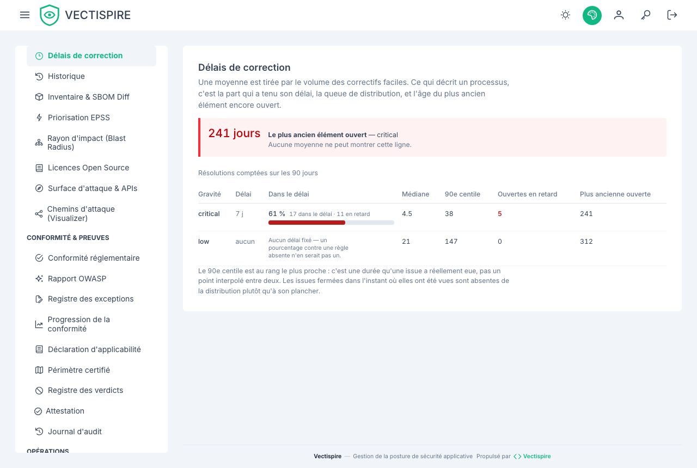

# Délais de correction

Le temps que mettent les constats à se fermer, lu par la queue de la distribution plutôt que par la
moyenne.

## Pourquoi pas une moyenne

**Une moyenne est tirée par le volume des correctifs faciles.** Fermez quarante montées de version
dans la journée et la moyenne est excellente pendant que la seule critique que personne n'a touchée
est toujours ouverte.

Ce qui décrit un processus, ce sont trois nombres, et cet écran les met au même niveau :

- la **part qui a tenu son délai**, par gravité ;
- le **90e centile** — la queue, là où le processus échoue vraiment ;
- l'**âge du plus ancien élément encore ouvert**.

## Le plus ancien élément ouvert est en haut

C'est la ligne qu'aucune moyenne ne peut montrer, et la première qu'un évaluateur demande. La ranger
dans le tableau en ferait une donnée parmi neuf.

Elle n'est signalée que si elle dépasse le délai **de sa propre gravité**, pas si elle est
simplement ancienne. Vingt et un jours en rouge sur un délai de quatre-vingt-dix est une alarme
fausse, et un écran qui crie au loup pour une cible dans les temps apprend à ignorer celle qui ne
l'est pas.

## Trois états vides, et ce ne sont pas les mêmes

| L'écran dit | Cela signifie |
|---|---|
| **Aucun délai fixé** | Personne n'a donné d'objectif à cette gravité. Un taux calculé contre une règle absente n'en est pas un, et il serait cité comme s'il l'était. |
| **Rien à mesurer** | Le délai existe, mais rien n'a été résolu sur la fenêtre pour s'y comparer. |
| **0 %** | Le délai existe, du travail a été clos, et rien n'a tenu le délai. |

Le cas du milieu s'affichait auparavant `0 %`, qui se lit « on ne tient jamais les délais » là où la
phrase vraie est « rien n'a été clos sur ces quatre-vingt-dix jours ».

## D'où viennent les délais

Les quatre fenêtres se règlent dans [Réglages](../administration/settings.fr.md), une par gravité.
Ce sont des réglages et non des constantes parce qu'une politique de remédiation est écrite par une
organisation, pas par un outil. **Zéro désactive une gravité** — le texte d'aide le dit sur chacune,
parce que l'autre lecture, zéro comme « à corriger immédiatement », transformerait le vidage d'un
champ en un retard intégralement en dépassement.

## À lire aussi

- [Plan de remédiation](remediation.fr.md) — quoi faire, dans l'ordre.
- [Constats et triage](issues.fr.md) — là où le chronomètre démarre et s'arrête.
