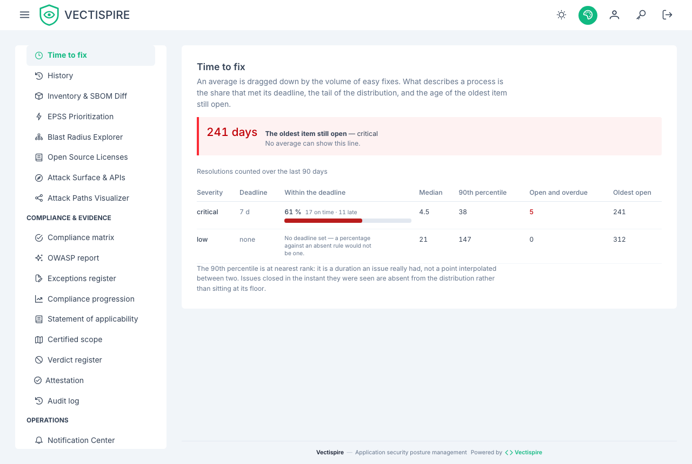

# Remediation times

How long findings take to close, read from the tail of the distribution rather than from the mean.

## Why not an average

**A mean is dragged down by the volume of easy fixes.** Close forty dependency bumps in a day and
the average looks excellent while the one critical nobody touched is still open.

What describes a process is three numbers, and this screen puts them on the same footing:

- the **share that met its deadline**, per severity;
- the **90th percentile** — the tail, where the process actually fails;
- the **age of the oldest item still open**.

## The oldest open item is at the top

It is the line no mean can show and the first an assessor asks for. Filing it in the table would
make it one datum among nine.

It is highlighted when it is past the deadline **of its own severity**, not when it is merely old.
Twenty-one days in red against a ninety-day deadline is a false alarm, and a screen that cries
wolf about a target that is on time teaches people to ignore the one that is not.

## Three empty states, and they are not the same

| The screen says | It means |
|---|---|
| **No deadline set** | Nobody gave this severity a target. A rate computed against an absent rule is not a rate, and it would be quoted as though it were. |
| **Nothing to measure** | The deadline exists, but nothing was resolved inside the window to measure against it. |
| **0 %** | The deadline exists, work was closed, and none of it met the deadline. |

The middle case used to be shown as `0 %`, which reads as "we never meet our deadlines" where the
true sentence is "nothing was closed in these ninety days".

## Where the deadlines come from

The four windows are set in [Settings](../administration/settings.md), one per severity. They are
settings rather than constants because a remediation policy is written by an organisation, not by
a tool. **Zero disables a severity** — the help text says so on each of them, because the other
reading, zero as "due immediately", turns clearing a field into a backlog entirely in breach.

## Related

- [Remediation plan](remediation.md) — what to do, in order.
- [Issues and triage](issues.md) — where the clock starts and stops.
