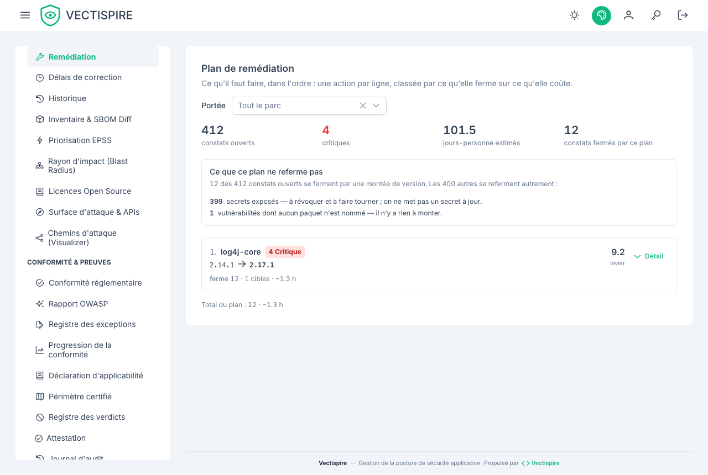

# Plan de remédiation

La liste des constats dit ce qui ne va pas. Cette page dit ce qu'on en fait, et dans quel ordre.



## Une ligne est une action

La différence avec la [liste des vulnérabilités](issues.fr.md) tient à ce qu'une ligne désigne.
Là-bas, une ligne est une vulnérabilité. Ici, une ligne est une montée de version — et quatorze
constats de la même bibliothèque sur six dépôts ne sont pas quatorze décisions, mais une seule.

C'est toute la raison d'être de cette page. Un backlog trié par sévérité demande à une équipe un
arbitrage par ligne, et il y a des milliers de lignes. Un ordre de travail trié par levier lui
demande de faire la première.

## Comment l'ordre est décidé

Le levier est ce qu'une mise à jour ferme, rapporté à ce qu'elle coûte :

```
levier = (CVE distincts × 2 + critiques × 3 + élevés × 1,5) / effort
effort = 1 heure + 0,1 heure par CVE distinct
```

Les vulnérabilités graves pèsent plus que leur nombre : dix constats faibles sur un paquet ne
valent pas le même après-midi que deux critiques. Les égalités se départagent par le nom du
paquet, pour que les mêmes données donnent deux fois le même ordre.

Seuls les constats portant un nom de paquet sont classés : ce sont les seuls qu'une mise à jour
ferme. Un secret en dur ou un bucket mal configuré n'a pas de version vers laquelle aller, et il
reste dans la liste des vulnérabilités, à sa place. Quand le plan est vide et que la liste ne
l'est pas, c'est en général pour cette raison, et la page le dit.

## La version qu'elle conseille

La version d'arrivée vient de ce que les scanners ont remonté sur chaque constat — les versions
qui le corrigent — et la plus haute est retenue. Les numéros sont comparés comme des versions et
non comme du texte : « 2.9.0 » passe *après* « 2.17.1 » dans l'ordre alphabétique, et la
conseiller laisserait la faille ouverte.

Quand aucun constat n'annonce de version corrigée, la page affiche **aucune version corrigée
publiée** plutôt que d'inventer une cible. C'est une vraie réponse : elle signifie que la mise à
jour n'est pas encore le bon geste, et que le constat demande un arbitrage, un contournement ou
une autre bibliothèque.

## Lire une ligne

Déplier une ligne montre les vulnérabilités que la mise à jour ferme — chacune renvoie vers la
liste filtrée — ainsi que les dépôts et les images concernés. Les compteurs en haut de page
donnent son échelle au plan : combien de constats sont ouverts en tout, combien sont critiques,
l'effort estimé sur l'ensemble du parc, et la part que ferment les dix lignes en dessous.

## Portée et profondeur

Le sélecteur de portée restreint le plan à un dépôt ou à une image — la même question, posée d'une
cible plutôt que du parc. En changer relance la liste à dix lignes : le plan n'est plus le même, et
conserver la profondeur précédente laisserait croire à une continuité qui n'existe pas.

Dix lignes par défaut, parce qu'un ordre de travail court est ce qui fait démarrer une équipe.
**Voir la suite** allonge la liste par paliers plutôt que de la paginer : personne ne veut la page 4
d'un plan de remédiation, on veut savoir ce qui vient après les dix premières. Cela s'arrête à
cinquante, là où un ordre de travail cesse d'en être un.

Tout ici respecte les mêmes règles de visibilité que le reste du produit : un compte voit le plan
des cibles qu'il a le droit de voir, et d'aucune autre.
