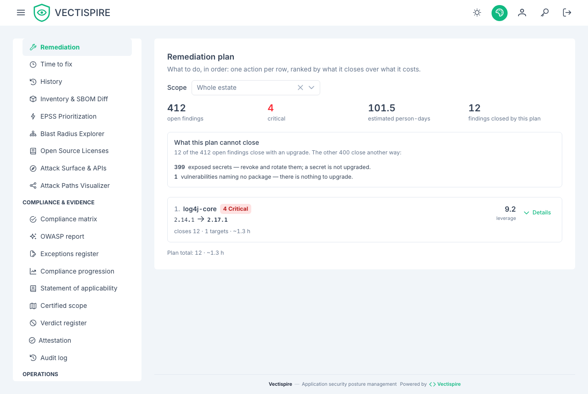

# Remediation plan

The findings list says what is wrong. This page says what to do about it, in order.



## One row is one action

The difference from the [findings list](issues.md) is what a row means. There, a row is a
vulnerability. Here, a row is an upgrade — and fourteen findings of the same library across six
repositories are not fourteen decisions, they are one.

That is the whole reason the page exists. A backlog sorted by severity asks a team to make a
judgement call per line, and there are thousands of lines. A work order sorted by leverage asks
them to do the first thing on it.

## How the order is decided

Leverage is what an upgrade closes over what it costs:

```
leverage = (distinct CVEs × 2 + critical × 3 + high × 1.5) / effort
effort   = 1 hour + 0.1 hour per distinct CVE
```

Severe vulnerabilities weigh more than their number, because ten low findings on a package are
not worth the same afternoon as two critical ones. Ties break on the package name, so the same
data produces the same order twice.

Only findings that carry a package name are ranked: those are the ones an upgrade closes. A
hardcoded secret or a misconfigured bucket does not have a version to move to, and it stays in
the findings list where it belongs. When the plan is empty and the findings list is not, this is
usually why, and the page says so.

## The version it recommends

The target version comes from what the scanners reported on each finding — the versions that fix
it — and the highest of them is chosen. Version numbers are compared as versions, not as text:
`2.9.0` sorts *after* `2.17.1` alphabetically, and recommending it would leave the vulnerability
open.

When no finding announces a fixed version, the page says **no fixed version published** rather
than inventing a target. That is a real answer: it means the upgrade is not the move yet, and the
finding needs triage, a workaround, or a different library.

## Reading a row

Expanding a row shows the vulnerabilities the upgrade closes — each one links into the filtered
findings list — and the repositories and images it touches. The counters at the top of the page
give the plan its scale: how many findings are open in total, how many are critical, the estimated
effort for the whole estate, and how much of it the ten rows below close.

## Scope and depth

The scope selector narrows the plan to one repository or one image — the same question, asked of
one target instead of the estate. Changing it starts the list over at ten rows: the plan is a
different plan, and carrying the previous depth across would suggest a continuity that is not
there.

Ten rows is the default because a short work order is what makes a team start. **Show more** grows
the list in steps rather than paging it, because nobody wants page 4 of a remediation plan — they
want to know what comes after the first ten. It stops at fifty, where a work order stops being one.

Everything here honours the same visibility rules as the rest of the product: an account sees the
plan for the targets it is allowed to see, and no others.
