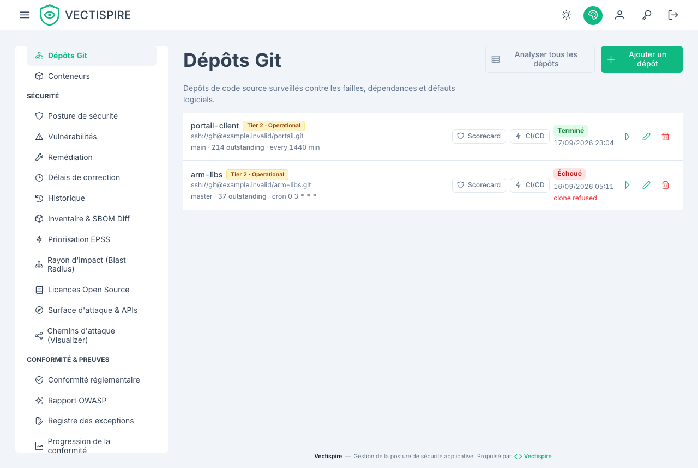

# Dépôts

Un dépôt est une cible de scan : une URL de clonage, une branche, éventuellement un
sous-chemin, et une récurrence.

## En enregistrer un

**Dépôts → ajouter.**

| Champ | Notes |
|---|---|
| **URL du dépôt** | HTTPS pour un dépôt public, SSH là où une clé de déploiement est nécessaire. |
| **Nom affiché** | Le nom sous lequel tous les autres écrans le désignent. |
| **Branche** | La branche analysée à chaque exécution. |
| **Sous-chemin** | Pour un monodépôt. Enregistrez un monodépôt **une fois par projet**, pas une fois pour l'arbre entier — sinon un seul SBOM confond les dépendances de plusieurs applications et aucun verdict ne veut plus rien dire. |
| **Niveau de criticité métier** | Niveau 1 · critique pour la mission, niveau 2 · opérationnel, niveau 3 · interne. |
| **Agent requis** | Épingle le scan à un agent. Laissez vide, sauf si le dépôt n'est routable que depuis un segment réseau particulier. |

## Identifiants {#credentials}

Les dépôts privés s'authentifient avec une clé de déploiement enregistrée sous
[Clés SSH](../administration/ssh-keys.md). Donnez-lui un accès **en lecture seule** chez votre
hébergeur — Vectispire ne fait jamais que cloner.

La moitié privée est chiffrée au repos avec votre `ENCRYPTION_KEY`. Le stockage d'une clé est
refusé net tant que cette variable n'est pas posée.

## Récurrence {#recurrence}

Posez soit un **intervalle de scan**, soit une **expression cron**. L'expression l'emporte
quand les deux sont présents.

Préférez cron. Un intervalle dérive de quelques minutes à chaque exécution, si bien qu'un scan
configuré pour 03:00 migre dans la journée de travail en quelques semaines — et un scan qui
concurrence la journée de travail est le scan que quelqu'un finit par désactiver.

La récurrence est la raison d'être du produit plutôt qu'une commodité : de nouvelles
vulnérabilités sont publiées contre du code qui n'a pas changé, donc un dépôt analysé une fois
est un dépôt dont la posture est connue à une date passée.

## Niveaux de criticité métier {#business-criticality-tiers}

Trois niveaux, et ils existent pour que le classement tienne compte de ce qu'une cible *est*
plutôt que seulement de ce qu'on y a trouvé :

- **Niveau 1 · critique pour la mission**
- **Niveau 2 · opérationnel**
- **Niveau 3 · interne**

La même CVE critique n'est pas le même problème dans un chemin de paiement et dans un outil
interne jetable. Sans niveau, le backlog affirme qu'ils sont identiques.

## La pastille README

Chaque dépôt peut exposer une pastille dynamique pour son propre README, montrant la note de
posture de sécurité. Elle met le chiffre sous les yeux des gens qui commitent, c'est-à-dire là
où il change les comportements.

## Comment la note du scorecard est calculée

La note de la **fiche scorecard** d'un dépôt et celle de sa pastille sont le même nombre. Elle
est calculée à la demande, sur le backlog du dépôt tel qu'il est — rien n'est stocké.

**Ce qui compte.** Les problèmes ouverts de ce dépôt seulement. Les problèmes résolus sont
écartés, ainsi que ceux triés **non affecté** ou **corrigé** — les deux décisions qui empêchent
déjà un problème de faire échouer la barrière. Un problème dont l'exclusion est **en attente
d'approbation** compte toujours : une demande n'est pas une décision. Un statut de triage que
Vectispire ne reconnaît pas compte aussi, plutôt que d'être lu comme réglé.

**Le score** part de 100 :

| Élément | Points | Par |
|---|---|---|
| Vulnérabilité activement exploitée (CISA KEV) | −25 | problème |
| Critique, atteignable | −15 | problème |
| Critique, non atteignable ou atteignabilité inconnue | −8 | problème |
| Haute | −4 | problème |
| Licence non autorisée par la politique de licences | −5 | composant |
| Au moins un scan terminé | +5 | une fois |

Les pénalités s'additionnent : un critique atteignable et activement exploité coûte 40. Les
sévérités moyenne et basse ne coûtent rien. Le résultat est borné entre 0 et 100.

**La note :**

| Score | Note |
|---|---|
| 95 et plus | A+ |
| 85 – 94 | A |
| 70 – 84 | B |
| 55 – 69 | C |
| 40 – 54 | D |
| moins de 40 | F |

Par exemple, un dépôt scanné avec un critique atteignable, un critique non atteignable, une
haute, une moyenne activement exploitée et une licence non autorisée obtient
100 − 15 − 8 − 4 − 25 − 5 + 5 = **48, note D**.

**Ce qui ne change pas la note.** Les problèmes en retard sur leur délai de remédiation sont
comptés sur la fiche et produisent une recommandation, mais ne coûtent aucun point : les délais
sont un réglage propre à chaque installation (voir [Délais de correction](remediation-delays.md#dou-viennent-les-delais)),
et une pastille ne doit pas changer de note parce que quelqu'un a modifié une fenêtre.

**Les recommandations** listent, quand elles s'appliquent : les licences non autorisées,
l'absence de scan terminé — une attestation in-toto est délivrée à partir d'un scan terminé, il
n'y en a donc aucune avant —, les vulnérabilités activement exploitées, les critiques, les
hautes et les problèmes en retard.

Les pénalités n'ont pas de plafond, l'échelle sature donc par le bas : cinq critiques
atteignables et exploités suffisent pour un F, et cinq cents donnent le même F. Lisez les
compteurs de la fiche, pas seulement la lettre.

Cette note n'est **pas** celle du classement de maturité du tableau de bord, qui suit une autre
règle — voir [Tableau de bord](dashboard.md#note-de-posture-de-securite).

## Supprimer un dépôt

Retirer un dépôt retire ses scans et son historique d'issues avec lui. Là où vous devez garder
la trace, exportez d'abord
[l'historique de détection et de triage](history.md) — ce document est écrit pour être lu
après coup par quelqu'un qui n'était pas là.
