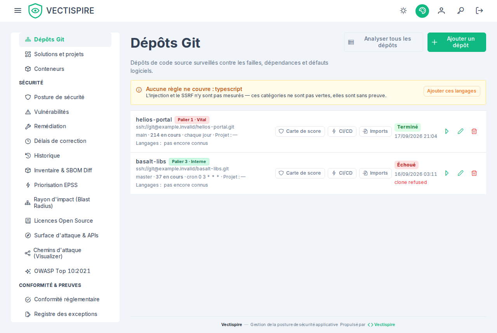

# Dépôts

Un dépôt est une cible de scan : une URL de clonage, une branche, éventuellement un
sous-chemin, et une récurrence.



## En enregistrer un

**Dépôts → ajouter.**

| Champ | Notes |
|---|---|
| **URL du dépôt** | HTTPS pour un dépôt public, SSH là où une clé de déploiement est nécessaire. Donnez l'adresse que la forge sert réellement : un clonage **ne suit aucune redirection HTTP**, vers aucun hôte, parce que l'hôte qu'elle ferait atteindre n'a jamais été vérifié. Un projet déplacé ou renommé échoue avec *« answered with a redirect … to &lt;hôte&gt; »* — enregistrez la nouvelle adresse. |
| **Nom affiché** | Le nom sous lequel tous les autres écrans le désignent. |
| **Branche** | La branche analysée à chaque exécution. |
| **Sous-chemin** | Pour un monodépôt. Enregistrez un monodépôt **une fois par projet**, pas une fois pour l'arbre entier — sinon un seul SBOM confond les dépendances de plusieurs applications et aucun verdict ne veut plus rien dire. Relatif à la racine du dépôt — `services/billing` — sans segment `..` ni `/` initial ; un répertoire qui est un lien hors du dépôt fait échouer l'analyse plutôt qu'analyser autre chose. |
| **Niveau de criticité métier** | Niveau 1 · critique pour la mission, niveau 2 · opérationnel, niveau 3 · interne. |
| **Agent requis** | Épingle le scan à un agent. Laissez vide, sauf si le dépôt n'est routable que depuis un segment réseau particulier. |

## Identifiants {#credentials}

Les dépôts privés s'authentifient avec une clé de déploiement enregistrée sous
[Clés SSH](../administration/ssh-keys.md). Donnez-lui un accès **en lecture seule** chez votre
hébergeur — Vectispire ne fait jamais que cloner.

La moitié privée est chiffrée au repos avec votre `ENCRYPTION_KEY`. Le stockage d'une clé est
refusé net tant que cette variable n'est pas posée.

### En SSH : la clé d'hôte de la forge {#ssh-host-keys}

Un clone avec une clé de déploiement vérifie la **clé d'hôte** du serveur contre un fichier
`known_hosts` tenu par l'exécutant qui mène le scan — le worker intégré du plan de contrôle ou un
agent :

- **Premier contact :** la clé est acceptée et inscrite dans ce fichier.
- **Chaque clone suivant :** la clé doit correspondre. Sinon le scan échoue avec *« The host key of
  … has changed since the last clone. Check it is the same server before running again. »* et rien
  n'est récupéré. Après une vraie rotation chez la forge, supprimez la ligne de cet hôte dans le
  fichier ; le scan suivant inscrit la nouvelle clé.
- **Épinglée plutôt qu'apprise :** écrivez vous-même les clés de la forge dans le fichier (issues de
  `ssh-keyscan`, comparées aux empreintes que publie votre forge) et rendez le fichier **en lecture
  seule** pour l'exécutant. Il n'est alors que comparé : un hôte qu'il ne liste pas est refusé, et
  rien n'y est jamais ajouté.

Le fichier est `<home>/.ssh/known_hosts` du processus de l'exécutant. Dans le `docker-compose.yml`
livré, c'est `$VECTISPIRE_WORK_DIR/home/.ssh/known_hosts` pour le plan de contrôle et
`$VECTISPIRE_AGENT_WORK_DIR/home/.ssh/known_hosts` pour l'agent — voir
[Installation](../getting-started/installation.md). Rien d'autre de ce répertoire n'est lu pour un
clone avec clé : ni identité, ni agent, ni `config` — un alias `Host`, un `Port`, un `ProxyJump` ou
un `StrictHostKeyChecking` y sont sans effet. Mettez l'hôte et le port réels dans l'URL du dépôt.

#### Un agent `local` : remplir `known_hosts` avant son premier clone {#ssh-known-hosts-local-agent}

Un agent en mode `local` ne reçoit aucune clé et clone avec l'accès SSH de sa propre machine —
l'identité, la `config` et le `known_hosts` du `.ssh` de son home, utilisés tels quels. C'est le
comportement de ssh lui-même, et il **refuse un hôte que son `known_hosts` ne liste pas** :
personne n'est là pour répondre « êtes-vous sûr ? ». La première analyse échoue alors avec *« The
host key of … was refused by this machine's own known_hosts: the host is not listed there, or its
key has changed. »* C'est voulu — un premier contact inscrit sans vérification est le moment où
une interception serait crue — et le fichier est donc rempli une fois, par vous, après avoir
vérifié la clé.

Le fichier est `<home>/.ssh/known_hosts` du processus de l'agent : dans le profil `with-agent`,
`$VECTISPIRE_AGENT_WORK_DIR/home/.ssh/known_hosts` ; pour l'image de l'agent lancée seule,
`/home/vectispire/.ssh/known_hosts` sauf si vous réglez `-Duser.home`. Sur l'hôte de l'agent :

```bash
# 1. Récupérer les clés d'hôte de la forge (ajoutez -p <port> pour un port non standard).
ssh-keyscan -t ed25519,ecdsa,rsa gitlab.example.com > known_hosts.new

# 2. Afficher leurs empreintes et comparer CHACUNE à celles que publie la forge — GitHub et
#    GitLab.com listent les leurs dans leur documentation ; pour votre propre serveur, demandez à
#    son administrateur la sortie de `ssh-keygen -lf /etc/ssh/ssh_host_ed25519_key.pub`.
#    Une différence : arrêtez-vous.
ssh-keygen -lf known_hosts.new

# 3. Installer le fichier pour l'utilisateur de l'agent (1000:1000 dans les images).
home="${VECTISPIRE_AGENT_WORK_DIR:-/var/lib/vectispire/agent-work}/home"
sudo install -d -m 0700 -o 1000 -g 1000 "$home/.ssh"
sudo install -m 0644 -o 1000 -g 1000 known_hosts.new "$home/.ssh/known_hosts"
```

`ssh-keyscan` récupère les clés par le même réseau que celui où se tiendrait une interception :
l'étape 2, contre une empreinte obtenue par un autre chemin, est la vérification, et la sauter
inscrit ce qui a répondu. L'identité avec laquelle l'agent clone se place à côté
(`$home/.ssh/id_ed25519`, mode 0600, propriété de 1000) — une clé dédiée à cet agent, jamais la
vôtre. Ne mettez pas `StrictHostKeyChecking no` dans une `config` de ce répertoire pour passer
outre le refus : il accepterait n'importe quel serveur, clé changée comprise.

### En HTTPS, avec un jeton

Un dépôt joignable seulement en HTTPS se clone avec un **jeton HTTPS** — un jeton personnel, de
projet ou de déploiement délivré par la forge, avec un accès en lecture au dépôt. Enregistrez-le
sous **Jetons HTTPS**, à côté de [Clés SSH](../administration/ssh-keys.fr.md) dans le menu, avec :

- **l'hôte** pour lequel il est émis (`gitlab.example.com`, sans schéma ni port). Le jeton est
  présenté à cet hôte et à **aucun autre** : un dépôt dont l'URL nomme un autre serveur ne peut pas
  l'utiliser, et une redirection vers un autre hôte ne reçoit rien — c'est mesuré, pas supposé ;
- un **nom d'utilisateur** si votre forge en veut un à côté du jeton ; laissé vide, une valeur fixe
  est envoyée, que GitLab, GitHub et Gitea acceptent.

Un dépôt utilise une clé SSH **ou** un jeton HTTPS, du type que son URL appelle. Le jeton est chiffré
comme une clé, jamais réaffiché, et ne rejoint un agent qu'en mode `delegated`, scellé ; un agent
`local` n'en reçoit aucun.

**Un jeton écrit dans l'URL n'est plus accepté** (`https://utilisateur:jeton@hôte/…`) : il était
conservé en clair dans la ligne du dépôt et envoyé à chaque agent. Les dépôts déjà enregistrés ainsi
continuent de fonctionner ; pour en migrer un, retirez l'identifiant de son URL et rattachez un
jeton.

## Récurrence {#recurrence}

Posez soit un **intervalle de scan**, soit une **expression cron**. L'expression l'emporte
quand les deux sont présents.

Préférez cron. Un intervalle dérive de quelques minutes à chaque exécution, si bien qu'un scan
configuré pour 03:00 migre dans la journée de travail en quelques semaines — et un scan qui
concurrence la journée de travail est le scan que quelqu'un finit par désactiver.

La récurrence est la raison d'être du produit plutôt qu'une commodité : de nouvelles
vulnérabilités sont publiées contre du code qui n'a pas changé, donc un dépôt analysé une fois
est un dépôt dont la posture est connue à une date passée.

## Niveaux de criticité métier {#business-criticality-tiers}

Trois niveaux, et ils existent pour que le classement tienne compte de ce qu'une cible *est*
plutôt que seulement de ce qu'on y a trouvé :

- **Niveau 1 · critique pour la mission**
- **Niveau 2 · opérationnel**
- **Niveau 3 · interne**

La même CVE critique n'est pas le même problème dans un chemin de paiement et dans un outil
interne jetable. Sans niveau, le backlog affirme qu'ils sont identiques.

## Projet {#project}

Chaque dépôt indique le projet où il est rangé, avec un lien vers ce projet dans
[Solutions et projets](../administration/solutions-and-projects.md), ou « — » s'il n'est dans
aucun. Le rangement se fait depuis cet écran, par un administrateur — et il change des accès : une
attribution sur un projet couvre les dépôts qui y sont rangés.

## La pastille README

Chaque dépôt peut exposer une pastille dynamique pour son propre README, montrant la note de
posture de sécurité — la lettre seule, jamais les points de risque du score : la pastille est anonyme,
et les points diraient à quiconque la lit combien est ouvert et quand cela bouge. Elle met la note sous
les yeux des gens qui commitent, c'est-à-dire là où elle change les comportements.

## Comment la note du scorecard est calculée

La note de la **fiche scorecard** d'un dépôt et celle de sa pastille sont le même nombre. Elle
est calculée à la demande, sur le backlog du dépôt tel qu'il est — rien n'est stocké. La formule est
celle de la [décision 0036](https://github.com/asmolabs/vectispire/blob/main/docs/architecture/fr/decisions/0036-the-posture-score-formula.md),
depuis la 0.11.0.

**Ce qui compte.** Les problèmes ouverts de ce dépôt seulement. Les problèmes résolus sont
écartés, ainsi que ceux triés **non affecté** ou **corrigé** — les deux décisions qui empêchent
déjà un problème de faire échouer la barrière. Un problème dont l'exclusion est **en attente
d'approbation** compte toujours : une demande n'est pas une décision. Un statut de triage que
Vectispire ne reconnaît pas compte aussi, plutôt que d'être lu comme réglé.

**Les points de risque** additionnent ce qui est ouvert, chaque problème et chaque licence interdite
une fois :

| Élément | Points de risque | Par |
|---|---|---|
| Vulnérabilité activement exploitée (CISA KEV), quelle que soit sa sévérité | 25 | problème |
| Critique | 10 | problème |
| Haute | 4 | problème |
| Moyenne (ou sans sévérité) | 0,5 | problème |
| Basse | 0,125 | problème |
| Licence non autorisée par la politique de licences | 4 | composant |

Un problème exploité compte comme exploité seulement, pas aussi sous sa sévérité.

**Le score** vaut **100 × e^(−points de risque / 55)**, arrondi, et jamais moins de 1. Chaque problème
retire une part de ce qui reste plutôt qu'un nombre fixe de points : le score baisse vite pour les
premiers problèmes et continue de baisser, de plus en plus lentement, si bien qu'un backlog deux fois
plus grand a toujours un score plus bas — cinquante moyennes ne se lisent plus comme cinq cents, et une
équipe loin dans F voit encore ses points de risque baisser à mesure qu'elle corrige. **Tout problème
activement exploité plafonne le score à 54**, le haut de D. Un scan terminé ne rapporte rien : en
avoir un est ce qui fait qu'une cible est notée.

**L'atteignabilité n'est pas un terme.** Vectispire n'exécute aucune analyse de graphe d'appels,
si bien que rien n'établit si le code vulnérable d'un composant est appelé. Tout critique pèse pareil.

**La note :**

| Score | Note |
|---|---|
| 95 et plus | A+ |
| 85 – 94 | A |
| 70 – 84 | B |
| 55 – 69 | C |
| 40 – 54 | D |
| moins de 40 | F |

Par exemple : un critique fait 10 points de risque, **83, B** ; un critique exploité 25 points, 63
plafonné à **54, D** ; cinquante moyennes 25 points, **63, C** ; une licence interdite 4 points, **93,
A**. Un dépôt scanné avec deux critiques, une haute, une moyenne activement exploitée, deux moyennes,
quatre basses et une licence interdite a 10 + 10 + 4 + 25 + 0,5 + 0,5 + 0,5 + 4 = 54,5 points de risque
et obtient **37, note F**.

**Les points de risque sont sur la fiche** (`riskPoints`), à côté du score, pour qui est connecté —
jamais sur la pastille publique. Ils sont une somme de ce qui est ouvert, pas un pourcentage.

**Pas de scan, pas de note.** Un dépôt ou une image sans scan terminé n'a rien à noter : sa fiche
porte la note **`NO_DATA`** sans score ni points de risque (`score` et `riskPoints` valent `null`), et
sa pastille affiche *no data* en gris. Les compteurs restent, puisqu'ils sont vrais de ce qui a été lu ;
un import SARIF seul ne fait pas d'une cible une cible analysée. Un scan en cours, ou un scan échoué
après un scan terminé, n'enlève pas la note : le backlog noté est celui qu'a laissé le dernier scan
terminé.

**Un projet ou une solution** — la fiche qui accompagne
[la conformité d'un projet](compliance.fr.md#par-projet-et-par-solution) — est noté par son **maillon
le plus faible** : le plus bas score des cibles que vous en voyez qui ont un scan terminé, chacun
calculé comme le calcule la fiche de la cible, et `weakestTarget` nomme cette cible (nature, id, nom,
son propre score, sa note et ses points de risque). Une portée n'est pas plus sûre que sa cible la plus
exposée, et sa note ne dépend pas de sa taille : vingt dépôts de quatre moyennes chacun, tous à 96, A+,
font un projet A+ — pas le D qu'additionner leurs backlogs donnerait. Une cible jamais analysée n'entre
pas en lice. Les **points de risque de la portée sont la somme de son backlog ouvert**, chaque problème
et chaque licence une fois, quel que soit le nombre de ses cibles qui les nomment, pour qu'une grande
portée montre toujours ce qui est ouvert. Aucune cible analysée, c'est `NO_DATA`. Une partie analysée
plafonne le score à la part analysée, arrondie, et ajoute la recommandation *Scan the N target(s) never
scanned* : dix cibles dont une analysée propre valent 10, pas 100 — le plafond de couverture des
contrôles de conformité, lu sur les mêmes cibles. `totalTargets` et `observedTargets` disent ce que la
fiche couvre. La fenêtre de fraîcheur de la conformité ne la plafonne pas : cette fenêtre est un
réglage de chaque installation, et une note ne doit pas différer entre deux installations qui tiennent
le même parc.

**Le portefeuille n'a pas de note unique.** Une note sur tout un parc est soit écrasée par sa taille,
soit la note de la pire cible sous un autre nom ; aucune ne dit quoi faire ensuite. Le tableau de bord —
et `GET /api/v1/scorecards/global` — montre à la place combien des cibles que vous voyez lisent chaque
note, *Pas de données* compris, la plus faible d'entre elles par son nom, et les points de risque de
tout ce qui est ouvert. Voir [Tableau de bord](dashboard.md#note-de-posture-de-securite).

**Ce qui ne change pas la note.** Les problèmes en retard sur leur délai de remédiation sont
comptés sur la fiche et produisent une recommandation, mais ne coûtent aucun point : les délais
sont un réglage propre à chaque installation (voir [Délais de correction](remediation-delays.md#dou-viennent-les-delais)),
et une pastille ne doit pas changer de note parce que quelqu'un a modifié une fenêtre. Une installation
ne peut pas non plus changer les poids : deux installations qui tiennent le même parc le notent pareil.

**Les recommandations** listent, quand elles s'appliquent : les licences non autorisées,
l'absence de scan terminé — une attestation in-toto est délivrée à partir d'un scan terminé, il
n'y en a donc aucune avant —, les vulnérabilités activement exploitées, les critiques, les
hautes et les problèmes en retard.

Cette note est aussi celle du classement de maturité du tableau de bord : une cible y lit le même
score et la même lettre — voir [Tableau de bord](dashboard.md#note-de-posture-de-securite).

**Les notes ont baissé en 0.11.0, et rien n'a changé dans les dépôts.** La formule d'avant facturait 25
pour un problème exploité en plus de sa sévérité, 8 pour un critique, 4 pour une haute, 5 pour une
licence, rien pour les moyennes et les basses, et donnait 5 pour un scan terminé ; elle atteignait 0 à
vingt-sept hautes et lisait cinquante et cinq cents moyennes pareil, à 100. Les moyennes, les basses et
chaque problème de plus comptent désormais, si bien que la plupart des notes se lisent plus bas le jour
où une installation se met à jour. Le graphique de tendance du tableau de bord marque ce jour.

### D'autres poids, pour comparer (expérimental) {#score-simulation}

**Expérimental — rien ne change sur une fiche, une pastille ni le classement.** Un administrateur peut
voir chaque cible notée avec d'autres poids sur le backlog réel du parc :
`GET /api/v1/scorecards/simulation`. Rien n'est enregistré ni consigné. La route a servi à décider la
formule ci-dessus, et est retirée à la version qui suit la 0.11.0.

Chacun de `exploited`, `critical`, `high`, `medium`, `low`, `licence` et `k` peut être passé en
paramètre de requête ; un paramètre absent prend la valeur de production. La réponse liste pour chaque
cible le score et la note actuels — ceux de la fiche — à côté de ceux de la candidate avec les poids
demandés, ses points de risque et ses compteurs, et combien de cibles lisent chaque note sous chacune.
**Sans paramètre, les deux s'accordent.**

**Les projets et les solutions sont listés aussi** (`scopes`), chacun de ceux que
l'[arbre des solutions](../administration/solutions-and-projects.fr.md) montre à l'administrateur, avec
les deux façons de noter une portée qui ont été comparées : `weakestScore` et `weakestGrade`, le
**maillon le plus faible** qu'utilise désormais la fiche (`currentScore` lui est égal sans paramètre),
et `candidateScore` et `candidateGrade`, la **somme** — la formule sur tout le backlog de la portée,
rejetée parce qu'elle baisse la note d'une portée qui tient plus de cibles. `licences` et
`currentLicences` comptent les entrées de licence interdites de la portée à la façon de la candidate et
à celle de la fiche ; elles s'accordent depuis la 0.11.0, et `currentDoubleCounted` vaut `false` —
avant, une fiche de portée comptait deux fois les licences d'un scan nommant à la fois une de ses
images et un de ses dépôts.

## Langages {#languages}

Chaque dépôt montre, sous ses détails, les langages recensés par son **scan terminé le plus récent**,
en petites étiquettes dans le vocabulaire même des manifestes de plugin (`java`, `typescript`…).
**« pas encore connus »** signifie que rien n'a été recensé — aucun scan terminé depuis que le
recensement existe, ou un arbre trop grand pour être compté — et n'est pas **« aucun langage
détecté »**, qui signifie que le recensement a eu lieu et n'en a trouvé aucun. Voir
[plugins](../administration/plugins.md#les-langages-detectes-dans-un-depot) pour ce que les langages
décident.

## Ce qui est lu de l'arbre, et ce qui ne l'est pas

Les scanners tournent dans des conteneurs. Deux lectures ont lieu dans le processus de Vectispire
lui-même — le manifeste du projet (`pom.xml`, `package.json`, `pyproject.toml`…) et la découverte
d'API — et elles **ignorent tout lien symbolique et tout fichier de plus de 2 Mo**. Le contenu d'un
dépôt appartient à son auteur : un lien commité vers `/dev/zero` ou vers un fichier de l'hôte, ou un
fichier source d'un gigaoctet, faisait tomber le processus ou lisait l'hôte. Un point d'accès
déclaré seulement dans un tel fichier n'est pas découvert.

## Supprimer un dépôt

Retirer un dépôt retire ses scans et son historique d'issues avec lui. Là où vous devez garder
la trace, exportez d'abord
[l'historique de détection et de triage](history.md) — ce document est écrit pour être lu
après coup par quelqu'un qui n'était pas là.
