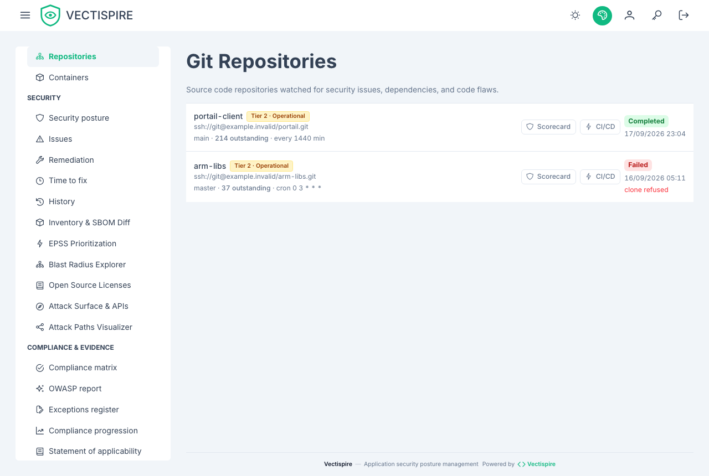

# Repositories

A repository is a scan target: a clone URL, a branch, optionally a sub-path, and a
recurrence.

## Registering one

**Repositories → add.**

| Field | Notes |
|---|---|
| **Repository URL** | HTTPS for a public repository, SSH where a deploy key is needed. |
| **Display name** | What every other screen calls it. |
| **Branch** | The branch scanned on every run. |
| **Sub-path** | For a monorepo. Register a monorepo **once per project**, not once for the whole tree — otherwise one SBOM conflates several applications' dependencies and no verdict means anything. |
| **Business criticality tier** | Tier 1 · Mission Critical, Tier 2 · Operational, Tier 3 · Internal. |
| **Required agent** | Pins the scan to one agent. Leave empty unless the repository is only routable from a particular network segment. |

## Credentials

Private repositories authenticate with a deploy key registered under
[SSH keys](../administration/ssh-keys.md). Give it **read-only** access at your provider —
Vectispire only ever clones.

The private half is encrypted at rest with your `ENCRYPTION_KEY`. Storing a key is refused
outright until that variable is set.

## Recurrence

Set either a **scan interval** or a **cron expression**. The expression wins when both are
present.

Prefer cron. An interval drifts a few minutes on every run, so a scan configured for 03:00
migrates into the working day over a few weeks — and a scan that competes with the working
day is the scan somebody eventually turns off.

Recurrence is the point of the product rather than a convenience: new vulnerabilities are
published against code that has not changed, so a repository scanned once is a repository
whose posture is known as of a date in the past.

## Business criticality tiers

Three tiers, and they exist so that ranking can account for what a target *is* rather than
only for what was found in it:

- **Tier 1 · Mission Critical**
- **Tier 2 · Operational**
- **Tier 3 · Internal**

The same critical CVE is a different problem in a payment path than in an internal
scratch tool. Without a tier, the backlog says they are the same.

## The README badge

Each repository can expose a dynamic badge for its own README, showing the security
posture grade. It puts the number in front of the people who commit, which is where it
changes behaviour.

## How the scorecard grade is computed

The grade on a repository's **scorecard** and on its badge is the same number. It is computed
when asked for, from the repository's backlog as it stands — nothing is stored.

**What counts.** Open issues of that repository only. Resolved issues are left out, and so are
issues triaged **not affected** or **fixed** — the two decisions that already stop an issue
failing the gate. An issue whose dismissal is **awaiting approval** still counts: a request is
not a decision. A triage status Vectispire does not recognise counts too, rather than being
read as settled.

**The score** starts at 100:

| Element | Points | Per |
|---|---|---|
| Actively exploited vulnerability (CISA KEV) | −25 | issue |
| Critical, reachable | −15 | issue |
| Critical, not reachable or reachability unknown | −8 | issue |
| High | −4 | issue |
| Licence not allowed by the licence policy | −5 | component |
| At least one completed scan | +5 | once |

Penalties add up: a reachable, actively exploited critical costs 40. Medium and low severities
cost nothing. The result is held between 0 and 100.

**The grade:**

| Score | Grade |
|---|---|
| 95 and above | A+ |
| 85 – 94 | A |
| 70 – 84 | B |
| 55 – 69 | C |
| 40 – 54 | D |
| below 40 | F |

For example, a scanned repository with one reachable critical, one unreachable critical, one
high, one actively exploited medium and one disallowed licence scores
100 − 15 − 8 − 4 − 25 − 5 + 5 = **48, grade D**.

**What does not move the grade.** Issues past their remediation deadline are counted on the
scorecard and produce a recommendation, but cost no points: deadlines are a setting of each
deployment (see [Remediation times](remediation-delays.md#where-the-deadlines-come-from)), and a badge must not
change grade because somebody edited a window.

**The recommendations** list, when they apply: disallowed licences, no completed scan yet —
an in-toto attestation is issued from a completed scan, so there is none before —, actively
exploited vulnerabilities, criticals, highs, and overdue issues.

The penalties have no ceiling, so the scale saturates at the bottom: five reachable, exploited
criticals already make an F, and five hundred make the same F. Read the counts on the
scorecard, not only the letter.

This grade is **not** the one in the dashboard's maturity ranking, which uses another rule —
see [Dashboard](dashboard.md#security-posture-grade).

## Deleting a repository

Removing a repository removes its scans and its issue history with it. Where you need the
record kept, export the
[detection and triage history](history.md) first — that document is written to be read
after the fact by somebody who was not there.
