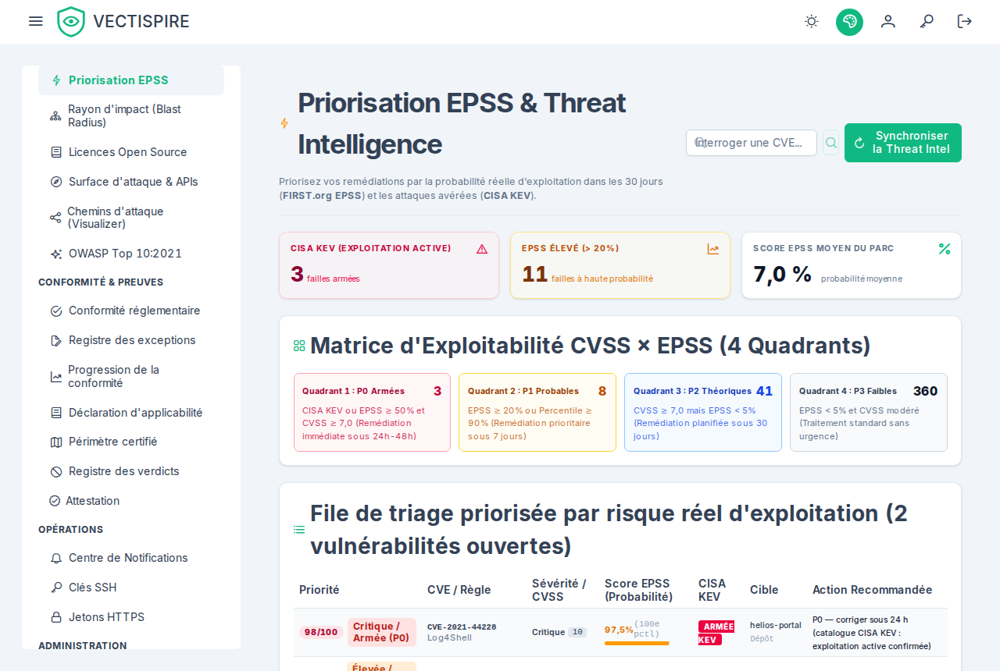
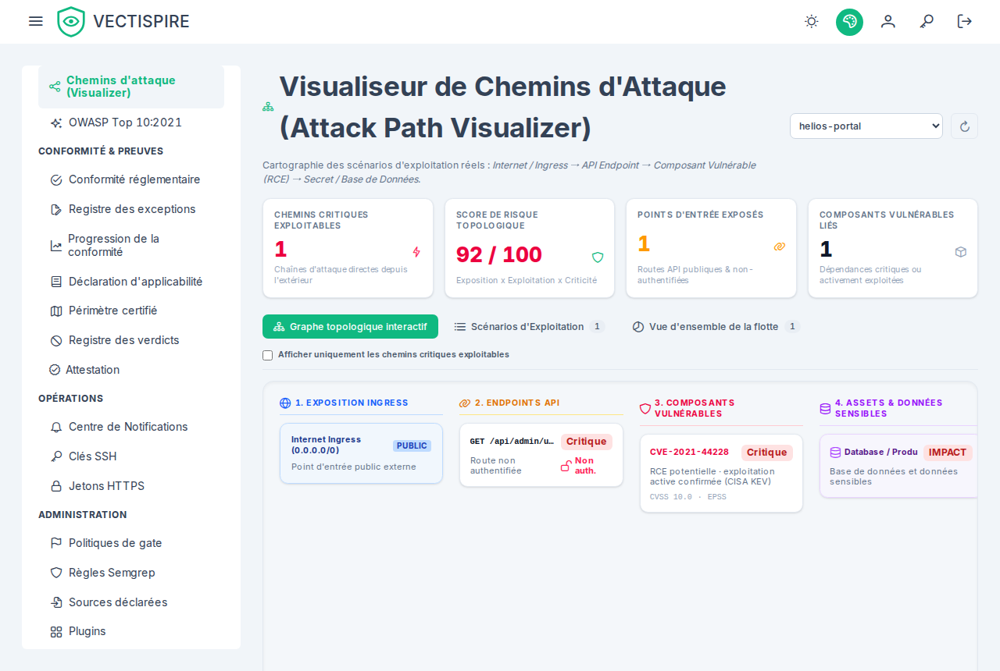

# Analyse de risque

Quatre vues qui répondent à « qu'est-ce que cela met réellement en risque », chacune sous un
angle différent.

## EPSS

La page **EPSS** classe le parc par probabilité d'exploitation plutôt que par CVSS. Chaque
vulnérabilité porte son score, et l'écart entre les deux nombres est tout le propos : le CVSS
dit à quel point ce serait grave, l'EPSS dit à quel point quelqu'un est susceptible d'essayer.

Le statut **KEV** de la CISA se tient à côté — non pas une prédiction, mais un constat que
l'exploitation a été observée. Une entrée KEV passe devant un EPSS élevé, qui passe devant un
CVSS élevé.

Le statut KEV vient du catalogue de la CISA tel que le plan de contrôle l'a lu en dernier : toutes
les six heures, ou quand un responsable sécurité clique **Synchroniser** dans l'onglet **Threat
Intelligence** des paramètres. Cet onglet indique quand il a été lu, la date de publication CISA du
catalogue en usage, et pourquoi la dernière tentative a échoué le cas échéant — un échec conserve le
catalogue en usage au lieu de le vider. Un constat ouvert est marqué quand sa CVE est listée, et ne
l'est plus quand le catalogue cesse de la lister ; un constat nouvellement marqué est envoyé au SIEM
sous `VECTI-SEC-002`. Avant la première synchronisation rien n'est marqué, et l'onglet indique
*jamais synchronisé* plutôt qu'un zéro rassurant.

Les scores EPSS viennent du fichier quotidien du FIRST tel que le plan de contrôle l'a lu en dernier :
une fois par jour, et avec le catalogue quand un responsable clique **Synchroniser**. Le même onglet
indique quel modèle a produit les scores en usage et le jour dont ils relèvent, et pourquoi la
dernière tentative a échoué le cas échéant. Un fichier n'est pris qu'entier : tronqué, plus ancien
que celui en usage, ou avec un dixième de CVE en moins, il est refusé et les scores en usage sont
conservés. Une fois un fichier appliqué, les scores des constats ouverts en sont rafraîchis — c'est
ce que lisent le classement, la barrière et les scorecards. Aucun scan n'interroge le FIRST : les
CVE que portent vos dépôts ne sont jamais envoyées à un tiers. Avant la première synchronisation
aucune CVE n'a de score, et le classement n'en montre aucun plutôt qu'un zéro mesuré.

Le classement porte sur les vulnérabilités ouvertes dont le triage n'est pas réglé : une
vulnérabilité triée **non affecté** ou **corrigé** en sort, comme elle sort de la barrière et du
scorecard. Une exclusion encore en attente d'approbation reste classée — une demande n'est pas une
décision.

Le classement pèse le CVSS, l'EPSS et le KEV, et rien d'autre : les quatre quadrants de la matrice
sont exactement les seuils que leurs légendes énoncent. Il n'y a ni terme, ni carte, ni colonne
d'atteignabilité — Vectispire n'exécute aucune analyse de graphe d'appels, il ne peut donc pas dire
si le code vulnérable est appelé.

## Chemins d'attaque

La visionneuse de chemins d'attaque enchaîne les constats en itinéraires plutôt que de les
énumérer un à un : un composant exposé, une vulnérabilité qui l'atteint, un identifiant commité
à côté. Un itinéraire fait de trois constats moyens peut compter davantage que n'importe quel
constat élevé sur la même cible, et aucune liste triée par gravité ne le montrera jamais.

Un constat trié **non affecté** ou **corrigé** n'est pas une étape d'un itinéraire : l'écran affirme
que quelque chose est atteignable, et l'équipe a déjà soutenu que ce ne l'était pas.

## Rayon d'impact

Le rayon d'impact travaille depuis un composant vers l'extérieur : si ce paquet est compromis,
qu'atteint-il ? Les graphes de dépendances multi-niveaux sont cartographiés sur chaque dépôt et
chaque image enregistrés, si bien que la réponse couvre le parc plutôt qu'un projet.

Lisez-le avec le [niveau de criticité métier](repositories.md#business-criticality-tiers). Un
large rayon d'impact qui ne touche que des outils internes de niveau 3, ce n'est pas le même
lundi qu'un rayon qui touche un chemin de paiement de niveau 1.

## Surface d'attaque et OWASP

La **surface d'attaque** rassemble ce qui est joignable depuis l'extérieur — les points
d'entrée qu'un constat doit franchir pour compter.

**OWASP** regroupe le backlog par catégories OWASP, qui sont le vocabulaire que la plupart des
revues de sécurité et la plupart des auditeurs parlent déjà. C'est une reformulation des mêmes
constats, pas un scan séparé.

### Le Top 10, semaine par semaine

*Rapport OWASP* → *Par semaine* montre les mêmes dix catégories sur 12, 26 ou 52 semaines — ou un
intervalle choisi — pour tout le parc ou un projet ou une solution. Chaque colonne est une semaine ISO,
du lundi au dimanche en UTC ; un en-tête de colonne sélectionne la semaine, dont les chiffres et la grille
s'affichent sous la carte de chaleur.

- **Une semaine relevée** est une semaine que le relevé hebdomadaire a capturée : sa case prend la couleur
  de la grille (constats, plus foncé quand il y en a plus ; rien trouvé ; non mesurée ; aucun scanner ici),
  et ses ouverts laissent de côté le triage réglé. **Les risques acceptés sont montrés à part**, en gris et
  entre parenthèses — jamais ajoutés aux ouverts.
- **Une semaine reconstituée**, antérieure au relevé, est **hachurée**, et les courbes passent en pointillé
  sur elle. Elle se lit dans les dates des issues : elle n'a pas d'état, et ses ouverts incluent les issues
  que le triage avait réglées, car le triage à une date passée n'est pas connu. C'est pourquoi aucune
  évolution des ouverts n'est affichée sur la semaine où le relevé commence — l'écart serait celui de la
  définition.
- **Chaque nombre ouvre le backlog qu'il compte**, dans le même périmètre : des ouverts listent les issues
  de la catégorie ouvertes à la fin du dimanche de la semaine (et non réglées, sur une semaine relevée —
  le triage tel qu'il est aujourd'hui) ; des apparues ou résolues listent les issues vues pour la première
  fois ou résolues de son lundi à son dimanche ; des rouvertes listent les issues revenues pendant cette
  semaine. Le backlog dit ce qu'on lui a demandé dans un bandeau, avec le chemin du retour et de quoi le
  retirer.
- **Un total ouvre les issues rangées dans l'une des dix catégories** — jamais tout le backlog, dont les
  constats de licence et de qualité ne sont dans aucune catégorie et rendraient la liste plus longue que
  la barre. Une exception : sur une semaine relevée où une catégorie n'était pas mesurée, le total des
  ouverts n'ouvre rien, puisque la grille n'y comptait rien et que la liste en tiendrait les issues.
- **Rouvertes** compte les issues qu'une analyse ou un import a retrouvées après leur résolution — ce qui
  fait monter les ouverts d'une semaine sans barre d'apparues correspondante. Elles sont dessinées en
  violet, empilées sur les apparues. Les réouvertures ne sont consignées que depuis la mise à jour qui les
  a introduites : **une semaine commencée avant affiche un tiret, pas un zéro**, et une note sous la vue
  dit à partir de quelle semaine le chiffre existe.

*Exporter en CSV* donne une ligne par semaine et catégorie, avec l'indication « reconstituée » ;
*Imprimer / PDF* imprime la vue sans les menus, par le « enregistrer en PDF » du navigateur. L'adresse
porte la fenêtre, le périmètre et la semaine sélectionnée : un lien reproduit la vue.

## Bien s'en servir

Aucune de ces vues ne produit de nouveaux constats. Elles reclassent ceux que vous avez selon
une question à laquelle la gravité ne répond pas. Servez-vous-en quand le backlog est trop long
pour être traité dans l'ordre — ce qui, sur un parc réel, est toujours le cas.
