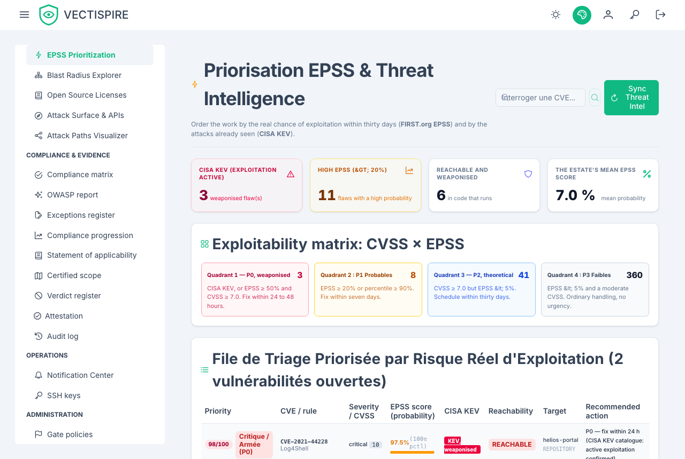
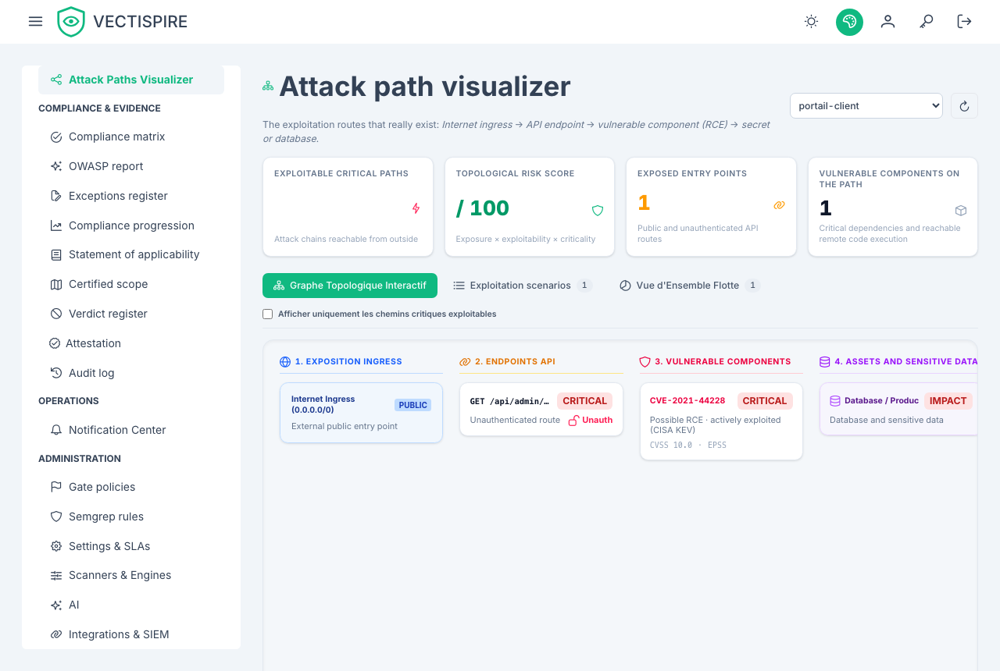

# Risk analysis

Four views that answer "what does this actually put at risk", each from a different angle.

## EPSS

The **EPSS** page ranks the estate by exploitation probability rather than by CVSS. Every
vulnerability carries its score, and the difference between the two numbers is the whole
point: CVSS says how bad it would be, EPSS says how likely anyone is to try.

CISA **KEV** status sits alongside it — not a prediction but a record that exploitation has
been observed. A KEV entry outranks a high EPSS, which outranks a high CVSS.

The ranking covers open vulnerabilities whose triage is not settled: one triaged **not affected**
or **fixed** leaves it, as it leaves the gate and the scorecard. A dismissal still awaiting
approval stays ranked — a request is not a decision.

## Attack paths

The attack path visualiser chains findings into routes rather than listing them
individually: an exposed component, a vulnerability that reaches it, a credential that was
committed near it. A route made of three medium findings can matter more than any one high
finding on the same target, and no severity-sorted list will ever show it.

A finding triaged **not affected** or **fixed** is no hop on a route: the screen's claim is that
something can be reached, and the team has already argued it cannot.

## Blast radius

Blast radius works from a component outwards: if this package is compromised, what does it
reach? Multi-tier dependency graphs are mapped across every registered repository and
image, so the answer covers the estate rather than one project.

Read it together with the [business criticality tier](repositories.md#business-criticality-tiers).
A wide blast radius that touches only Tier 3 internal tools is a different Monday than one
that touches a Tier 1 payment path.

## Attack surface and OWASP

**Attack surface** collects what is reachable from outside — the entry points a finding has
to traverse to matter.

**OWASP** groups the backlog by the OWASP categories, which is the vocabulary most
security reviews and most auditors already speak. It is a reframing of the same findings,
not a separate scan.

## Using these well

None of these views produce new findings. They re-rank the ones you have according to a
question severity cannot answer. Use them when the backlog is too long to work through in
order — which, on a real estate, is always.
