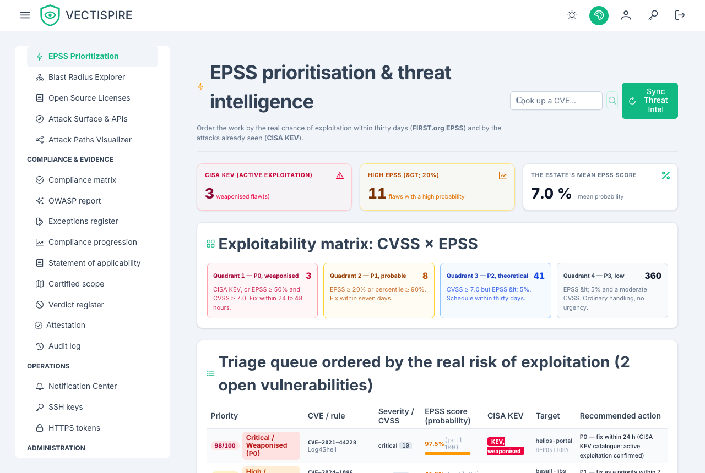
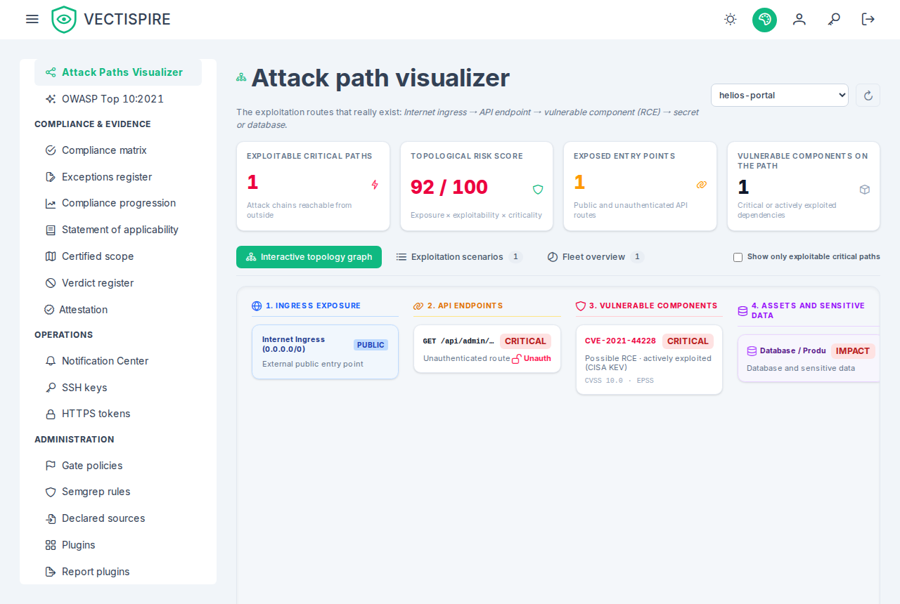

# Risk analysis

Four views that answer "what does this actually put at risk", each from a different angle.

## EPSS

The **EPSS** page ranks the estate by exploitation probability rather than by CVSS. Every
vulnerability carries its score, and the difference between the two numbers is the whole
point: CVSS says how bad it would be, EPSS says how likely anyone is to try.

CISA **KEV** status sits alongside it — not a prediction but a record that exploitation has
been observed. A KEV entry outranks a high EPSS, which outranks a high CVSS.

The KEV status comes from CISA's catalogue as the control plane last read it: every six hours, or
when a security lead presses **Synchronize** on the **Threat Intelligence** settings tab. That tab
says when it was last read, CISA's release date of the catalogue in use, and why the last attempt
failed if it did — a failure keeps the catalogue in use rather than emptying it. An open issue is
flagged when its CVE is listed and un-flagged when the catalogue stops listing it; a newly flagged
one is sent to the SIEM as `VECTI-SEC-002`. Before the first synchronisation nothing is flagged, and
the tab says *never synchronized* rather than a reassuring zero.

The EPSS scores come from FIRST's daily file as the control plane last read it: once a day, and
with the catalogue when a lead presses **Synchronize**. The same tab says which model produced the
scores in use and the day they are for, and why the last attempt failed if it did. A file is taken
only whole: one cut short, older than the one in use, or with a tenth fewer CVE is refused and the
scores in use are kept. Once a file is applied, the open issues' scores are refreshed from it —
which is what the ranking, the gate and the scorecards read. No scan asks FIRST anything, so which
CVE your repositories carry is never sent to a third party. Before the first synchronisation no CVE
has a score, and the ranking shows none rather than a measured zero.

The ranking covers open vulnerabilities whose triage is not settled: one triaged **not affected**, **will not fix** or **fixed** leaves it, as it leaves the gate and the scorecard. A dismissal still awaiting
approval stays ranked — a request is not a decision.

The ranking weighs CVSS, EPSS and KEV, and nothing else: the four quadrants of the matrix are
exactly the thresholds their captions state. There is no reachability term, card or column —
Vectispire runs no call-graph analysis, so it cannot say whether the vulnerable code is called.

## Attack paths

The attack path view puts side by side, for one repository, the routes it exposes (public, or
requiring no authentication, from the API inventory) and its open critical, high or KEV-listed
vulnerabilities and secrets. **It is a co-location heuristic, not a reachability analysis**: every
exposed route is linked to every such vulnerability of the same repository, the *Internet* node at
the start and the *database* node at the end are drawn for every repository, and a vulnerability is
marked exploitable when the repository has any unauthenticated route. Nothing establishes that the
route calls the vulnerable code, that the application is reachable from the Internet, or that it has
a database at all.

Use it to see which repositories carry an open door and a critical flaw at the same time, then
confirm a path by hand. A finding triaged **not affected**, **will not fix** or **fixed** is left out. The details are
in the [attack path reference](https://github.com/asmolabs/vectispire/blob/main/docs/en/ATTACK_PATH_VISUALIZER.md).

## Blast radius

Blast radius works from a component outwards: if this package is compromised, what does it
reach? Multi-tier dependency graphs are mapped across every registered repository and
image, so the answer covers the estate rather than one project.

Read it together with the [business criticality tier](repositories.md#business-criticality-tiers).
A wide blast radius that touches only Tier 3 internal tools is a different Monday than one
that touches a Tier 1 payment path.

## Attack surface and OWASP

**Attack surface** collects what is reachable from outside — the entry points a finding has
to traverse to matter.

**OWASP** groups the backlog by the categories of the **OWASP Top 10:2021** — the edition the
mapping is written for; no other edition is supported — which is the vocabulary most security
reviews and most auditors already speak. It is a reframing of the same findings,
not a separate scan.

The current grid reads the whole estate you see, or **one solution or one project**, chosen above it —
the same picker as *By week*, kept in the address so a link shows the same view. Every figure is then
that scope's: a project never scanned reads *unmeasured* even where its neighbours are covered. A scope
you see only in part says so, and counts what you see. A count of open findings opens the backlog of
that category in the same scope, settled triage left out as the grid leaves it out.

### The OWASP Top 10:2021, week by week

*OWASP Top 10:2021* → *By week* shows the same ten categories over 12, 26 or 52 weeks — or a range you
choose — for the whole estate or one project or solution. Each column is an ISO week, Monday to
Sunday in UTC; a column header selects the week, whose figures and grid appear below the heatmap.

- **A recorded week** is one the weekly record captured: its square has the grid's colour (findings,
  darker for more; nothing found; not measured; no scanner here), and its open count leaves settled
  triage out. **Accepted risks are shown apart**, in grey and in brackets — never added into open.
- **A reconstructed week**, before the record started, is **hatched**, and the curves are dashed over
  it. It is read from the issues' dates: there is no state for it, and its open count includes the
  issues triage had settled, because the triage of a past date is not known. That is why no change is
  shown for open across the week the record starts — the difference would be the definition changing.
- **Every count opens the backlog it counts**, in the same scope: an open count lists the issues of that
  category open at the end of the week's Sunday (and not settled, on a recorded week — triage as it
  stands today); an opened or resolved figure lists the issues first seen or resolved from its Monday to
  its Sunday; a reopened figure lists the issues brought back in that week. The backlog says what it was
  asked in a banner, with the way back and a way to clear it.
- **A total opens the issues placed in any of the ten categories** — never the whole backlog, whose
  licence and quality findings are in no category and would make the list longer than the bar. One
  exception: on a recorded week where a category was not measured, the total open count opens nothing,
  since the grid counted nothing in that category and the list would hold its issues.
- **Reopened** counts the issues a scan or an import found again after they were resolved — what makes
  open rise in a week with no opened bar to match. It is drawn in purple, stacked on the opened bar.
  Reopenings have been recorded only since the upgrade that introduced them: **a week that began
  before shows a dash, not a zero**, and a note under the view says from which week the figure exists.

*Export CSV* gives one row per week and category, with whether the week was reconstructed; *Print /
PDF* prints the view without the menus, through the browser's own "save as PDF". The address carries
the window, the scope and the selected week, so a link reproduces the view.

### The OWASP report written by a model

*Security* → *OWASP Top 10:2021*, a repository picked, **Run the analysis** asks the configured model ([Settings](../administration/settings.md#ai-review))
for one repository's posture report against the Top 10:2021, from its latest scan. **The model is sent the
repository's open findings, never its source**: type, category, severity, identifier, component, location,
triage and description, three hundred at most, the rest stated as left out — and the repository's OWASP
grid. The report records the model, the scan it was built from and what it was sent; it is prose a model
wrote, not evidence, and nothing it says becomes an issue or reaches a gate.

- **The categories are Vectispire's, not the model's.** Each finding goes with the category the grid
  above places it in — infrastructure checks in A05, vulnerable dependencies and components past their
  support in A06, committed secrets in A07, a static analysis finding where its rule declares — and the
  model is told to group the findings under it and never move one. The findings the grid places nowhere
  are listed apart, under *Not placed by the scanners*, rather than given a category. A report written
  before this was introduced had the model choose, and could disagree with the grid — secrets under A02,
  for instance; its PDF says the model placed them.
- **An empty category says why it is empty.** The model is given each category's state in the grid —
  findings, nothing found, not measured, no scanner here — and the *Not evidenced* section repeats it.
  None of the three empty states is a clean bill of health: a scanner that found nothing looked only at
  the part of the category it can see.
- **After each scan, if you ask for it.** With **Write the OWASP report after each repository scan**
  (`ai_review_owasp_after_scan`, off by default) and model review on, a repository scan that completes
  asks for the report — built from that scan, never from a failed one, never for a container image. It is
  written beside the scans and never holds one up, **one at a time**: a local model answers one request
  at a time, so no report starts while another is being written, on any instance of the control plane or
  from the button. A repository whose report is being written is not asked again, and several scans of
  one repository waiting for the model become one report, from the newest. A report that failed says
  why on the page, as one asked by hand does, and the scan stays completed. The audit log records each
  one as `AI_REVIEW_REQUESTED`, with no user — nobody asked. A request waiting on an instance that stops
  is lost; the next scan asks again.

Whoever reads the report reads it through their own visibility: the route refuses a repository you do
not see, and the counts and links beside the report are counted as your backlog counts them.

## Using these well

None of these views produce new findings. They re-rank the ones you have according to a
question severity cannot answer. Use them when the backlog is too long to work through in
order — which, on a real estate, is always.
