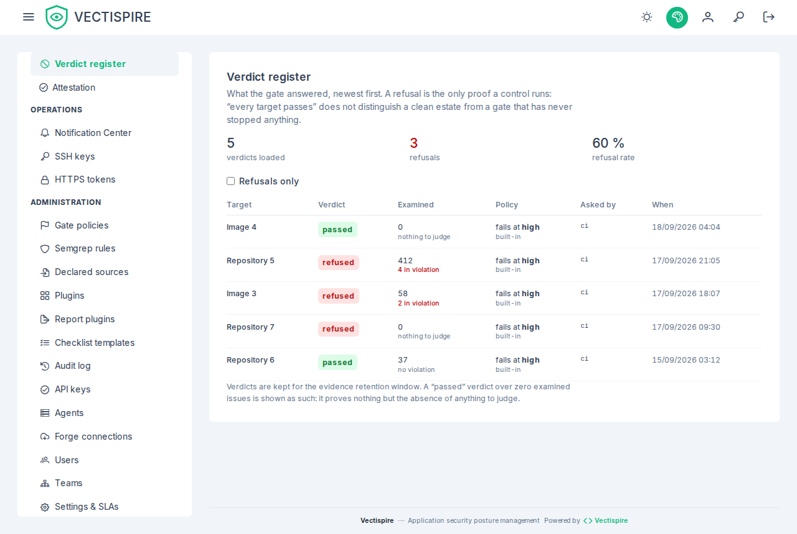

# CI policy gate

The gate answers one question from your pipeline: **should this build fail?**

## The short version

```bash
curl -fsSLO https://github.com/asmolabs/vectispire/releases/download/<tag>/vectispire-gate.sh
curl -fsSLO https://github.com/asmolabs/vectispire/releases/download/<tag>/vectispire-gate.sh.cosign.bundle
cosign verify-blob \
  --bundle vectispire-gate.sh.cosign.bundle \
  --certificate-identity "https://github.com/asmolabs/vectispire/.github/workflows/release.yml@refs/tags/<tag>" \
  --certificate-oidc-issuer https://token.actions.githubusercontent.com \
  vectispire-gate.sh
sh vectispire-gate.sh --repository <repository-id>
```

Downloaded, verified, then run — never piped into `sh`, where the bytes execute as they arrive and
nothing can be checked first. Where `cosign` is not installed, compare the file's SHA-256 with the
`VECTISPIRE_GATE_SHA256` of the GitLab template at the same tag, which is what the template itself
does. The script is a release asset from 0.10.0 on.

Or use the shipped integrations rather than writing the request by hand:

- [`ci/vectispire-gate.sh`](https://github.com/asmolabs/vectispire/blob/main/ci/vectispire-gate.sh) — a shell script for any runner;
- [`ci/github-action/action.yml`](https://github.com/asmolabs/vectispire/blob/main/ci/github-action/action.yml) — a GitHub composite action;
- [`ci/gitlab/vectispire-gate.gitlab-ci.yml`](https://github.com/asmolabs/vectispire/blob/main/ci/gitlab/vectispire-gate.gitlab-ci.yml) — a GitLab template, included from your project: it fetches the release's gate script, runs it only at the digest it pins, and fails the pipeline on a red verdict ([wired here](ci-examples.md#gitlab-ci)).

All three need `VECTISPIRE_URL` and `VECTISPIRE_TOKEN` in the job environment. The token is an
[API key](../administration/api-keys.md) with the `scan` scope — asking for a verdict counts as
scanning — preferably restricted to the one target the pipeline gates.

[CI examples](ci-examples.md) wires it end to end in GitLab CI and Jenkins — scan, wait, gate — and
imports SonarQube's results through a declared source.

## The verdict names its policy

The response says which policy it applied. That matters when a build fails and the author
wants to know what bar they were held to — "the global policy, version 4" is an answer;
"failed" is not.



## Policies are stored, not sent

**A `policy` object in the request can only *tighten* what applies, never loosen it.**

This was not always so. The rules used to arrive in the request body, which meant each
project decided its own bar, which meant the gate measured nothing comparable across the
estate. Now the applied policy is a **stored, versioned** one — global, or overridden per
target — written on **Administration → Gate policies**. A request can be stricter than it.
It cannot be laxer.

Where nothing is stored, the built-in default applies. The screen shows that default beside
what is stored, so that "not set" and "set to the same thing" do not look alike.

[Configuring policies →](../administration/gate-policies.md)

## What a policy can consider

| | |
|---|---|
| **Threshold** | the severity at which the build fails |
| **Fixable only** | ignore what has no published fix — you cannot ask a team to fix what upstream has not fixed |
| **Actively exploited** | treat KEV entries differently from the rest |
| **Triaged findings** | whether a triaged issue still counts |
| **License violations** | fail on a blocked license |
| **Model review** | whether an AI review verdict participates |
| **Plugins** (`include_plugins`) | whether findings from [plugins and SARIF imports](../administration/plugins.md) participate — off by default |

## Quality never fails a build

Semgrep quality findings cannot fail a gate, by construction rather than by configuration.
See [Code quality](../guide/quality.md) for why that boundary is load-bearing.

## A target nobody examined never passes

**A target whose scans never ran to their end fails the gate, whatever the policy says**: never
scanned, its only scans still pending or running, or the newest scan that finished failed. Its backlog
is empty or stale, and an empty backlog would pass every rule that reads one. The answer is an HTTP
200 like any other refusal — `passed: false`, and a violation of rule `observation` with no issue
behind it and a `reason` that says which case it is — so the script exits 1, the verdict joins the
register and the refusal is signalled to the SIEM.

No policy flag switches it off, and a request cannot: `include_triaged`, `fixable_only` and the
threshold choose which findings count, and this rule counts none. A scan still running changes
nothing either way — the verdict rests on the newest scan that *finished*, so a scheduled re-scan does
not turn a passing target red while it runs.

## Where to put the gate

After the scan and before the deploy. Two failure modes to avoid:

**Gating on a stale scan.** A verdict about last week's commit tells you nothing about this
one. Trigger the scan in the pipeline, then gate on it.

**Gating before the scan finished.** A target whose first scan has not completed fails with an
`observation` violation, and so does one whose last scan failed — a red build, not a green one. Wait
for the scan the pipeline triggered, then gate. See
[Reading the results](../getting-started/reading-results.md#two-states-with-an-empty-backlog).

## Annotating the pull request too

A gate is binary and arrives at the end. Export [SARIF](../guide/exports.md#sarif-210)
alongside it so the findings land on the diff, where they get fixed rather than triaged.
