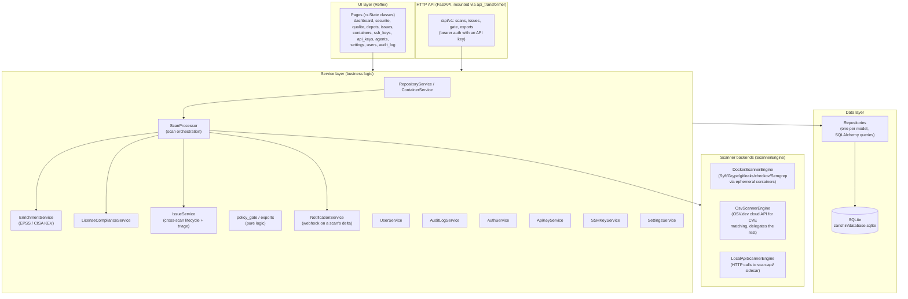
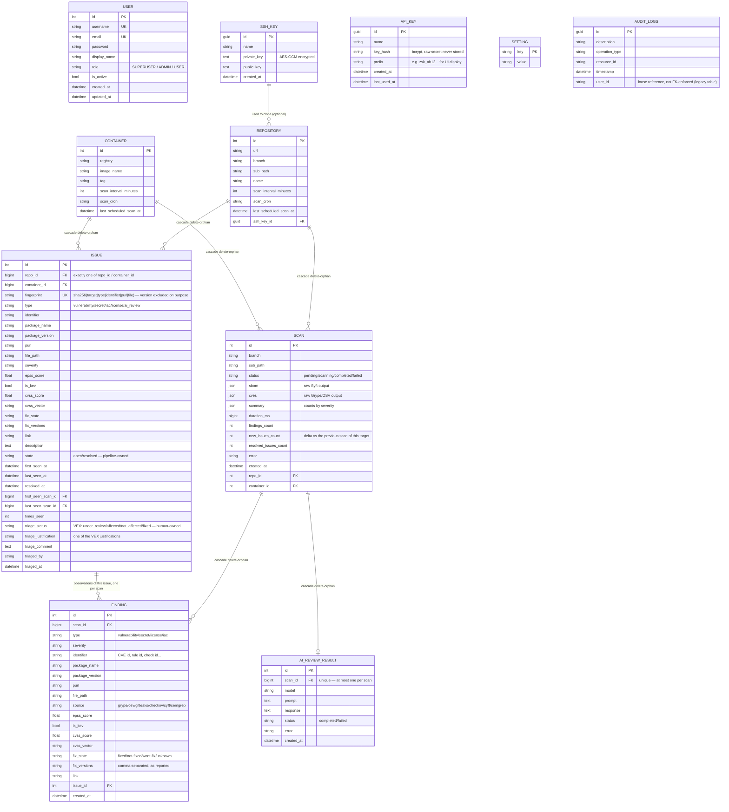
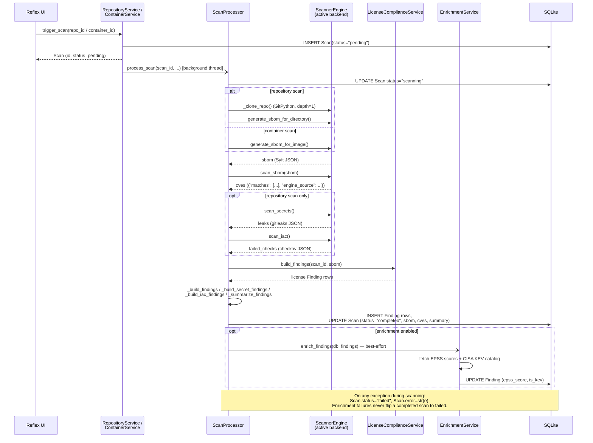
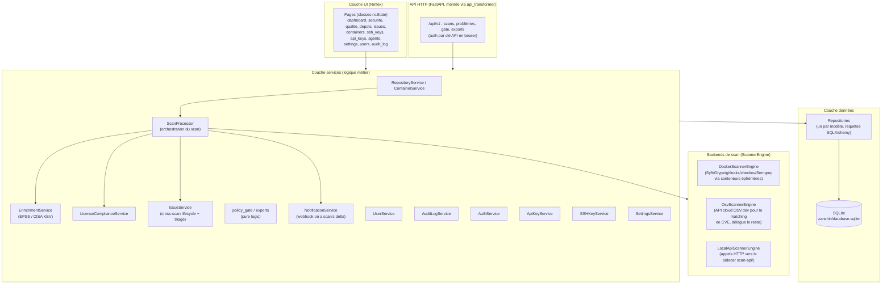
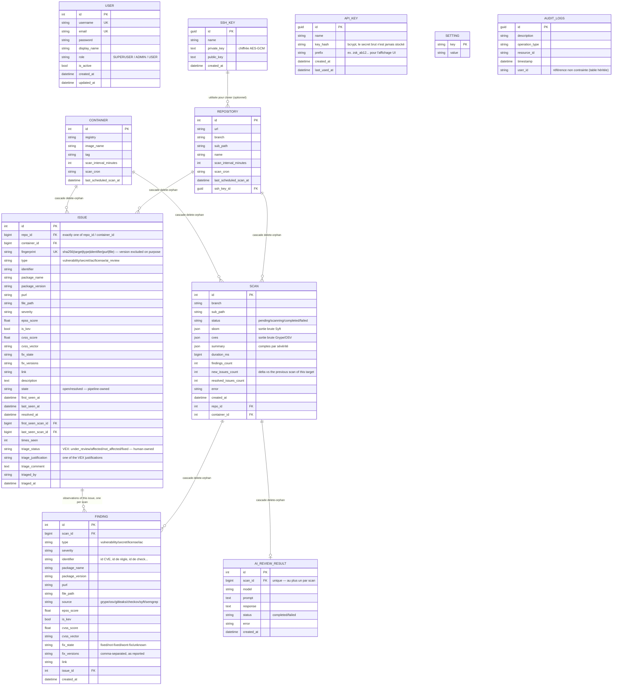
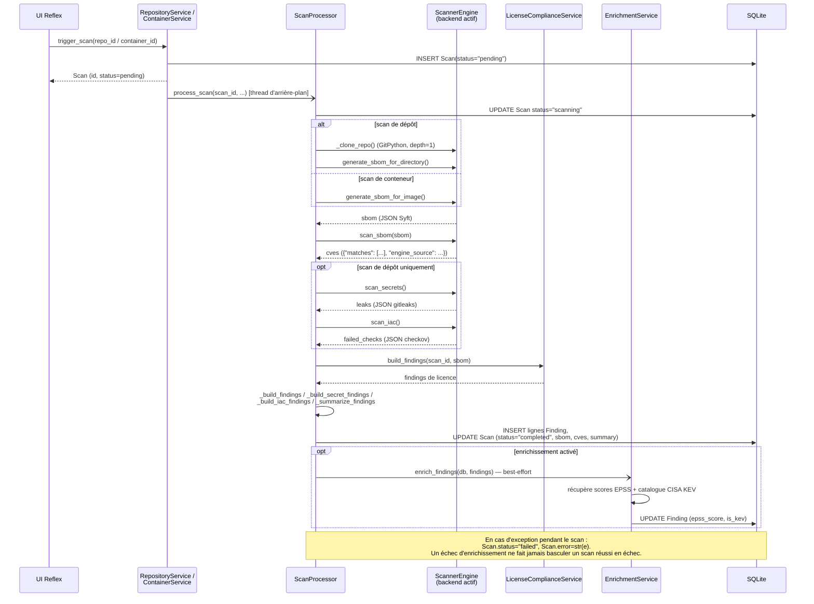

# Zanshin — Technical Documentation

**[English](#english)** | **[Français](#français)**

---

## English

This document describes Zanshin's internal architecture, database schema, and the scan pipeline's runtime flow. For features and quick start, see [`README.md`](../README.md). For the design rationale behind the pluggable scanner backends, see [`docs/architecture/`](architecture/).

### 1. Layered architecture

Zanshin follows a classic layered architecture with manual dependency injection — there is no framework-level DI container; `IoCContainer` (`zanshin/container.py`) wires every repository and service by hand, instantiated fresh per request via `get_container()`.



Each `IoCContainer` instance builds its `scanner_engine` via `get_scanner_engine(settings_service)` (`zanshin/services/scanners/factory.py`), which reads the `scan_backend` setting (`docker` / `osv` / `local_api`) and returns the matching implementation — `ScanProcessor` itself never knows which one is active.

### 2. Database schema

SQLite, with the schema managed by **Alembic** (`migrations/`). `zanshin/schema.py` brings the database to the latest revision at startup, adopting a database that predates Alembic by stamping the baseline revision instead of replaying it. Column changes are ordinary migrations now (`render_as_batch=True`, since SQLite cannot `ALTER` in place) — the constraint that pushed several earlier features into new tables rather than new columns is gone.



Notes:

- A `Scan` belongs to **either** a `Repository` **or** a `Container` (`repo_id`/`container_id` are both nullable; exactly one is set). `is_container = scan.container_id is not None` is how the code branches scan behavior.
- `Finding` is the normalized, queryable projection of a scan's results (used by the UI, VEX triage, and enrichment). The raw `Scan.sbom`/`Scan.cves` JSON blobs are kept alongside it, unmodified, for audit purposes.
- `Issue` is the cross-scan layer above `Finding`: a finding is an observation valid for one scan, an issue is the problem itself, followed over time. It is what makes triage possible — a decision recorded against a finding would be orphaned by the next scan. Two axes are kept strictly separate: `state` is written only by the pipeline (what the scanners observe), `triage_status` only by a human (what was decided). See [`backend/src/services/issue-sync.service.ts`](../backend/src/services/issue-sync.service.ts).
- `VexDecision`, `Finding.status` and `Finding.vex_decision_id` were dropped in migration 0003 once `Issue` superseded them: the table was never written to in any deployment, and the column was written once as "open" and never read again. Two models for one concept is a trap for the next reader.
- `AuditLog` maps onto `audit_logs`, a table inherited from an earlier implementation of this application. Its schema was matched exactly (via `PRAGMA table_info` against the live database) rather than redesigned, since it predates Alembic and carries live data. `user_id` is a plain string column, not an enforced foreign key.
- `AiReviewResult` holds the optional AI code review's raw narrative output (see §4bis) — a separate table rather than a `Finding` column, since it's free-form text, not a normalized/queryable finding, and adding a `Text` column to the existing `Finding` table would need a manual migration.
- `GUID` (`zanshin/models/guid.py`) is a custom SQLAlchemy type storing UUIDs as 16-byte binary values in SQLite (`SSHKey`, `ApiKey`, `AuditLog` all use it as their primary key type).

### 3. Scan pipeline (sequence)

Triggered from the UI, a scan runs in a background thread (`concurrent.futures.ThreadPoolExecutor`, shared module-level `executor` in `repository_service.py`) so the request thread returns immediately with a `pending` `Scan` row.



Key points not obvious from the diagram alone:

- Secrets, IaC and source-code (Semgrep) scanning only run for **repository** scans, never for container images (see docs/architecture/ §5) — Syft's license data, on the other hand, applies to both.
- **`None` is not `[]` in `ScanArtifacts`.** `iac` and `sast` are `Optional`: an empty list is the positive claim *"the analysis ran and found nothing"*, which is what allows `IssueService` to resolve a target's outstanding issues of that type. `None` means the step did not run — disabled, unsupported by the backend, or crashed — and the backlog is then left untouched. Reading a crashed scanner as a clean one would declare a repository fixed, so every scanner that can fail returns `None`, and `scanned_types_for(..., iac_ran=…, sast_ran=…)` is what carries that through to resolution.
- **Semgrep produces two finding types from one run.** `SastService` reads each rule's `metadata.category`: `security` becomes a `sast` finding, gated like any vulnerability; everything else becomes a `quality` finding, which `policy_gate.QUALITY_TYPES` excludes from every verdict with no opt-in. Since both come from the same pass, they enter `scanned_types` together. The rules are Zanshin's own (`zanshin/services/scanners/rules/semgrep/`), copied into each scan's workspace beside `SOURCE_SUBDIR` — a rule tree inside Zanshin's own image would be invisible to the sibling Semgrep container, because volume paths are resolved by the Docker daemon.
- `cves["engine_source"]` (not `"source"` — Grype's own JSON already uses that key for something unrelated) records which backend actually produced the vulnerability matches, so `_build_findings` can set `Finding.source` correctly regardless of which `ScannerEngine` ran.
- `ScannerEngine.get_workspace_root()` returns `None` for every backend except `LocalApiScannerEngine`, which needs its temp directory created inside the volume shared with the `scan-api` sidecar rather than the OS default temp location.

### 3quater. The visual layer

The interface follows the [Sakai](https://sakai.primeng.org) admin template, and the
values in `assets/theme.css` are measured from it rather than approximated: a 28px
gutter used for every gap, a 56px top bar, a 280px sidebar that **floats as a card**
below it instead of being flush to the window, 6px corners, 28px card padding — and no
borders and no shadows anywhere. Surfaces are told apart by background alone; that last
point carries most of the look and is the easiest thing to lose, since every component
library draws a line by default.

Two details are worth knowing before editing that file, because both fail *silently*:

- The page colour must be set through `--color-background` **on `.radix-themes`**, not on
  `body`. Radix paints its own background over the viewport, so a `body` rule is simply
  covered — and the symptom is white cards on a white page, i.e. no visible cards at all.
- `--zs-surface` is declared on `.radix-themes` and not on `:root`, because Radix puts its
  colour *scales* on `:root` but its semantic tokens (`--color-panel-solid`) on
  `.radix-themes`. A custom property is substituted where it is declared, so the same
  declaration on `:root` resolves to nothing and inherits down as transparent.

Everything is expressed against Radix's `--slate-*` scale, so the header's light/dark
toggle switches between two versions of one design rather than one design and an
afterthought. Cards across the application share the `zs-card` class instead of repeating
a utility string, which is what lets a change to the language reach every screen at once.

### 3ter. The Sécurité and Qualité sections

The navigation carries two named sections. **Sécurité** groups its overview with
Problèmes, Dépôts & Scans and Conteneurs; **Qualité** has one page. The routes are
unchanged — `/depots` and `/containers` keep their addresses, because renaming them for a
visual grouping would break every bookmark.

`/securite` (`security_overview.py` + `ui/pages/securite.py`) finally displays something
that has been computed since gate policies existed and shown nowhere: the verdict of
`POST /api/v1/gate`, per target. It obtains it by calling `policy_gate.evaluate` with the
same resolved policy the endpoint uses — not by a second implementation in SQL, which
would agree today and diverge the first time `GatePolicy` grows a flag. A test asserts
the two agree across six issue configurations.

Two costs are avoided deliberately, and both would otherwise scale with the number of
targets: `GatePolicyService.resolve` issues one or two queries per call, and loading a
target's issues issues another. Everything is read once — policies, open issues in the
few columns a verdict needs (`IssueRepository.find_open_for_gate`), latest scan per
target — and matched in memory. A test counts the SQL statements at 3 and at 30 targets
and requires the same number.

The page also names what no other screen does: a target **never scanned**, or whose
**last scan failed**, has an empty backlog, and an empty backlog satisfies every policy.
Those two states are counted in the header and badged next to the verdict rather than
being allowed to read as "clean".

`/qualite` ranks the `quality` backlog by rule, by file and by repository — axes the
issue list cannot offer, and the only useful framing in front of a four-figure backlog.
It states explicitly that none of those findings can fail a build, because a screen full
of counts otherwise reads as if they could.

### 3bis. Who executes a scan: the built-in agent and remote agents

The sequence above is one process doing everything. Since docs/architecture/04, *where* the scanners
run is a separate question from *what happens to their output*, because `ScanProcessor`
was split in two:

| Object | Job | Needs a database? |
|---|---|---|
| `ScanRunner` (`scan_runner.py`) | workspace, clone, Syft/Grype/gitleaks/checkov/Semgrep, AI-review sample | **no** |
| `ScanIngestor` (`scan_ingestor.py`) | `Finding` rows, licences, EOL, EPSS/KEV, AI review, issue reconciliation, outbox | yes, only |

`ScanProcessor` is now the composition of the two, and it keeps its old signature — which
is why the queue, the scheduler and the existing tests did not change. The two halves
exchange `ScanTask` / `ScanArtifacts` (`zanshin/scan_contract.py`), a module that imports
nothing from Zanshin: that is what lets those objects travel over HTTP to a machine with
no database.

Every scan is claimed by an **agent**, which is a row in the `agent` table. The web
process is one of them (`kind=builtin`, registered at startup, one per host); a
worker speaking the agent protocol is another (`kind=remote`).

```mermaid
sequenceDiagram
    participant Q as scan_queue
    participant BI as Built-in agent<br/>(this process)
    participant API as /api/v1/agents
    participant RA as Remote agent<br/>(agent protocol)
    participant ING as ScanIngestor
    participant DB as Database

    Note over Q,DB: A scan is a row. Whoever claims it writes its own id into claimed_by<br/>and takes a lease (LEASE_SECONDS).

    Q->>DB: claim_next(worker=builtin) — if the built-in agent is enabled
    BI->>BI: ScanRunner.run(task) — renews the lease on each step
    BI->>ING: ingest(artifacts) — only if still_owned()

    RA->>API: POST /hello (identity, contract version)
    RA->>API: GET /jobs?wait=30 (long-poll)
    API->>DB: claim_next(worker=remote-agent-id)
    API-->>RA: ScanTask (no deploy key unless credentials_mode=delegated)
    RA->>RA: ScanRunner.run(task) — the same code as the built-in agent
    RA->>API: POST /jobs/{id}/heartbeat (renews the lease)
    RA->>API: POST /jobs/{id}/result (message_id, artifacts — sliced if large)
    API->>DB: INSERT processed_message + ingest, one transaction
    API->>ING: ingest(artifacts)

    Note over API,DB: A replayed report is answered "duplicate" and changes nothing.<br/>A lapsed lease makes the scan claimable again; the late worker's result is refused.
```

Consequences worth knowing:

- **Disabling the built-in agent** (Agents page) is how an operator says "run nothing on
  this host". Queued scans then wait — visibly, with their position — for a remote agent.
  Its executor count is the existing `scan_max_concurrent` setting, not a second number.
- **The concurrency limit is per agent.** Counting every running scan would have meant
  that adding an agent *reduced* what the host was allowed to do.
- **A remote agent never touches the database**, and gets a deploy key only if its
  `credentials_mode` is `delegated` *and* the transport is TLS. An import test enforces
  the first half (`tests/test_agent_worker.py`); the API enforces the second.
- **More than one web instance is now possible**, and conditional: PostgreSQL (the claim
  uses `FOR UPDATE SKIP LOCKED`, which SQLite does not have), `REDIS_URL`
  (Reflex's own state, and the security counters), and `ZANSHIN_AUTO_MIGRATE=false`. The
  periodic work — scheduled scans, retention, the outbox relay — is taken under a lease
  so exactly one instance does it; claiming scans is not, so every instance keeps
  working. Start it wrong and the application refuses or warns, naming the reason
  (docs/architecture/04).


### 4. Scanner backends

| Backend | SBOM / secrets / IaC | Vulnerability matching | Notes |
|---|---|---|---|
| `docker` (default) | Ephemeral containers: `anchore/syft`, `zricethezav/gitleaks`, `bridgecrew/checkov`, `semgrep/semgrep` | `anchore/grype` (ephemeral container) | Requires Docker socket access from the Zanshin process. |
| `osv` | Delegated to a `DockerScannerEngine` instance via composition | OSV.dev `/v1/query`, one package (purl) at a time | Only package identifiers leave the machine, never code or the full SBOM. Response translated into Grype's own shape so the rest of the pipeline is backend-agnostic. |
| `local_api` | HTTP calls to the `scan-api/` FastAPI sidecar, which runs the same tools as direct subprocesses | Same sidecar | Sidecar must share a filesystem volume with Zanshin (same host); paths are passed, never file uploads. See `scan-api/README.md`. |

All three implement the same `ScannerEngine` abstract base (`zanshin/services/scanners/base.py`): `generate_sbom_for_image`, `generate_sbom_for_directory`, `scan_sbom`, `scan_secrets`, `scan_iac`, plus the concrete `get_workspace_root()`.

### 4bis. Optional: AI code review (Ollama)

`AiReviewService` (`zanshin/services/ai_review_service.py`) is a separate, disabled-by-default addition — not a `ScannerEngine` implementation. It sends source code to a locally-run [Ollama](https://ollama.com) model with a "security architect" system prompt (`review_code()`), as a lightweight complement to the structured scanners above rather than a SAST replacement.

The model choice is deliberately not hardcoded: `list_available_models()` reads live from Ollama's own `GET /api/tags`, so whatever the operator has actually pulled is what becomes selectable from the Settings page — a short fallback list (`gemma4:12b-it-qat`, `gemma4:e4b-it-qat`) is only shown as a suggestion when Ollama can't be reached, never presented as installed. `gemma4:12b-it-qat` (official Ollama library, Q4_0/4-bit, ~7.2GB, ~9-10GB RAM/VRAM) is the documented default; `gemma4:e4b-it-qat` (~6.1GB) trades review quality for a lighter footprint on constrained hosts. Settings: `ai_review_enabled`, `ai_review_model`, `ai_review_ollama_url` (default `http://localhost:11434`), `ai_review_deployment_mode` (`local`/`docker`, default `local`).

Ollama itself can be run natively or in Docker (a ready-made `docker-compose.ollama.yml` is provided at the repo root) — both talk to Zanshin over the same HTTP API, so `ai_review_deployment_mode` is purely informational (drives the Settings-page warning text, doesn't change how `AiReviewService` connects). Native is recommended on Apple Silicon Macs: Docker Desktop has no GPU/Metal passthrough there, so a containerized Ollama runs CPU-only and is noticeably slower than the native app. See [`GETTING_STARTED.md`](GETTING_STARTED.md) §7 for both setups.

**Pipeline integration:** when `ai_review_enabled` is set, `ScanProcessor` calls `AiReviewService` for **repository scans only** (same reasoning as secrets/IaC — no source code for a container image scan). `ScanProcessor._collect_ai_review_sample()` builds the code sample sent to the model: a sorted, extension-filtered concatenation of source files (skipping `.git`/`node_modules`/`.venv`/`__pycache__`/`dist`/`build`), capped at `AI_REVIEW_MAX_CHARS` (40,000 characters, no chunking/RAG — large repositories are silently truncated). The result is persisted as one `AiReviewResult` row per scan (§2), and is best-effort like enrichment: a failure (Ollama unreachable, model error) is recorded on that row (`status="failed"`, `error=...`) but never turns the scan itself into a failure.

**Normalized findings:** the system prompt now asks the model to respond with a strict JSON array (`severity`/`title`/`file_path`/`description`/`recommendation` per item). `AiReviewService.parse_findings()` turns that text into structured data defensively — tolerates a markdown code fence, skips malformed items, normalizes severity to the same vocabulary used by Grype/OSV/gitleaks/checkov (`critical`/`high`/`medium`/`low`/`negligible`/`unknown`), and never raises (a response that doesn't parse just yields an empty list). `ScanProcessor._run_ai_review` then creates one `Finding(type="ai_review")` row per parsed item (severity, title, file path, `source="ollama:<model>"`), alongside the `AiReviewResult` row, which keeps the full narrative (reformatted from the parsed items when parsing succeeds, raw text otherwise). The scan detail dialog (`depots.py`) shows both the narrative and a table of normalized findings (severity/title/file), only when a result exists for that scan.

### 5. Service / repository reference

| Service | Responsibility |
|---|---|
| `ScanProcessor` | Orchestrates a full scan (see §3); the only consumer of `ScannerEngine`. |
| `RepositoryService` / `ContainerService` | CRUD for tracked repos/images; `trigger_scan()` creates the `Scan` row and dispatches `ScanProcessor.process_scan` to the background executor. |
| `EnrichmentService` | Populates `epss_score`/`is_kev` on vulnerability findings after a scan. Caches the KEV catalog at the **class** level (survives `IoCContainer` being rebuilt per request); never turns a completed scan into a failure. |
| `LicenseComplianceService` | Evaluates a configurable license blocklist against SBOM data already collected by Syft (no separate scanner tool). |
| `AiReviewService` | Optional, disabled-by-default LLM code review via Ollama (see §4bis). Called from `ScanProcessor` for repository scans; never turns a completed scan into a failure. |
| `UserService` | User CRUD with guardrails: can't delete your own account, can't demote/deactivate/delete the last active `SUPERUSER`. |
| `ApiKeyService` | Issues API keys: bcrypt hash stored, raw secret returned once at creation and never persisted. |
| `AuditLogService` | Records sensitive admin actions (`AuditOperation` constants: logins, user/API-key/setting changes); `record()` never raises — a logging failure must not break the action being audited. |
| `AuthService` | Password hashing/verification, user authentication. |
| `SSHKeyService` | Stores SSH private keys encrypted at rest (`EncryptionService`, AES-GCM) for cloning private repositories. |
| `SettingsService` | Thin key/value accessor over the `setting` table (backend choice, feature toggles, license blocklist). |

Each service depends only on the repositories it needs (constructor injection), and repositories are thin wrappers around SQLAlchemy queries scoped to one model — there is no generic base repository, each one exposes the specific queries its service actually needs (e.g. `FindingRepository.count_by_scan_ids_and_type`, `AuditLogRepository.find_recent`).

### 6. Testing approach

The unit suite runs without a database. The integration suites start a real PostgreSQL through testcontainers, apply every migration, and roll each test back in its own transaction — so the schema under test is the one production will receive, and the cases cannot see each other. They **do not skip** when Docker is missing: a run that verifies nothing must fail loudly, which is the defect this harness itself once had. See `README.md` for how to run it.

---

## Français

Ce document décrit l'architecture interne de Zanshin, le schéma de base de données, et le déroulement du pipeline de scan. Pour les fonctionnalités et le démarrage rapide, voir [`README.md`](../README.md). Pour le raisonnement derrière les backends de scan pluggables, voir [`docs/architecture/`](architecture/).

### 1. Architecture en couches

Zanshin suit une architecture en couches classique avec injection de dépendances manuelle — il n'y a pas de conteneur DI de framework ; `IoCContainer` (`zanshin/container.py`) câble à la main chaque repository et service, instancié à neuf par requête via `get_container()`.



Chaque instance d'`IoCContainer` construit son `scanner_engine` via `get_scanner_engine(settings_service)` (`zanshin/services/scanners/factory.py`), qui lit le réglage `scan_backend` (`docker` / `osv` / `local_api`) et retourne l'implémentation correspondante — `ScanProcessor` lui-même ne sait jamais laquelle est active.

### 2. Schéma de base de données

SQLite, schéma géré par **Alembic** (`migrations/`). `zanshin/schema.py` met la base à la dernière révision au démarrage, en adoptant une base antérieure à Alembic (estampille de la révision de référence plutôt que rejeu). Les changements de colonne sont désormais des migrations ordinaires (`render_as_batch=True`, SQLite ne sachant pas `ALTER` en place) — la contrainte qui a poussé plusieurs fonctionnalités antérieures vers de nouvelles tables plutôt que de nouvelles colonnes a disparu.



Remarques :

- Un `Scan` appartient soit à un `Repository`, soit à un `Container` (`repo_id`/`container_id` sont tous deux nullable ; un seul des deux est renseigné). `is_container = scan.container_id is not None` détermine le branchement du comportement de scan.
- `Finding` est la projection normalisée et requêtable des résultats d'un scan (utilisée par l'UI, le triage VEX et l'enrichissement). Les blobs JSON bruts `Scan.sbom`/`Scan.cves` sont conservés à côté, inchangés, à des fins d'audit.
- `Issue` est la couche inter-scans au-dessus de `Finding` : un finding est une observation valable pour un scan, un issue est le problème lui-même, suivi dans le temps. C'est ce qui rend le triage possible — une décision enregistrée sur un finding serait orpheline au scan suivant. Deux axes strictement séparés : `state` n'est écrit que par le pipeline (ce que les scanners observent), `triage_status` que par un humain (ce qui a été décidé). Voir [`backend/src/services/issue-sync.service.ts`](../backend/src/services/issue-sync.service.ts).
- `VexDecision`, `Finding.status` et `Finding.vex_decision_id` ont été supprimées par la migration 0003 dès lors que `Issue` les supersédait : la table n'a jamais été écrite dans aucun déploiement, et la colonne était écrite une fois à « open » puis jamais relue. Deux modèles pour un seul concept, c'est un piège pour le prochain lecteur.
- `AuditLog` correspond à `audit_logs`, une table héritée d'une implémentation précédente de cette application. Son schéma a été repris à l'identique (via `PRAGMA table_info` sur la base réelle) plutôt que redessiné, la table étant antérieure à Alembic et porteuse de données réelles. `user_id` est une simple colonne texte, pas une clé étrangère contrainte.
- `AiReviewResult` contient la sortie narrative brute de la revue de code par IA optionnelle (voir §4bis) — une table séparée plutôt qu'une colonne sur `Finding`, puisqu'il s'agit de texte libre, pas d'un finding normalisé/requêtable, et qu'ajouter une colonne `Text` à la table `finding` existante nécessiterait une migration manuelle.
- `GUID` (`zanshin/models/guid.py`) est un type SQLAlchemy personnalisé qui stocke les UUID sous forme de valeurs binaires 16 octets dans SQLite (`SSHKey`, `ApiKey`, `AuditLog` l'utilisent tous comme type de clé primaire).

### 3. Pipeline de scan (séquence)

Déclenché depuis l'UI, un scan s'exécute dans un thread d'arrière-plan (`concurrent.futures.ThreadPoolExecutor`, `executor` partagé au niveau module dans `repository_service.py`), afin que le thread de la requête retourne immédiatement avec une ligne `Scan` au statut `pending`.



Points importants non visibles sur le seul diagramme :

- Le scan de secrets, d'IaC et du code source (Semgrep) ne s'exécute que pour les scans de **dépôts**, jamais pour les images de conteneurs (voir docs/architecture/ §5) — les données de licence de Syft, elles, s'appliquent aux deux.
- **`None` n'est pas `[]` dans `ScanArtifacts`.** `iac` et `sast` sont `Optional` : une liste vide affirme que *l'analyse a tourné et n'a rien trouvé*, ce qui autorise `IssueService` à résoudre les problèmes existants de ce type. `None` signifie que l'étape n'a pas eu lieu — désactivée, non supportée par le backend, ou plantée — et le backlog est alors laissé intact. Lire un scanner planté comme un scanner propre reviendrait à déclarer un dépôt corrigé : tout scanner susceptible d'échouer renvoie donc `None`, et `scanned_types_for(..., iac_ran=…, sast_ran=…)` porte cette distinction jusqu'à la résolution.
- **Semgrep produit deux types de constats en un seul passage.** `SastService` lit le `metadata.category` de chaque règle : `security` donne un constat `sast`, traité comme toute vulnérabilité ; tout le reste donne un constat `quality`, que `policy_gate.QUALITY_TYPES` exclut de tout verdict, sans option pour le réactiver. Les deux venant du même passage, ils entrent ensemble dans `scanned_types`. Les règles sont celles de Zanshin (`zanshin/services/scanners/rules/semgrep/`), recopiées dans l'espace de travail de chaque scan à côté de `SOURCE_SUBDIR` — un répertoire de règles vivant dans l'image de Zanshin serait invisible du conteneur Semgrep voisin, les chemins de volume étant résolus par le démon Docker.
- `cves["engine_source"]` (pas `"source"` — la sortie JSON native de Grype utilise déjà cette clé pour autre chose) enregistre quel backend a réellement produit le matching de vulnérabilités, afin que `_build_findings` renseigne correctement `Finding.source` quel que soit le `ScannerEngine` utilisé.
- `ScannerEngine.get_workspace_root()` retourne `None` pour tous les backends sauf `LocalApiScannerEngine`, qui a besoin que son répertoire temporaire soit créé dans le volume partagé avec le sidecar `scan-api` plutôt que dans le répertoire temporaire par défaut du système.

### 3bis. Qui exécute un scan : agent intégré et agents distants

La séquence ci-dessus décrit un processus qui fait tout. Depuis les agents distants, *où* les
scanners tournent est une question distincte de *ce qu'il advient de leur sortie*, parce
que `ScanProcessor` a été coupé en deux :

| Objet | Métier | Besoin de la base ? |
|---|---|---|
| `ScanRunner` (`scan_runner.py`) | espace de travail, clone, Syft/Grype/gitleaks/checkov, échantillon pour la revue IA | **non** |
| `ScanIngestor` (`scan_ingestor.py`) | `Finding`, licences, EOL, EPSS/KEV, revue IA, rapprochement des problèmes, outbox | oui, uniquement |

`ScanProcessor` est désormais la composition des deux et garde son ancienne signature —
c'est pourquoi la file, l'ordonnanceur et les tests existants n'ont pas changé. Les deux
moitiés échangent `ScanTask` / `ScanArtifacts` (`zanshin/scan_contract.py`), un module qui
n'importe rien de Zanshin : c'est ce qui permet à ces objets de voyager en HTTP vers une
machine sans base de données.

Tout scan est réclamé par un **agent**, qui est une ligne de la table `agent`. Le
processus web en est un (`kind=builtin`, enregistré au démarrage, un par hôte) ; un
travailleur parlant le protocole d'agent en est un autre (`kind=remote`).

```mermaid
sequenceDiagram
    participant Q as scan_queue
    participant BI as Agent intégré<br/>(ce processus)
    participant API as /api/v1/agents
    participant RA as Agent distant<br/>(protocole d'agent)
    participant ING as ScanIngestor
    participant DB as Base de données

    Note over Q,DB: Un scan est une ligne. Celui qui la réclame écrit son id dans claimed_by<br/>et prend un bail (LEASE_SECONDS).

    Q->>DB: claim_next(worker=intégré) — si l'agent intégré est activé
    BI->>BI: ScanRunner.run(task) — renouvelle le bail à chaque étape
    BI->>ING: ingest(artifacts) — seulement si still_owned()

    RA->>API: POST /hello (identité, version de contrat)
    RA->>API: GET /jobs?wait=30 (long-poll)
    API->>DB: claim_next(worker=id-agent-distant)
    API-->>RA: ScanTask (aucune clé sauf credentials_mode=delegated)
    RA->>RA: ScanRunner.run(task) — le même code que l'agent intégré
    RA->>API: POST /jobs/{id}/heartbeat (renouvelle le bail)
    RA->>API: POST /jobs/{id}/result (message_id, artefacts — fractionnés si volumineux)
    API->>DB: INSERT processed_message + ingestion, une seule transaction
    API->>ING: ingest(artifacts)

    Note over API,DB: Un rapport rejoué reçoit « duplicate » et ne change rien.<br/>Un bail expiré rend le scan réclamable ; le résultat du retardataire est refusé.
```

Conséquences à connaître :

- **Désactiver l'agent intégré** (page Agents) est la façon de dire « n'exécute rien sur
  cet hôte ». Les scans en file attendent alors un agent distant, visiblement, avec leur
  position. Son nombre d'exécuteurs est le réglage existant `scan_max_concurrent`, pas un
  second nombre.
- **La limite de simultanéité est par agent.** Compter tous les scans en cours aurait
  fait qu'ajouter un agent *réduisait* ce que l'hôte s'autorisait.
- **Un agent distant ne touche jamais la base**, et ne reçoit une clé de déploiement que
  si son `credentials_mode` vaut `delegated` **et** que le transport est TLS. Un test
  d'imports garantit la première moitié (`tests/test_agent_worker.py`) ; l'API applique la
  seconde.
- **Plus d'une instance web est désormais possible**, sous conditions : PostgreSQL (la
  réclamation utilise `FOR UPDATE SKIP LOCKED`, absent de SQLite), `REDIS_URL`
  (l'état de Reflex, et les compteurs de sécurité) et `ZANSHIN_AUTO_MIGRATE=false`. Le
  travail périodique — scans planifiés, rétention, relais de l'outbox — est pris sous un
  bail pour qu'une seule instance le fasse ; réclamer des scans ne l'est pas, pour que
  toutes continuent de travailler. Mal démarrée, l'application refuse ou avertit en
  nommant la raison (docs/architecture/04).


### 4. Backends de scan

| Backend | SBOM / secrets / IaC | Matching de vulnérabilités | Remarques |
|---|---|---|---|
| `docker` (défaut) | Conteneurs éphémères : `anchore/syft`, `zricethezav/gitleaks`, `bridgecrew/checkov` | `anchore/grype` (conteneur éphémère) | Nécessite l'accès au socket Docker depuis le processus Zanshin. |
| `osv` | Délégué à une instance `DockerScannerEngine` par composition | OSV.dev `/v1/query`, un paquet (purl) à la fois | Seuls les identifiants de paquets sortent de la machine, jamais le code ni le SBOM complet. La réponse est traduite dans le format de Grype pour que le reste du pipeline reste agnostique au backend. |
| `local_api` | Appels HTTP vers le sidecar FastAPI `scan-api/`, qui exécute les mêmes outils en sous-processus direct | Idem, via le sidecar | Le sidecar doit partager un volume de fichiers avec Zanshin (même hôte) ; des chemins sont transmis, jamais des fichiers uploadés. Voir `scan-api/README.md`. |

Les trois implémentations respectent la même interface abstraite `ScannerEngine` (`zanshin/services/scanners/base.py`) : `generate_sbom_for_image`, `generate_sbom_for_directory`, `scan_sbom`, `scan_secrets`, `scan_iac`, plus la méthode concrète `get_workspace_root()`.

### 4bis. Optionnel : revue de code par IA (Ollama)

`AiReviewService` (`zanshin/services/ai_review_service.py`) est un ajout séparé, désactivé par défaut — pas une implémentation de `ScannerEngine`. Il envoie le code source à un modèle [Ollama](https://ollama.com) exécuté localement avec un prompt système "security architect" (`review_code()`), en complément léger des scanners structurés ci-dessus plutôt qu'en remplacement d'un moteur SAST.

Le choix du modèle n'est volontairement pas figé en dur : `list_available_models()` lit en direct sur l'API `GET /api/tags` d'Ollama, de sorte que tout ce que l'opérateur a réellement téléchargé devient sélectionnable depuis la page Paramètres — une courte liste de repli (`gemma4:12b-it-qat`, `gemma4:e4b-it-qat`) n'est proposée qu'en suggestion quand Ollama est injoignable, jamais présentée comme installée. `gemma4:12b-it-qat` (librairie officielle Ollama, Q4_0/4-bit, ~7,2 Go, ~9-10 Go RAM/VRAM) est le défaut documenté ; `gemma4:e4b-it-qat` (~6,1 Go) échange de la qualité de revue contre une empreinte plus légère sur du matériel contraint. Réglages : `ai_review_enabled`, `ai_review_model`, `ai_review_ollama_url` (défaut `http://localhost:11434`), `ai_review_deployment_mode` (`local`/`docker`, défaut `local`).

Ollama peut tourner nativement ou en Docker (un fichier `docker-compose.ollama.yml` prêt à l'emploi est fourni à la racine du dépôt) — dans les deux cas, la communication avec Zanshin se fait via la même API HTTP, donc `ai_review_deployment_mode` est purement informatif (pilote le texte d'avertissement de la page Réglages, ne change rien à la façon dont `AiReviewService` se connecte). Le mode natif est recommandé sur Mac Apple Silicon : Docker Desktop n'y a pas de passthrough GPU/Metal, un Ollama conteneurisé tourne alors en CPU uniquement et est nettement plus lent que l'application native. Voir [`GETTING_STARTED.md`](GETTING_STARTED.md) §7 pour les deux configurations.

**Intégration au pipeline :** quand `ai_review_enabled` est actif, `ScanProcessor` appelle `AiReviewService` pour les **scans de dépôt uniquement** (même raisonnement que secrets/IaC — pas de code source pour un scan d'image conteneur). `ScanProcessor._collect_ai_review_sample()` construit l'échantillon de code envoyé au modèle : concaténation triée et filtrée par extension des fichiers source (en excluant `.git`/`node_modules`/`.venv`/`__pycache__`/`dist`/`build`), plafonnée à `AI_REVIEW_MAX_CHARS` (40 000 caractères, sans chunking/RAG — les gros dépôts sont silencieusement tronqués). Le résultat est persisté sous forme d'une ligne `AiReviewResult` par scan (§2), en mode best-effort comme l'enrichissement : un échec (Ollama injoignable, erreur du modèle) est enregistré sur cette ligne (`status="failed"`, `error=...`) mais ne fait jamais échouer le scan lui-même.

**Findings normalisés :** le prompt système demande désormais au modèle de répondre avec un tableau JSON strict (`severity`/`title`/`file_path`/`description`/`recommendation` par élément). `AiReviewService.parse_findings()` transforme ce texte en données structurées de façon défensive — tolère un bloc de code markdown, ignore les éléments mal formés, normalise la sévérité vers le même vocabulaire que Grype/OSV/gitleaks/checkov (`critical`/`high`/`medium`/`low`/`negligible`/`unknown`), et ne lève jamais d'exception (une réponse qui ne parse pas donne simplement une liste vide). `ScanProcessor._run_ai_review` crée ensuite une ligne `Finding(type="ai_review")` par élément parsé (sévérité, titre, chemin de fichier, `source="ollama:<modèle>"`), en plus de la ligne `AiReviewResult` qui garde la narration complète (reformatée à partir des éléments parsés quand le parsing réussit, texte brut sinon). La fenêtre de détail d'un scan (`depots.py`) affiche à la fois la narration et un tableau de findings normalisés (sévérité/titre/fichier), uniquement quand un résultat existe pour ce scan.

### 5. Référence services / repositories

| Service | Responsabilité |
|---|---|
| `ScanProcessor` | Orchestre un scan complet (voir §3) ; seul consommateur de `ScannerEngine`. |
| `RepositoryService` / `ContainerService` | CRUD des dépôts/images suivis ; `trigger_scan()` crée la ligne `Scan` et envoie `ScanProcessor.process_scan` à l'executor d'arrière-plan. |
| `EnrichmentService` | Renseigne `epss_score`/`is_kev` sur les findings de vulnérabilité après un scan. Cache le catalogue KEV au niveau **classe** (survit à la reconstruction d'`IoCContainer` à chaque requête) ; ne fait jamais basculer un scan réussi en échec. |
| `LicenseComplianceService` | Évalue une liste noire de licences configurable sur les données SBOM déjà collectées par Syft (pas d'outil de scan séparé). |
| `AiReviewService` | Revue de code par LLM via Ollama, optionnelle et désactivée par défaut (voir §4bis). Appelé depuis `ScanProcessor` pour les scans de dépôt ; ne fait jamais basculer un scan réussi en échec. |
| `UserService` | CRUD utilisateurs avec garde-fous : impossible de supprimer son propre compte, de rétrograder/désactiver/supprimer le dernier `SUPERUSER` actif. |
| `ApiKeyService` | Émet des clés API : hash bcrypt stocké, secret brut retourné une seule fois à la création, jamais persisté. |
| `AuditLogService` | Enregistre les actions admin sensibles (constantes `AuditOperation` : connexions, modifications utilisateur/clé API/réglage) ; `record()` ne lève jamais d'exception — un échec de journalisation ne doit pas casser l'action journalisée. |
| `AuthService` | Hachage/vérification de mot de passe, authentification utilisateur. |
| `SSHKeyService` | Stocke les clés SSH privées chiffrées au repos (`EncryptionService`, AES-GCM) pour cloner des dépôts privés. |
| `SettingsService` | Accesseur clé/valeur simple sur la table `setting` (choix du backend, activation de fonctionnalités, liste noire de licences). |

Chaque service ne dépend que des repositories dont il a besoin (injection par constructeur), et les repositories sont de fines enveloppes autour de requêtes SQLAlchemy propres à un modèle — il n'y a pas de repository générique de base, chacun expose les requêtes spécifiques dont son service a réellement besoin (ex. `FindingRepository.count_by_scan_ids_and_type`, `AuditLogRepository.find_recent`).

### 6. Approche de test

La suite unitaire tourne sans base. Les suites d'intégration démarrent un vrai PostgreSQL par testcontainers, appliquent toutes les migrations, et annulent chaque test dans sa propre transaction — le schéma testé est donc celui que la production recevra, et les cas ne se voient pas entre eux. Elles **ne se sautent pas** quand Docker manque : une campagne qui ne vérifie rien doit échouer bruyamment, défaut que ce harnais a lui-même porté. Voir `README.md` pour l'exécuter.
