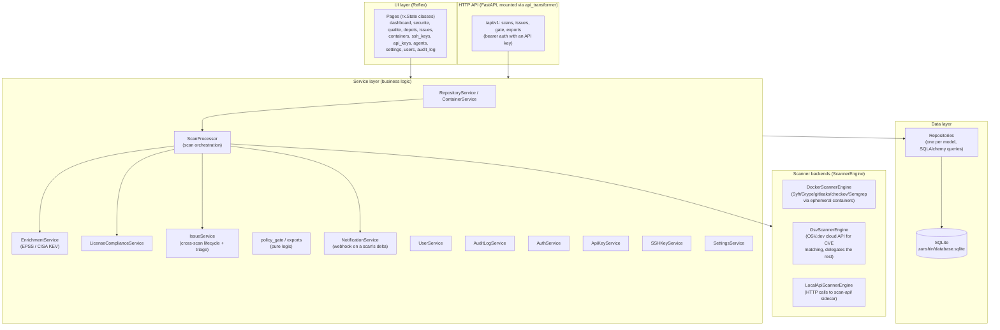
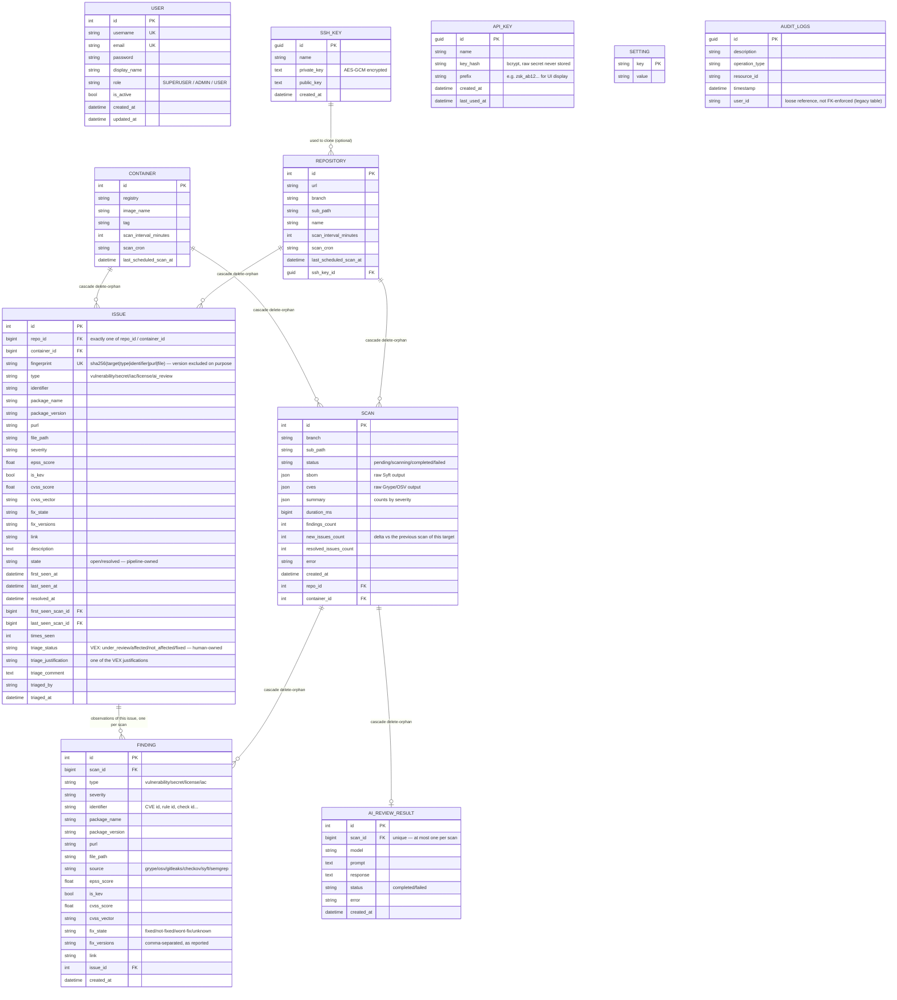
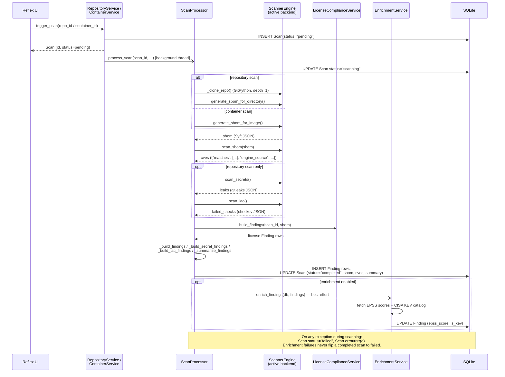

# Zanshin — Technical Documentation

This document describes Zanshin's internal architecture, database schema, and the scan pipeline's runtime flow. For features and quick start, see [`README.md`](../README.md). For the design rationale behind the pluggable scanner backends, see [`docs/architecture/`](architecture/).

## 1. Layered architecture

Zanshin follows a classic layered architecture with manual dependency injection — there is no framework-level DI container; `IoCContainer` (`zanshin/container.py`) wires every repository and service by hand, instantiated fresh per request via `get_container()`.



Each `IoCContainer` instance builds its `scanner_engine` via `get_scanner_engine(settings_service)` (`zanshin/services/scanners/factory.py`), which reads the `scan_backend` setting (`docker` / `osv` / `local_api`) and returns the matching implementation — `ScanProcessor` itself never knows which one is active.

## 2. Database schema

SQLite, with the schema managed by **Alembic** (`migrations/`). `zanshin/schema.py` brings the database to the latest revision at startup, adopting a database that predates Alembic by stamping the baseline revision instead of replaying it. Column changes are ordinary migrations now (`render_as_batch=True`, since SQLite cannot `ALTER` in place) — the constraint that pushed several earlier features into new tables rather than new columns is gone.



Notes:

- A `Scan` belongs to **either** a `Repository` **or** a `Container` (`repo_id`/`container_id` are both nullable; exactly one is set). `is_container = scan.container_id is not None` is how the code branches scan behavior.
- `Finding` is the normalized, queryable projection of a scan's results (used by the UI, VEX triage, and enrichment). The raw `Scan.sbom`/`Scan.cves` JSON blobs are kept alongside it, unmodified, for audit purposes.
- `Issue` is the cross-scan layer above `Finding`: a finding is an observation valid for one scan, an issue is the problem itself, followed over time. It is what makes triage possible — a decision recorded against a finding would be orphaned by the next scan. Two axes are kept strictly separate: `state` is written only by the pipeline (what the scanners observe), `triage_status` only by a human (what was decided). See [`backend/src/services/issue-sync.service.ts`](../backend/src/services/issue-sync.service.ts).
- `VexDecision`, `Finding.status` and `Finding.vex_decision_id` were dropped in migration 0003 once `Issue` superseded them: the table was never written to in any deployment, and the column was written once as "open" and never read again. Two models for one concept is a trap for the next reader.
- `AuditLog` maps onto `audit_logs`, a table inherited from an earlier implementation of this application. Its schema was matched exactly (via `PRAGMA table_info` against the live database) rather than redesigned, since it predates Alembic and carries live data. `user_id` is a plain string column, not an enforced foreign key.
- `AiReviewResult` holds the optional AI code review's raw narrative output (see §4bis) — a separate table rather than a `Finding` column, since it's free-form text, not a normalized/queryable finding, and adding a `Text` column to the existing `Finding` table would need a manual migration.
- `GUID` (`zanshin/models/guid.py`) is a custom SQLAlchemy type storing UUIDs as 16-byte binary values in SQLite (`SSHKey`, `ApiKey`, `AuditLog` all use it as their primary key type).

## 3. Scan pipeline (sequence)

Triggered from the UI, a scan runs in a background thread (`concurrent.futures.ThreadPoolExecutor`, shared module-level `executor` in `repository_service.py`) so the request thread returns immediately with a `pending` `Scan` row.



Key points not obvious from the diagram alone:

- Secrets, IaC and source-code (Semgrep) scanning only run for **repository** scans, never for container images (see docs/architecture/ §5) — Syft's license data, on the other hand, applies to both.
- **`None` is not `[]` in `ScanArtifacts`.** `iac` and `sast` are `Optional`: an empty list is the positive claim *"the analysis ran and found nothing"*, which is what allows `IssueService` to resolve a target's outstanding issues of that type. `None` means the step did not run — disabled, unsupported by the backend, or crashed — and the backlog is then left untouched. Reading a crashed scanner as a clean one would declare a repository fixed, so every scanner that can fail returns `None`, and `scanned_types_for(..., iac_ran=…, sast_ran=…)` is what carries that through to resolution.
- **Semgrep produces two finding types from one run.** `SastService` reads each rule's `metadata.category`: `security` becomes a `sast` finding, gated like any vulnerability; everything else becomes a `quality` finding, which `policy_gate.QUALITY_TYPES` excludes from every verdict with no opt-in. Since both come from the same pass, they enter `scanned_types` together. The rules are Zanshin's own (`zanshin/services/scanners/rules/semgrep/`), copied into each scan's workspace beside `SOURCE_SUBDIR` — a rule tree inside Zanshin's own image would be invisible to the sibling Semgrep container, because volume paths are resolved by the Docker daemon.
- `cves["engine_source"]` (not `"source"` — Grype's own JSON already uses that key for something unrelated) records which backend actually produced the vulnerability matches, so `_build_findings` can set `Finding.source` correctly regardless of which `ScannerEngine` ran.
- `ScannerEngine.get_workspace_root()` returns `None` for every backend except `LocalApiScannerEngine`, which needs its temp directory created inside the volume shared with the `scan-api` sidecar rather than the OS default temp location.

## 3quater. The visual layer

The interface follows the [Sakai](https://sakai.primeng.org) admin template, and the
values in `assets/theme.css` are measured from it rather than approximated: a 28px
gutter used for every gap, a 56px top bar, a 280px sidebar that **floats as a card**
below it instead of being flush to the window, 6px corners, 28px card padding — and no
borders and no shadows anywhere. Surfaces are told apart by background alone; that last
point carries most of the look and is the easiest thing to lose, since every component
library draws a line by default.

Two details are worth knowing before editing that file, because both fail *silently*:

- The page colour must be set through `--color-background` **on `.radix-themes`**, not on
  `body`. Radix paints its own background over the viewport, so a `body` rule is simply
  covered — and the symptom is white cards on a white page, i.e. no visible cards at all.
- `--zs-surface` is declared on `.radix-themes` and not on `:root`, because Radix puts its
  colour *scales* on `:root` but its semantic tokens (`--color-panel-solid`) on
  `.radix-themes`. A custom property is substituted where it is declared, so the same
  declaration on `:root` resolves to nothing and inherits down as transparent.

Everything is expressed against Radix's `--slate-*` scale, so the header's light/dark
toggle switches between two versions of one design rather than one design and an
afterthought. Cards across the application share the `zs-card` class instead of repeating
a utility string, which is what lets a change to the language reach every screen at once.

## 3ter. The Sécurité and Qualité sections

The navigation carries two named sections. **Sécurité** groups its overview with
Problèmes, Dépôts & Scans and Conteneurs; **Qualité** has one page. The routes are
unchanged — `/depots` and `/containers` keep their addresses, because renaming them for a
visual grouping would break every bookmark.

`/securite` (`security_overview.py` + `ui/pages/securite.py`) finally displays something
that has been computed since gate policies existed and shown nowhere: the verdict of
`POST /api/v1/gate`, per target. It obtains it by calling `policy_gate.evaluate` with the
same resolved policy the endpoint uses — not by a second implementation in SQL, which
would agree today and diverge the first time `GatePolicy` grows a flag. A test asserts
the two agree across six issue configurations.

Two costs are avoided deliberately, and both would otherwise scale with the number of
targets: `GatePolicyService.resolve` issues one or two queries per call, and loading a
target's issues issues another. Everything is read once — policies, open issues in the
few columns a verdict needs (`IssueRepository.find_open_for_gate`), latest scan per
target — and matched in memory. A test counts the SQL statements at 3 and at 30 targets
and requires the same number.

The page also names what no other screen does: a target **never scanned**, or whose
**last scan failed**, has an empty backlog, and an empty backlog satisfies every policy.
Those two states are counted in the header and badged next to the verdict rather than
being allowed to read as "clean".

`/qualite` ranks the `quality` backlog by rule, by file and by repository — axes the
issue list cannot offer, and the only useful framing in front of a four-figure backlog.
It states explicitly that none of those findings can fail a build, because a screen full
of counts otherwise reads as if they could.

## 3bis. Who executes a scan: the built-in agent and remote agents

The sequence above is one process doing everything. Since docs/architecture/04, *where* the scanners
run is a separate question from *what happens to their output*, because `ScanProcessor`
was split in two:

| Object | Job | Needs a database? |
|---|---|---|
| `ScanRunner` (`scan_runner.py`) | workspace, clone, Syft/Grype/gitleaks/checkov/Semgrep, AI-review sample | **no** |
| `ScanIngestor` (`scan_ingestor.py`) | `Finding` rows, licences, EOL, EPSS/KEV, AI review, issue reconciliation, outbox | yes, only |

`ScanProcessor` is now the composition of the two, and it keeps its old signature — which
is why the queue, the scheduler and the existing tests did not change. The two halves
exchange `ScanTask` / `ScanArtifacts` (`zanshin/scan_contract.py`), a module that imports
nothing from Zanshin: that is what lets those objects travel over HTTP to a machine with
no database.

Every scan is claimed by an **agent**, which is a row in the `agent` table. The web
process is one of them (`kind=builtin`, registered at startup, one per host); a
worker speaking the agent protocol is another (`kind=remote`).

```mermaid
sequenceDiagram
    participant Q as scan_queue
    participant BI as Built-in agent<br/>(this process)
    participant API as /api/v1/agents
    participant RA as Remote agent<br/>(agent protocol)
    participant ING as ScanIngestor
    participant DB as Database

    Note over Q,DB: A scan is a row. Whoever claims it writes its own id into claimed_by<br/>and takes a lease (LEASE_SECONDS).

    Q->>DB: claim_next(worker=builtin) — if the built-in agent is enabled
    BI->>BI: ScanRunner.run(task) — renews the lease on each step
    BI->>ING: ingest(artifacts) — only if still_owned()

    RA->>API: POST /hello (identity, contract version)
    RA->>API: GET /jobs?wait=30 (long-poll)
    API->>DB: claim_next(worker=remote-agent-id)
    API-->>RA: ScanTask (no deploy key unless credentials_mode=delegated)
    RA->>RA: ScanRunner.run(task) — the same code as the built-in agent
    RA->>API: POST /jobs/{id}/heartbeat (renews the lease)
    RA->>API: POST /jobs/{id}/result (message_id, artifacts — sliced if large)
    API->>DB: INSERT processed_message + ingest, one transaction
    API->>ING: ingest(artifacts)

    Note over API,DB: A replayed report is answered "duplicate" and changes nothing.<br/>A lapsed lease makes the scan claimable again; the late worker's result is refused.
```

Consequences worth knowing:

- **Disabling the built-in agent** (Agents page) is how an operator says "run nothing on
  this host". Queued scans then wait — visibly, with their position — for a remote agent.
  Its executor count is the existing `scan_max_concurrent` setting, not a second number.
- **The concurrency limit is per agent.** Counting every running scan would have meant
  that adding an agent *reduced* what the host was allowed to do.
- **A remote agent never touches the database**, and gets a deploy key only if its
  `credentials_mode` is `delegated`. An architecture test enforces the first half
  (`src/architecture.spec.ts` forbids `agent/` from importing TypeORM or a driver); the
  dispatcher enforces the second, and it is the *only* place that decides — a duplicate
  check in the controller had already drifted from it.
- **The queue is routed.** A target can require an agent label (`required_agent_label`);
  only agents carrying it see its scans. Without this, any registered agent claimed any
  scan — and an agent placed in a lower-trust segment, which is the whole reason remote
  agents exist, could harvest every other repository's deploy key. The filter lives **inside
  the locking query**: claiming then releasing what does not fit would starve other claimants
  for the length of the transaction. The requirement is **copied onto the scan** when it is
  queued, never read through a join — the claim stays a single-table query. A scan with no
  requirement goes to anyone (the previous behaviour); an agent with no label takes only
  unrestricted work. The built-in worker reads its own from `ZANSHIN_WORKER_LABELS`. The
  Agents page reports required labels nobody carries, without which the scan would wait
  forever under a "queued" that explains nothing.
- **Deploy keys travel sealed when the agent publishes a key.** At startup an agent
  generates an ephemeral X25519 pair, announces the public half on `hello`, and the control
  plane seals the key for it (X25519 + HKDF-SHA256 + AES-256-GCM). This is what TLS does
  not give: most deployments terminate TLS on a reverse proxy, where the SSH key is in
  clear — in a memory dump, in a debug log, and to whoever administers that proxy. Sealing
  removes the proxy from the trust boundary, and the private half is never written to
  disk, so a restarted agent is simply a new recipient. An older agent announces no key,
  receives the key in clear, and is therefore still refused over a plaintext transport.
- **More than one web instance is now possible**, and conditional: PostgreSQL (the claim
  uses `FOR UPDATE SKIP LOCKED`, which SQLite does not have), `REDIS_URL`
  (Reflex's own state, and the security counters), and `ZANSHIN_AUTO_MIGRATE=false`. The
  periodic work — scheduled scans, retention, the outbox relay — is taken under a lease
  so exactly one instance does it; claiming scans is not, so every instance keeps
  working. Start it wrong and the application refuses or warns, naming the reason
  (docs/architecture/04).


## 4. Scanner backends

| Backend | SBOM / secrets / IaC | Vulnerability matching | Notes |
|---|---|---|---|
| `docker` (default) | Ephemeral containers: `anchore/syft`, `zricethezav/gitleaks`, `bridgecrew/checkov`, `semgrep/semgrep` | `anchore/grype` (ephemeral container) | Requires Docker socket access from the Zanshin process. |
| `osv` | Delegated to a `DockerScannerEngine` instance via composition | OSV.dev `/v1/query`, one package (purl) at a time | Only package identifiers leave the machine, never code or the full SBOM. Response translated into Grype's own shape so the rest of the pipeline is backend-agnostic. |
| `local_api` | HTTP calls to the `scan-api/` FastAPI sidecar, which runs the same tools as direct subprocesses | Same sidecar | Sidecar must share a filesystem volume with Zanshin (same host); paths are passed, never file uploads. See `scan-api/README.md`. |

All three implement the same `ScannerEngine` abstract base (`zanshin/services/scanners/base.py`): `generate_sbom_for_image`, `generate_sbom_for_directory`, `scan_sbom`, `scan_secrets`, `scan_iac`, plus the concrete `get_workspace_root()`.

## 4bis. Optional: AI code review (Ollama)

`AiReviewService` (`zanshin/services/ai_review_service.py`) is a separate, disabled-by-default addition — not a `ScannerEngine` implementation. It sends source code to a locally-run [Ollama](https://ollama.com) model with a "security architect" system prompt (`review_code()`), as a lightweight complement to the structured scanners above rather than a SAST replacement.

The model choice is deliberately not hardcoded: `list_available_models()` reads live from Ollama's own `GET /api/tags`, so whatever the operator has actually pulled is what becomes selectable from the Settings page — a short fallback list (`gemma4:12b-it-qat`, `gemma4:e4b-it-qat`) is only shown as a suggestion when Ollama can't be reached, never presented as installed. `gemma4:12b-it-qat` (official Ollama library, Q4_0/4-bit, ~7.2GB, ~9-10GB RAM/VRAM) is the documented default; `gemma4:e4b-it-qat` (~6.1GB) trades review quality for a lighter footprint on constrained hosts. Settings: `ai_review_enabled`, `ai_review_model`, `ai_review_ollama_url` (default `http://localhost:11434`), `ai_review_deployment_mode` (`local`/`docker`, default `local`).

Ollama itself can be run natively or in Docker (a ready-made `docker-compose.ollama.yml` is provided at the repo root) — both talk to Zanshin over the same HTTP API, so `ai_review_deployment_mode` is purely informational (drives the Settings-page warning text, doesn't change how `AiReviewService` connects). Native is recommended on Apple Silicon Macs: Docker Desktop has no GPU/Metal passthrough there, so a containerized Ollama runs CPU-only and is noticeably slower than the native app. See [`GETTING_STARTED.md`](GETTING_STARTED.md) §7 for both setups.

**Pipeline integration:** when `ai_review_enabled` is set, `ScanProcessor` calls `AiReviewService` for **repository scans only** (same reasoning as secrets/IaC — no source code for a container image scan). `ScanProcessor._collect_ai_review_sample()` builds the code sample sent to the model: a sorted, extension-filtered concatenation of source files (skipping `.git`/`node_modules`/`.venv`/`__pycache__`/`dist`/`build`), capped at `AI_REVIEW_MAX_CHARS` (40,000 characters, no chunking/RAG — large repositories are silently truncated). The result is persisted as one `AiReviewResult` row per scan (§2), and is best-effort like enrichment: a failure (Ollama unreachable, model error) is recorded on that row (`status="failed"`, `error=...`) but never turns the scan itself into a failure.

**Normalized findings:** the system prompt now asks the model to respond with a strict JSON array (`severity`/`title`/`file_path`/`description`/`recommendation` per item). `AiReviewService.parse_findings()` turns that text into structured data defensively — tolerates a markdown code fence, skips malformed items, normalizes severity to the same vocabulary used by Grype/OSV/gitleaks/checkov (`critical`/`high`/`medium`/`low`/`negligible`/`unknown`), and never raises (a response that doesn't parse just yields an empty list). `ScanProcessor._run_ai_review` then creates one `Finding(type="ai_review")` row per parsed item (severity, title, file path, `source="ollama:<model>"`), alongside the `AiReviewResult` row, which keeps the full narrative (reformatted from the parsed items when parsing succeeds, raw text otherwise). The scan detail dialog (`depots.py`) shows both the narrative and a table of normalized findings (severity/title/file), only when a result exists for that scan.

## 5. Service / repository reference

| Service | Responsibility |
|---|---|
| `ScanProcessor` | Orchestrates a full scan (see §3); the only consumer of `ScannerEngine`. |
| `RepositoryService` / `ContainerService` | CRUD for tracked repos/images; `trigger_scan()` creates the `Scan` row and dispatches `ScanProcessor.process_scan` to the background executor. |
| `EnrichmentService` | Populates `epss_score`/`is_kev` on vulnerability findings after a scan. Caches the KEV catalog at the **class** level (survives `IoCContainer` being rebuilt per request); never turns a completed scan into a failure. |
| `LicenseComplianceService` | Evaluates a configurable license blocklist against SBOM data already collected by Syft (no separate scanner tool). |
| `AiReviewService` | Optional, disabled-by-default LLM code review via Ollama (see §4bis). Called from `ScanProcessor` for repository scans; never turns a completed scan into a failure. |
| `UserService` | User CRUD with guardrails: can't delete your own account, can't demote/deactivate/delete the last active `SUPERUSER`. |
| `ApiKeyService` | Issues API keys: bcrypt hash stored, raw secret returned once at creation and never persisted. |
| `AuditLogService` | Records sensitive admin actions (`AuditOperation` constants: logins, user/API-key/setting changes); `record()` never raises — a logging failure must not break the action being audited. |
| `AuthService` | Password hashing/verification, user authentication. |
| `SSHKeyService` | Stores SSH private keys encrypted at rest (`EncryptionService`, AES-GCM) for cloning private repositories. |
| `SettingsService` | Thin key/value accessor over the `setting` table (backend choice, feature toggles, license blocklist). |

Each service depends only on the repositories it needs (constructor injection), and repositories are thin wrappers around SQLAlchemy queries scoped to one model — there is no generic base repository, each one exposes the specific queries its service actually needs (e.g. `FindingRepository.count_by_scan_ids_and_type`, `AuditLogRepository.find_recent`).

## 6. Testing approach

The unit suite runs without a database. The integration suites start a real PostgreSQL through testcontainers, apply every migration, and roll each test back in its own transaction — so the schema under test is the one production will receive, and the cases cannot see each other. They **do not skip** when Docker is missing: a run that verifies nothing must fail loudly, which is the defect this harness itself once had. See `README.md` for how to run it.

