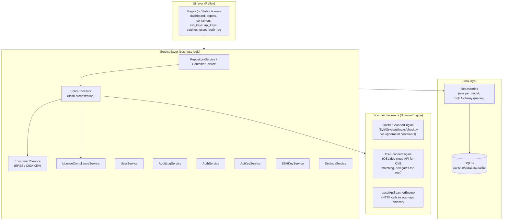
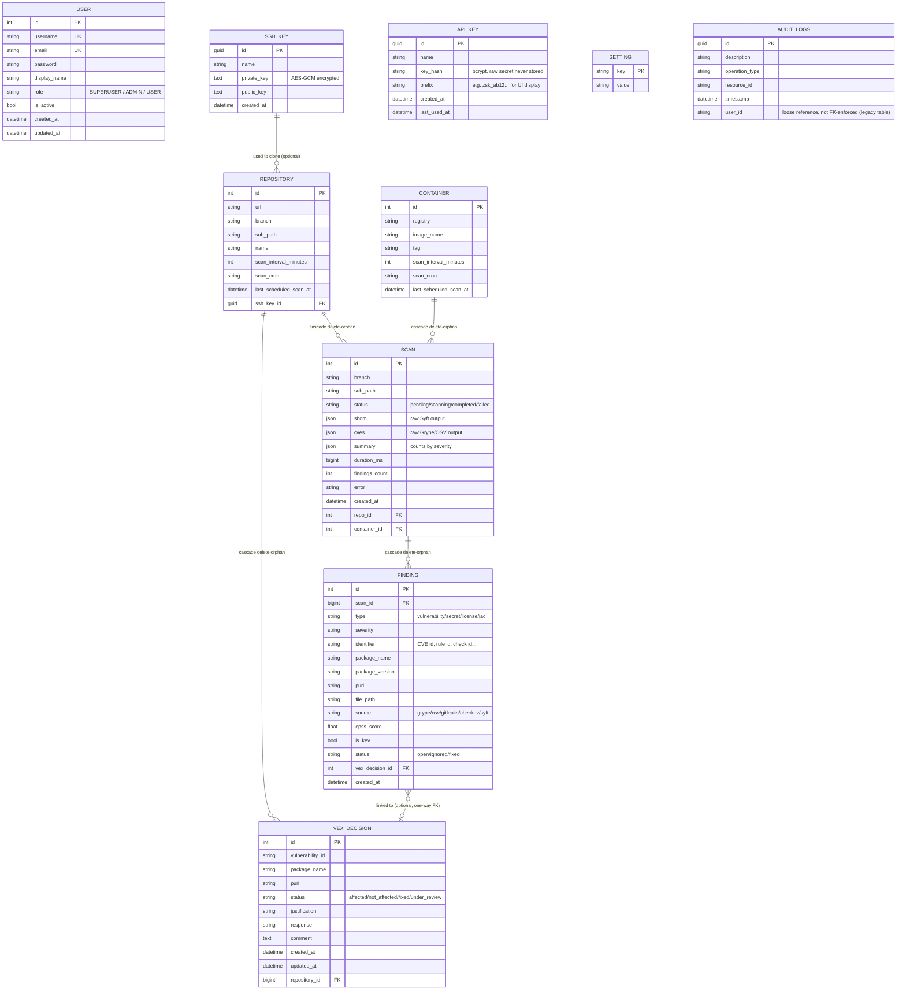
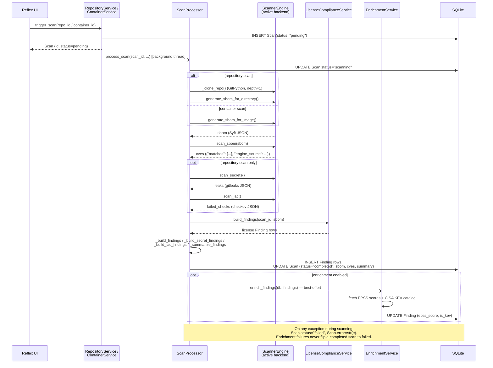
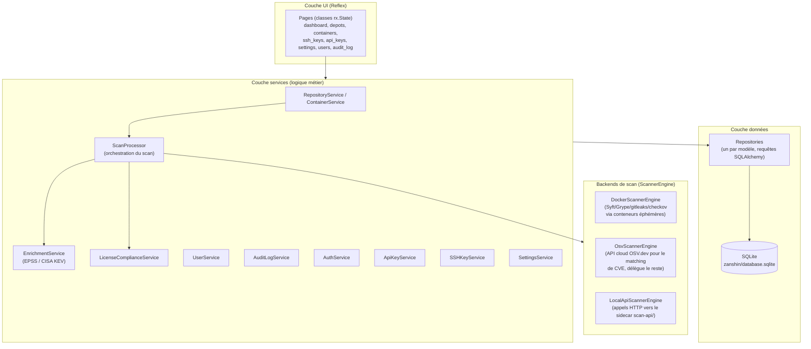
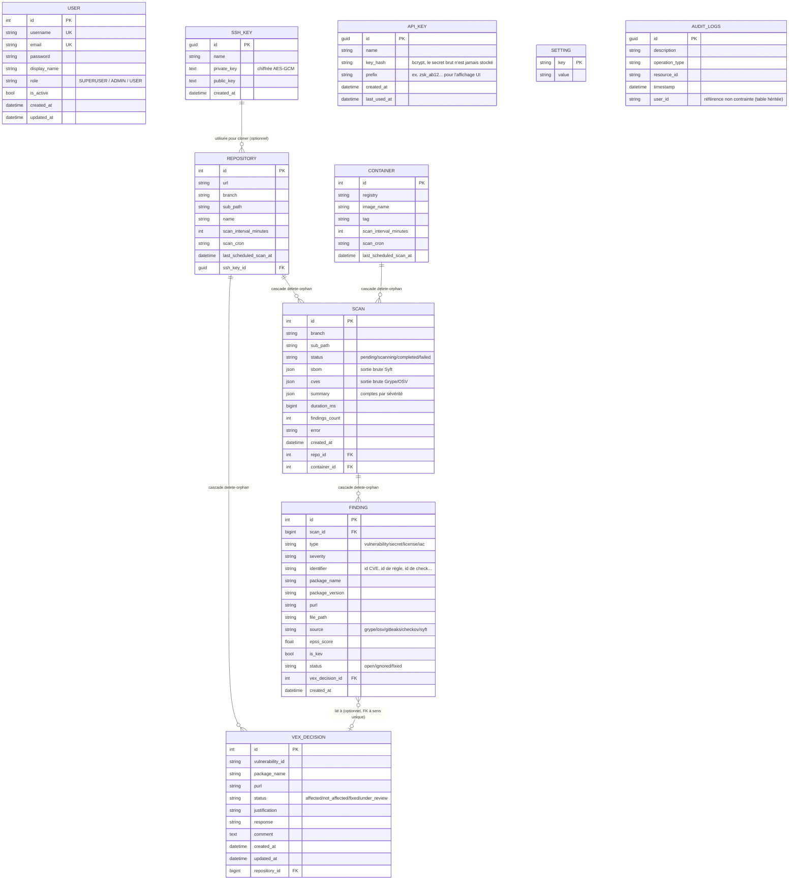
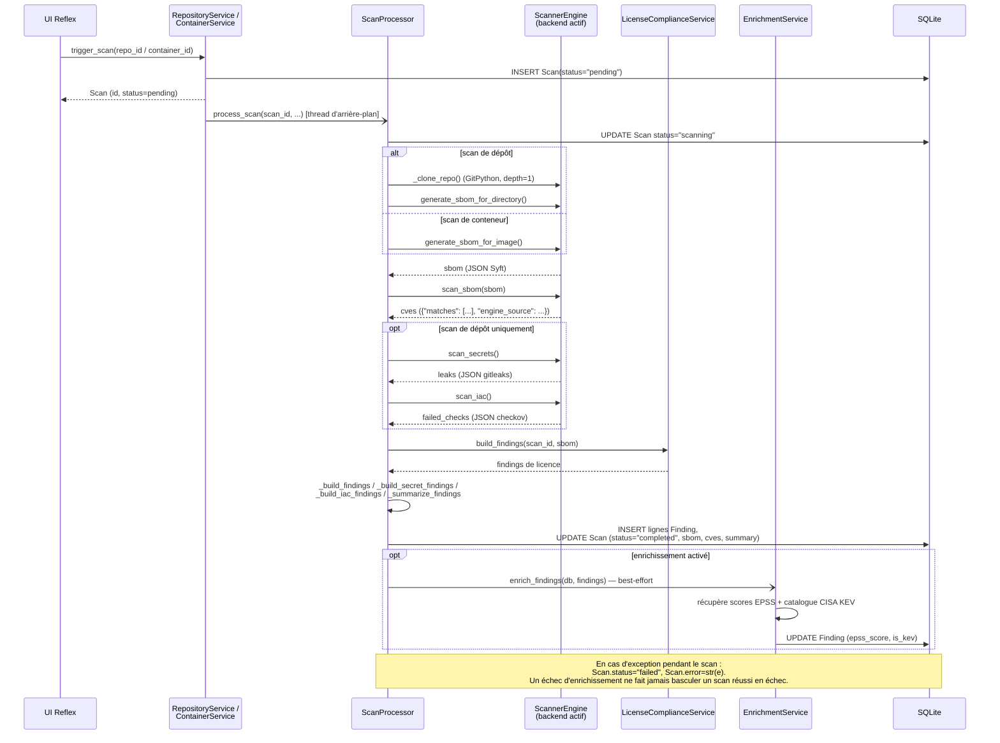

# Zanshin — Technical Documentation

**[English](#english)** | **[Français](#français)**

---

## English

This document describes Zanshin's internal architecture, database schema, and the scan pipeline's runtime flow. For features and quick start, see [`README.md`](../README.md). For the design rationale behind the pluggable scanner backends, see [`ADR-001`](architecture/ADR-001-scanner-backends.md).

### 1. Layered architecture

Zanshin follows a classic layered architecture with manual dependency injection — there is no framework-level DI container; `IoCContainer` (`zanshin/container.py`) wires every repository and service by hand, instantiated fresh per request via `get_container()`.

Each `IoCContainer` instance builds its `scanner_engine` via `get_scanner_engine(settings_service)` (`zanshin/services/scanners/factory.py`), which reads the `scan_backend` setting (`docker` / `osv` / `local_api`) and returns the matching implementation — `ScanProcessor` itself never knows which one is active.

### 2. Database schema

SQLite, no migration tool (Alembic or similar isn't wired up yet — see ADR-001). `Base.metadata.create_all()` runs at startup and only creates missing tables; altering an existing column requires a manual, hand-written migration.

Notes:

- A `Scan` belongs to **either** a `Repository` **or** a `Container` (`repo_id`/`container_id` are both nullable; exactly one is set). `is_container = scan.container_id is not None` is how the code branches scan behavior.
- `Finding` is the normalized, queryable projection of a scan's results (used by the UI, VEX triage, and enrichment). The raw `Scan.sbom`/`Scan.cves` JSON blobs are kept alongside it, unmodified, for audit purposes.
- `Finding.vex_decision_id` is a one-way FK onto the pre-existing `vex_decision` table — safe to add because it's a column on the new `finding` table, not a change to `vex_decision` itself.
- `AuditLog` maps onto `audit_logs`, a table inherited from an earlier implementation of this application. Its schema was matched exactly (via `PRAGMA table_info` against the live database) rather than redesigned, since there's no migration tool to alter it. `user_id` is a plain string column, not an enforced foreign key.
- `GUID` (`zanshin/models/guid.py`) is a custom SQLAlchemy type storing UUIDs as 16-byte binary values in SQLite (`SSHKey`, `ApiKey`, `AuditLog` all use it as their primary key type).

### 3. Scan pipeline (sequence)

Triggered from the UI, a scan runs in a background thread (`concurrent.futures.ThreadPoolExecutor`, shared module-level `executor` in `repository_service.py`) so the request thread returns immediately with a `pending` `Scan` row.

Key points not obvious from the diagram alone:

- Secrets and IaC scanning only run for **repository** scans, never for container images (see ADR-001 §5) — Syft's license data, on the other hand, applies to both.
- `cves["engine_source"]` (not `"source"` — Grype's own JSON already uses that key for something unrelated) records which backend actually produced the vulnerability matches, so `_build_findings` can set `Finding.source` correctly regardless of which `ScannerEngine` ran.
- `ScannerEngine.get_workspace_root()` returns `None` for every backend except `LocalApiScannerEngine`, which needs its temp directory created inside the volume shared with the `scan-api` sidecar rather than the OS default temp location.

### 4. Scanner backends

| Backend | SBOM / secrets / IaC | Vulnerability matching | Notes |
|---|---|---|---|
| `docker` (default) | Ephemeral containers: `anchore/syft`, `zricethezav/gitleaks`, `bridgecrew/checkov` | `anchore/grype` (ephemeral container) | Requires Docker socket access from the Zanshin process. |
| `osv` | Delegated to a `DockerScannerEngine` instance via composition | OSV.dev `/v1/query`, one package (purl) at a time | Only package identifiers leave the machine, never code or the full SBOM. Response translated into Grype's own shape so the rest of the pipeline is backend-agnostic. |
| `local_api` | HTTP calls to the `scan-api/` FastAPI sidecar, which runs the same tools as direct subprocesses | Same sidecar | Sidecar must share a filesystem volume with Zanshin (same host); paths are passed, never file uploads. See `scan-api/README.md`. |

All three implement the same `ScannerEngine` abstract base (`zanshin/services/scanners/base.py`): `generate_sbom_for_image`, `generate_sbom_for_directory`, `scan_sbom`, `scan_secrets`, `scan_iac`, plus the concrete `get_workspace_root()`.

### 5. Service / repository reference

| Service | Responsibility |
|---|---|
| `ScanProcessor` | Orchestrates a full scan (see §3); the only consumer of `ScannerEngine`. |
| `RepositoryService` / `ContainerService` | CRUD for tracked repos/images; `trigger_scan()` creates the `Scan` row and dispatches `ScanProcessor.process_scan` to the background executor. |
| `EnrichmentService` | Populates `epss_score`/`is_kev` on vulnerability findings after a scan. Caches the KEV catalog at the **class** level (survives `IoCContainer` being rebuilt per request); never turns a completed scan into a failure. |
| `LicenseComplianceService` | Evaluates a configurable license blocklist against SBOM data already collected by Syft (no separate scanner tool). |
| `UserService` | User CRUD with guardrails: can't delete your own account, can't demote/deactivate/delete the last active `SUPERUSER`. |
| `ApiKeyService` | Issues API keys: bcrypt hash stored, raw secret returned once at creation and never persisted. |
| `AuditLogService` | Records sensitive admin actions (`AuditOperation` constants: logins, user/API-key/setting changes); `record()` never raises — a logging failure must not break the action being audited. |
| `AuthService` | Password hashing/verification, user authentication. |
| `SSHKeyService` | Stores SSH private keys encrypted at rest (`EncryptionService`, AES-GCM) for cloning private repositories. |
| `SettingsService` | Thin key/value accessor over the `setting` table (backend choice, feature toggles, license blocklist). |

Each service depends only on the repositories it needs (constructor injection), and repositories are thin wrappers around SQLAlchemy queries scoped to one model — there is no generic base repository, each one exposes the specific queries its service actually needs (e.g. `FindingRepository.count_by_scan_ids_and_type`, `AuditLogRepository.find_recent`).

### 6. Testing approach

The `tests/` suite (pytest) runs entirely against an in-memory SQLite database, created fresh per test — `zanshin/database.sqlite` is never touched. Services that hardcode `SessionLocal` internally (`ScanProcessor.process_scan`, `container.get_container`) are tested by monkeypatching that symbol to an isolated in-memory session factory rather than by changing production code to accept an injected session. The Reflex UI/State layer is intentionally excluded from coverage measurement (see `pyproject.toml`'s `[tool.coverage.run]`), since `rx.State` classes need Reflex's own event-handler test harness, not plain pytest. See `README.md` for how to run it.

---

## Français

Ce document décrit l'architecture interne de Zanshin, le schéma de base de données, et le déroulement du pipeline de scan. Pour les fonctionnalités et le démarrage rapide, voir [`README.md`](../README.md). Pour le raisonnement derrière les backends de scan pluggables, voir [`ADR-001`](architecture/ADR-001-scanner-backends.md).

### 1. Architecture en couches

Zanshin suit une architecture en couches classique avec injection de dépendances manuelle — il n'y a pas de conteneur DI de framework ; `IoCContainer` (`zanshin/container.py`) câble à la main chaque repository et service, instancié à neuf par requête via `get_container()`.

Chaque instance d'`IoCContainer` construit son `scanner_engine` via `get_scanner_engine(settings_service)` (`zanshin/services/scanners/factory.py`), qui lit le réglage `scan_backend` (`docker` / `osv` / `local_api`) et retourne l'implémentation correspondante — `ScanProcessor` lui-même ne sait jamais laquelle est active.

### 2. Schéma de base de données

SQLite, sans outil de migration (Alembic ou équivalent n'est pas encore câblé — voir l'ADR-001). `Base.metadata.create_all()` s'exécute au démarrage et ne crée que les tables manquantes ; modifier une colonne existante nécessite une migration manuelle écrite à la main.

Remarques :

- Un `Scan` appartient soit à un `Repository`, soit à un `Container` (`repo_id`/`container_id` sont tous deux nullable ; un seul des deux est renseigné). `is_container = scan.container_id is not None` détermine le branchement du comportement de scan.
- `Finding` est la projection normalisée et requêtable des résultats d'un scan (utilisée par l'UI, le triage VEX et l'enrichissement). Les blobs JSON bruts `Scan.sbom`/`Scan.cves` sont conservés à côté, inchangés, à des fins d'audit.
- `Finding.vex_decision_id` est une FK à sens unique vers la table préexistante `vex_decision` — sans risque à ajouter car c'est une colonne sur la nouvelle table `finding`, pas une modification de `vex_decision` elle-même.
- `AuditLog` correspond à `audit_logs`, une table héritée d'une implémentation précédente de cette application. Son schéma a été repris à l'identique (via `PRAGMA table_info` sur la base réelle) plutôt que redessiné, faute d'outil de migration pour la modifier. `user_id` est une simple colonne texte, pas une clé étrangère contrainte.
- `GUID` (`zanshin/models/guid.py`) est un type SQLAlchemy personnalisé qui stocke les UUID sous forme de valeurs binaires 16 octets dans SQLite (`SSHKey`, `ApiKey`, `AuditLog` l'utilisent tous comme type de clé primaire).

### 3. Pipeline de scan (séquence)

Déclenché depuis l'UI, un scan s'exécute dans un thread d'arrière-plan (`concurrent.futures.ThreadPoolExecutor`, `executor` partagé au niveau module dans `repository_service.py`), afin que le thread de la requête retourne immédiatement avec une ligne `Scan` au statut `pending`.

Points importants non visibles sur le seul diagramme :

- Le scan de secrets et d'IaC ne s'exécute que pour les scans de **dépôts**, jamais pour les images de conteneurs (voir ADR-001 §5) — les données de licence de Syft, elles, s'appliquent aux deux.
- `cves["engine_source"]` (pas `"source"` — la sortie JSON native de Grype utilise déjà cette clé pour autre chose) enregistre quel backend a réellement produit le matching de vulnérabilités, afin que `_build_findings` renseigne correctement `Finding.source` quel que soit le `ScannerEngine` utilisé.
- `ScannerEngine.get_workspace_root()` retourne `None` pour tous les backends sauf `LocalApiScannerEngine`, qui a besoin que son répertoire temporaire soit créé dans le volume partagé avec le sidecar `scan-api` plutôt que dans le répertoire temporaire par défaut du système.

### 4. Backends de scan

| Backend | SBOM / secrets / IaC | Matching de vulnérabilités | Remarques |
|---|---|---|---|
| `docker` (défaut) | Conteneurs éphémères : `anchore/syft`, `zricethezav/gitleaks`, `bridgecrew/checkov` | `anchore/grype` (conteneur éphémère) | Nécessite l'accès au socket Docker depuis le processus Zanshin. |
| `osv` | Délégué à une instance `DockerScannerEngine` par composition | OSV.dev `/v1/query`, un paquet (purl) à la fois | Seuls les identifiants de paquets sortent de la machine, jamais le code ni le SBOM complet. La réponse est traduite dans le format de Grype pour que le reste du pipeline reste agnostique au backend. |
| `local_api` | Appels HTTP vers le sidecar FastAPI `scan-api/`, qui exécute les mêmes outils en sous-processus direct | Idem, via le sidecar | Le sidecar doit partager un volume de fichiers avec Zanshin (même hôte) ; des chemins sont transmis, jamais des fichiers uploadés. Voir `scan-api/README.md`. |

Les trois implémentations respectent la même interface abstraite `ScannerEngine` (`zanshin/services/scanners/base.py`) : `generate_sbom_for_image`, `generate_sbom_for_directory`, `scan_sbom`, `scan_secrets`, `scan_iac`, plus la méthode concrète `get_workspace_root()`.

### 5. Référence services / repositories

| Service | Responsabilité |
|---|---|
| `ScanProcessor` | Orchestre un scan complet (voir §3) ; seul consommateur de `ScannerEngine`. |
| `RepositoryService` / `ContainerService` | CRUD des dépôts/images suivis ; `trigger_scan()` crée la ligne `Scan` et envoie `ScanProcessor.process_scan` à l'executor d'arrière-plan. |
| `EnrichmentService` | Renseigne `epss_score`/`is_kev` sur les findings de vulnérabilité après un scan. Cache le catalogue KEV au niveau **classe** (survit à la reconstruction d'`IoCContainer` à chaque requête) ; ne fait jamais basculer un scan réussi en échec. |
| `LicenseComplianceService` | Évalue une liste noire de licences configurable sur les données SBOM déjà collectées par Syft (pas d'outil de scan séparé). |
| `UserService` | CRUD utilisateurs avec garde-fous : impossible de supprimer son propre compte, de rétrograder/désactiver/supprimer le dernier `SUPERUSER` actif. |
| `ApiKeyService` | Émet des clés API : hash bcrypt stocké, secret brut retourné une seule fois à la création, jamais persisté. |
| `AuditLogService` | Enregistre les actions admin sensibles (constantes `AuditOperation` : connexions, modifications utilisateur/clé API/réglage) ; `record()` ne lève jamais d'exception — un échec de journalisation ne doit pas casser l'action journalisée. |
| `AuthService` | Hachage/vérification de mot de passe, authentification utilisateur. |
| `SSHKeyService` | Stocke les clés SSH privées chiffrées au repos (`EncryptionService`, AES-GCM) pour cloner des dépôts privés. |
| `SettingsService` | Accesseur clé/valeur simple sur la table `setting` (choix du backend, activation de fonctionnalités, liste noire de licences). |

Chaque service ne dépend que des repositories dont il a besoin (injection par constructeur), et les repositories sont de fines enveloppes autour de requêtes SQLAlchemy propres à un modèle — il n'y a pas de repository générique de base, chacun expose les requêtes spécifiques dont son service a réellement besoin (ex. `FindingRepository.count_by_scan_ids_and_type`, `AuditLogRepository.find_recent`).

### 6. Approche de test

La suite `tests/` (pytest) s'exécute entièrement sur une base SQLite en mémoire, créée à neuf pour chaque test — `zanshin/database.sqlite` n'est jamais touchée. Les services qui codent en dur `SessionLocal` en interne (`ScanProcessor.process_scan`, `container.get_container`) sont testés en substituant ce symbole (monkeypatch) par une fabrique de session isolée en mémoire, plutôt qu'en modifiant le code de production pour accepter une session injectée. La couche UI/State Reflex est volontairement exclue de la mesure de couverture (voir `[tool.coverage.run]` dans `pyproject.toml`), car les classes `rx.State` nécessitent le harnais de test propre à Reflex, pas pytest classique. Voir `README.md` pour l'exécuter.
