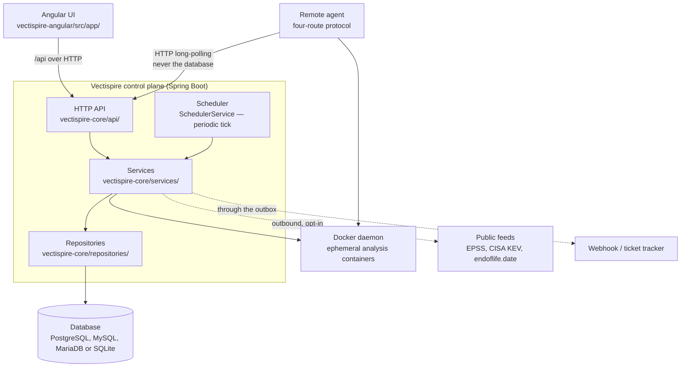
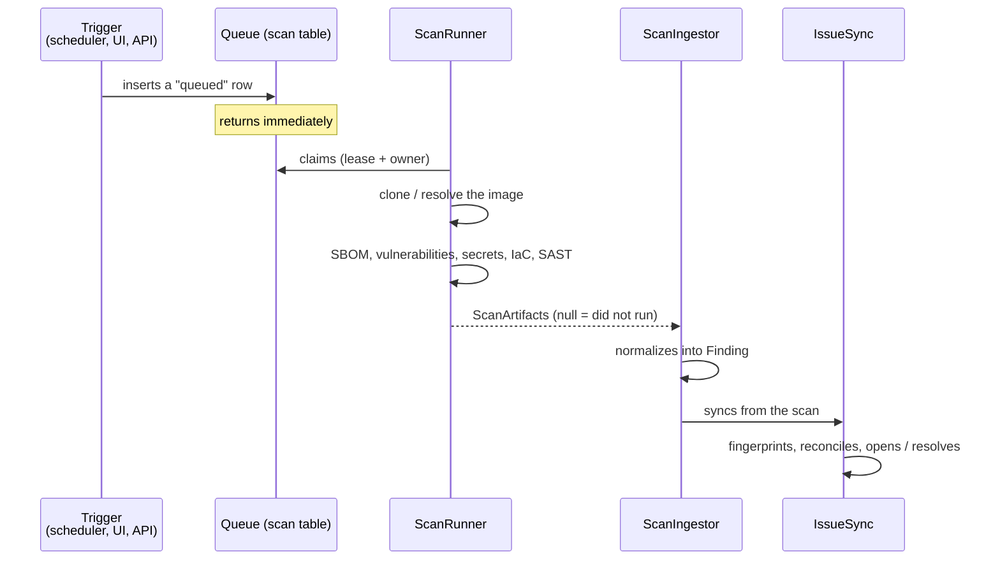

# 01 — Overview

## What Vectispire does

Vectispire watches the security of a set of **targets** — Git repositories and container
images — by periodically putting them through a battery of analyzers, and tracks what it
finds **from one scan to the next**.

That last point is what separates it from a script that runs Grype in CI. A scanner
returns a list; Vectispire returns a **backlog**: what appeared, what was triaged and by
whom, what has been sitting there for six scans, what has gone away. A report says what
exists today; a backlog says what changed, which is the only information anyone acts on.

The second use is the **compliance verdict**: `POST /api/v1/gate` tells a build pipeline
whether a target passes, according to an explicit policy. This is where Vectispire stops
being a dashboard and becomes a decision.

Three principles shape everything else.

**Everything is local.** The analyzers run in ephemeral containers on the same machine,
with the network cut off when the tool has nothing to fetch. No source code leaves. This
is not a constraint endured: it is what makes the tool deployable where application
security is actually a question, and it is why the Semgrep rules are bundled rather than
downloaded ([decision 0006](decisions/0006-semgrep-rules-written-here.md)).

**The default deployment is one process and one file.** A single `docker run` and the
tool is up. Everything distributed — several instances, remote agents, PostgreSQL — is
possible, and refused at startup when the configuration does not allow it
([04](04-runtime-and-deployment.md)).

**What was not observed is not clean.** An analyzer that crashes has found nothing, and
mistaking its silence for an empty result declares the target fixed. This distinction
runs through the whole codebase
([decision 0007](decisions/0007-none-is-not-an-empty-list.md)).

## The pieces



**Two artifacts, one API.** A Spring Boot
backend and an Angular front end; the browser now talks to the same HTTP API that a CI
pipeline or a remote agent talks to. The API keys finally have a consumer that is not
the UI itself.

**Dependency injection is Spring's**, by constructor: every collaborator is a parameter a
class cannot be built without. An earlier design
built its own `IoCContainer` per request around a database session; that hand-rolled
graph is gone.

### The layers, and the rule that holds them

```
api/ ──► services/ ──► repositories/ ──► persistence/ ──► database
           │                                  │
           └──────────────┬───────────────────┘
                          ▼
                       domain/          (pure, depends on nothing)
```

One rule, and it is what makes the whole thing testable: **a layer only knows the one
below it.** In particular, a service writes no SQL — it goes through a repository — and a
repository holds no business rule.

This rule is not merely written down: `ArchitectureTest` reads the
import graph with ArchUnit and fails the suite when a layer imports from above itself, or when
a domain class imports a framework. See
[`zanshin-java/README.md`](../../zanshin-java/README.md) for the full table.

Two practical consequences:

- The UI and a CI pipeline are two clients of the **same** endpoint. The verdict shown on
  the Security screen is the one `POST /api/v1/gate` returns, because both go through
  the same `PolicyGate` — not because someone was careful. A SQL aggregate that
  reimplemented the verdict would agree today and diverge the first time a policy flag
  was added.
- The UI's view models
  ([`zanshin-angular/src/app/core/api.models.ts`](../../zanshin-angular/src/app/core/api.models.ts))
  are typed and computed server-side. The browser receives finished values, not
  arithmetic.

## The path of a scan



**Triggering does not execute.** A trigger inserts a `queued` row and returns. A worker
loop claims and executes. That is what lets a remote agent, or a second instance, take
the work — and what removed the in-memory queue held by whichever process received the
request ([decision 0002](decisions/0002-the-database-carries-the-queue.md)).

**Two separated responsibilities.** `ScanRunner` runs the analyzers and knows nothing of
the database; `ScanIngestor` reads the artifacts and writes. The cut is not cosmetic: it
is what lets a remote agent execute the first half with no database access
([decision 0003](decisions/0003-long-polling-for-agents.md)), and
`zanshin-agent` does not depend on `zanshin-core`, so no JDBC driver is on its compile
classpath and the property cannot quietly lapse — the violation fails to compile.

### The analyzers

Each is an ephemeral container, pinned **by digest** — these images are Zanshin's own
supply chain, and they run on a machine that has the Docker socket.

| Step | Tool | Network | Produces |
|---|---|---|---|
| SBOM | `anchore/syft` | open (registry, daemon) | component inventory |
| Vulnerabilities | `anchore/grype` | open (vulnerability database) | `vulnerability` findings |
| Secrets | `gitleaks` | **cut off** | `secret` findings |
| IaC | `bridgecrew/checkov` | **cut off** | `iac` findings |
| Source code | `semgrep/semgrep` | **cut off** | `sast` and `quality` findings |
| Licenses | *(none)* | — | derived from the SBOM |
| End of life | endoflife.date | outbound, opt-in | `eol` findings |
| AI review | local Ollama | local, opt-in | `ai_review` findings |

[`ScanRunner`](../../zanshin-java/zanshin-common/src/main/java/com/asmolabs/zanshin/common/scanning/ScanRunner.java) is a single concrete class, and
deliberately so. An earlier design had a `ScannerEngine` interface with three
implementations — Docker, a local side-car API, and OSV
([decision 0001](decisions/0001-pluggable-scan-layer.md)); the port carried over only the
Docker one, and [decision 0010](decisions/0010-one-scan-runner.md) abandons the seam rather
than rebuilding it around a single implementation. **Moving execution elsewhere is done by
running an agent elsewhere**, not by substituting an engine.

## The periodic tick

A single rhythm carries all background work: scheduled scans, retention of raw payloads,
triage expiry, outbox relay, refreshing the built-in agent. It is taken **under a lease**
— a row in `leader_lease`, see
[`LeaderLeases`](../../zanshin-java/zanshin-core/src/main/java/com/asmolabs/zanshin/core/repositories/LeaderLeases.java) —
so that only one instance holds it. A holder that dies stops renewing; the next tick
takes over after expiry ([04](04-runtime-and-deployment.md)).

A lease in a table rather than an engine advisory lock: it is portable, it works
single-instance with no special case, and above all **it is observable**. When something
has stopped happening, `SELECT * FROM leader_lease` says who was supposed to do it and
until when. A `pg_advisory_lock` answers no question after the fact.

## Still open

- **Per-team partitioning exists, and is off by default.** This entry used to say a *user* sees
  everything, and it was the first thing anybody evaluating Zanshin read — while teams, direct
  per-account assignment and per-team notification channels had all been built. What remains true
  is narrower and belongs to [03](03-security.md): `TARGET_VISIBILITY` ships as `everyone` so an
  upgrade changes nothing, a **new** installation is created partitioned, and an existing
  deployment has no partitioning until an administrator switches it.
- **The Docker socket requirement is unconditional** for whichever process runs scans,
  which is what the abandoned seam had been meant to avoid
  ([0010](decisions/0010-one-scan-runner.md)). The mitigation is to move execution onto an
  agent so the network-exposed process does not hold the socket — see the `VERISCAPE_ROLE`
  item in [04](04-runtime-and-deployment.md).
- **No reachability analysis** (call graph, taint). A vulnerability in a dependency that
  is never called is counted like any other. That is heavy work, deliberately out of
  scope.
