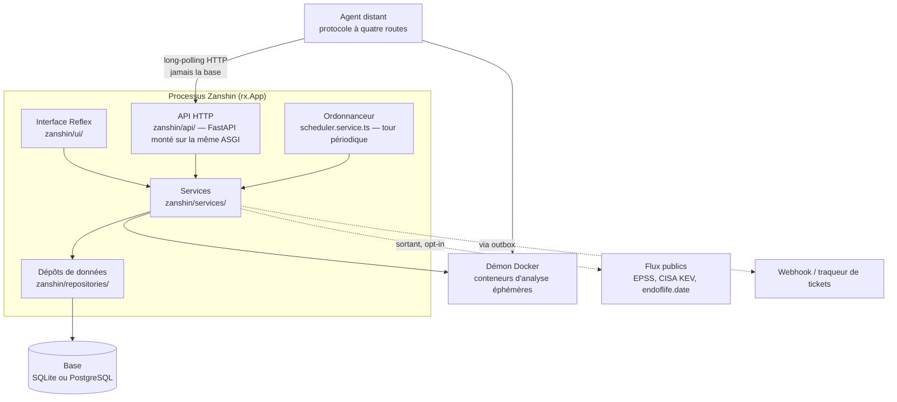
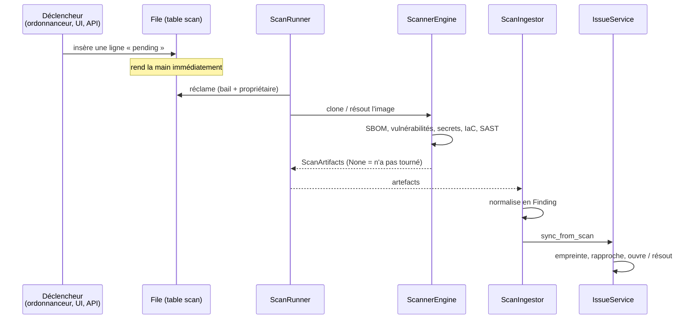

# 01 — Vue d'ensemble

## Ce que fait Zanshin

Zanshin surveille la sécurité d'un ensemble de **cibles** — des dépôts Git et des images
de conteneur — en leur faisant passer périodiquement une batterie d'analyseurs, et suit
ce qu'il trouve **d'un scan à l'autre**.

Ce dernier point est ce qui le distingue d'un script qui lance Grype dans une CI. Un
scanner rend une liste ; Zanshin rend un **backlog** : ce qui est apparu, ce qui a été
trié et par qui, ce qui traîne depuis six scans, ce qui a disparu. Un rapport dit ce qui
existe aujourd'hui ; un backlog dit ce qui a changé, ce qui est la seule information sur
laquelle quelqu'un agit.

Le second usage est le **verdict de conformité** : `POST /api/v1/gate` répond à une chaîne
d'intégration si une cible passe, selon une politique explicite. C'est l'endroit où
Zanshin cesse d'être un tableau de bord et devient une décision.

Trois principes structurent tout le reste.

**Tout est local.** Les analyseurs tournent dans des conteneurs éphémères sur la même
machine, réseau coupé quand l'outil n'a rien à récupérer. Aucun code source ne sort. Ce
n'est pas une contrainte subie : c'est ce qui rend l'outil déployable là où la question de
la sécurité applicative se pose vraiment, et c'est pourquoi les règles Semgrep sont
embarquées plutôt que téléchargées ([décision 0006](decisions/0006-regles-semgrep-ecrites-ici.md)).

**Le déploiement par défaut est un processus et un fichier.** Un `docker run` et l'outil
tourne. Tout ce qui est réparti — plusieurs instances, des agents distants, PostgreSQL,
Redis — est possible et refusé au démarrage quand la configuration ne le permet pas
([04](04-execution-et-deploiement.md)).

**Ce qui n'a pas été observé n'est pas propre.** Un analyseur qui plante n'a rien
constaté, et confondre son silence avec un résultat vide déclare la cible corrigée. Cette
distinction traverse tout le code ([décision 0007](decisions/0007-none-n-est-pas-une-liste-vide.md)).

## Les pièces



**Un seul artefact.** L'interface et l'API sont servies par le même processus, sur le même
port : l'API FastAPI est montée sur l'application Reflex via `api_transformer`. C'est ce
qui donne enfin un consommateur aux clés API — elles pouvaient être émises depuis
l'interface et ne servaient à rien.

**L'injection de dépendances est manuelle**, par `IoCContainer`
([`backend/src/api/api.module.ts`](../../backend/src/api/api.module.ts)), construit par requête autour d'une
session de base. Pas de framework : le graphe est explicite et lisible d'un bout à l'autre.

### Les couches, et la règle qui les tient

```
ui/ ─┐
     ├──► services/ ──► repositories/ ──► models/ ──► base
api/─┘         │
               └──► services/scanners/ ──► Docker
```

Une seule règle, et elle est ce qui rend l'ensemble testable : **une couche ne connaît que
celle du dessous.** En particulier, un service ne fait pas de requête SQL — il passe par un
dépôt de données — et un dépôt ne contient pas de règle métier.

Deux conséquences pratiques :

- L'interface et l'API sont deux clients du **même** service. Le verdict affiché sur
  l'écran Sécurité est celui que rend `POST /api/v1/gate`, parce que les deux appellent
  `policy_gate.evaluate` — pas parce que quelqu'un a fait attention. Une agrégation SQL
  qui réimplémenterait le verdict serait d'accord aujourd'hui et divergerait au premier
  drapeau de politique ajouté.
- Les *view-models* de l'interface ([`frontend/src/app/core/api.models.ts`](../../frontend/src/app/core/api.models.ts))
  sont typés et calculés côté serveur. Le navigateur reçoit des valeurs finies, pas de
  l'arithmétique.

## Le trajet d'un scan



**Déclencher n'exécute pas.** `trigger_scan` insère une ligne `pending` et rend la main.
Une boucle de travailleurs réclame et exécute. C'est ce qui permet qu'un agent distant, ou
une seconde instance, prenne le travail — et ce qui a supprimé la file en mémoire du
processus qui avait reçu la requête
([décision 0002](decisions/0002-la-base-porte-la-file.md)).

**Deux responsabilités séparées.** `ScanRunner` fait tourner les analyseurs et ne connaît
pas la base ; `ScanIngestor` lit les artefacts et écrit. La coupure n'est pas cosmétique :
c'est elle qui permet à un agent distant d'exécuter la première moitié sans accès à la
base ([décision 0003](decisions/0003-long-polling-pour-les-agents.md)).

### Les analyseurs

Chacun est un conteneur éphémère, épinglé **par digest** — ces images sont la chaîne
d'approvisionnement de Zanshin, et elles s'exécutent sur une machine qui a le socket
Docker.

| Étape | Outil | Réseau | Produit |
|---|---|---|---|
| SBOM | `anchore/syft` | ouvert (registre, démon) | inventaire des composants |
| Vulnérabilités | `anchore/grype` | ouvert (base de vulnérabilités) | constats `vulnerability` |
| Secrets | `gitleaks` | **coupé** | constats `secret` |
| IaC | `bridgecrew/checkov` | **coupé** | constats `iac` |
| Code source | `semgrep/semgrep` | **coupé** | constats `sast` et `quality` |
| Licences | *(aucun)* | — | déduit du SBOM |
| Fin de vie | endoflife.date | sortant, opt-in | constats `eol` |
| Revue IA | Ollama local | local, opt-in | constats `ai_review` |

Le contrat est [`ScanRunner`](../../backend/src/scanning/scan-runner.ts), et il a trois
implémentations : Docker (défaut), une API locale en side-car, et OSV. Une méthode que le
moteur ne sait pas faire renvoie `None` — dire « je ne sais pas faire » est une réponse
honnête, ajouter une méthode abstraite casserait les deux autres implémentations
([décision 0001](decisions/0001-couche-de-scan-pluggable.md)).

## Le tick périodique

Un seul rythme porte tout le travail de fond : scans planifiés, rétention des charges
brutes, expiration des triages, relais de l'outbox, rafraîchissement de l'agent intégré.
Il est pris **sous un bail** — une ligne dans `leader_lease` — pour qu'une seule instance
le tienne. Un porteur qui meurt cesse de renouveler ; le tick suivant reprend après
expiration ([04](04-execution-et-deploiement.md)).

Un bail en table plutôt qu'un verrou consultatif du moteur : c'est portable, ça marche en
mono-instance sans cas particulier, et surtout **c'est observable**. Quand quelque chose a
cessé de se produire, `SELECT * FROM leader_lease` dit qui était censé le faire et
jusqu'à quand. Un `pg_advisory_lock` ne répond à aucune question après coup.

## Reste ouvert

- **Aucun cloisonnement par équipe au niveau des comptes.** Une clé API peut être
  restreinte à une cible ; un *utilisateur* voit tout. C'est la limite la plus visible pour
  qui voudrait déployer Zanshin sur plusieurs équipes.
- **`local_api` ne fait pas de SAST** et le side-car ne gagnera pas d'endpoint : il est
  redondant avec les agents distants, qui font la même chose avec une frontière de
  confiance meilleure.
- **Pas d'analyse d'atteignabilité** (call-graph, taint). Une vulnérabilité présente dans
  une dépendance non appelée est comptée comme les autres. C'est un chantier lourd, hors
  périmètre assumé.
