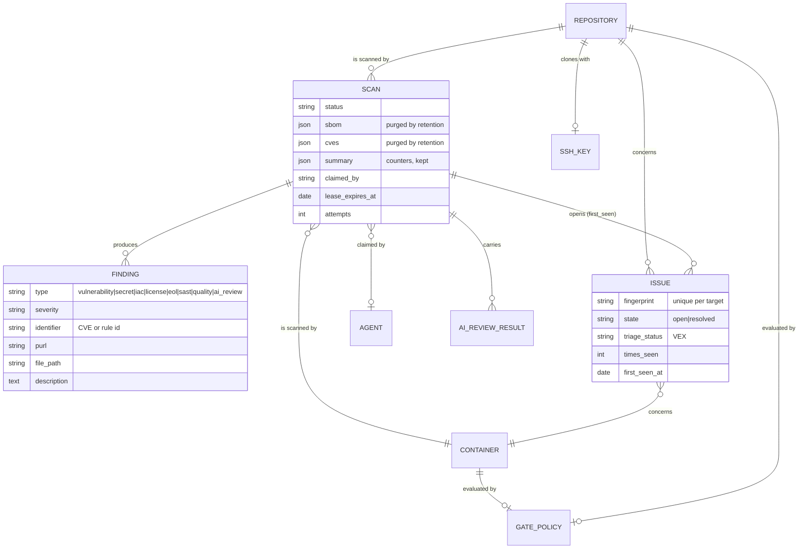
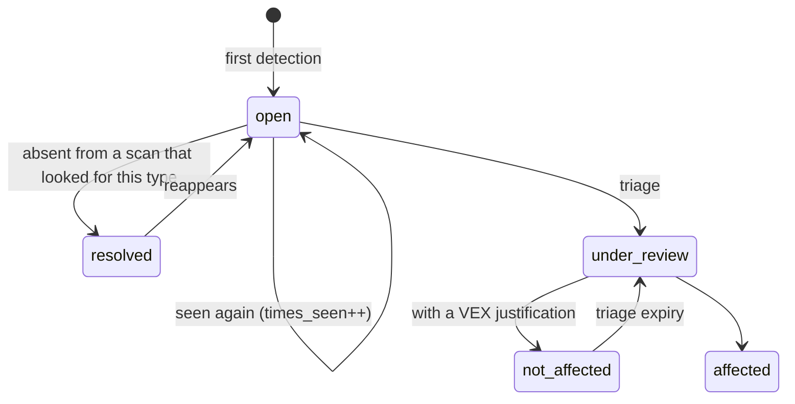

# 02 — Data model

## The distinction everything rests on: finding and issue

This is the one thing to understand before touching this schema.

- A **`Finding`** is what an analyzer said, during **one** scan. It is immutable and
  disposable. Re-running the scan produces a new one.
- An **`Issue`** is the same problem **tracked across scans**. It has a first detection, a
  times-seen counter, a state, a triage decision and its author.

A finding has no history; an issue is nothing but history. Conflating the two is what
used to leave `Finding.status` at "open" forever and left `VexDecision`, which existed,
never written — there was nothing stable to attach a decision to.



The service tables, outside the main schema: `user`, `api_key`, `setting`, `audit_log`
(chained), `outbox_message` (what goes out), `processed_message` (what comes in,
deduplicated), `leader_lease` (who holds the tick), `agent`.

## The fingerprint

An issue's identity across scans, computed by
[`buildFingerprint`](../../backend/src/domain/issues/issue-fingerprint.ts):

```
sha256( target, type, identifier, purl-or-package-name, file-path )
```

**What is absent from it is a choice, and it is the important part.**

*The package version* — otherwise an outdated dependency that stays outdated across three
version bumps would be three unrelated issues, and a triage decision would evaporate on
every patch release. This is an issue with a history.

*The line number* — otherwise a code shift would reopen everything. The trade-off is real
and accepted: twelve occurrences of the same Semgrep rule in one file form **a single
issue**, and a `not_affected` triage placed on one covers the others, including those
added the following week. Mitigated by listing every occurrence in the scan panel. An
identity per occurrence would need an explicit parameter, not a repurposing of the
existing fields.

### The trap to know before touching anything

**Everything that goes into the fingerprint is a data contract.** Renaming a rule,
changing a Semgrep rule's category (the `type` is part of it), normalizing a file path:
each of these **resolves every existing issue and creates new ones**, losing all triage
history. Silently, and across all targets at once.

That is a data migration, not a fix. One known defect lives there today: gitleaks and
checkov record paths as seen **from inside the container** (`/repo/source/…`).
Normalizing them is right, and will cost a resolve-and-recreate of every `secret` and
`iac` issue.

## An issue's life cycle



**"Absent from a scan that looked for this type"** is the clause that matters. An issue is
resolved only if the scan actually looked for its type — hence the `scannedTypes` list
carried into
[`issue-sync.service.ts`](../../backend/src/services/issue-sync.service.ts), which
includes a type only if it ran. Without that condition, turning off secret scanning would
declare every secret fixed.

The triage vocabulary is **VEX**, not a house vocabulary: `not_affected` requires a
justification drawn from the standard's list. That is what makes the VEX export possible
without translation — and what stops "not affected" from being a box someone ticks
without saying anything.

## What is stored twice, and why

`Scan.sbom` and `Scan.cves` keep the analyzers' **raw** payloads, alongside the
normalized `Finding` rows. Redundant, and deliberate: it is the only record of what the
tool actually said, and therefore the only way to replay a decision or to understand a
questionable normalization.

They are **purged after a delay** by retention. `Scan.summary`, which holds only
counters, is kept — it is what feeds the dashboard and the OpenVEX export. The
consequence to know: a scan detail panel is built from the `Finding` rows, never from the
blob, precisely so that it keeps working after the purge.

## The migrations

TypeORM, one set per dialect, under `backend/src/persistence/migrations/`. Two rules
learned by breaking something.

**A migration that has already been applied is a record, not code.** Rewriting it breaks
fresh installations — this happened: an Alembic revision in the Python stack rebuilt the
SQLite tables from the *live* models instead of the real database, so a fresh install
failed on a column the model had and the database did not yet. The narrow, safe exception
is amending a *baseline*, which by construction only ever runs on an empty database.

**What is invisible on SQLite is real elsewhere.** Six portability defects lived in this
schema, all invisible both from SQLite and to a careful reading: a `BINARY` type
PostgreSQL does not know, an unquoted `FROM user` that names a function there rather than
a table, a `VARCHAR` with no length, a `BIGINT` foreign key pointing at an `INT` key,
`DROP INDEX IF EXISTS`, `NULLS LAST`. All found by running against real servers — and the
story repeated itself with every engine added. The MySQL campaign revealed that no index
covered the scan queue, something PostgreSQL tolerated on a test-sized table. The SQLite
campaign revealed that the purge of the brute-force counters compared a date against a
hand-built **string**, so it emptied the whole table on every pass. The MariaDB campaign
revealed that its declared capabilities were wrong on three counts, and that its native
`uuid` type made the MySQL migrations inapplicable.

Hence `npm run test:integration:all`, which runs all four
([decision 0008](decisions/0008-postgresql-and-mysql.md)).

**And hence `schema-parity.integration-spec.ts`**, which asks on every engine the question
`migration:generate` asks — "what would have to change for the database to look like the
entities?" — whose right answer is "nothing". The two had already diverged: an index
enriched by a migration without being enriched on the entity, another created without
being declared anywhere. A missing index changes no result, only its cost: nothing else
would have seen it.

Two things to watch for whoever writes the next one:

- **One migration set per dialect, and four are needed.** The PostgreSQL reference is raw
  SQL — `SERIAL`, `uuid_generate_v4()`, `TIMESTAMP WITH TIME ZONE` — which MySQL refuses,
  and vice versa. SQLite knows none of the three. And **MariaDB is not MySQL**: since 10.7
  it carries a native `uuid` type that its driver picks on its own, so the MySQL
  migrations produced a schema there that the model immediately wanted to rebuild —
  sixty-two statements of difference, measured. No tool translates one into the other: all
  four are generated from the same entities, against a real server of each engine.
- **Parity between entities and migrations is checked during the campaign**: an entity
  changed without its migration fails the integration tests, which apply the migrations
  rather than synthesizing the schema. That is the only way to see an incorrect migration
  before production.

## Still open

- **The gitleaks and checkov paths are not normalized** (see above). The fix is known, so
  is its cost.
- **The audit log lives in the same database as what it watches.** The chaining makes a
  selective edit detectable, not impossible.
- **An occurrence is not an issue** for SAST, by choice of fingerprint.
