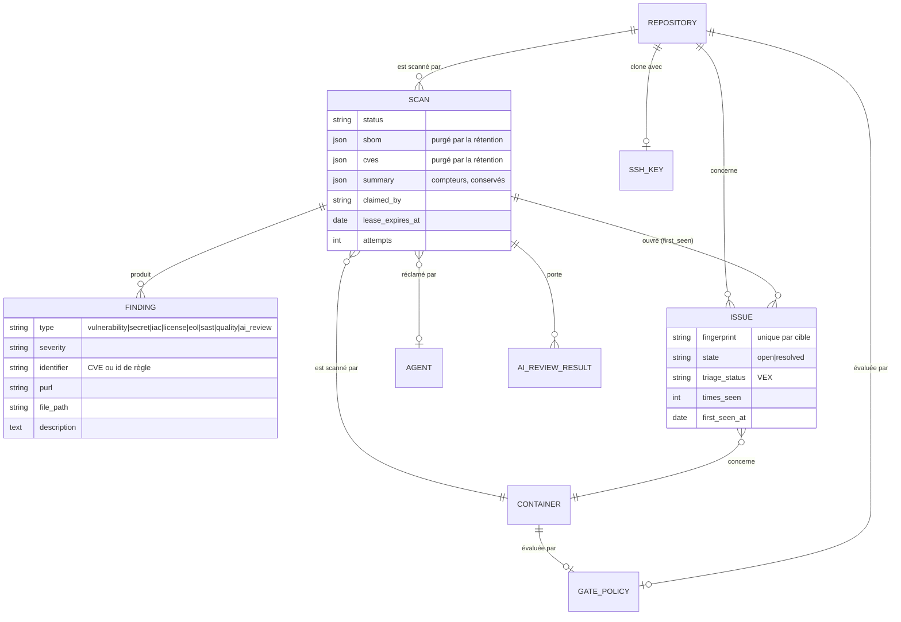
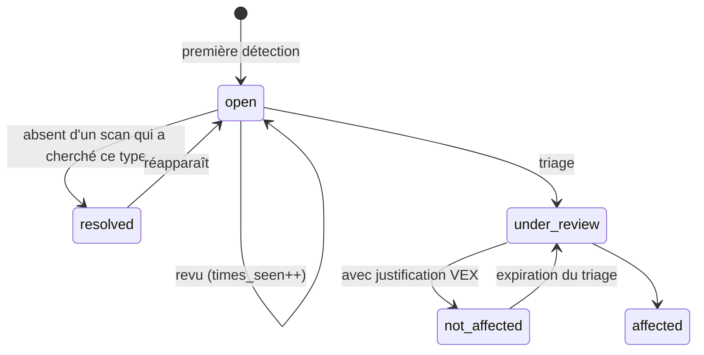

# 02 — Modèle de données

## La distinction qui porte tout : constat et problème

C'est la seule chose à comprendre avant de toucher à ce schéma.

- Un **`Finding`** est ce qu'un analyseur a dit, lors d'**un** scan. Il est immuable et
  jetable. Relancer le scan en produit un nouveau.
- Un **`Issue`** est le même problème **suivi à travers les scans**. Il a une première
  détection, un compteur de fois vu, un état, une décision de triage et son auteur.

Un constat n'a pas d'histoire ; un problème n'a que ça. Confondre les deux est ce qui
faisait qu'avant, `Finding.status` restait « open » pour toujours et que `VexDecision`,
qui existait, n'était jamais écrit — il n'y avait rien de stable à quoi accrocher une
décision.



Les tables de service, hors du schéma principal : `user`, `api_key`, `setting`,
`audit_log` (chaînée), `outbox_message` (ce qui sort), `processed_message` (ce qui entre,
dédupliqué), `leader_lease` (qui tient le tick), `agent`.

## L'empreinte

L'identité d'un problème à travers les scans, calculée par
[`buildFingerprint`](../../backend/src/domain/issues/issue-fingerprint.ts) :

```
sha256( cible, type, identifiant, purl-ou-nom-de-paquet, chemin-de-fichier )
```

**Ce qui en est absent est un choix, et c'est le plus important.**

*La version du paquet* — sinon une dépendance périmée qui le reste à travers trois montées
de version serait trois problèmes sans rapport, et une décision de triage s'évaporerait à
chaque correctif de patch. C'est un problème avec une histoire.

*La ligne* — sinon un décalage de code rouvrirait tout. La contrepartie est réelle et
assumée : douze occurrences d'une même règle Semgrep dans un même fichier forment **un
seul problème**, et un triage `not_affected` posé sur l'une couvre les autres, y compris
celles ajoutées la semaine suivante. Atténué en listant chaque occurrence dans le panneau
de scan. Une identité par occurrence demanderait un paramètre explicite, pas un
détournement des champs existants.

### Le piège à connaître avant de toucher à quoi que ce soit

**Tout ce qui entre dans l'empreinte est un contrat de données.** Renommer une règle,
changer la catégorie d'une règle Semgrep (le `type` en fait partie), normaliser un chemin
de fichier : chacun de ces gestes **résout tous les problèmes existants et en crée de
nouveaux**, en perdant tout l'historique de triage. Silencieusement, et sur toutes les
cibles à la fois.

C'est une opération de migration de données, pas une correction. Un défaut connu vit
là aujourd'hui : gitleaks et checkov enregistrent des chemins vus **du côté du conteneur**
(`/repo/source/…`). Les normaliser est juste, et coûtera une résolution-recréation de tous
les problèmes de type `secret` et `iac`.

## Le cycle de vie d'un problème



**« Absent d'un scan qui a cherché ce type »** est la clause qui compte. Un problème n'est
résolu que si le scan a réellement cherché son type — d'où
`issue_service.scanned_types_for(...)`, qui n'inclut un type que s'il a tourné. Sans cette
condition, désactiver le scan de secrets déclarerait tous les secrets corrigés.

Le vocabulaire de triage est celui de **VEX**, pas un vocabulaire maison : `not_affected`
exige une justification prise dans la liste de la norme. C'est ce qui rend l'export VEX
possible sans traduction — et ce qui empêche « pas concerné » d'être une case qu'on coche
sans rien dire.

## Ce qui est stocké deux fois, et pourquoi

`Scan.sbom` et `Scan.cves` gardent les charges **brutes** des analyseurs, à côté des
`Finding` normalisés. Redondant, et voulu : c'est la seule trace de ce que l'outil a
réellement dit, donc la seule façon de rejouer une décision ou de comprendre une
normalisation douteuse.

Elles sont **purgées après un délai** par la rétention. `Scan.summary`, qui ne contient
que des compteurs, est conservé — c'est lui qui alimente le tableau de bord et l'export
OpenVEX. La conséquence à connaître : un panneau de détail de scan est construit à partir
des `Finding`, jamais du blob, précisément pour qu'il continue de fonctionner après la
purge.

## Les migrations

Alembic, quinze révisions, tête unique vérifiée par un test. Deux règles apprises en
cassant quelque chose.

**Une migration déjà appliquée est un enregistrement, pas du code.** La réécrire casse les
installations neuves — c'est arrivé : la révision 0014 reconstruisait les tables SQLite
depuis les modèles *vivants* au lieu de la base réelle, donc une installation neuve
échouait sur une colonne que le modèle avait mais que la base n'avait pas encore. Elle
reflète maintenant la base. Seule exception, étroite et sûre : amender une *baseline*, qui
par construction ne s'exécute que sur une base neuve.

**Ce qui est invisible sur SQLite est réel ailleurs.** Six défauts de portabilité
existaient dans ce schéma, tous invisibles à la fois depuis SQLite et à la lecture : un
type `BINARY` que PostgreSQL ne connaît pas, un `FROM user` non quoté qui y désigne une
fonction et non une table, un `VARCHAR` sans longueur, une clé étrangère `BIGINT` vers une
clé `INT`, `DROP INDEX IF EXISTS`, `NULLS LAST`. Tous trouvés en exécutant contre de vrais
serveurs — et l'histoire s'est répétée à chaque moteur ajouté. La campagne MySQL a révélé
qu'aucun index ne couvrait la file de scans, ce que PostgreSQL tolérait sur une table de
test. La campagne SQLite a révélé que la purge des compteurs d'anti-force-brute comparait
une date à une **chaîne** bâtie à la main, si bien qu'elle vidait la table entière à chaque
passage. La campagne MariaDB a révélé que ses capacités déclarées étaient fausses sur trois
points, et que son type `uuid` natif rendait les migrations MySQL inapplicables.

D'où `npm run test:integration:all`, qui passe les quatre
([décision 0008](decisions/0008-postgresql-et-mysql.md)).

**Et d'où `schema-parity.integration-spec.ts`**, qui pose sur chaque moteur la question que
pose `migration:generate` — « que faudrait-il changer pour que la base ressemble aux
entités ? » — dont la bonne réponse est « rien ». Les deux avaient déjà divergé : un index
enrichi par migration sans l'être sur l'entité, un autre créé sans être déclaré nulle part.
Un index manquant ne change aucun résultat, seulement son coût : rien d'autre ne l'aurait vu.

Deux points de vigilance pour qui écrit la seizième :

- **Un jeu de migrations par dialecte, et il en faut quatre.** La référence PostgreSQL est
  du SQL brut — `SERIAL`, `uuid_generate_v4()`, `TIMESTAMP WITH TIME ZONE` — que MySQL
  refuse, et réciproquement. SQLite ne connaît aucun des trois. Et **MariaDB n'est pas
  MySQL** : depuis la 10.7 il porte un type `uuid` natif que son pilote choisit seul, si
  bien que les migrations MySQL y produisaient un schéma que le modèle voulait aussitôt
  reconstruire — soixante-deux instructions d'écart, mesurées. Aucun outil ne traduit l'un
  en l'autre : les quatre sont générés depuis les mêmes entités, contre un vrai serveur de
  chaque moteur.
- **La parité entre entités et migrations est vérifiée en campagne** : une entité modifiée
  sans sa migration fait échouer les tests d'intégration, qui appliquent les migrations
  plutôt que de synthétiser le schéma. C'est le seul moyen de voir une migration incorrecte
  avant la production.

## Reste ouvert

- **Les chemins de gitleaks et checkov ne sont pas normalisés** (voir plus haut). Le
  correctif est connu, son coût aussi.
- **Le journal d'audit vit dans la même base que ce qu'il surveille.** Le chaînage rend
  une édition sélective détectable, pas impossible.
- **Une occurrence n'est pas un problème** pour le SAST, par choix d'empreinte.
