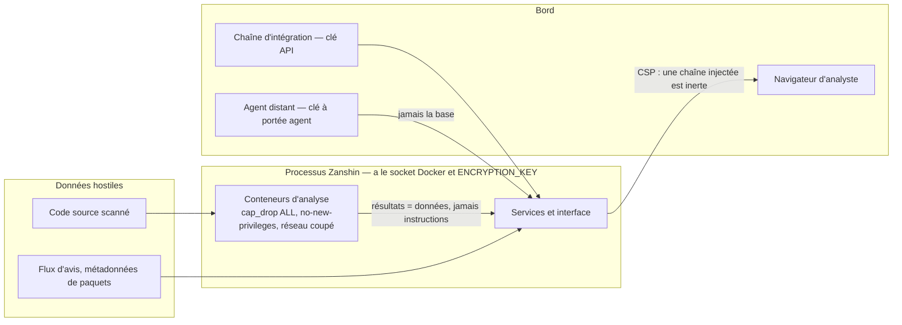

# 03 — Sécurité

Zanshin est un outil de sécurité, ce qui ne le rend pas sûr : ça le rend **intéressant à
attaquer**. Il détient des clés de déploiement, il a le socket Docker, il affiche des
chaînes produites par du code hostile, et il rend un verdict qu'on a intérêt à faire
mentir.

Ce document dit où sont les frontières, ce qui les garde, et ce qui reste ouvert.

## Ce qu'il y a à voler

| Bien | Où | Conséquence d'une fuite |
|---|---|---|
| Clés SSH de déploiement | `ssh_key`, chiffrées AES-GCM | accès en lecture à tous les dépôts surveillés |
| `ENCRYPTION_KEY` | environnement | déchiffre **toutes** les clés ci-dessus |
| Accès au socket Docker | processus | équivalent root sur l'hôte |
| Le verdict du gate | `issue`, `gate_policy` | un build qui devait échouer passe |
| Rapports gitleaks bruts | `scan.cves`, purgés | **des secrets en clair** |
| Journal d'audit | `audit_log`, chaîné | efface qui a fait quoi |

La dernière ligne du tableau mérite d'être lue deux fois : **la charge brute d'un scanner
de secrets contient les secrets**. Le `Finding` normalisé, lui, ne garde que la règle, le
fichier et la ligne. C'est pourquoi la rétention purge les charges brutes, et pourquoi un
message qui sortirait du périmètre devrait être chiffré — pas « pourrait ».

## Les frontières de confiance

**Trois frontières, et ce qui les tient.**

*Entre le code scanné et Zanshin.* Le code est exécuté par un analyseur, jamais par
Zanshin, et l'analyseur tourne avec `cap_drop: ALL`, `no-new-privileges`, des plafonds
mémoire et PID, et le réseau coupé quand l'outil n'a rien à récupérer. Les quatre images
sont **épinglées par digest** : elles s'exécutent sur une machine qui a le socket Docker,
donc qui contrôle `anchore/syft:latest` contrôle la machine — et un scan doit être
reproductible.

**Aucun conteneur d'analyse ne voit le socket Docker.** L'étape SBOM d'image le montait,
pour que Syft tire l'image lui-même : c'était donner root sur l'hôte à un processus dont
l'entrée — les couches d'une image que personne ne contrôle — est hostile par définition.
Zanshin tire et exporte désormais l'image lui-même, et ne présente au conteneur qu'une
archive en lecture seule, réseau coupé. Un test le vérifie sur ce que le scanner *demande*,
pas sur ce qu'on lit dans le code.

**La chaîne du journal d'audit est un graphe, et non une file.** Elle exigeait un chaînage
strictement unique, si bien que deux instances web écrivant au même instant — elles lisent
la même queue et produisent deux entrées portant la même précédente — faisaient déclarer
rompu un journal parfaitement honnête. Une alerte fausse dans un contrôle d'intégrité finit
par couvrir les vraies. La vérification porte donc sur ce qui ne dépend pas de l'ordre :
chaque entrée correspond à sa propre empreinte, la précédente de chacune existe encore, et
aucune entrée sans empreinte n'est postérieure au début du chaînage. **Ce qu'elle ne détecte
plus** : la suppression d'une entrée dont personne ne descend — la dernière écrite, ou le
bout d'une branche. Le prix est assumé ; refermer ce cas demanderait de sérialiser toutes
les écritures d'audit, donc de faire attendre chaque action auditée derrière les autres.

**Aucun appel sortant ne suit une redirection.** `validateOutboundUrl` ne vérifie que la
*première* requête : Node suit les redirections par défaut, si bien qu'une destination
validée répondant `302 Location: http://169.254.169.254/` était rejointe sans que rien ne
revérifie. Les six appels du dépôt en avaient chacun besoin ; aucun ne l'avait. Le cas le
plus coûteux n'est pas le webhook mais la revue par modèle : son garde exige une destination
interne précisément parce qu'elle reçoit le code source du dépôt scanné, et une redirection
vers l'extérieur en aurait fait un canal d'exfiltration silencieux. La règle vit dans un
seul module, et un test d'architecture empêche le septième appel de repartir directement sur
`fetch` — un manquement qu'aucun test fonctionnel ne verrait, puisque tout marche
parfaitement tant que personne ne redirige.

**La file de scans est routée.** N'importe quel agent enregistré réclamait n'importe quel
scan : un agent posé dans un segment de moindre confiance — ce pour quoi les agents distants
existent — pouvait réclamer les scans de tous les dépôts et en recevoir les clés. Une cible
peut désormais exiger une étiquette, et seuls les agents qui la portent la voient. Ni le
scellement de bout en bout ni le mode `local` ne referment cela : le premier protège la clé
en chemin et l'ouvre bien chez le demandeur, le second retire la clé mais laisse l'agent lire
le code source.

**La configuration des analyseurs vient de Zanshin, jamais de la cible.** gitleaks retombe
sur le `.gitleaks.toml` du dépôt scanné quand aucun `--config` ne lui est donné, et
l'utilise *à la place* de son jeu intégré ; Semgrep n'examine que les fichiers suivis par
git. Dans les deux cas, le dépôt audité décidait de ce qui serait cherché chez lui — et un
scan qui ne trouve rien parce qu'on lui a dit de ne rien chercher se lit « analysé, rien
trouvé », ce qui résout tout l'historique de la cible.

*Entre les résultats et l'analyste.* Ce que Zanshin affiche vient des analyseurs et des
flux d'avis, c'est-à-dire de données qu'un attaquant influence. La CSP décide si une
chaîne injectée est inerte ou s'exécute avec la session de l'analyste. Elle est réelle et
étroite ; `'unsafe-inline'` et `'unsafe-eval'` y figurent parce que le bundle généré les
exige, et le dire est plus honnête que publier une politique que quelqu'un désactivera au
premier contact. **HSTS est volontairement absent** : Zanshin s'atteint souvent en HTTP
sur une adresse interne, et un HSTS rendrait cette origine définitivement injoignable dans
le navigateur qui l'a vue une fois. Il appartient au proxy qui termine le TLS, lequel sait
qu'il a du TLS.

*Entre un agent et la base.* Un agent distant **ne parle qu'à l'API**. C'est la raison
numéro un du long-polling : un agent avec une connexion PostgreSQL aurait besoin des
identifiants de la base *et* de `ENCRYPTION_KEY`, donc de quoi déchiffrer toutes les clés
SSH de toutes les cibles ([décision 0003](decisions/0003-long-polling-pour-les-agents.md)).
Un test d'imports garantit qu'il ne peut pas importer la couche base.

## Les contrôles, et pourquoi ils sont réglés ainsi

**Authentification et sessions.** bcrypt coût 12, expiration de session à 12 heures
vérifiée au chargement de page. Une estampille absente ou illisible compte comme expirée —
échouer ouvert rendrait le contrôle décoratif, et le coût d'échouer fermé est une
reconnexion.

**Anti-bourrage.** Les échecs sont comptés **par utilisateur et par client**, jamais l'un
seul : sur le seul utilisateur, n'importe qui verrouille un compte connu en échouant
exprès ; sur le seul client, un botnet répartit ses tentatives. La vérification a lieu
**avant** le hachage — sinon la lenteur volontaire de bcrypt devient un moyen de dépenser
le CPU du serveur gratuitement.

**Clés API.** Trois axes : portées (`read`/`scan`/`export`), restriction à une cible, et
expiration. La restriction rétrécit aussi les **listes** — refuser les routes par cible en
laissant `/issues` tout renvoyer n'aurait rien restreint. Un refus répond **403 et non
404**, pour qu'un pipeline distingue « ma clé est ailleurs » de « cette cible a disparu ».
Créer une clé est réservé aux administrateurs : une clé sans portée était une élévation de
privilège par conception.

**Chiffrement.** AES-GCM, avec le contexte lié au chiffré (`ssh_key:{id}:private_key`).
Sans ces données associées, quiconque pouvait écrire en base copiait la clé chiffrée du
dépôt B dans la ligne du dépôt A, et A était ensuite cloné avec la clé de B, **sans
erreur**. Le déchiffrement retente sans contexte pour les valeurs antérieures et le
journalise. Il n'y a **pas de clé par défaut** : une constante publiée aurait déchiffré la
base de tout le monde. La rotation passe par `ZANSHIN_PREVIOUS_ENCRYPTION_KEYS`.

**Garde d'URL.** Deux règles pour deux besoins opposés, et c'est le piège. Pour le webhook,
le risque est le SSRF : on refuse le privé. Pour Ollama, le risque est **l'exfiltration** —
la revue IA envoie jusqu'à 40 000 caractères de code source à l'URL configurée — donc on
exige le privé. Le link-local (`169.254.0.0/16`, les métadonnées d'instance) est refusé
*même* quand le privé est autorisé, parce que c'est précisément l'adresse que l'attaque
vise. Toutes les adresses résolues sont vérifiées, pas la première : un nom peut renvoyer
une publique et une privée. Et l'URL est **revalidée à l'envoi**, pas seulement à
l'enregistrement — un réglage écrit directement en base ne doit pas devenir un canal
d'exfiltration.

**Journal d'audit.** Chaque entrée porte l'empreinte de la précédente, plus l'IP et le
user-agent. Le chaînage ne rend pas le journal inaltérable — qui peut écrire la table peut
réécrire toute la chaîne — mais il rend l'édition **sélective** détectable, et c'est la
menace réaliste quand la ligne intéressante est une parmi des milliers. Les entrées
antérieures au chaînage sont déclarées non vérifiables plutôt que rétro-hachées :
backfiller des empreintes serait fabriquer une preuve.

**Le verdict n'accepte pas n'importe quoi.** Deux types de constats n'entrent dans aucun
verdict de gate : la revue IA, parce qu'un dépôt hostile pourrait faire écrire un
`critical` à un modèle à qui l'on donne son code ; et la qualité, parce qu'un gate qui
rougit le jour où l'on active l'analyse du code source est un gate qu'on désactive à midi
([décision 0005](decisions/0005-la-qualite-ne-bloque-jamais-le-gate.md)).

**Un LLM n'est pas une frontière de confiance.** L'échantillon envoyé à la revue IA est
encadré par un délimiteur explicite et le prompt demande au modèle de *signaler* une
tentative d'injection plutôt que d'y obéir. C'est une atténuation, pas un correctif — et
c'est la raison de fond pour laquelle son verdict ne bloque rien.

## Ce que les tests garantissent

Ce qui compte ici est vérifié plutôt qu'affirmé : l'agent ne peut pas importer la couche
base (test d'imports), le journal détecte une altération (`verify_chain`), une clé
restreinte ne voit pas les autres cibles, une URL Ollama publique est refusée à l'envoi,
la page de connexion ne cite aucun identifiant, et aucune feuille de style tierce n'est
déclarée — le CSP les refuserait, donc la déclarer produirait une page qui *paraît*
correcte.

## Reste ouvert

- **Pas de cloisonnement par équipe au niveau des comptes.** Un utilisateur voit tout. La
  limite la plus lourde de cette liste.
- **La fenêtre de DNS rebinding n'est pas fermée** entre la vérification d'une URL et la
  requête. Il faudrait épingler l'adresse résolue dans le client HTTP.
- **Le journal d'audit est dans la base qu'il surveille.**
- **Le socket Docker reste monté** dans le déploiement par défaut. Seuls le backend
  `local_api` et les agents distants le retirent du processus exposé sur le réseau.
- **Un agent compromis peut fausser un verdict** en remontant des résultats mensongers.
  Les remontées sont auditées ; elles ne sont pas prouvées.
