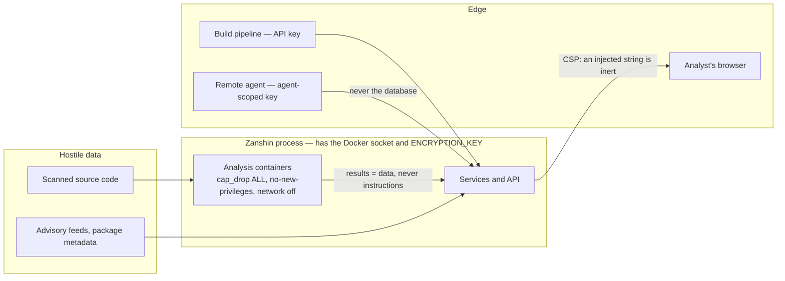

# 03 — Security

Zanshin is a security tool, which does not make it secure: it makes it **interesting to
attack**. It holds deployment keys, it has the Docker socket, it displays strings
produced by hostile code, and it returns a verdict someone has an interest in making
lie.

This document says where the boundaries are, what guards them, and what is still open.

## What there is to steal

| Asset | Where | Consequence of a leak |
|---|---|---|
| SSH deployment keys | `ssh_key`, AES-GCM encrypted | read access to every watched repository |
| `ENCRYPTION_KEY` | environment | decrypts **all** the keys above |
| Access to the Docker socket | process | root-equivalent on the host |
| The gate verdict | `issue`, `gate_policy` | a build that should have failed passes |
| Raw gitleaks reports | `scan.cves`, purged | **secrets in clear text** |
| Audit log | `audit_log`, chained, optionally mirrored outside the database | erases who did what |

The last row deserves reading twice: **a secret scanner's raw payload contains the
secrets**. The normalized `Finding` keeps only the rule, the file and the line. That is
why retention purges the raw payloads, and why a message leaving the perimeter would have
to be encrypted — not "could".

## The trust boundaries



**Three boundaries, and what holds them.**

*Between the scanned code and Zanshin.* The code is executed by an analyzer, never by
Zanshin, and the analyzer runs with `cap_drop: ALL`, `no-new-privileges`, memory and PID
caps, and the network cut off when the tool has nothing to fetch. All four images are
**pinned by digest**: they run on a machine that has the Docker socket, so whoever
controls `anchore/syft:latest` controls the machine — and a scan should be reproducible.

**No analysis container sees the Docker socket.** The image SBOM step used to mount it,
so that Syft could pull the image itself: that handed root on the host to a process whose
input — the layers of an image nobody controls — is hostile by definition. Zanshin now
pulls and exports the image itself, and presents the container with nothing but a
read-only archive, network off. A test checks this against what the scanner *asks for*,
not against what one reads in the code.

**The audit log's chain is a graph, not a queue.** It used to require a strictly unique
chaining, so that two web instances writing at the same instant — both reading the same
tail and producing two entries carrying the same predecessor — made a perfectly honest
log declare itself broken. A false alarm in an integrity check ends up covering the real
ones. The verification therefore covers what does not depend on order: each entry matches
its own hash, each one's predecessor still exists, and no entry without a hash is later
than the start of the chaining. **What it no longer detects**: the deletion of an entry
nobody descends from — the last one written, or the tip of a branch. The price is
accepted; closing that case would mean serializing every audit write, and therefore
making every audited action queue behind the others.

**No outbound call follows a redirect.**
[`validateOutboundUrl`](../../zanshin-java/zanshin-common/src/main/java/com/asmolabs/zanshin/common/domain/net/OutboundUrlGuard.java) only checks the
*first* request: Node follows redirects by default, so a validated destination answering
`302 Location: http://169.254.169.254/` was reached with nothing re-checking. All six
calls in the repository needed this; none had it. The costliest case is not the webhook
but the model review: its guard demands an internal destination precisely because it
receives the scanned repository's source code, and a redirect outward would have made it
a silent exfiltration channel. The rule lives in a single module, and an architecture
test stops the seventh call from building its own client — a lapse no functional test would
see, since everything works perfectly as long as nobody redirects. That test **did not exist**
until the pin was added: this paragraph described the NestJS suite, which was not carried over
by the port, and for that whole time the sentence was the only thing enforcing it.

**The scan queue is routed.** Any registered agent used to claim any scan: an agent placed
in a less-trusted segment — which is what remote agents are for — could claim the scans of
every repository and receive their keys. A target can now require a label, and only agents
carrying it see it. Neither end-to-end sealing nor `local` mode closes this: the first
protects the key in transit and does open it at the claimant, the second removes the key
but still lets the agent read the source code.

**The analyzers' configuration comes from Zanshin, never from the target.** gitleaks falls
back to the scanned repository's `.gitleaks.toml` when no `--config` is given, and uses it
*instead of* its built-in set; Semgrep only examines files tracked by git. In both cases
the audited repository decided what would be looked for in it — and a scan that finds
nothing because it was told to look for nothing reads as "analyzed, nothing found", which
resolves the target's entire history.

*Between the results and the analyst.* What Zanshin displays comes from the analyzers and
the advisory feeds, that is, from data an attacker influences. The CSP decides whether an
injected string is inert or runs with the analyst's session, and it is now **sent** — on every
response, static files included, since the document carrying the string is `index.html` and not
the JSON. `SecurityHeadersTest` asserts the whole policy string rather than its presence,
because this control was already lost once: it was described here for an implementation that
was then rewritten, and nothing disagreed with the document for as long as the header was
missing. That is the failure mode of a security header — every page still renders.

```
default-src 'self'; script-src 'self'; style-src 'self' 'unsafe-inline'; img-src 'self' data:;
font-src 'self'; connect-src 'self'; object-src 'none'; base-uri 'self'; form-action 'self';
frame-ancestors 'none'
```

**`style-src` carries `'unsafe-inline'`, and it was measured rather than assumed.** Without it
the production bundle loads, runs, and renders *entirely unstyled*: Angular emits component
styles as `<style>` elements at runtime and PrimeNG sets style attributes on what it positions,
which the console reports several dozen times on the sign-in page alone. Neither a nonce nor a
hash list closes it — a browser applies neither to style attributes — so closing it properly is
a change to the interface, not to this header. What the relaxation costs is page redressing: an
injected `<style>` can cover a button or fake a dialog. What it does not cost is execution,
because **`script-src` keeps neither `'unsafe-inline'` nor `'unsafe-eval'`**, and that is the
half that turns a displayed string into a session.

**Two things the measurement found that reading could not.** Angular's production build inlines
critical CSS by emitting `<link media="print" onload="this.media='all'">`; `script-src 'self'`
blocks that inline handler, the stylesheet stays `media="print"`, and the interface renders
unstyled — a page broken by a header nobody would suspect. `inlineCritical` is therefore off in
`angular.json`, which is the fix that keeps `script-src` strict. And two pages inherited from
the Sakai template — `auth/access` and `auth/error` — each pulled an illustration from
`primefaces.org/cdn`, which `img-src 'self' data:` refuses. `scripts/check-assets.mjs` read the
application shell only, so nothing saw them; it now reads every component template, and the
images are gone rather than the directive widened.

**HSTS is deliberately absent**: Zanshin is often reached over HTTP on an internal address, and
HSTS would make that origin permanently unreachable in any browser that saw it once. It belongs
to the proxy that terminates TLS, which knows it has TLS. `SecurityHeadersTest` pins its
absence, so that adding it becomes a decision rather than a default.

*Between one team and another.* Two kinds of grant decide what an account reads, and they are
**unioned**: the teams it belongs to, and the targets assigned to it directly. Direct assignment
is the exception — one contractor, one repository — and a team is the organisation, because a
per-account pairing costs one row per account per target and nobody maintains that by hand for
long. Intersecting the two would have made joining a team *narrow* what somebody already had, so
an administrator adding a member would silently revoke; the union is the only reading in which
both gestures grant.

Everything else follows the rule that was already there: an account with no grant sees
**nothing**, administrators see everything (somebody has to be able to assign), a refusal on
another team's target is a **404 and not a 403** — the identifier itself is not information a
stranger should confirm — and an API key's restriction is intersected with all of it, never
unioned. Two details are load-bearing rather than incidental. The membership query is a
`team_id in (…)`, whose empty form is a syntax error on some engines and matches every row on
others, so an account in no team short-circuits before the query rather than after it. And
deleting a team removes its rows **explicitly** instead of relying on the declared cascade,
because SQLite enforces foreign keys only when `PRAGMA foreign_keys = ON` has been issued and
nothing here issues it — a revocation must not depend on which of four engines is underneath.

*Between an agent and the database.* A remote agent **only talks to the API**. That is the
number one reason for long-polling: an agent with a PostgreSQL connection would need the
database credentials *and* `ENCRYPTION_KEY`, hence everything needed to decrypt every SSH
key of every target ([decision 0003](decisions/0003-long-polling-for-agents.md)). An
module graph guarantees it: `zanshin-agent` does not depend on `zanshin-core`, so the import does not compile.

## The controls, and why they are set this way

**Authentication and sessions.** Argon2id for the password — 19 MiB, two passes, through
BouncyCastle's lightweight API rather than the JCA (see the note in
[`PasswordHasher`](../../zanshin-java/zanshin-common/src/main/java/com/asmolabs/zanshin/common/domain/crypto/PasswordHasher.java);
bcrypt is gone, and with it the 72-byte truncation that forced a rule refusing long
passphrases). An absolute lifetime of 12 hours and an idle lifetime of 60 minutes, both
re-evaluated on **every request** rather than on page load. A missing or unreadable timestamp
counts as expired — failing open would make the control decorative, and the cost of failing
closed is one re-login.

**A second factor, delegated rather than built.** Zanshin holds a deployment key for every
repository it watches, and a password is one factor. `ZANSHIN_PASSWORD_LOGIN=false` closes the
password door, so single sign-on carries whatever the realm requires — including an MFA
requirement Zanshin never implements, never stores a secret for, and never has to write a
recovery path around. What blocked that delegation before was that the password stayed
available beside the provider: the realm's strongest requirement was optional in practice.

The guard matters more than the feature. **The request is honoured only when a provider is
configured**; asked for without one, password sign-in stays on and says so at error level,
because closing the only door that works locks everybody out of a tool holding every watched
repository's key — and the person best placed to notice is the one who can no longer sign in.
That is the same shape as `OidcConfiguration` hanging on the issuer variable rather than on a
bean. The way back from a realm that has become unreachable is the variable and a restart, by
whoever can reach the process: deliberately not a button in the interface, which the attacker
this setting exists to stop could also press.

**The session store holds verifiers, not credentials.** `t_session`'s primary key is the
token's SHA-256; the token itself is written nowhere. It used to be the key in the clear,
which meant every copy of that table was a set of live sessions — a nightly backup, a read
replica, a `select *` pasted into a support thread, or the dump of the very database the
audit log lives in. Reading the table now yields hashes, and presenting one authenticates
nobody, because the lookup hashes what the caller sent.

**SHA-256 and not Argon2id here, for the opposite reason to the password.** A session token
is 32 bytes from a CSPRNG: there is no dictionary to walk, so a memory-hard derivation
protects nothing — and it would be paid on every authenticated request, which is how a
protection becomes the denial-of-service lever. API keys can afford Argon2 precisely because
their clear prefix narrows the lookup to a handful of rows first; a session is resolved by
primary key, once per request, and has no such budget.

The field is `tokenHash`, not `token`, and that is a control rather than a preference: the
two are one assignment apart, and writing the clear token into the hash column produces a
system that works perfectly and protects nothing. Upgrading **drops** the table rather than
renaming its column — a rename would carry over rows holding exactly the clear tokens the
change exists to stop storing. Everybody signs in once more; a session is not durable data.

**Anti-stuffing.** Failures are counted **per user and per client**, never one alone: on
the user alone, anyone locks a known account by failing on purpose; on the client alone, a
botnet spreads its attempts. The check happens **before** hashing — otherwise Argon2id's
deliberate cost, memory included, becomes a way to spend the server's CPU for free.

**API keys.** Three axes: scopes (`read`/`scan`/`export`), restriction to one target, and
expiry. The restriction also narrows the **lists** — refusing the per-target routes while
letting `/issues` return everything would have restricted nothing. A refusal answers
**403, not 404**, so that a pipeline can tell "my key is for something else" from "that
target is gone". Creating a key is reserved to administrators: a key without a scope was a
privilege escalation by design.

**Encryption.** AES-GCM, with the context bound to the ciphertext
(`ssh_key:{id}:private_key`). Without that associated data, anyone who could write to the
database copied repository B's encrypted key into repository A's row, and A was then
cloned with B's key, **with no error**. Decryption retries without context for older
values and logs it. There is **no default key**: a published constant would have
decrypted everybody's database. Rotation goes through
`ZANSHIN_PREVIOUS_ENCRYPTION_KEYS`.

**URL guard.** Two rules for two opposite needs, and that is the trap. For the webhook the
risk is SSRF: private addresses are refused. For Ollama the risk is **exfiltration** — the
AI review sends up to 40,000 characters of source code to the configured URL — so private
is required. Link-local (`169.254.0.0/16`, instance metadata) is refused *even* when
private is allowed, because that is precisely the address the attack aims at. Every
resolved address is checked, not the first: one name can return a public and a private
one. And the URL is **re-validated at send time**, not only when saved — a setting written
straight into the database must not become an exfiltration channel.

**And the connection goes to the address that was checked.** Validating a name and then
handing the *name* to a client means two lookups, and between them the answer can change: a
record with a one-second TTL answers with a public address while the settings page is saved
and with `169.254.169.254` when the request is made. Everything reads correctly and nothing
is protected — that is DNS rebinding, and the only place it can be closed is where the socket
is opened. `OutboundUrlGuard.validateAndResolve` therefore returns the addresses it checked,
and `PinnedHttpSender` connects to those and resolves nothing again.

The JDK's `HttpClient` could not do it: it has no resolver hook — checked against JDK 25 —
and the JDK's answer, `InetAddressResolverProvider`, replaces resolution for the **whole
process**, which is the same global mutable state this codebase refuses when it declines to
register a JCA provider. Apache's client takes a resolver per client, so the pin lives for one
request. It was already on the runtime classpath through docker-java; the build now declares
it, because depending on something by accident is not depending on it.

Two details that are the difference between a pin and a broken client. The **host name still
travels** — only the lookup is replaced — so `Host`, SNI and certificate verification are
untouched; connecting to a validated IP literal instead would have traded TLS verification for
SSRF protection. And a host that was *not* checked is **refused rather than resolved**: the
resolver has no fallback, so a redirect somebody re-enables cannot leave the process. A
destination whose name does not resolve at all is refused too — there is nothing to pin to, and
sending anyway would mean the validation decided nothing.

`PinnedHttpSenderTest` proves it against a real socket rather than a mock: the request reaches
a listening server **through a host name under `.invalid`, which resolves nowhere**. Had
anything in the path asked the system resolver, it could not have arrived.

**Audit log.** Each entry carries the previous one's hash, plus the IP and user agent. The
chaining does not make the log immutable — whoever can write the table can rewrite the
whole chain — but it makes **selective** editing detectable, and that is the realistic
threat when the interesting row is one among thousands. Entries predating the chaining are
declared unverifiable rather than back-hashed: backfilling hashes would be manufacturing
evidence.

**And there can now be a second copy, outside the database the log watches.**
`ZANSHIN_AUDIT_MIRROR` names a path; each entry is appended there as one JSON line, in the
canonical form the hash covers, so the two copies are comparable field by field. It is not
that a file is unforgeable — it is not. It is that erasing an entry now takes **two edits in
two media with two sets of permissions**, and the mirror is normally shipped off the host by a
collector within seconds, at which point the second copy is beyond reach of whoever holds the
database.

What that buys, precisely: **the deletion the chain is blind to**. Removing the last entry
written — the tip nobody descends from, which is exactly the entry somebody covering their
tracks removes — leaves a chain that verifies perfectly. This document recorded that as an
accepted limit. Against a mirror it is one subtraction, and `/audit-log/verify` reports it as
a break rather than calling the log intact. The reverse difference is reported too: entries in
the table and not in the mirror, which is what an insert by somebody holding the database and
not the file looks like — indistinguishable, from here, from entries written before the mirror
existed, and the report says so rather than guessing.

**Off unless configured, and the screen says which.** Writing to a path unasked fails on a
read-only container filesystem, and a control that warns at every start is one people learn to
ignore. So the default is off — and the verification reports `mirrored: false` instead of
reporting nothing, because "0 missing" from a mirror that does not exist reads as reassurance
and is not.

**An accepted risk now has an end, and the end arrives.** A triage decision may carry a review
date — offered and not imposed, because "the component is not present" needs no re-examination
while "not reachable in our configuration" badly does, and only the person deciding knows which
they recorded. The date returns the issue to `under_review` when it passes, which changes what a
gate answers and what a VEX document asserts, so it is recorded in the triage history as an
event with **no actor**: inventing a "system" user would put a person who does not exist into a
compliance report.

**It was not enforced until now, and the shape of that gap is worth keeping.** The expiry
existed, was tested, was exported into SARIF — and was called by nothing outside its own suite.
An acceptance was therefore permanent, silently, on an installation whose export documents
promised a review date. It is wired into the hourly tick, so the worst case is that a lapsed
decision outlives its date by an hour; the alternative — expiring on page load — would leave the
gate a pipeline asks for at three in the morning answering from a decision that lapsed the day
before.

**A remediation deadline reports, and blocks nothing.** Each severity carries a window —
15 / 30 / 90 / 180 days by default, all four settings — counted from when an issue was **first
seen**, never from the last scan: restarting the clock at each sighting would make a deadline
unreachable by construction, since a target scanned nightly would reset every window every
night. A settled issue has none, because a triage decision is not lateness, and a window of zero
disables its severity rather than breaching it — the other reading turns clearing a field into a
backlog entirely in breach. No window enters a gate verdict, for the reason
[decision 0005](decisions/0005-quality-never-blocks-the-gate.md) gives about quality: a gate that
starts failing the day a policy is switched on is a gate that gets switched off by lunchtime.

The figure on the dashboard, the list it links to and the line in the posture PDF all come from
**one clause** — a union of per-severity thresholds evaluated in the database — so a count and
the rows behind it cannot disagree. `RemediationSlaRoutesTest` checks exactly that pairing,
because two copies of one filter part company the first time either is edited.

**The verdict does not accept just anything.** Two finding types enter no gate verdict: AI
review, because a hostile repository could get a model it is handed its own code to write
a `critical`; and quality, because a gate that turns red the day source-code analysis is
switched on is a gate that gets switched off by lunchtime
([decision 0005](decisions/0005-quality-never-blocks-the-gate.md)).

**An LLM is not a trust boundary.** The sample sent to the AI review is wrapped in an
explicit delimiter and the prompt asks the model to *report* an injection attempt rather
than obey it. That is a mitigation, not a fix — and it is the underlying reason its
verdict blocks nothing.

## What the tests guarantee

What matters here is checked rather than asserted: the agent cannot import the database
layer (the module graph makes it impossible), the log detects tampering (`verifyChain`),
a restricted key does not see other targets, a public Ollama URL is refused at send time,
the login page names no credential, a team member sees what the team owns and an account in no
team sees nothing (`TeamVisibilityTest`), the policy header is sent with its every directive
(`SecurityHeadersTest`), a deleted entry the chain declares intact is caught by the mirror
(`AuditMirrorTest`), and no third-party asset is declared anywhere — shell or component
template — because the CSP would refuse it, so declaring it would produce a page that merely
*looks* right.

## Still open

- **An aggregate was leaking past the visibility rule.** The dashboard's backlog-by-severity
  breakdown was a single grouped query with no visibility clause, so a reader assigned to one
  repository read the whole deployment's severity counts beside a posture that was correctly
  narrowed. Fixed with this change, and worth recording as the shape of the mistake: every read
  path was asking `Visibility` except the one that returned numbers rather than rows.
- **Restricted visibility is off by default.** `TARGET_VISIBILITY` ships as `everyone`, so an
  update changes nothing for an existing deployment — and a deployment that never changes it has
  no partitioning at all. Teams and per-account assignment both do nothing until it is switched
  to `assigned`, which is a setting an administrator has to know exists. The screen says which
  mode is in force; nothing forces the choice.
- **The audit log is in the database it watches**, unless a mirror is configured — and the
  default is unconfigured. A deployment that sets no `ZANSHIN_AUDIT_MIRROR` still has one copy
  and one set of credentials protecting it; the verification screen says so, which is the most
  a default-off control can do.
- **The Docker socket stays mounted** in the default deployment. Only remote agents take
  it out of the process exposed on the network; the `local_api` back end that also did so
  was not carried over by the port. A filtering proxy in front of it now has a documented and
  *measured* configuration ([04](04-runtime-and-deployment.md#the-docker-socket-and-what-a-proxy-in-front-of-it-is-worth)),
  which shrinks the sideways reach — but `POST /containers/create` is on the list Zanshin needs,
  and that endpoint accepts a privileged container bind-mounting `/`. **The proxy is not a
  containment boundary**; rootless Docker or a remote agent is what reduces the privilege.
- **A compromised agent can skew a verdict** by reporting false results. Reports are
  audited; they are not proven.
- **Zanshin's own supply chain is now scanned by Zanshin's own scanners**, on every run, in
  the `supply-chain` job: Syft builds an SBOM of the jar that actually ships and Grype fails
  the build on a **fixable** High finding. `--only-fixed` is the design, not a softening —
  failing on an advisory with no released fix makes a gate nobody can satisfy, which is
  [decision 0005](decisions/0005-quality-never-blocks-the-gate.md) applied to ourselves.
  Turning it on found three fixable High findings in the jar (httpcore5 twice, the PostgreSQL
  driver), so it went green by fixing rather than by lowering the line; the catalog raises all
  three above what the Spring Boot BOM asks for, with the advisories named. `npm audit` runs
  there too — blocking on what ships, reporting on the development tree — so "it reports
  nothing" is a measurement rather than a belief. Medium findings with fixes (jackson-databind,
  log4j-api, both BOM-managed) are printed and block nobody.
- **Releases are not signed, and there is no release pipeline to sign them in.** Publishing a
  signed artifact and its SBOM would be the next step for anybody consuming Zanshin as a
  binary; writing the signing before the publishing would be inventing a process the project
  does not have.
