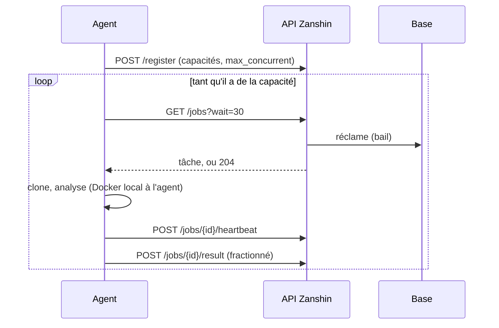

# 04 — Exécution et déploiement

## Trois formes, et une seule que presque tout le monde utilise

**Une instance, un fichier.** Un processus, SQLite, le socket Docker. C'est le défaut, et
ce n'est pas un mode dégradé : c'est ce qui fait qu'on peut essayer Zanshin en un quart
d'heure, ce qui décide de l'adoption d'un outil libre. Tout ce qui suit est facultatif.

**Plusieurs instances.** Possible depuis que la file, l'ordonnanceur et les compteurs ont
cessé d'être en mémoire. Exige PostgreSQL, Redis et des migrations en étape de
déploiement — et **l'application refuse de démarrer** quand ce n'est pas réuni.

**Des agents distants.** Une instance web, des exécutants ailleurs — un autre réseau,
une autre architecture, une machine qui a le droit d'atteindre un dépôt privé que le plan
de contrôle n'a pas. Fonctionne **même sur SQLite**, parce qu'un agent ne touche jamais la
base.

## Ce qui est refusé au démarrage, et pourquoi

`backend/src/persistence/dialects.ts` déclare, et le démarrage vérifie, ce qui ne peut pas marcher. Refuser tôt
avec un message qui nomme la raison, plutôt que de laisser découvrir le problème sous la
forme d'une base corrompue ou d'utilisateurs déconnectés au hasard.

| Situation | Réaction | Ce qui casserait sinon |
|---|---|---|
| Deuxième instance sur SQLite | **refus** | SQLite a un seul écrivain : ce n'est pas lent, c'est corrompu. Et `FOR UPDATE SKIP LOCKED` n'y existe pas, donc la réclamation ne peut pas être rendue sûre |
| Plusieurs instances web sans `REDIS_URL` | avertissement | Reflex garde l'état d'un client sur l'instance qui a accepté sa socket ; un client qui atterrit sur l'autre est déconnecté par intermittence, sans erreur exploitable |
| `ZANSHIN_AUTO_MIGRATE` actif sur plusieurs hôtes | avertissement | le verrou de migration est un verrou fichier : il coordonne un hôte, pas une flotte |
| URL MySQL | **refus** | [décision 0004](decisions/0004-sqlite-et-postgresql-seulement.md) |

**Comment une seconde instance est détectée.** Pas en demandant à l'opérateur — un drapeau
de configuration est faux exactement quand ça compte, parce que personne ne le pose.
Chaque instance enregistre déjà une ligne d'agent intégré pour son hôte et la rafraîchit à
chaque tick ; une autre instance vivante est donc la ligne d'un autre hôte avec un
`last_seen_at` récent.

Deux limites assumées : deux instances **sur le même hôte** partagent une ligne et sont
invisibles ici — ce déploiement n'achète rien qu'une limite de concurrence plus haute ne
donnerait ; et une instance arrêtée depuis moins de deux minutes semble encore vivante, ce
qui peut refuser un redémarrage tournant sous un nouveau nom d'hôte. `ZANSHIN_ALLOW_MULTI_INSTANCE_SQLITE`
existe pour ce seul cas, et il ne rend rien sûr — il fait taire le contrôle.

## La file, et sa réclamation

Les scans sont des lignes avec un statut. Ce qui manquait était la **réclamation
transactionnelle**.

Sur **PostgreSQL** : `SELECT … FOR UPDATE SKIP LOCKED` puis le changement de statut dans
la *même* transaction. Soit une instance tient la ligne et la ligne le dit, soit ni l'un
ni l'autre.

Sur **SQLite** : un `UPDATE ... WHERE status = 'pending'` conditionnel dont le nombre de
lignes touchées désigne le gagnant. Correct pour les threads d'un processus, ce qui est
tout ce que SQLite permet de toute façon.

Le contrôle de dialecte est **explicite**, et c'est important : le dialecte SQLite de
SQLAlchemy **laisse tomber `FOR UPDATE` en silence** au lieu de le refuser. Demander sans
vérifier aurait produit une réclamation d'apparence transactionnelle, verte sur la machine
du développeur, distribuant le même scan à deux processus en production.

### Le bail

`claimed_by`, `claimed_at`, `lease_expires_at`, `attempts`. Un exécutant renouvelle
pendant qu'il travaille ; un exécutant qui meurt cesse, et le scan est repris après
expiration. Le bail est généreux (20 minutes par défaut) parce qu'une seule étape — tirer
une grosse image, passer Grype sur un gros SBOM — prend des minutes, et qu'un bail plus
court que l'étape déclarerait morts des exécutants en bonne santé.

Après trois reprises, le scan **échoue** au lieu d'être remis en file : une cible qui bloque
tout ce qui la prend occuperait sinon la flotte entière, et un opérateur verrait un scan
éternellement « sur le point de démarrer ».

### Ce qu'un vrai test de concurrence a trouvé

Dix réclamants concurrents, connexions distinctes, contre un vrai serveur : aucun scan
jamais réclamé deux fois — la sûreté tenait dès la première version — mais **six réclamants
sur dix repartaient les mains vides** alors que vingt scans attendaient. Un problème de
débit, pas de sûreté, dont la forme en production est un agent qui interroge la file trente
secondes pendant que du travail attend.

La correction évidente — élargir la fenêtre de sélection puis la tronquer — **aggrave les
choses** : un réclamant qui verrouille des lignes qu'il ne prendra pas affame les autres
tant qu'il les tient. Ce qui marche est de demander exactement ce dont on a besoin et de
réessayer, avec un budget mesuré.

C'est exactement la classe de défaut annoncée par la stratégie de test : invisible sur
SQLite et à la lecture. **Une garantie de concurrence non exécutée contre un vrai serveur
n'est pas une garantie.**

## Les agents distants

**Long-polling, pas un broker.** L'agent demande du travail quand il a de la capacité : le
contrôle de flux se fait tout seul, alors qu'un broker qui pousse ignore ce que l'agent
fait. La latence n'est pas un enjeu — un scan dure une à deux minutes, un long-poll de
trente secondes coûte quelques pourcents. Et la raison principale reste la frontière de
confiance ([décision 0003](decisions/0003-long-polling-pour-les-agents.md)).

**Une remontée rejouée ne doit rien casser.** Un agent qui réessaie ne doit pas insérer
deux fois 421 constats. L'empreinte ne suffit pas : elle rend le rapprochement idempotent,
mais `sync_from_scan` incrémente `times_seen` à chaque appel, donc un rapport rejoué
**fausserait l'historique sans créer de doublon visible**. D'où un identifiant de message,
une table `processed_message` avec contrainte d'unicité, et l'insertion de cet identifiant
**dans la transaction qui applique l'effet**.

**Les grosses charges sont fractionnées.** 421 constats et un SBOM de 18 Mo ne passent pas
dans une requête confortable. C'est du fractionnement, pas du regroupement par lots — le
regroupement n'achèterait rien de mesurable à ce débit et retarderait la seule chose que
quelqu'un attend.

## Ce qui sort

Les notifications passent par un **outbox** : une ligne écrite dans la transaction qui
produit le résultat de scan, relayée par le tick. Avant, le webhook partait *après* la
validation — si le processus mourait entre les deux, la notification était perdue en
silence.

Réessais espacés, abandon après huit tentatives avec entrée d'audit, `message_id` dans la
charge pour qu'un récepteur puisse dédupliquer une livraison au-moins-une-fois.

Il n'y a **pas d'outbox pour la file des scans** : il n'y a pas de second système, la base
suffit.

## Les réglages qui comptent

| Variable | Ce qu'elle décide |
|---|---|
| `ZANSHIN_DATABASE_URL` / `ZANSHIN_DB_PATH` | où vivent les données. Un chemin suffit pour le cas courant |
| `ENCRYPTION_KEY` | sans elle, rien ne peut être chiffré. Aucune valeur par défaut |
| `ZANSHIN_PREVIOUS_ENCRYPTION_KEYS` | rotation : les anciennes clés restent en lecture |
| `ZANSHIN_ALLOWED_ORIGINS` | qui peut ouvrir le websocket. **Par défaut le port 3000 seulement** — sur un autre port, l'interface se charge et rien ne fonctionne |
| `REDIS_URL` | état Reflex et compteurs partagés. Requis dès deux instances web |
| migration | `npm --workspace backend run migration:run` comme étape de déploiement, avant le démarrage des instances |
| `ZANSHIN_*_IMAGE` | remplacer une image d'analyseur épinglée, pour la mettre à jour |
| `ZANSHIN_SEMGREP_RULES_DIR` | règles fournies par l'opérateur, fusionnées avec celles embarquées |

## Reste ouvert

- **La base par défaut vit dans `zanshin/`**, que le rechargement à chaud surveille : en
  développement, chaque écriture relance le backend, jusqu'à ce qu'il cesse de répondre.
  Contourné par `ZANSHIN_DB_PATH`, pas corrigé.
- **`ZANSHIN_ALLOWED_ORIGINS` vaut le port 3000 en dur.** Sur un autre port, le websocket
  est refusé et l'interface ne dit rien de plus qu'une petite icône barrée ; le message
  est dans le journal du serveur.
- **`ZANSHIN_ROLE`** (séparer un rôle `web` d'un rôle `agent` dans le même artefact) est
  décrit et non fait. Les agents distants couvrent le besoin réel ; le gain restant serait
  de retirer le client Docker du processus exposé sur le réseau.
- **Le routage par capacité** n'existe pas : il n'y a pas encore deux agents différents à
  départager.
- **Le `Dockerfile.agent` n'a jamais été construit.**
