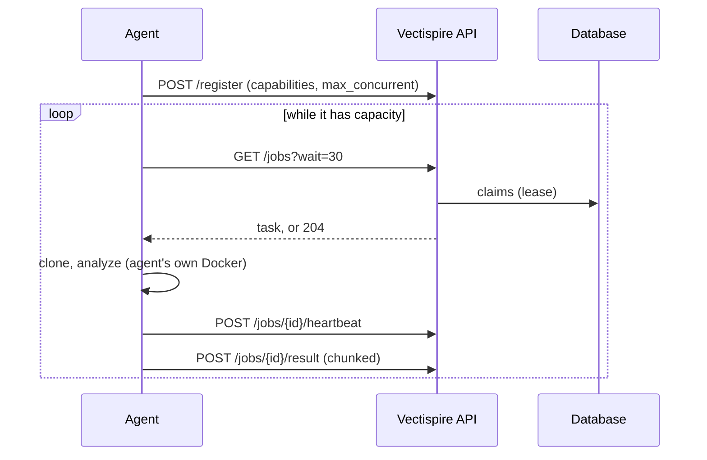

# 04 — Runtime and deployment

## Three shapes, and only one that almost everybody uses

**One instance, one file.** One process, SQLite, the Docker socket. This is not a degraded
mode: it is what lets someone try Vectispire in a quarter of an hour, which is what decides
whether a free tool gets adopted. Everything that follows is optional.

To be set explicitly — `VECTISPIRE_DB_DIALECT=sqlite` — because the code's default is
PostgreSQL, which is what a lasting deployment wants. This shape was in fact **announced
without existing** for the whole of the port: the dialect was listed among the supported
engines, its driver was not installed, and no connection was possible. All four engines
now pass the entire integration campaign, each with its own set of migrations.

**Several instances.** Possible since the queue, the scheduler and the counters stopped
living in memory. Requires PostgreSQL. The API is stateless and the
session lives in the database, so that requirement is gone.

**Remote agents.** One web instance, executors elsewhere — another network, another
architecture, a machine allowed to reach a private repository the control plane cannot.
Works **even on SQLite**, because an agent never touches the database.

## What the engine tells you at startup, and why

[`V1__initial_schema.sql`](../../vectispire-java/vectispire-core/src/main/resources/db/migration/postgresql/V1__initial_schema.sql)
declares what each engine can and cannot do, and the startup path emits a warning for
every capability that is missing, each one naming the consequence rather than the
capability. Saying it early beats letting the problem be discovered as a corrupted
database or as users logged out at random.

| Capability | Missing on | Consequence named at startup |
|---|---|---|
| Transactional claiming | SQLite | claiming falls back to a conditional `UPDATE`; correct within one process, unsafe across several |
| Complete claim batches | MySQL | a claimant can come back empty while the queue is not; throughput, not correctness |
| Microsecond timestamps | *(none today)* | the audit chain covers the timestamp, so truncation makes every entry fail its own check |
| `NULLS LAST` | MySQL, MariaDB | ordering puts nulls at the other end; the queries compensate explicitly |
| Concurrent writers | SQLite | a second instance on the same file does not run slowly, it corrupts |

These are warnings, not refusals. An earlier design additionally refused to boot a second
instance on SQLite, detecting its peer through the built-in agent rows; that guard, and
the `VECTISPIRE_ALLOW_MULTI_INSTANCE_SQLITE` escape hatch that muted it, were not carried
over by the port. **Nothing currently stops you from pointing two instances at one SQLite
file**, and the consequence is data corruption rather than slowness. See "still open".

## The queue, and how it is claimed

Scans are rows with a status. What was missing was **transactional claiming**.

On **PostgreSQL**: `SELECT … FOR UPDATE SKIP LOCKED` then the status change in the *same*
transaction. Either an instance holds the row and the row says so, or neither.

On **MariaDB**: identical, and **measured**. Two concurrent claimants against four queued
scans — the second receives a full batch, as under PostgreSQL. Its capabilities had been
inherited from MySQL "out of caution, not observation", and three of the four were wrong.

On **MySQL**: `SKIP LOCKED` works, but skipped rows count against the `LIMIT`, so a batch
comes back short under contention — sometimes empty while the queue is not. Throughput,
not correctness: nothing is served twice, the rest goes out on the next round.

On **SQLite**: a conditional `UPDATE ... WHERE status = 'queued'` whose affected-row count
names the winner. Correct for threads within one process, which is all SQLite allows
anyway.

**The choice is made on a declared capability, not on the engine's name** — and that
capability is finally read. It had described the behaviour from the start without
producing it: claiming issued `FOR UPDATE` unconditionally.

The `better-sqlite3` driver **refuses** `FOR UPDATE` rather than ignoring it, which is
preferable: a driver that drops it silently produces a claim that looks
transactional, green on the developer's machine, and handing the same scan to two
processes in production.

### The lease

`claimed_by`, `claimed_at`, `lease_expires_at`, `attempts`. An executor renews while it
works; an executor that dies stops, and the scan is taken over after expiry. The lease is
generous (20 minutes by default) because a single step — pulling a large image, running
Grype over a large SBOM — takes minutes, and a lease shorter than the step would declare
healthy executors dead.

After three takeovers the scan **fails** instead of being requeued: a target that jams
whatever picks it up would otherwise occupy the entire fleet, and an operator would see a
scan forever "about to start".

### What a real concurrency test found

Ten concurrent claimants, separate connections, against a real server: no scan ever
claimed twice — safety held from the first version — but **six claimants out of ten came
back empty-handed** while twenty scans waited. A throughput problem, not a safety one,
whose production shape is an agent polling the queue for thirty seconds while work sits
there.

The obvious fix — widen the selection window then truncate it — **makes things worse**: a
claimant that locks rows it will not take starves the others for as long as it holds them.
What works is asking for exactly what you need and retrying, with a measured budget.

This is exactly the class of defect the testing strategy predicted: invisible on SQLite
and to a careful reading. **A concurrency guarantee not executed against a real server is
not a guarantee.**

## Remote agents



**Long-polling, not a broker.** The agent asks for work when it has capacity: flow control
happens by itself, whereas a broker that pushes has no idea what the agent is doing.
Latency is not at stake — a scan takes one to two minutes, a thirty-second long-poll costs
a few percent. And the main reason remains the trust boundary
([decision 0003](decisions/0003-long-polling-for-agents.md)).

**The queue is routed by label.** A target can require a label, and only agents carrying
it see its scans — `VECTISPIRE_WORKER_LABELS` on the executor side. Without this, any
registered agent claimed any scan, which defeats the point of placing an agent in a
less-trusted segment.

**A replayed report must break nothing.** An agent that retries must not insert 421
findings twice. The fingerprint is not enough: it makes reconciliation idempotent, but the
issue sync increments `times_seen` on every call, so a replayed report **would skew the
history without creating a visible duplicate**. Hence a message identifier, a
`processed_message` table with a uniqueness constraint, and the insertion of that
identifier **inside the transaction that applies the effect**.

**Large payloads are chunked.** 421 findings and an 18 MB SBOM do not fit in a comfortable
request. This is chunking, not batching — batching would buy nothing measurable at this
rate and would delay the one thing somebody is waiting for.

## What goes out

Notifications go through an **outbox**: a row written in the transaction that produces the
scan result, relayed by the tick. Before, the webhook fired *after* the commit — if the
process died in between, the notification was lost silently.

Spaced retries, abandonment after eight attempts with an audit entry, a `message_id` in
the payload so a receiver can deduplicate an at-least-once delivery.

There is **no outbox for the scan queue**: there is no second system, the database is
enough.

## The Docker socket, and what a proxy in front of it is worth

The built-in worker runs the analyzers as sibling containers, so the process exposed on the
network holds the Docker socket. Reaching that socket is equivalent to root on the host. That
is the deployment's largest single risk and it is worth being exact about what reduces it.

**A socket proxy needs no code change, and that was verified rather than assumed.** The client
is built from `DefaultDockerClientConfig`, which reads `DOCKER_HOST`, so pointing Vectispire at a
filtering proxy is one variable. The whole scanner suite —
`ContainerRunnerIntegrationTest`, ten cases including the pull path with the image deleted
first — was run against [`tecnativa/docker-socket-proxy`] with the flags below, and passed.
The proxy's own log is where this list comes from; it is the traffic, not a reading of the
code:

| Endpoint | Why Vectispire calls it |
|---|---|
| `GET /_ping` | is the daemon there, asked before claiming a scan rather than during one |
| `GET /images/{ref}/json` | is the pinned digest already local |
| `POST /images/create` | pull, with the platform forced |
| `GET /images/{ref}/get` | export an image as an archive, so the cataloguer never sees the socket |
| `POST /containers/create` | one analyzer, with its caps dropped and its network off |
| `POST /containers/{id}/start`, `/wait`, `/stop` | run it, wait for it, stop it when it overruns |
| `GET /containers/{id}/logs` | its stdout and stderr, kept apart |
| `DELETE /containers/{id}` | remove it |

```yaml
# The minimum that works. Every other section of the API stays refused — `GET /info` answers
# 403, which is how the restriction was confirmed to be real.
services:
  docker-socket-proxy:
    image: tecnativa/docker-socket-proxy
    volumes: ["/var/run/docker.sock:/var/run/docker.sock:ro"]
    environment:
      CONTAINERS: 1   # create, start, wait, stop, logs, remove
      IMAGES: 1       # inspect, pull, export
      PING: 1
      POST: 1         # without it every call above is read-only and no scan runs
  vectispire:
    environment:
      DOCKER_HOST: tcp://docker-socket-proxy:2375
    # and no socket mounted here
```

**Now the part that matters more than the table.** `CONTAINERS=1` with `POST=1` allows
`POST /containers/create`, and that endpoint accepts `Privileged`, `CapAdd` and a bind mount
of `/`. **Anyone who can reach this proxy can still take the host.** The proxy therefore does
not make the socket safe; what it removes is everything *else* — `exec`, swarm, secrets,
networks, volumes, `/info`, the events stream — which shrinks what a compromise reaches
sideways, and makes the endpoints Vectispire uses an enumerable list somebody can audit. Deploy
it for that, and do not deploy it believing the escape is closed.

What actually reduces the privilege, in ascending order of what it costs to run:

- **Rootless Docker.** The escape then lands on an unprivileged user rather than on root. One
  daemon to reconfigure, and bind mounts need care; it is the highest ratio of the three.
- **Remote agents** ([decision 0003](decisions/0003-long-polling-for-agents.md)). The socket
  moves to a machine that holds no `ENCRYPTION_KEY` and serves nothing on the network. This is
  the shape Vectispire was designed for, and it is why the agent cannot reach the database.
- **A sandboxed runtime** — gVisor, Kata, Sysbox — as the analyzers' runtime. It contains the
  analyzer, not the socket holder, so it pairs with one of the two above rather than replacing
  them.

[`tecnativa/docker-socket-proxy`]: https://github.com/Tecnativa/docker-socket-proxy

## The settings that matter

| Variable | What it decides |
|---|---|
| `VECTISPIRE_DB_URL`, `VECTISPIRE_DB_USER`, `VECTISPIRE_DB_PASSWORD` | where the data lives. A **JDBC** URL — `jdbc:postgresql://…`, `jdbc:mysql://…` — from which the driver and the dialect follow; there is no separate dialect variable |
| `ENCRYPTION_KEY` | without it, nothing can be encrypted. No default value |
| `VECTISPIRE_PREVIOUS_ENCRYPTION_KEYS` | rotation: the old keys stay readable |
| `VECTISPIRE_AUDIT_MIRROR` | a path where each audit entry is also appended, outside the database it watches. Empty means one copy, and `/audit-log/verify` reports that |
| `DOCKER_HOST` | read by the Docker client, so the daemon can be a filtering proxy instead of the socket. See the section above for the exact surface, and for what it does not buy |
| `VECTISPIRE_EMBEDDED_WORKER` | whether this process also runs scans, or only serves the API |
| `VECTISPIRE_WORKER_LABELS` | which labelled targets this executor is allowed to claim |
| `VECTISPIRE_QUEUE_LEASE`, `VECTISPIRE_QUEUE_MAX_ATTEMPTS` | the lease and the takeover budget described above |
| `VECTISPIRE_LEADER_LEASE` | how long the tick's holder keeps it without renewing |
| migration | Flyway applies migrations at startup, under the leader lease, so one instance migrates and the others wait |
| `VECTISPIRE_SEMGREP_RULES_DIR` | operator-supplied rules, merged with the bundled ones |

Three variables earlier versions needed are gone, and are listed here because their
absence is the answer to "where did it go": ~~`REDIS_URL`~~ (the API is stateless, the
session lives in the database), ~~`VECTISPIRE_ALLOWED_ORIGINS`~~ (there is no websocket to
authorize any more), and ~~`VECTISPIRE_AUTO_MIGRATE`~~ (migrations are an explicit step).

## Still open

- **Nothing refuses a second instance on SQLite.** An earlier version detected a
  live peer through the built-in agent rows and refused to boot; the port did not carry
  the guard over. The failure mode is corruption, not slowness, which makes this the
  heaviest item on this list.
- **`VECTISPIRE_ROLE`** (separating a `web` role from an `agent` role in one artifact) is
  described and not done. Remote agents cover the real need; the remaining gain would be
  taking the Docker client out of the network-exposed process.
- **Capability-based routing** does not exist. Label-based routing does, which covers the
  security need; picking between two agents on what they can *do* is still open.
- **`Dockerfile.agent` has never been built.**
