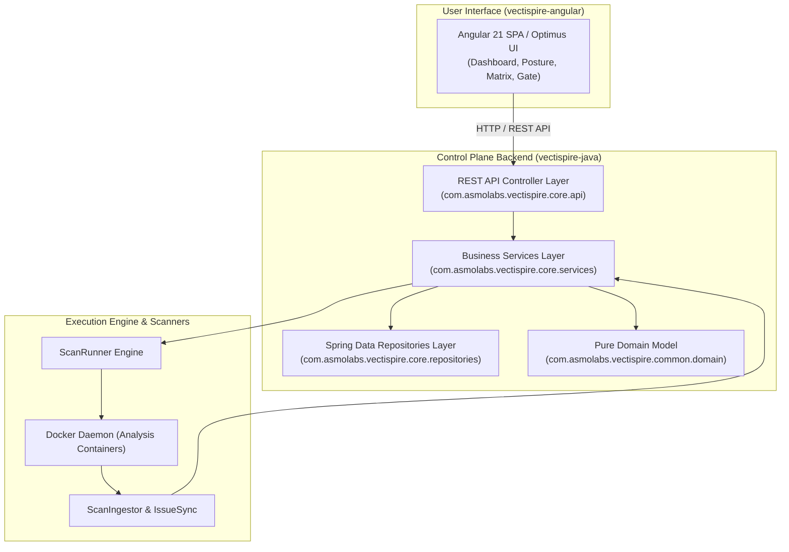

# Architecture Document — 01. Application View

* **Project:** Vectispire — ASPM & Security Control Plane
* **Template:** `bflorat/modele-da` — Architecture Document Template (Bertrand Florat)
* **Status:** Approved · **Version:** 1.0

---

## 1. General Overview & Scope

Vectispire is an **Application Security Posture Management (ASPM)** and compliance attestation
platform. Its primary function is to continuously monitor target security postures (Git repositories
and Docker container images), aggregate findings across multiple scanners (SCA, Secrets, IaC, SAST),
and track issues from scan to scan in a **reconciled backlog**.

### 1.1 Major Functional Goals
1. **SBOM Inventory & Vulnerability Analysis (SCA)**: Component inventory and CVE detection via Syft
   & Grype.
2. **Secret Detection**: Gitleaks with server-enforced rules, deduplicated by `IssueFingerprint`.
   One engine, deliberately — [decision 0015](../../en/decisions/0015-one-secrets-engine.md).
3. **IaC & SAST Analysis**: Infrastructure configuration scanning (Checkov) and source code analysis
   (Semgrep).
4. **Code Quality & AI Review**: Technical debt evaluation and local AI-assisted code review
   integration (Ollama).
5. **Quality Gate & CI/CD Attestation**: Deterministic decision engine (`POST /api/v1/gate`)
   evaluating build compliance.
6. **Regulatory Compliance & Audit Packages**: Global and target-level compliance matrices for NIS
   2, DORA, ISO 27001, PCI-DSS v4.0, Cyber Resilience Act (EU CRA), and SOC 2 Type II.
7. **SBOM Drift & Diff Viewer**: Differential comparison between scan releases tracking
   added/removed components, license shifts, and net CVE changes.
8. **Security Debt & High-Impact Remediation**: Engineering effort quantification (in person-days)
   and maximum-ROI package upgrade discovery.

---

## 2. Application Component Breakdown



### 2.1 Main Application Modules

- **`vectispire-core`**: Primary Spring Boot 4.1 backend containing REST APIs, business logic,
  leader leases, cron tasks, and audit log sealing.
- **`vectispire-common`**: Shared library containing pure domain models (`Finding`, `Issue`,
  `ScanArtifacts`), fingerprinting algorithms (`IssueFingerprint`), and the `ScanRunner` engine.
- **`vectispire-agent`**: Lightweight standalone remote agent communicating strictly via HTTP
  Long-Polling.
- **`vectispire-angular`**: Single Page Application frontend built with Angular 21 and Optimus UI.

---

## 3. Data Model & Reconciliation (Finding vs Issue)

A fundamental design rule governs Vectispire's data model:

```
Finding (Raw scanner output)  ──►  SHA-256 Fingerprint  ──►  Issue (Reconciled lifecycle)
```

- **`Finding`**: Raw output returned by a scanner during a specific scan step. Immutable and
  transient.
- **`Issue`**: Persistent vulnerability tracked across scans. Maintains first seen date
  (`first_seen`), occurrence count (`times_seen`), status (`OPEN`/`RESOLVED`), and VEX triage
  history (`NOT_AFFECTED`, `IN_TRIAGE`).

### 3.1 Fingerprint Computation (`IssueFingerprint`)
The deterministic identity fingerprint for an `Issue` is computed as:
```
sha256( target_id + type + rule_or_cve_id + purl_or_package + file_path )
```

---

## 4. Interfaces & Communication Flows

1. **Internal REST API (`/api/v1/*`)**: JSON payload exchanges between Angular frontend and Spring
   Boot backend.
2. **Quality Gate Interface (`POST /api/v1/gate`)**: Dedicated endpoint for CI/CD pipelines
   returning compliance verdicts.
3. **Agent Long-Polling Protocol (`GET /api/v1/agent/jobs?wait=30`)**: Communication channel
   between remote agents and control plane.
